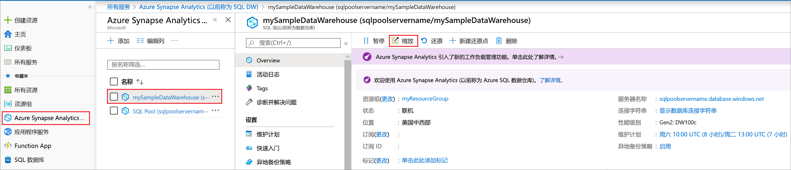

# 快速入门：通过 Azure 门户缩放 Synapse SQL 池的计算

可以使用 Azure 门户缩放 Synapse SQL 池（数据仓库）的计算。 [横向扩展计算](sql-data-warehouse-manage-compute-overview.md)以提高性能或按比例缩减计算以节约成本。 

如果没有 Azure 订阅，请在开始之前创建一个[免费](https://azure.microsoft.com/free/)帐户。

## 登录到 Azure 门户

登录 [Azure 门户](https://portal.azure.com/)。

## 在开始之前

可以缩放已有的 SQL 池，也可以使用[快速入门：创建并连接-门户](create-data-warehouse-portal.md)创建名为**mySampleDataWarehouse**的 sql 池。 本快速入门教程缩放 **mySampleDataWarehouse**。

>[!IMPORTANT] 
>SQL 池必须处于联机状态才能进行缩放。 

## 缩放计算

可以通过增加或减少数据仓库单位来缩放 SQL 池计算资源。 [快速入门：创建并连接-门户](create-data-warehouse-portal.md)创建**mySampleDataWarehouse** ，并将其初始化为 400 dwu。 以下步骤调整为 DWU **mySampleDataWarehouse**。

更改数据仓库单位：

1. 在 Azure 门户的左侧页面中，单击 " **Azure Synapse Analytics （以前称为 SQL DW）** "。
2. 从**Azure Synapse Analytics （以前称为 SQL DW）** 页中选择 " **mySampleDataWarehouse** "。 SQL 池将打开。
3. 单击“缩放”****。

    

2. 在“缩放”窗格中，向左或向右移动滑块，以更改 DWU 设置。 然后选择 "缩放"。

    

## 后续步骤
若要了解有关 SQL 池的详细信息，请继续阅读将[数据加载到 sql 池](load-data-from-azure-blob-storage-using-polybase.md)教程。 
