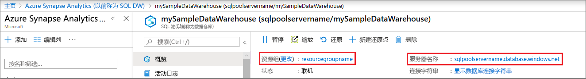

# <a name="quickstart-scale-compute-for-synapse-sql-pool-with-azure-powershell"></a>快速入门：使用 Azure PowerShell 缩放 Synapse SQL 池的计算

可以使用 Azure PowerShell 缩放 Synapse SQL 池（数据仓库）的计算。 [横向扩展计算](sql-data-warehouse-manage-compute-overview.md)以提高性能或按比例缩减计算以节约成本。

如果没有 Azure 订阅，请在开始之前创建一个[免费](https://azure.microsoft.com/free/)帐户。

## <a name="before-you-begin"></a>开始之前

[!INCLUDE [updated-for-az](../../../includes/updated-for-az.md)]

本快速入门假设已有一个可以缩放的 SQL 池。 如果需要创建一个 SQL 池，请参考[创建和连接 - 门户](create-data-warehouse-portal.md)创建名为 **mySampleDataWarehouse** 的 SQL 池。

## <a name="log-in-to-azure"></a>登录 Azure

使用 [Connect-AzAccount](/powershell/module/az.accounts/connect-azaccount?toc=/azure/synapse-analytics/sql-data-warehouse/toc.json&bc=/azure/synapse-analytics/sql-data-warehouse/breadcrumb/toc.json) 命令登录到 Azure 订阅，并按照屏幕上的说明进行操作。

```powershell
Connect-AzAccount
```

若要查看正在使用的订阅，请运行 [Get-AzSubscription](/powershell/module/az.accounts/get-azsubscription?toc=/azure/synapse-analytics/sql-data-warehouse/toc.json&bc=/azure/synapse-analytics/sql-data-warehouse/breadcrumb/toc.json)。

```powershell
Get-AzSubscription
```

如果需要使用与默认订阅不同的订阅，请运行 [Set-AzContext](/powershell/module/az.accounts/set-azcontext?toc=/azure/synapse-analytics/sql-data-warehouse/toc.json&bc=/azure/synapse-analytics/sql-data-warehouse/breadcrumb/toc.json)。

```powershell
Set-AzContext -SubscriptionName "MySubscription"
```

## <a name="look-up-data-warehouse-information"></a>查找数据仓库信息

查找计划暂停和恢复的数据仓库的数据库名称、服务器名称和资源组。

按照以下步骤查找数据仓库的位置信息。

1. 登录 [Azure 门户](https://portal.azure.com/)。
2. 在 Azure 门户的左侧导航页中单击“Azure Synapse Analytics (前称为 SQL 数据仓库)”。 
3. 在“Azure Synapse Analytics (前称为 SQL 数据仓库)”页中选择“mySampleDataWarehouse”打开数据仓库。  

    

4. 记下将用作数据库名称的数据仓库名称。 请记住，数据仓库是一种数据库。 同时记下服务器名称和资源组。 将在 pause 和 resume 命令中使用该服务器名称和资源组名称。
5. 在 PowerShell cmdlet 中请仅使用服务器名称的第一个组成部分。 在上图中，完整的服务器名称为 sqlpoolservername.database.windows.net。 我们在 PowerShell cmdlet 中使用 **sqlpoolservername** 作为服务器名称。

## <a name="scale-compute"></a>缩放计算

在 SQL 池中，可以通过调整数据仓库单位来增加或减少计算资源。 [创建和 Connect - 门户](create-data-warehouse-portal.md)创建 **mySampleDataWarehouse** 并初始化 400 DWU。 以下步骤调整为 DWU **mySampleDataWarehouse**。

若要更改数据仓库单位，请使用 [Set-AzSqlDatabase](/powershell/module/az.sql/set-azsqldatabase?toc=/azure/synapse-analytics/sql-data-warehouse/toc.json&bc=/azure/synapse-analytics/sql-data-warehouse/breadcrumb/toc.json) PowerShell cmdlet。 以下示例将数据库 **mySampleDataWarehouse**（托管在服务器 **sqlpoolservername** 上的资源组 **resourcegroupname** 中）的数据仓库单位设置为 DW300c。

```Powershell
Set-AzSqlDatabase -ResourceGroupName "resourcegroupname" -DatabaseName "mySampleDataWarehouse" -ServerName "sqlpoolservername" -RequestedServiceObjectiveName "DW300c"
```

## <a name="check-data-warehouse-state"></a>检查数据仓库状态

若要查看数据仓库的当前状态，使用 [Get-AzSqlDatabase](/powershell/module/az.sql/get-azsqldatabase?toc=/azure/synapse-analytics/sql-data-warehouse/toc.json&bc=/azure/synapse-analytics/sql-data-warehouse/breadcrumb/toc.json) PowerShell cmdlet。 此 cmdlet 将显示资源组 **resourcegroupname** 和服务器 **sqlpoolservername.database.windows.net** 中 **mySampleDataWarehouse** 数据库的状态。

```powershell
$database = Get-AzSqlDatabase -ResourceGroupName resourcegroupname -ServerName sqlpoolservername -DatabaseName mySampleDataWarehouse
```

这会导致以下类似的结果

```powershell
ResourceGroupName             : resourcegroupname
ServerName                    : sqlpoolservername
DatabaseName                  : mySampleDataWarehouse
Location                      : North Europe
DatabaseId                    : 34d2ffb8-b70a-40b2-b4f9-b0a39833c974
Edition                       : DataWarehouse
CollationName                 : SQL_Latin1_General_CP1_CI_AS
CatalogCollation              :
MaxSizeBytes                  : 263882790666240
Status                        : Online
CreationDate                  : 11/20/2017 9:18:12 PM
CurrentServiceObjectiveId     : 284f1aff-fee7-4d3b-a211-5b8ebdd28fea
CurrentServiceObjectiveName   : DW300c
RequestedServiceObjectiveId   : 284f1aff-fee7-4d3b-a211-5b8ebdd28fea
RequestedServiceObjectiveName :
ElasticPoolName               :
EarliestRestoreDate           :
Tags                          :
ResourceId                    : /subscriptions/xxxxxxxx-xxxx-xxxx-xxxx-xxxxxxxxxxxx/
                                resourceGroups/resourcegroupname/providers/Microsoft.Sql/servers/sqlpoolservername/databases/mySampleDataWarehouse
CreateMode                    :
ReadScale                     : Disabled
ZoneRedundant                 : False
```

可在输出中查看数据库的“状态”  。 在本例中，可以看到此数据库处于联机状态。  运行此命令后，应收到“联机”、“正在暂停”、“正在恢复”、“正在缩放”和“已暂停”等状态值。

要单独查看状态，请使用以下命令：

```powershell
$database | Select-Object DatabaseName,Status
```

## <a name="next-steps"></a>后续步骤

现已了解如何缩放 SQL 池的计算。 若要详细了解 SQL 池，请继续阅读有关加载数据的教程。

> [!div class="nextstepaction"]
>[将数据载入 SQL 池中](load-data-from-azure-blob-storage-using-polybase.md)
