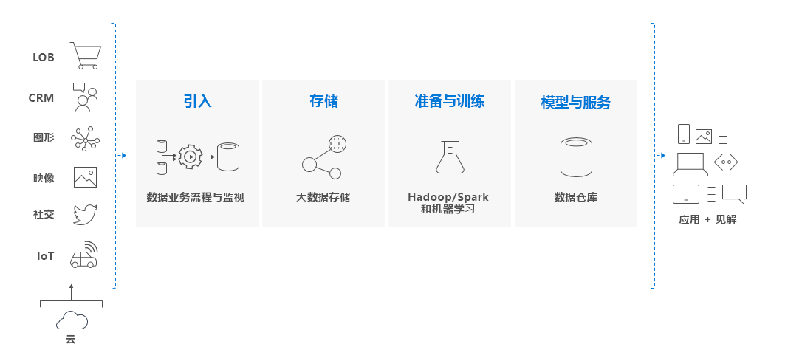

# 什么是 Azure Synapse Analytics（以前称为 SQL DW）？

> [!NOTE] 
>浏览 [Azure Synapse（工作区预览版）文档](../overview-what-is.md)。
>

Azure Synapse 是一种分析服务，它将企业数据仓库和大数据分析结合在一起。 借助它可以使用无服务器的按需资源或预配资源，任意执行自己定义的大规模数据查询。 Azure Synapse 将这两个领域结合在一起，以统一的体验引入、准备、管理和提供数据，以满足即时 BI 和机器学习的需求。

Azure Synapse 包含四个组件：

- Synapse SQL：基于 T-SQL 的完整分析 - 正式发布
  - SQL 池（按预配的 DWU 付费）
  - SQL 按需（按处理的 TB 付费）（预览）
- Spark：深度集成的 Apache Spark（预览）
- Synapse 管道：混合数据集成（预览）
- 工作室：统一的用户体验。 （预览版）

## Azure Synapse 中的 Synapse SQL 池

Synapse SQL 池是指 Azure Synapse 中正式发布的企业数据仓库功能。

SQL 池表示使用 Synapse SQL 时预配的分析资源集合。 SQL 池的大小由数据仓库单位 (DWU) 决定。

使用简单的 [PolyBase](/sql/relational-databases/polybase/polybase-guide?toc=/azure/synapse-analytics/sql-data-warehouse/toc.json&bc=/azure/synapse-analytics/sql-data-warehouse/breadcrumb/toc.json&view=azure-sqldw-latest) T-SQL 查询导入大数据，然后利用 MPP 的功能运行高性能分析。 进行集成和分析时，Synapse SQL 池将成为企业赖以获取更快且更可靠的见解的唯一信息源。  

## 大数据解决方案的关键组件

数据仓库是基于云的端到端大数据解决方案的关键组件。

在云数据解决方案中，可从各种源将数据引入大数据存储中。 将数据置于大数据存储中以后，Hadoop、Spark 和机器学习算法就可以准备和训练数据。 当数据可供进行复杂的分析时，Synapse SQL 池就会使用 PolyBase 来查询大数据存储。 PolyBase 使用标准 T-SQL 查询将数据引入 Synapse SQL 池表中。

Synapse SQL 池通过分列存储将数据存储到关系表中。 此格式可显著降低数据存储费用，改进查询性能。 存储数据后，即可大规模地运行分析。 与传统数据库系统相比，数分钟的分析查询只需数秒即可完成，数天的查询只需数小时。

分析结果可以传输到世界各地的报告数据库或应用程序。 然后即可通过业务分析获得进行明智的业务决策所需的见解。

## 后续步骤

- 浏览 [Azure Synapse 体系结构](massively-parallel-processing-mpp-architecture.md)
- 快速[创建 SQL 池](create-data-warehouse-portal.md)
- [加载示例数据](load-data-from-azure-blob-storage-using-polybase.md)
- 浏览[视频](https://azure.microsoft.com/documentation/videos/index/?services=sql-data-warehouse)

或者，查看以下一些其他 Azure Synapse 资源。

- 搜索[博客](https://azure.microsoft.com/blog/tag/azure-sql-data-warehouse/)
- 提交[功能请求](https://feedback.azure.com/forums/307516-sql-data-warehouse)
- [创建支持票证](sql-data-warehouse-get-started-create-support-ticket.md)
- 搜索 [MSDN 论坛](https://social.msdn.microsoft.com/Forums/azure/home?forum=AzureSQLDataWarehouse)
- 搜索 [Stack Overflow 论坛](https://stackoverflow.com/questions/tagged/azure-sqldw)
