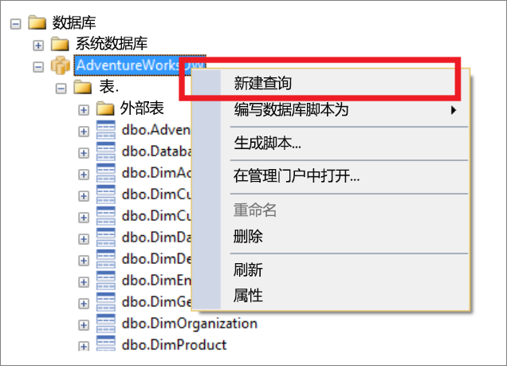
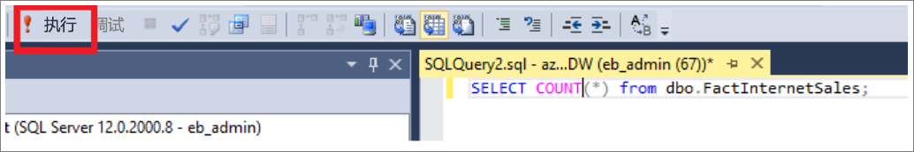
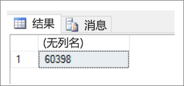

# <a name="connect-to-azure-synapse-analytics-with-sql-server-management-studio-ssms"></a>使用 SQL 服务器管理工作室 （SSMS） 连接到 Azure 同步分析

> [!div class="op_single_selector"]
>
> * [Power BI](sql-data-warehouse-get-started-visualize-with-power-bi.md)
> * [Azure 机器学习](sql-data-warehouse-get-started-analyze-with-azure-machine-learning.md)
> * [Visual Studio](sql-data-warehouse-query-visual-studio.md)
> * [sqlcmd](sql-data-warehouse-get-started-connect-sqlcmd.md)
> * [SSMS](sql-data-warehouse-query-ssms.md)

使用 SQL 服务器管理工作室 （SSMS） 连接到和查询 Azure 突触中的数据仓库。

## <a name="prerequisites"></a>先决条件

要使用本教程，需要：

* 现有的 SQL 池。 要创建一个，请参阅[创建 SQL 池](create-data-warehouse-portal.md)。
* 安装了 SQL Server Management Studio (SSMS)。 如果您还没有，请免费[下载 SSMS。](/sql/ssms/download-sql-server-management-studio-ssms?toc=/azure/synapse-analytics/sql-data-warehouse/toc.json&bc=/azure/synapse-analytics/sql-data-warehouse/breadcrumb/toc.json&view=azure-sqldw-latest)
* 完全限定的 SQL Server 名称。 要查找此信息，请参阅[连接到 SQL 池](sql-data-warehouse-connect-overview.md)。

## <a name="1-connect-to-your-sql-pool"></a>1. 连接到 SQL 池

1. 打开 SSMS。
2. 通过选择**文件** > **连接对象资源管理器**打开对象资源管理器。

    
3. 填写“连接到服务器”窗口中的字段。

   

   * **服务器名称**. 输入前面标识的 **服务器名称** 。
   * **身份验证**。 选择“SQL Server 身份验证”**** 或“Active Directory 集成身份验证”****。
   * **用户名**和**密码**。 如果上面选择了 SQL Server 身份验证，请输入用户名和密码。
   * 单击“连接”。
4. 要浏览，请展开 Azure SQL 服务器。 可以查看与服务器关联的数据库。 展开 AdventureWorksDW 以查看示例数据库中的表。

   

## <a name="2-run-a-sample-query"></a>2. 运行示例查询

现在，已建立了与数据库的连接，接下来让我们编写查询。

1. 在 SQL Server 对象资源管理器中右键单击数据库。
2. 选择“新建查询”****。 “新建查询”窗口随即打开。

   
3. 将以下 T-SQL 查询复制到查询窗口：

   ```sql
   SELECT COUNT(*) FROM dbo.FactInternetSales;
   ```

4. 单击`Execute`或使用以下快捷方式运行查询： `F5`。

   
5. 查看查询结果。 在此示例中，FactInternetSales 表包含 60398 行。

   

## <a name="next-steps"></a>后续步骤

现在，您可以连接和查询，请尝试[使用 Power BI 可视化数据](sql-data-warehouse-get-started-visualize-with-power-bi.md)。 要为 Azure 活动目录身份验证配置环境，请参阅[对 SQL 池进行身份验证](sql-data-warehouse-authentication.md)。
