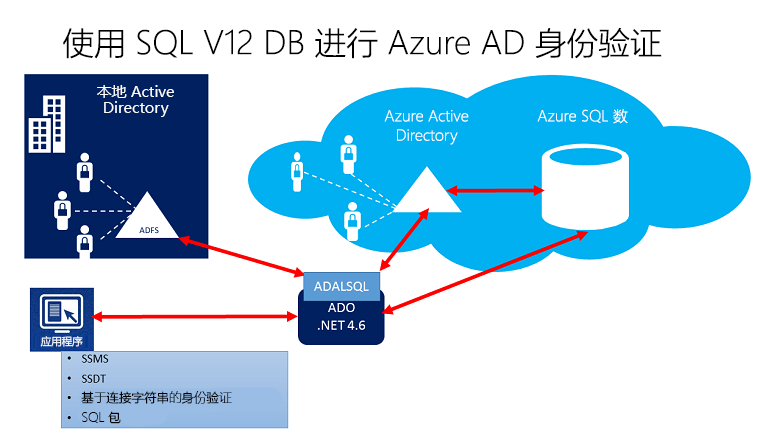
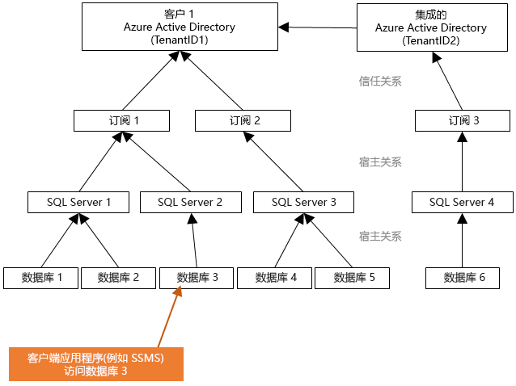
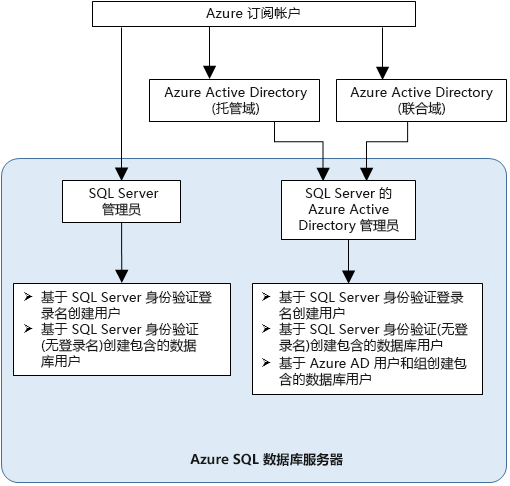

# 结合使用 Azure Active Directory 身份验证与 Synapse SQL 进行身份验证

Azure Active Directory 身份验证是一种使用 Azure Active Directory (Azure AD) 中的标识连接到 [Azure Synapse Analytics](../overview-faq.md) 的机制。

使用 Azure AD 身份验证，你可以集中管理有权访问 Azure Synapse 的用户标识，以简化权限管理。 包括如下优点：

- 它提供了一种替代常规的用户名和密码身份验证的方法。
- 帮助阻止用户标识在数据库服务器之间激增。
- 允许在单一位置中轮换密码。
- 客户可以使用外部 (Azure AD) 组来管理权限。
- 它可以通过启用集成的 Windows 身份验证和 Azure Active Directory 支持的其他形式的身份验证来消除存储密码。
- Azure AD 支持对连接到 Azure Synapse 的应用程序进行基于令牌的身份验证。
- Azure AD 身份验证支持对本地 Azure Active Directory 进行 ADFS（域联合）或本机用户/密码身份验证，无需进行域同步。
- Azure AD 支持从 SQL Server Management Studio 进行连接，后者使用 Active Directory 通用身份验证，其中包括多重身份验证 (MFA)。  MFA 包括利用一系列简单的验证选项进行的强身份验证，这些选项包括电话、短信、含有 PIN 码的智能卡或移动应用通知。 有关详细信息，请参阅 [SSMS 支持通过 Synapse SQL 进行 Azure AD 多重身份验证](mfa-authentication.md)。
- Azure AD 支持来自 SQL Server Data Tools (SSDT) 的使用 Active Directory 交互式身份验证的类似连接。 有关详细信息，请参阅 [SQL Server Data Tools (SSDT) 中的 Azure Active Directory 支持](/sql/ssdt/azure-active-directory?toc=/azure/synapse-analytics/toc.json&bc=/azure/synapse-analytics/breadcrumb/toc.json&view=azure-sqldw-latest)。

配置步骤包括配置和使用 Azure Active Directory 身份验证的以下过程。

1. 创建并填充 Azure AD。
2. 创建一个 Azure Active Directory 标识
3. 在 Synapse 工作区（预览版）中为所创建的 Azure Active Directory 标识分配角色
4. 使用 Azure AD 标识连接到 Synapse Studio。

## Azure Synapse Analytics 中的 AAD 直通身份验证

有了 Azure Synapse Analytics，你就可以使用 Azure Active Directory 标识访问数据湖中的数据。

通过定义在不同的数据引擎中都会遵守的文件和数据访问权限，你可以简化数据湖解决方案，因为可以在单一位置定义这些权限，而不必在多个位置定义它们。

## 信任体系结构

以下概要关系图概述了将 Azure AD 身份验证与 Synapse SQL 配合使用的解决方案体系结构。 若要支持 Azure AD 本机用户密码，只需考虑云部分和 Azure AD/Synapse SQL。 若要支持联合身份验证（或 Windows 凭据的用户/密码），需要与 ADFS 块进行通信。 箭头表示通信路径。

下图表明允许客户端通过提交令牌连接到数据库的联合、信任和托管关系。 该令牌已由 Azure AD 进行身份验证且受数据库信任。 

客户 1 可以代表具有本机用户的 Azure Active Directory 或具有联合用户的 Azure AD。 客户 2 代表包含已导入用户的可行解决方案；在本例中，来自联合 Azure Active Directory 且 ADFS 正与 Azure Active Directory 进行同步。 

请务必了解，使用 Azure AD 身份验证访问数据库需要托管订阅与 Azure AD 相关联。 必须使用同一订阅来创建托管 Azure SQL 数据库或 SQL 池的 SQL Server。

## 管理员结构

使用 Azure AD 身份验证时，Synapse SQL 会有两个管理员帐户：原始的 SQL Server 管理员和 Azure AD 管理员。 只有基于 Azure AD 帐户的管理员可以在用户数据库中创建第一个 Azure AD 包含的数据库用户。 

Azure AD 管理员登录名可以是 Azure AD 用户，也可以是 Azure AD 组。 当管理员为组帐户时，可以由任何组成员使用，因此可以为 Synapse SQL 实例启用多个 Azure AD 管理员。 

以管理员身份使用组帐户时，可以在 Azure AD 中集中添加和删除组成员，无需在 Synapse Analytics 工作区中更改用户或权限，从而提高可管理性。 无论何时都仅可配置一个 Azure AD 管理员（一个用户或组）。

## 权限

若要新建用户，必须具有数据库中的 `ALTER ANY USER` 权限。 `ALTER ANY USER` 权限可以授予任何数据库用户。 `ALTER ANY USER` 权限还由服务器管理员帐户、具有该数据库的 `CONTROL ON DATABASE` 或 `ALTER ON DATABASE` 权限的数据库用户以及 `db_owner` 数据库角色的成员拥有。

若要在 Synapse SQL 中创建一个包含数据库用户，必须使用 Azure AD 标识连接到数据库或实例。 若要创建第一个包含数据库用户，必须通过使用 Azure AD 管理员（其是数据库的所有者）连接到数据库。 

只有为 Synapse SQL 创建 Azure AD 管理员之后，才有可能进行任何 Azure AD 身份验证。 如果已从服务器删除 Azure Active Directory 管理员，先前在 Synapse SQL 内创建的现有 Azure Active Directory 用户将无法再使用其 Azure Active Directory 凭据连接到数据库。
 
## Azure AD 功能和限制

- 可以在 Synapse SQL 中预配 Azure AD 的以下成员：

  - 本机成员：在托管域或客户域中的 Azure AD 中创建的成员。 有关详细信息，请参阅[将自己的域名添加到 Azure AD](../../active-directory/fundamentals/add-custom-domain.md?toc=/azure/synapse-analytics/toc.json&bc=/azure/synapse-analytics/breadcrumb/toc.json)。
  - 联合域成员：在联合域的 Azure AD 中创建的成员。 有关详细信息，请参阅 [Microsoft Azure 现在支持与 Windows Server Active Directory 联合](https://azure.microsoft.com/blog/20../../windows-azure-now-supports-federation-with-windows-server-active-directory/)。
  - 作为本机或联合域成员从其他 Azure AD 导入的成员。
  - 以安全组形式创建的 Active Directory 组。

- 如果 Azure AD 用户是具有 `db_owner` 服务器角色的组的成员，则此类用户无法对 Synapse SQL 使用 **[CREATE DATABASE SCOPED CREDENTIAL](/sql/t-sql/statements/create-database-scoped-credential-transact-sql?toc=/azure/synapse-analytics/toc.json&bc=/azure/synapse-analytics/breadcrumb/toc.json&view=azure-sqldw-latest)** 语法。 将出现以下错误：

    `SQL Error [2760] [S0001]: The specified schema name 'user@mydomain.com' either does not exist or you do not have permission to use it.`

    请直接将 `db_owner` 角色授予个体 Azure AD 用户以缓解 **CREATE DATABASE SCOPED CREDENTIAL** 问题。

- 这些系统函数在 Azure AD 主体下执行时，返回 NULL 值：

  - `SUSER_ID()`
  - `SUSER_NAME(<admin ID>)`
  - `SUSER_SNAME(<admin SID>)`
  - `SUSER_ID(<admin name>)`
  - `SUSER_SID(<admin name>)`

## 使用 Azure AD 标识进行连接

Azure Active Directory 身份验证支持使用 Azure AD 标识连接到数据库的以下方法：

- Azure Active Directory 密码
- 集成式 Azure Active Directory
- 采用了 MFA 的通用 Azure Active Directory
- 使用应用程序令牌身份验证

Azure AD 服务器主体（登录名）（**公共预览版**）支持以下身份验证方法：

- Azure Active Directory 密码
- 集成式 Azure Active Directory
- 采用了 MFA 的通用 Azure Active Directory

### 其他注意事项

- 为了增强可管理性，建议将一个专用 Azure AD 组预配为管理员。
- 任何时候都只能为 Synapse SQL 池配置一个 Azure AD 管理员（一个用户或组）。
  - 为 SQL 按需版本（预览版）添加 Azure AD 服务器主体（登录名）之后，即可创建能够添加到 `sysadmin` 角色的多个 Azure AD 服务器主体（登录名）。
- 只有 Synapse SQL 的 Azure AD 管理员最初可以使用 Azure Active Directory 帐户连接到 Synapse SQL。 Active Directory 管理员可以配置后续的 Azure AD 数据库用户。
- 我们建议将连接超时值设置为 30 秒。
- SQL Server 2016 Management Studio 和 SQL Server Data Tools for Visual Studio 2015（版本 14.0.60311.1（2016 年 4 月）或更高版本）支持 Azure Active Directory 身份验证。 （**用于 SqlServer 的 .NET Framework 数据提供程序**（.NET Framework 4.6 或更高版本）支持 Azure AD 身份验证）。 因此，这些工具和数据层应用程序（DAC 和 .BACPAC）的最新版本可以使用 Azure AD 身份验证。
- 从版本 15.0.1 开始，[sqlcmd 实用工具](/sql/tools/sqlcmd-utility?toc=/azure/synapse-analytics/toc.json&bc=/azure/synapse-analytics/breadcrumb/toc.json&view=azure-sqldw-latest)和 [bcp 实用工具](/sql/tools/bcp-utility?toc=/azure/synapse-analytics/toc.json&bc=/azure/synapse-analytics/breadcrumb/toc.json&view=azure-sqldw-latest)支持采用了 MFA 的 Active Directory 交互式身份验证。
- SQL Server Data Tools for Visual Studio 2015 至少需要 2016 年 4 月版的 Data Tools（版本 14.0.60311.1）。 目前，Azure AD 用户不会显示在 SSDT 对象资源管理器中。 解决方法是在 [sys.database_principals](/sql/relational-databases/system-catalog-views/sys-database-principals-transact-sql?toc=/azure/synapse-analytics/toc.json&bc=/azure/synapse-analytics/breadcrumb/toc.json&view=azure-sqldw-latest) 中查看这些用户。
- [Microsoft JDBC Driver 6.0 for SQL Server](https://www.microsoft.com/download/details.aspx?id=11774) 支持 Azure AD 身份验证。 另外，请参阅[设置连接属性](/sql/connect/jdbc/setting-the-connection-properties?toc=/azure/synapse-analytics/toc.json&bc=/azure/synapse-analytics/breadcrumb/toc.json&view=azure-sqldw-latest)。

## 后续步骤

- 有关 Synapse SQL 中的访问和控制的概述，请参阅 [Synapse SQL 访问控制](../sql/access-control.md)。
- 有关数据库主体的详细信息，请参阅[主体](/sql/relational-databases/security/authentication-access/principals-database-engine?toc=/azure/synapse-analytics/toc.json&bc=/azure/synapse-analytics/breadcrumb/toc.json&view=azure-sqldw-latest)。
- 有关数据库角色的详细信息，请参阅[数据库角色](/sql/relational-databases/security/authentication-access/database-level-roles?toc=/azure/synapse-analytics/toc.json&bc=/azure/synapse-analytics/breadcrumb/toc.json&view=azure-sqldw-latest)。

 