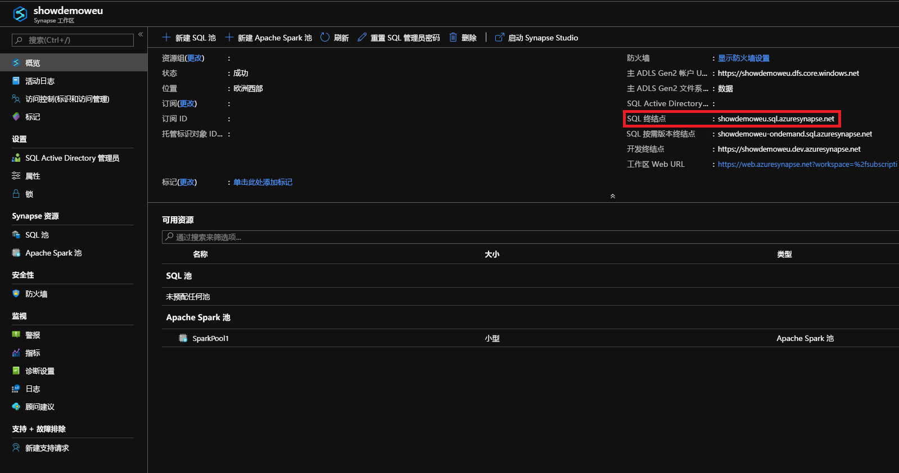
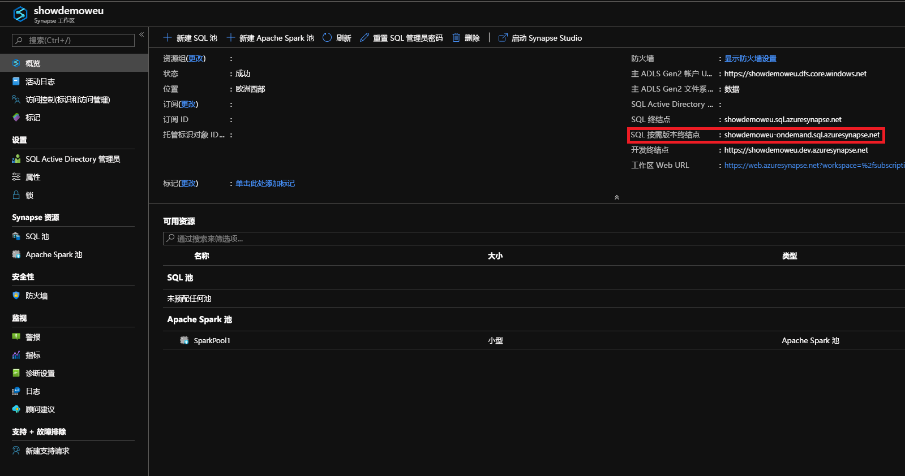

# <a name="connect-to-synapse-sql"></a>连接到 Synapse SQL
连接到 Azure Synapse Analytics 中的 Synapse SQL 功能。

## <a name="supported-tools-for-sql-on-demand-preview"></a>SQL 按需版本（预览版）支持的工具

完全支持的工具是 Azure Data Studio（预览版）。

版本 18.4 部分支持 SQL Server Management Studio。 有一些功能（例如连接和查询）受到限制。

## <a name="find-your-server-name"></a>查找服务器名称

以下示例中的 SQL 池的服务器名称为 showdemoweu.sql.azuresynapse.net。
以下示例中的 SQL 按需版本的服务器名称为 showdemoweu-ondemand.sql.azuresynapse.net。

若要查找完全限定的服务器名称，请执行以下操作：

1. 转到 [Azure 门户](https://portal.azure.com)。
2. 单击“Synapse 工作区”。 
3. 单击要连接到的工作区。
4. 转到“概览”。
5. 找到完整的服务器名称。

## <a name="sql-pool"></a>**SQL 池**



## <a name="sql-on-demand"></a>**SQL 按需版本**



## <a name="supported-drivers-and-connection-strings"></a>支持的驱动程序和连接字符串
Synapse SQL 支持 [ADO.NET](https://msdn.microsoft.com/library/e80y5yhx(v=vs.110).aspx)、[ODBC](https://msdn.microsoft.com/library/jj730314.aspx)、[PHP](https://msdn.microsoft.com/library/cc296172.aspx?f=255&MSPPError=-2147217396) 和 [JDBC](https://msdn.microsoft.com/library/mt484311(v=sql.110).aspx)。 单击前述的某个驱动程序，查找最新版本和文档。 若要自动生成通过 Azure 门户使用的驱动程序的连接字符串，请单击前述示例中的“显示数据库连接字符串”  。 下面也是一些示例，说明了每个驱动程序的连接字符串的样式。

> [!NOTE]
> 请考虑将连接超时值设置为 300 秒，以便连接可以经受住短时间内不可用。

### <a name="adonet-connection-string-example"></a>ADO.NET 连接字符串示例

```csharp
Server=tcp:{your_server}.sql.azuresynapse.net,1433;Database={your_database};User ID={your_user_name};Password={your_password_here};Encrypt=True;TrustServerCertificate=False;Connection Timeout=30;
```

### <a name="odbc-connection-string-example"></a>ODBC 连接字符串示例

```csharp
Driver={SQL Server Native Client 11.0};Server=tcp:{your_server}.sql.azuresynapse.net,1433;Database={your_database};Uid={your_user_name};Pwd={your_password_here};Encrypt=yes;TrustServerCertificate=no;Connection Timeout=30;
```

### <a name="php-connection-string-example"></a>PHP 连接字符串示例

```PHP
Server: {your_server}.sql.azuresynapse.net,1433 \r\nSQL Database: {your_database}\r\nUser Name: {your_user_name}\r\n\r\nPHP Data Objects(PDO) Sample Code:\r\n\r\ntry {\r\n   $conn = new PDO ( \"sqlsrv:server = tcp:{your_server}.sql.azuresynapse.net,1433; Database = {your_database}\", \"{your_user_name}\", \"{your_password_here}\");\r\n    $conn->setAttribute( PDO::ATTR_ERRMODE, PDO::ERRMODE_EXCEPTION );\r\n}\r\ncatch ( PDOException $e ) {\r\n   print( \"Error connecting to SQL Server.\" );\r\n   die(print_r($e));\r\n}\r\n\rSQL Server Extension Sample Code:\r\n\r\n$connectionInfo = array(\"UID\" => \"{your_user_name}\", \"pwd\" => \"{your_password_here}\", \"Database\" => \"{your_database}\", \"LoginTimeout\" => 30, \"Encrypt\" => 1, \"TrustServerCertificate\" => 0);\r\n$serverName = \"tcp:{your_server}.sql.azuresynapse.net,1433\";\r\n$conn = sqlsrv_connect($serverName, $connectionInfo);
```

### <a name="jdbc-connection-string-example"></a>JDBC 连接字符串示例

```Java
jdbc:sqlserver://yourserver.sql.azuresynapse.net:1433;database=yourdatabase;user={your_user_name};password={your_password_here};encrypt=true;trustServerCertificate=false;hostNameInCertificate=*.sql.azuresynapse.net;loginTimeout=30;
```

## <a name="connection-settings"></a>连接设置
Synapse SQL 在连接和创建对象期间会标准化一些设置。 这些设置不能重写，其中包括：

| 数据库设置 | 值 |
|:--- |:--- |
| [ANSI_NULLS](/sql/t-sql/statements/set-ansi-nulls-transact-sql?toc=/azure/synapse-analytics/toc.json&bc=/azure/synapse-analytics/breadcrumb/toc.json&view=azure-sqldw-latest) |ON |
| [QUOTED_IDENTIFIERS](/sql/t-sql/statements/set-quoted-identifier-transact-sql?toc=/azure/synapse-analytics/toc.json&bc=/azure/synapse-analytics/breadcrumb/toc.json&view=azure-sqldw-latest) |ON |
| [DATEFORMAT](/sql/t-sql/statements/set-dateformat-transact-sql?toc=/azure/synapse-analytics/toc.json&bc=/azure/synapse-analytics/breadcrumb/toc.json&view=azure-sqldw-latest) |mdy |
| [DATEFIRST](/sql/t-sql/statements/set-datefirst-transact-sql?toc=/azure/synapse-analytics/toc.json&bc=/azure/synapse-analytics/breadcrumb/toc.json&view=azure-sqldw-latest) |7 |

## <a name="recommendations"></a>建议

若要执行 SQL 按需版本  查询，建议使用 [Azure Data Studio](get-started-azure-data-studio.md) 和 Azure Synapse Studio 这两个工具。

## <a name="next-steps"></a>后续步骤
若要使用 Visual Studio 进行连接和查询，请参阅[使用 Visual Studio 进行查询](../sql-data-warehouse/sql-data-warehouse-query-visual-studio.md?toc=/azure/synapse-analytics/toc.json&bc=/azure/synapse-analytics/breadcrumb/toc.json)。 若要详细了解身份验证选项，请参阅[向 Synapse SQL 进行身份验证](../sql-data-warehouse/sql-data-warehouse-authentication.md?toc=/azure/synapse-analytics/toc.json&bc=/azure/synapse-analytics/breadcrumb/toc.json)。