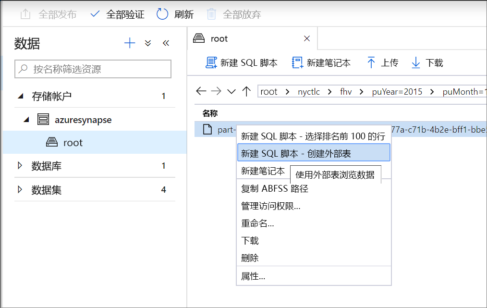
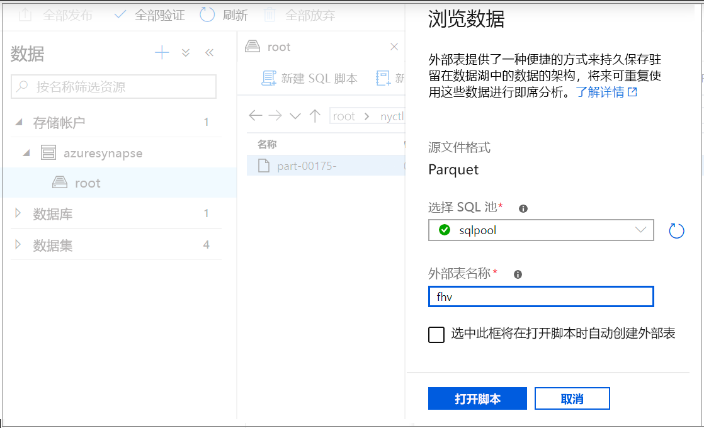
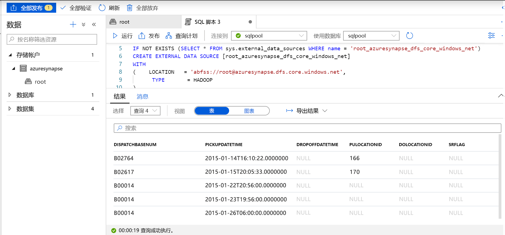

# <a name="use-external-tables-with-synapse-sql"></a>通过 Synapse SQL 使用外部表

外部表指向位于 Hadoop、Azure 存储 Blob 或 Azure Data Lake Storage 中的数据。 外部表用于读取文件中的数据，或将数据写入 Azure 存储中的文件。 借助 Synapse SQL，可以使用外部表在 SQL 池或 SQL 按需版本（预览版）中读取和写入数据。

## <a name="external-tables-in-synapse-sql-pool-and-on-demand"></a>Synapse SQL 池和按需版本中的外部表

### <a name="sql-pool"></a>[SQL 池](#tab/sql-pool) 

在 SQL 池中，可以使用外部表来执行以下操作：

- 使用 Transact-SQL 语句查询 Azure Blob 存储和 Azure Data Lake Gen2。
- 将 Azure Blob 存储与 Azure Data Lake Storage 中的数据导入和存储到 SQL 池。

与 [CREATE TABLE AS SELECT](../sql-data-warehouse/sql-data-warehouse-develop-ctas.md?toc=/azure/synapse-analytics/toc.json&bc=/azure/synapse-analytics/breadcrumb/toc.json) 语句结合使用时，从外部表中选择数据可将数据导入到 SQL 池中的表。 除了 [COPY 语句](/sql/t-sql/statements/copy-into-transact-sql?toc=/azure/synapse-analytics/toc.json&bc=/azure/synapse-analytics/breadcrumb/toc.json&view=azure-sqldw-latest)以外，外部表也可用于加载数据。 

有关加载操作的教程，请参阅[使用 PolyBase 从 Azure Blob 存储加载数据](../sql-data-warehouse/load-data-from-azure-blob-storage-using-polybase.md?toc=/azure/synapse-analytics/toc.json&bc=/azure/synapse-analytics/breadcrumb/toc.json)。

### <a name="sql-on-demand"></a>[SQL 按需版本](#tab/sql-on-demand)

对于 SQL 按需版本，使用外部表可以执行以下操作：

- 使用 Transact-SQL 语句查询 Azure Blob 存储或 Azure Data Lake Storage 中的数据。
- 使用 [CETAS](develop-tables-cetas.md) 将 SQL 按需版本查询结果存储到 Azure Blob 存储或 Azure Data Lake Storage 中的文件

可通过以下步骤使用 SQL 按需版本创建外部表：

1. CREATE EXTERNAL DATA SOURCE
2. CREATE EXTERNAL FILE FORMAT
3. CREATE EXTERNAL TABLE

---

### <a name="security"></a>安全性

用户必须具有针对外部表的 `SELECT` 权限才能读取数据。
外部表使用数据库范围的凭据访问基础 Azure 存储，这些凭据使用以下规则在数据源中定义：
- 没有凭据的数据源使外部表可访问 Azure 存储上公开可用的文件。
- 数据源可以使用凭据，使外部表能够使用 SAS 令牌或工作区托管标识，仅访问 Azure 存储上的文件。有关示例，请参阅[开发存储文件存储访问控制](develop-storage-files-storage-access-control.md#examples)一文。

> [!IMPORTANT]
> 在 SQL 池中，若数据源没有凭据，Azure AD 用户可使用其 Azure AD 标识访问存储文件。 在 SQL 按需版本中，需要创建存在数据库范围的凭据（具有 `IDENTITY='User Identity'` 属性）的数据源，请参阅[此处示例](develop-storage-files-storage-access-control.md#examples)。

## <a name="create-external-data-source"></a>CREATE EXTERNAL DATA SOURCE

外部数据源用于连接到存储帐户。 [此处](/sql/t-sql/statements/create-external-data-source-transact-sql?toc=/azure/synapse-analytics/toc.json&bc=/azure/synapse-analytics/breadcrumb/toc.json&view=azure-sqldw-latest)提供了完整文档。

### <a name="syntax-for-create-external-data-source"></a>CREATE EXTERNAL DATA SOURCE 的语法

#### <a name="sql-pool"></a>[SQL 池](#tab/sql-pool)

```syntaxsql
CREATE EXTERNAL DATA SOURCE <data_source_name>
WITH
(    LOCATION         = '<prefix>://<path>'
     [, CREDENTIAL = <database scoped credential> ]
     , TYPE = HADOOP
)
[;]
```

#### <a name="sql-on-demand"></a>[SQL 按需版本](#tab/sql-on-demand)

```syntaxsql
CREATE EXTERNAL DATA SOURCE <data_source_name>
WITH
(    LOCATION         = '<prefix>://<path>'
     [, CREDENTIAL = <database scoped credential> ]
)
[;]
```

---

### <a name="arguments-for-create-external-data-source"></a>CREATE EXTERNAL DATA SOURCE 的参数

data_source_name

指定数据源的用户定义名称。 该名称在数据库中必须唯一。

#### <a name="location"></a>位置
LOCATION = `'<prefix>://<path>'` - 提供连接协议和外部数据源的路径。 该路径可以包含 `'<prefix>://<path>/container'` 格式的容器，以及 `'<prefix>://<path>/container/folder'` 格式的文件夹。

| 外部数据源        | 位置前缀 | 位置路径                                         |
| --------------------------- | --------------- | ----------------------------------------------------- |
| Azure Blob 存储          | `wasb[s]`       | `<container>@<storage_account>.blob.core.windows.net` |
| Azure Data Lake Store Gen 1 | `adl`           | `<storage_account>.azuredatalake.net`                 |
| Azure Data Lake Store Gen 2 | `abfs[s]`       | `<container>@<storage_account>.dfs.core.windows.net`  |

#### <a name="credential"></a>凭据
CREDENTIAL = `<database scoped credential>` 是可选凭据，用于在 Azure 存储上进行身份验证。 没有凭据的外部数据源可以访问公共存储帐户。 

SQL 池中没有凭据的外部数据源还可以使用调用方 Azure AD 标识来访问存储中的文件。 具有凭据的外部数据源使用凭据中指定的标识来访问文件。
- 在 SQL 池中，数据库范围的凭据可以指定自定义应用程序标识、工作区托管标识或 SAK 密钥。 
- 在 SQL 按需版本中，数据库范围的凭据可以指定调用方的 Azure AD 标识、工作区托管标识或 SAK 密钥。 

#### <a name="type"></a>TYPE
TYPE = `HADOOP` 在 SQL 池中是强制选项，并指定使用 Polybase 技术来访问基础文件。 此参数不能用于使用内置本机读取器的 SQL 按需版本服务。

### <a name="example-for-create-external-data-source"></a>CREATE EXTERNAL DATA SOURCE 的示例

#### <a name="sql-pool"></a>[SQL 池](#tab/sql-pool)

以下示例为 Azure Data Lake Gen2 创建一个指向 New York 数据集的外部数据源：

```sql
CREATE EXTERNAL DATA SOURCE AzureDataLakeStore
WITH
  -- Please note the abfss endpoint when your account has secure transfer enabled
  ( LOCATION = 'abfss://newyorktaxidataset.azuredatalakestore.net' ,
    CREDENTIAL = ADLS_credential ,
    TYPE = HADOOP
  ) ;
```

#### <a name="sql-on-demand"></a>[SQL 按需版本](#tab/sql-on-demand)

以下示例为 Azure Data Lake Gen2 创建一个可使用 SAS 凭据进行访问的外部数据源：

```sql
CREATE DATABASE SCOPED CREDENTIAL [sqlondemand]
WITH IDENTITY='SHARED ACCESS SIGNATURE',  
SECRET = 'sv=2018-03-28&ss=bf&srt=sco&sp=rl&st=2019-10-14T12%3A10%3A25Z&se=2061-12-31T12%3A10%3A00Z&sig=KlSU2ullCscyTS0An0nozEpo4tO5JAgGBvw%2FJX2lguw%3D'
GO

CREATE EXTERNAL DATA SOURCE SqlOnDemandDemo WITH (
    LOCATION = 'https://sqlondemandstorage.blob.core.windows.net',
    CREDENTIAL = sqlondemand
);
```

以下示例为 Azure Data Lake Gen2 创建一个指向公开可用的 New York 数据集的外部数据源：

```sql
CREATE EXTERNAL DATA SOURCE YellowTaxi
WITH ( LOCATION = 'https://azureopendatastorage.blob.core.windows.net/nyctlc/yellow/')
```
---

## <a name="create-external-file-format"></a>CREATE EXTERNAL FILE FORMAT

创建一个外部文件格式对象，用于定义存储在 Azure Blob 存储或 Azure Data Lake Storage 中的外部数据。 创建外部文件格式是创建外部表的先决条件。 [此处](/sql/t-sql/statements/create-external-file-format-transact-sql?toc=/azure/synapse-analytics/toc.json&bc=/azure/synapse-analytics/breadcrumb/toc.json&view=azure-sqldw-latest)提供了完整文档。

创建外部文件格式会指定外部表引用的数据的实际布局。

### <a name="syntax-for-create-external-file-format"></a>CREATE EXTERNAL FILE FORMAT 的语法

```syntaxsql
-- Create an external file format for PARQUET files.  
CREATE EXTERNAL FILE FORMAT file_format_name  
WITH (  
    FORMAT_TYPE = PARQUET  
    [ , DATA_COMPRESSION = {  
        'org.apache.hadoop.io.compress.SnappyCodec'  
      | 'org.apache.hadoop.io.compress.GzipCodec'      }  
    ]);  

--Create an external file format for DELIMITED TEXT files
CREATE EXTERNAL FILE FORMAT file_format_name  
WITH (  
    FORMAT_TYPE = DELIMITEDTEXT  
    [ , DATA_COMPRESSION = 'org.apache.hadoop.io.compress.GzipCodec' ]
    [ , FORMAT_OPTIONS ( <format_options> [ ,...n  ] ) ]  
    );  

<format_options> ::=  
{  
    FIELD_TERMINATOR = field_terminator  
    | STRING_DELIMITER = string_delimiter
    | First_Row = integer
    | USE_TYPE_DEFAULT = { TRUE | FALSE }
    | Encoding = {'UTF8' | 'UTF16'}
}
```

### <a name="arguments-for-create-external-file-format"></a>CREATE EXTERNAL FILE FORMAT 的参数

file_format_name - 指定外部文件格式的名称。

FORMAT_TYPE = [ PARQUET | DELIMITEDTEXT] - 指定外部数据的格式。

- PARQUET - 指定 Parquet 格式。
- DELIMITEDTEXT - 指定具有列分隔符（也称为字段终止符）的文本格式。

FIELD_TERMINATOR = *field_terminator* - 仅适用于带分隔符的文本文件。 字段终止符指定一个或多个字符，用于在带分隔符的文本文件中标记每个字段（列）的末尾。 默认为竖线字符（“|”）。

示例：

- FIELD_TERMINATOR = '|'
- FIELD_TERMINATOR = ' '
- FIELD_TERMINATOR = ꞌ\tꞌ

STRING_DELIMITER = *string_delimiter* - 为带分隔符的文本文件中的字符串类型数据指定字段终止符。 字符串分隔符的长度是一个或多个字符，并且用单引号括起来。 默认为空字符串 ("")。

示例：

- STRING_DELIMITER = '"'
- STRING_DELIMITER = '*'
- STRING_DELIMITER = ꞌ,ꞌ

FIRST_ROW = *First_row_int* - 指定首先要读取的行号，此值将应用于所有文件。 如果将值设置为 2，则在加载数据时，会跳过每个文件中的第一行（标题行）。 会基于行终止符（/r/n、/r、/n）的存在跳过行。

USE_TYPE_DEFAULT = { TRUE | **FALSE** } - 指定在从文本文件中检索数据时，如何处理带分隔符的文本文件中缺失的值。

TRUE - 如果从文本文件中检索数据，则使用外部表定义中对应列的默认值数据类型来存储每个缺失值。 例如，将缺失值替换为：

- 如果列定义为数字列，则替换为 0。 不支持小数列，它们会导致错误。
- 如果列是字符串列，则替换为空字符串 ("")。
- 如果列是日期列，则替换为 1900-01-01。

FALSE - 将所有缺失值作为 NULL 存储。 在带分隔符的文本文件中使用 NULL 一词存储的任何 NULL 值都会作为字符串“NULL”导入。

Encoding = {'UTF8' | 'UTF16'} - SQL 按需版本可以读取 UTF8 和 UTF16 编码的带分隔符的文本文件。

DATA_COMPRESSION = *data_compression_method* - 此参数为外部数据指定数据压缩方法。 

PARQUET 文件格式类型支持以下压缩方法：

- DATA_COMPRESSION = 'org.apache.hadoop.io.compress.GzipCodec'
- DATA_COMPRESSION = 'org.apache.hadoop.io.compress.SnappyCodec'

从 PARQUET 外部表进行读取时，会忽略此参数，但在使用 [CETAS](develop-tables-cetas.md) 写入外部表时会使用此参数。

DELIMITEDTEXT 文件格式类型支持以下压缩方法：

- DATA_COMPRESSION = 'org.apache.hadoop.io.compress.GzipCodec'

### <a name="example-for-create-external-file-format"></a>CREATE EXTERNAL FILE FORMAT 的示例

以下示例为人口普查文件创建外部文件格式：

```sql
CREATE EXTERNAL FILE FORMAT census_file_format
WITH
(  
    FORMAT_TYPE = PARQUET,
    DATA_COMPRESSION = 'org.apache.hadoop.io.compress.SnappyCodec'
)
```

## <a name="create-external-table"></a>CREATE EXTERNAL TABLE

CREATE EXTERNAL TABLE 命令为 Synapse SQL 创建一个外部表，用于访问 Azure Blob 存储或 Azure Data Lake Storage 中存储的数据。 

### <a name="syntax-for-create-external-table"></a>CREATE EXTERNAL TABLE 的语法

```sql
CREATE EXTERNAL TABLE { database_name.schema_name.table_name | schema_name.table_name | table_name }
    ( <column_definition> [ ,...n ] )  
    WITH (
        LOCATION = 'folder_or_filepath',  
        DATA_SOURCE = external_data_source_name,  
        FILE_FORMAT = external_file_format_name
    )  
[;]  

<column_definition> ::=
column_name <data_type>
    [ COLLATE collation_name ]
```

### <a name="arguments-create-external-table"></a>CREATE EXTERNAL TABLE 的参数

{ database_name.schema_name.table_name | schema_name.table_name | table_name }

要创建的表的一到三部分名称。 对于外部表，SQL 按需版本仅存储表元数据。 不会将任何实际数据移动或存储到 SQL 按需版本中。

<column_definition>, ...*n* ]

CREATE EXTERNAL TABLE 支持配置列名、数据类型、为 Null 性和排序规则的功能。 不能对外部表使用 DEFAULT CONSTRAINT。

>[!IMPORTANT]
>列定义（包括数据类型和列数）必须与外部文件中的数据匹配。 如果存在不匹配，则在查询实际数据时会拒绝文件行。

从 Parquet 文件读取数据时，可以仅指定所要读取的列，并跳过其余的列。

LOCATION = '*folder_or_filepath*'

为 Azure Blob 存储中的实际数据指定文件夹或文件路径和文件名。 位置从根文件夹开始。 根文件夹是外部数据源中指定的数据位置。

如果指定文件夹 LOCATION，则 SQL 按需版本查询将从外部表中进行选择，并从该文件夹中检索文件。

> [!NOTE]
> 与 Hadoop 和 PolyBase 不同，SQL 按需版本不返回子文件夹。 它返回文件名以下划线 (_) 或句点 (.) 开头的文件。

在此示例中，如果 LOCATION='/webdata/'，则 SQL 按需版本查询将返回 mydata.txt 和 _hidden.txt 中的行。 它不返回 mydata2.txt 和 mydata3.txt，因为这些文件位于子文件夹中。


DATA_SOURCE = *external_data_source_name* - 指定包含外部数据位置的外部数据源的名称。 要创建外部数据源，请使用 [CREATE EXTERNAL DATA SOURCE](#create-external-data-source)。

FILE_FORMAT = *external_file_format_name* - 指定为外部数据存储文件类型和压缩方法的外部文件格式对象的名称。 若要创建外部文件格式，请使用 [CREATE EXTERNAL FILE FORMAT](#create-external-file-format)。

### <a name="permissions-create-external-table"></a>CREATE EXTERNAL TABLE 的权限

若要从某个外部表中进行选择，需要提供拥有列出和读取权限的适当凭据。

### <a name="example-create-external-table"></a>CREATE EXTERNAL TABLE 示例

以下示例创建一个外部表。 它返回第一行：

```sql
CREATE EXTERNAL TABLE census_external_table
(
    decennialTime varchar(20),
    stateName varchar(100),
    countyName varchar(100),
    population int,
    race varchar(50),
    sex    varchar(10),
    minAge int,
    maxAge int
)  
WITH (
    LOCATION = '/parquet/',
    DATA_SOURCE = population_ds,  
    FILE_FORMAT = census_file_format
)
GO

SELECT TOP 1 * FROM census_external_table
```

## <a name="create-and-query-external-tables-from-a-file-in-azure-data-lake"></a>从 Azure Data Lake 中的文件创建和查询外部表

现在，可以使用 Data Lake 浏览功能，通过简单的右键单击文件操作，使用 SQL 池或 SQL 按需版本创建和查询外部表。

### <a name="prerequisites"></a>先决条件

- 必须有权访问工作区，并且至少对 ADLS Gen2 帐户具有存储 Blob 数据参与者 ARM 访问角色

- 必须至少拥有在 SQL 池或 SQL OD 中创建和查询外部表的[权限](/sql/t-sql/statements/create-external-table-transact-sql?toc=/azure/synapse-analytics/toc.json&bc=/azure/synapse-analytics/breadcrumb/toc.json&view=azure-sqldw-latest#permissions-2)

- 与 ADLS Gen2 帐户关联的链接服务必须有权访问文件。 例如，如果链接服务身份验证机制为“托管标识”，则工作区托管标识必须至少对存储帐户拥有存储 Blob 读取者权限

在“数据”面板中，选择要从其创建外部表的文件：
> [!div class="mx-imgBorder"]
>

此时会打开一个对话框窗口。 选择“SQL 池”或“SQL 按需版本”，为表命名，然后选择“打开脚本”：

> [!div class="mx-imgBorder"]
>

系统会从该文件推理架构并自动生成 SQL 脚本：
> [!div class="mx-imgBorder"]
>

运行该脚本。 该脚本将自动运行 Select Top 100 *.：
> [!div class="mx-imgBorder"]
>

现已创建外部表，将来若要浏览此外部表的内容，用户可以直接从“数据”窗格查询：
> [!div class="mx-imgBorder"]
>

## <a name="next-steps"></a>后续步骤

查看 [CETAS](develop-tables-cetas.md) 一文，了解如何将查询结果保存到 Azure 存储中的外部表。 或者可以开始查询 [Apache Spark for Azure Synapse 外部表](develop-storage-files-spark-tables.md)。
