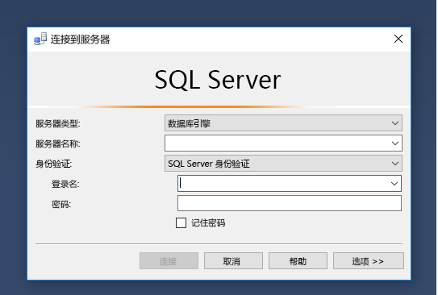
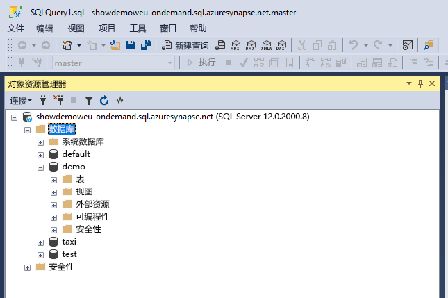
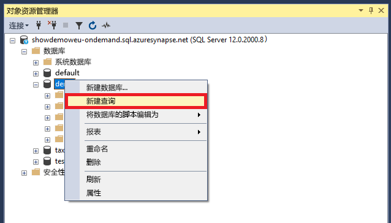
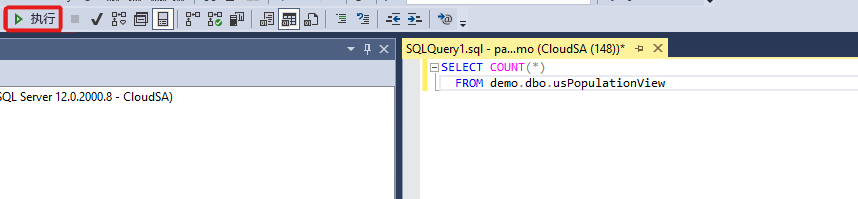
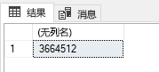

# <a name="connect-to-synapse-sql-with-sql-server-management-studio-ssms"></a>使用 SQL Server Management Studio (SSMS) 连接到 Synapse SQL
> [!div class="op_single_selector"]
> * [Azure Data Studio](get-started-azure-data-studio.md)
> * [Power BI](get-started-power-bi-professional.md)
> * [Visual Studio](../sql-data-warehouse/sql-data-warehouse-query-visual-studio.md?toc=/azure/synapse-analytics/toc.json&bc=/azure/synapse-analytics/breadcrumb/toc.json)
> * [sqlcmd](../sql/get-started-connect-sqlcmd.md)
> * [SSMS](get-started-ssms.md)
> 
> 

可以使用 [SQL Server Management Studio (SSMS)](/sql/ssms/download-sql-server-management-studio-ssms) 通过 SQL 按需版本（预览版）或 SQL 池资源在 Azure Synapse Analytics 中连接并查询 Synapse SQL。 

### <a name="supported-tools-for-sql-on-demand-preview"></a>SQL 按需版本（预览版）支持的工具

从版本 18.5 开始，我们支持部分 SSMS 功能（例如连接和查询），但这些功能很有限。 我们完全支持 [Azure Data Studio](/sql/azure-data-studio/download-azure-data-studio)。

## <a name="prerequisites"></a>先决条件

在开始之前，请确保满足以下先决条件：  

* [SQL Server Management Studio (SSMS)](/sql/ssms/download-sql-server-management-studio-ssms)。 
* 对于 SQL 池，你需要一个现有的数据仓库。 若要创建一个，请参阅[创建 SQL 池](../quickstart-create-sql-pool.md)。 对于 SQL 按需版本，在创建时已在工作区中预配了一个。 
* 完全限定的 SQL Server 名称。 若要查找此名称，请参阅[连接到 Synapse SQL](connect-overview.md)。

## <a name="connect"></a>连接

### <a name="sql-pool"></a>SQL 池

若要使用 SQL 池连接到 Synapse SQL，请执行以下步骤： 

1. 打开 SQL Server Management Studio (SSMS)。 
1. 在“连接到服务器”对话框中，填写各个字段，然后选择“连接”   ： 
  
    
   
   * **服务器名称**：输入前面标识的 **服务器名称** 。
   * **身份验证**：选择一个身份验证类型，例如“SQL Server 身份验证”  或“Active Directory 集成身份验证”  。
   * **用户名**和**密码**：如果在上面选择了“SQL Server 身份验证”，请输入用户名和密码。

1. 在“对象资源管理器”  中展开你的 Azure SQL Server。 可以查看与服务器关联的数据库，例如示例 AdventureWorksDW 数据库。 可以展开数据库来查看表：
   
    


### <a name="sql-on-demand-preview"></a>SQL 按需版本（预览版）

若要使用 SQL 按需版本连接到 Synapse SQL，请执行以下步骤： 

1. 打开 SQL Server Management Studio (SSMS)。
1. 在“连接到服务器”对话框中，填写各个字段，然后选择“连接”   ： 
   
    
   
   * **服务器名称**：输入前面标识的 **服务器名称** 。
   * **身份验证**：选择一个身份验证类型，例如“SQL Server 身份验证”  或“Active Directory 集成身份验证”  ：
   * **用户名**和**密码**：如果在上面选择了“SQL Server 身份验证”，请输入用户名和密码。
   * 单击“连接”  。

4. 要浏览，请展开 Azure SQL 服务器。 可以查看与服务器关联的数据库。 展开“demo”  以查看示例数据库中的内容。
   
    


## <a name="run-a-sample-query"></a>运行示例查询

### <a name="sql-pool"></a>SQL 池

现在已经建立了数据库连接，可以查询数据了。

1. 在 SQL Server 对象资源管理器中右键单击数据库。
2. 选择“新建查询”  。 “新建查询”窗口随即打开。
   
    
3. 将以下 T-SQL 查询复制到查询窗口中：
   
    ```sql
    SELECT COUNT(*) FROM dbo.FactInternetSales;
    ```
4. 运行查询。 为此，请单击 `Execute` 或使用以下快捷键：`F5`。
   
    
5. 查看查询结果。 在此示例中，FactInternetSales 表包含 60398 行。
   
    

### <a name="sql-on-demand"></a>SQL 按需版本

现在已经建立了数据库连接，可以查询数据了。

1. 在 SQL Server 对象资源管理器中右键单击数据库。
2. 选择“新建查询”  。 “新建查询”窗口随即打开。
   
    
3. 将以下 T-SQL 查询复制到查询窗口中：
   
    ```sql
    SELECT COUNT(*) FROM demo.dbo.usPopulationView
    ```
4. 运行查询。 为此，请单击 `Execute` 或使用以下快捷键：`F5`。
   
    
5. 查看查询结果。 在此示例中，usPopulationView 视图包含 3664512 行。
   
    

## <a name="next-steps"></a>后续步骤
可以进行连接和查询后，接下来请尝试[使用 Power BI 可视化数据](get-started-power-bi-professional.md)。

若要为 Azure Active Directory 身份验证配置环境，请参阅[向 Synapse SQL 进行身份验证](../sql-data-warehouse/sql-data-warehouse-authentication.md?toc=/azure/synapse-analytics/toc.json&bc=/azure/synapse-analytics/breadcrumb/toc.json)。

