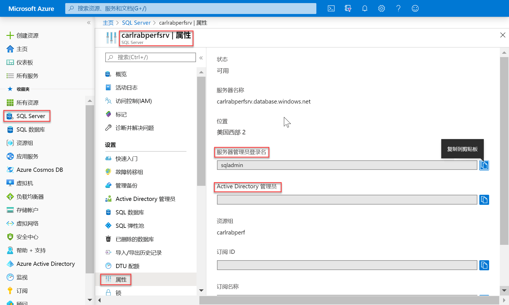
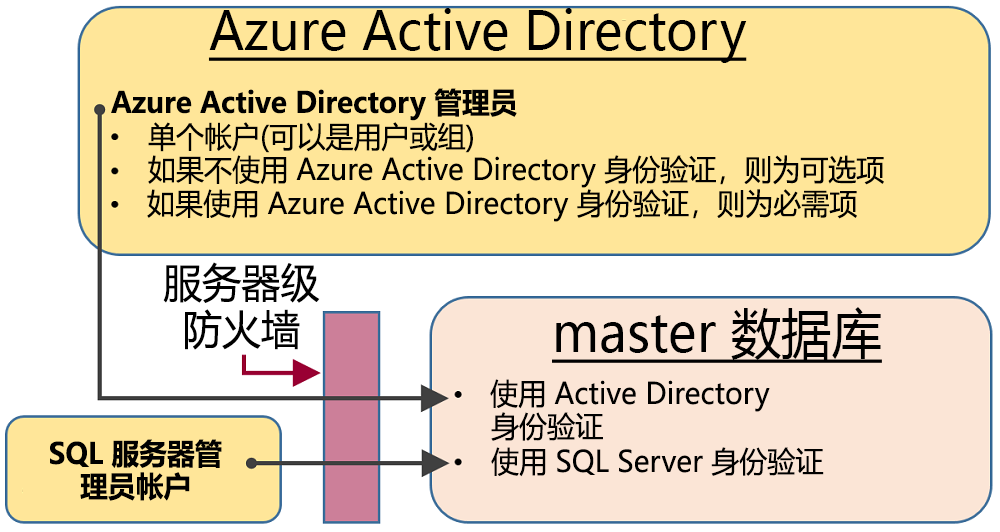
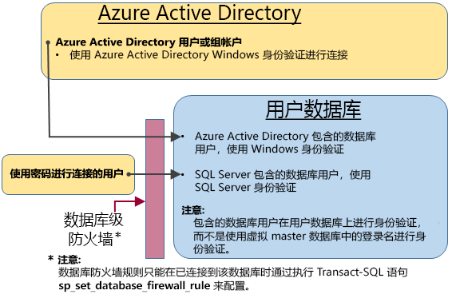

# <a name="sql-authentication"></a>SQL 身份验证

Azure Synapse Analytics 有两个可用来控制资源消耗的 SQL 组成要素。 本文介绍了这两个组成要素如何控制用户身份验证。

若要向 Synapse SQL 授权，可以使用两种授权类型：

- AAD 授权
- SQL 授权

AAD 授权依赖于 Azure Active Directory，使你能够在单一位置进行用户管理。 SQL 授权使旧版应用程序能够以一种熟悉的方式使用 Synapse SQL。

## <a name="administrative-accounts"></a>管理帐户

有两个充当管理员的管理帐户（**服务器管理员**和 **Active Directory 管理员**）。 若要在 SQL 服务器中识别这些管理员帐户，请打开 Azure 门户并导航到你的 Synapse SQL 的“属性”选项卡。



- **服务器管理员**

  创建 Azure Synapse Analytics 时，必须指定服务器管理员登录名。 SQL 服务器创建该帐户作为 master 数据库中的登录名。 此帐户通过 SQL Server 身份验证（用户名和密码）进行连接。 此类帐户只能存在一个。

- **Azure Active Directory 管理员**

  也可以将某个 Azure Active Directory 帐户（个人帐户或安全组帐户）配置为管理员。 配置 Azure AD 管理员的操作是可选操作，但如果需要使用 Azure AD 帐户连接到 Synapse SQL，则必须配置 Azure AD 管理员。

服务器管理员和 Azure AD 管理员帐户具有以下特征：

- 只有这些帐户才能自动连接到服务器上的任何 SQL 数据库。 （其他帐户若要连接到用户数据库，它们必须是数据库的所有者，或者在用户数据库中具有相应的用户帐户。）
- 这些帐户以 `dbo` 用户的身份进入用户数据库，在用户数据库中拥有所有权限。 （用户数据库的所有者也以 `dbo` 用户的身份进入数据库。）
- 不会以 `dbo` 用户的身份进入 `master` 数据库，在 master 数据库中拥有受限的权限。
- **不是**标准 SQL Server `sysadmin` 固定服务器角色的成员，SQL 数据库中未提供此角色。  
- 可以在 master 数据库和服务器级 IP 防火墙规则中创建、更改及删除数据库、登录名与用户。
- 可以在 `dbmanager` 和 `loginmanager` 角色中添加和删除成员。
- 可以查看 `sys.sql_logins` 系统表。

## <a name="sql-on-demand-preview"></a>[SQL 按需版本（预览版）](#tab/serverless)

若要管理有权访问 SQL 按需版本的用户，可以按以下说明操作。

若要创建用于 SQL 按需版本的登录名，请使用以下语法：

```sql
CREATE LOGIN Mary WITH PASSWORD = '<strong_password>';
-- or
CREATE LOGIN Mary@domainname.net FROM EXTERNAL PROVIDER;
```
在登录名存在后，可以在 SQL 按需版本终结点内的各个数据库中创建用户，并向这些用户授予所需的权限。 若要创建用户，可以使用以下语法：
```sql
CREATE USER Mary FROM LOGIN Mary;
-- or
CREATE USER Mary FROM LOGIN Mary@domainname.net;
-- or
CREATE USER [mike@contoso.com] FROM EXTERNAL PROVIDER;
```

在创建登录名和用户后，可以使用常规 SQL Server 语法来授予权限。

## <a name="sql-pool"></a>[SQL 池](#tab/provisioned)

### <a name="administrator-access-path"></a>管理员访问路径

适当地配置服务器级防火墙后，**SQL 服务器管理员**和 **Azure Active Directory 管理员**可以使用 SQL Server Management Studio 或 SQL Server Data Tools 等客户端工具进行连接。 仅最新工具提供所有的特性和功能。 

下图显示了这两个管理员帐户的典型配置：
 


使用服务器级防火墙中的开放端口时，管理员可以连接到任何 SQL 数据库。

### <a name="database-creators"></a>数据库创建者

其中一个管理角色是 **dbmanager** 角色。 此角色的成员可以创建新数据库。 要使用此角色，请在 `master` 数据库中创建一个用户，然后将该用户添加到 **dbmanager** 数据库角色。 

若要创建数据库，用户必须是基于 `master` 数据库中的 SQL Server 登录名的用户，或者是基于 Azure Active Directory 用户的已包含数据库用户。

1. 使用管理员帐户连接到 `master` 数据库。
2. 使用 [CREATE LOGIN](/sql/t-sql/statements/create-login-transact-sql?toc=/azure/synapse-analytics/toc.json&bc=/azure/synapse-analytics/breadcrumb/toc.json&view=azure-sqldw-latest) 语句创建 SQL Server 身份验证登录名。 示例语句：

   ```sql
   CREATE LOGIN Mary WITH PASSWORD = '<strong_password>';
   ```

   > [!NOTE]
   > 创建登录名或包含数据库用户时使用强密码。 有关详细信息，请参阅 [Strong Passwords](/sql/relational-databases/security/strong-passwords?toc=/azure/synapse-analytics/toc.json&bc=/azure/synapse-analytics/breadcrumb/toc.json&view=azure-sqldw-latest)。

   为了提高性能，会暂时在数据库级别缓存登录名（服务器级主体）。 若要刷新身份验证缓存，请参阅 [DBCC FLUSHAUTHCACHE](/sql/t-sql/database-console-commands/dbcc-flushauthcache-transact-sql?toc=/azure/synapse-analytics/toc.json&bc=/azure/synapse-analytics/breadcrumb/toc.json&view=azure-sqldw-latest)。

3. 在 `master` 数据库中，使用 [CREATE USER](/sql/t-sql/statements/create-user-transact-sql?toc=/azure/synapse-analytics/toc.json&bc=/azure/synapse-analytics/breadcrumb/toc.json&view=azure-sqldw-latest) 语句创建用户。 该用户可以是 Azure Active Directory 身份验证包含数据库用户（如果已针对 Azure AD 身份验证配置了环境），可以是 SQL Server 身份验证包含数据库用户，也可以是基于 SQL Server 身份验证登录名（在前一步骤中创建）的 SQL Server 身份验证用户。示例语句：

   ```sql
   CREATE USER [mike@contoso.com] FROM EXTERNAL PROVIDER; -- To create a user with Azure Active Directory
   CREATE USER Ann WITH PASSWORD = '<strong_password>'; -- To create a SQL Database contained database user
   CREATE USER Mary FROM LOGIN Mary;  -- To create a SQL Server user based on a SQL Server authentication login
   ```

4. 使用 [ALTER ROLE](/sql/t-sql/statements/alter-role-transact-sql?toc=/azure/synapse-analytics/toc.json&bc=/azure/synapse-analytics/breadcrumb/toc.json&view=azure-sqldw-latest) 语句将新用户添加到 `master` 中的 dbmanager 数据库角色。 示例语句：

   ```sql
   ALTER ROLE dbmanager ADD MEMBER Mary;
   ALTER ROLE dbmanager ADD MEMBER [mike@contoso.com];
   ```

   > [!NOTE]
   > dbmanager 是 master 数据库中的数据库角色，因此只能向该 dbmanager 角色添加数据库用户。 不能向数据库级角色添加服务器级登录名。

5. 必要时，可将防火墙规则配置为允许新用户建立连接。 （可在现有防火墙规则中包括新用户。）

现在，该用户可以连接到 `master` 数据库，并且可以创建新数据库。 创建数据库的帐户成为该数据库的所有者。

### <a name="login-managers"></a>登录名管理器

另一个管理角色是登录管理员角色。 此角色的成员可在 master 数据库中创建新登录名。 如果需要，可以完成相同的步骤（创建登录名和用户，并向 **loginmanager** 角色添加用户），使用户能够在 master 数据库中创建新登录名。 通常不必要创建登录名，因为 Microsoft 建议使用包含的数据库用户在数据库级别进行身份验证，而不要使用基于登录名的用户。 有关详细信息，请参阅 [包含的数据库用户 - 使你的数据库可移植](/sql/relational-databases/security/contained-database-users-making-your-database-portable?toc=/azure/synapse-analytics/toc.json&bc=/azure/synapse-analytics/breadcrumb/toc.json&view=azure-sqldw-latest)。

---

## <a name="non-administrator-users"></a>非管理员用户

非管理员帐户通常无需访问 master 数据库。 使用 [CREATE USER (Transact-SQL)](https://msdn.microsoft.com/library/ms173463.aspx) 语句在数据库级别创建包含数据库用户。 

该用户可以是 Azure Active Directory 身份验证包含数据库用户（如果已针对 Azure AD 身份验证配置了环境），可以是 SQL Server 身份验证包含数据库用户，也可以是基于 SQL Server 身份验证登录名（在前一步骤中创建）的 SQL Server 身份验证用户。  

要创建用户，请先连接到数据库，然后执行如下所示的语句：

```sql
CREATE USER Mary FROM LOGIN Mary;
CREATE USER [mike@contoso.com] FROM EXTERNAL PROVIDER;
```

开始时，仅其中一个管理员或数据库所有者可以创建用户。 若要授权其他用户来创建新用户，可通过如下所示语句向该选定用户授予 `ALTER ANY USER` 权限：

```sql
GRANT ALTER ANY USER TO Mary;
```

若要向其他用户授予对数据库的完全控制权限，可让这些用户成为 db_owner 固定数据库角色的成员。

在 Azure SQL 数据库中，请使用 `ALTER ROLE` 语句。

```sql
ALTER ROLE db_owner ADD MEMBER Mary;
```

在 SQL 池中，请使用 [EXEC sp_addrolemember](/sql/relational-databases/system-stored-procedures/sp-addrolemember-transact-sql?toc=/azure/synapse-analytics/toc.json&bc=/azure/synapse-analytics/breadcrumb/toc.json&view=azure-sqldw-latest)。

```sql
EXEC sp_addrolemember 'db_owner', 'Mary';
```

> [!NOTE]
> 创建基于 SQL 数据库服务器登录名的数据库用户的一个常见原因是用户需要访问多个数据库。 由于包含的数据库的用户都是单独的实体，因此每个数据库都维护其各自的用户及其密码。 这可能会导致开销，因为用户必须记住每个数据库的密码，当必须为许多数据库更改多个密码时，这通常难以做到。 但是，当使用 SQL Server 登录名和高可用性（活动异地复制和故障转移组）时，必须手动在每台服务器上设置 SQL Server 登录名。 否则，数据库用户在发生故障转移后将不再映射到该服务器登录名，并且在故障转移后将无法访问数据库。 

有关为异地复制配置登录名的详细信息，请参阅[针对异地还原或故障转移配置和管理 Azure SQL 数据库的安全性](../../sql-database/sql-database-geo-replication-security-config.md?toc=/azure/synapse-analytics/toc.json&bc=/azure/synapse-analytics/breadcrumb/toc.json)。

### <a name="configuring-the-database-level-firewall"></a>配置数据库级防火墙

最好是规定非管理员用户只能通过防火墙来访问所使用的数据库。 可以使用 [sp_set_database_firewall_rule](/sql/relational-databases/system-stored-procedures/sp-set-database-firewall-rule-azure-sql-database?toc=/azure/synapse-analytics/toc.json&bc=/azure/synapse-analytics/breadcrumb/toc.json&view=azure-sqldw-latest) 语句来配置数据库级防火墙，而不必通过服务器级防火墙来授权其 IP 地址访问所有数据库。 不能通过门户来配置数据库级防火墙。

### <a name="non-administrator-access-path"></a>非管理员访问路径

对数据库级防火墙进行适当配置以后，数据库用户即可使用 SQL Server Management Studio 或 SQL Server Data Tools 这样的客户端工具进行连接。 仅最新工具提供所有的特性和功能。 下图显示了典型的非管理员访问路径。



## <a name="groups-and-roles"></a>组和角色

有效的访问管理需要将权限分配到组和角色，而不是分配到单个用户。

- 使用 Azure Active Directory 身份验证时，请将 Azure Active Directory 用户放入 Azure Active Directory 组。 为该组创建包含数据库用户。 将一个或多个数据库用户添加到[数据库角色](/sql/relational-databases/security/authentication-access/database-level-roles?toc=/azure/synapse-analytics/toc.json&bc=/azure/synapse-analytics/breadcrumb/toc.json&view=azure-sqldw-latest)，然后向数据库角色分配[权限](/sql/relational-databases/security/permissions-database-engine?toc=/azure/synapse-analytics/toc.json&bc=/azure/synapse-analytics/breadcrumb/toc.json&view=azure-sqldw-latest)。

- 使用 SQL Server 身份验证时，请在数据库中创建包含的数据库用户。 将一个或多个数据库用户添加到[数据库角色](/sql/relational-databases/security/authentication-access/database-level-roles?toc=/azure/synapse-analytics/toc.json&bc=/azure/synapse-analytics/breadcrumb/toc.json&view=azure-sqldw-latest)，然后向数据库角色分配[权限](/sql/relational-databases/security/permissions-database-engine?toc=/azure/synapse-analytics/toc.json&bc=/azure/synapse-analytics/breadcrumb/toc.json&view=azure-sqldw-latest)。

数据库角色可以是内置的角色，例如 **db_owner**、**db_ddladmin**、**db_datawriter**、**db_datareader**、**db_denydatawriter** 和 **db_denydatareader**。 **db_owner** 通常用于向部分用户授予完全权限。 其他固定数据库角色可用于快速开发简单的数据库，但不建议用于大多数生产数据库。 

例如，**db_datareader** 固定数据库角色授予用户对数据库中每个表的读取访问权限，这通常超出了必要的范畴。 

而如果先使用 [CREATE ROLE](https://msdn.microsoft.com/library/ms187936.aspx) 语句创建自己的用户定义数据库角色，再根据业务需要向每个角色授予所需的最低权限，则要合适得多。 如果用户是多个角色的成员，则会聚合所有这些角色的权限。

## <a name="permissions"></a>权限

可以在 SQL 数据库中单独授予或拒绝 100 多种权限。 这些权限中，许多都是嵌套式的。 例如，针对架构的 `UPDATE` 权限包括针对该架构中每个表的 `UPDATE` 权限。 与大多数权限系统中的情况一样，拒绝某个权限将覆盖对该权限的授予操作。 

考虑到权限的嵌套性质和数目，可能需要进行仔细的研究才能设计出适当的权限系统，以便对数据库进行恰当的保护。 

一开始可以了解[权限（数据库引擎）](https://docs.microsoft.com/sql/relational-databases/security/permissions-database-engine)中的权限列表，并查看这些权限的[海报大小的图](https://docs.microsoft.com/sql/relational-databases/security/media/database-engine-permissions.png)。

### <a name="considerations-and-restrictions"></a>注意事项和限制

管理 SQL 数据库中的登录名和用户时，请注意以下要点：

- 执行 `CREATE/ALTER/DROP DATABASE` 语句时，必须连接到 **master** 数据库。
- 不能更改或删除对应于**服务器管理员**登录名的数据库用户。
- 美国英语是**服务器管理员**登录名的默认语言。
- 只有管理员（**服务器管理员**登录名或 Azure AD 管理员）和 **master** 数据库中 **dbmanager** 数据库角色的成员才有权执行 `CREATE DATABASE` 和 `DROP DATABASE` 语句。
- 执行 `CREATE/ALTER/DROP LOGIN` 语句时，必须连接到 master 数据库。 但不建议使用登录名。 改用包含的数据库用户。
- 若要连接到用户数据库，必须在连接字符串中提供数据库的名称。
- 只有服务器级别主体登录名和 **master** 数据库中**loginmanager** 数据库角色的成员才有权执行 `CREATE LOGIN`、`ALTER LOGIN` 和 `DROP LOGIN` 语句。
- 在 ADO.NET 应用程序中执行 `CREATE/ALTER/DROP LOGIN` 和 `CREATE/ALTER/DROP DATABASE` 语句时，不允许使用参数化命令。 有关详细信息，请参阅[命令和参数](/dotnet/framework/data/adonet/commands-and-parameters?toc=/azure/synapse-analytics/toc.json&bc=/azure/synapse-analytics/breadcrumb/toc.json)。
- 在执行 `CREATE/ALTER/DROP DATABASE` 和 `CREATE/ALTER/DROP LOGIN` 语句时，上述每个语句都必须是 Transact-SQL 批处理中的唯一语句。 否则，将会出错。 例如，以下 Transact-SQL 会检查该数据库是否存在。 如果该数据库存在，则调用 `DROP DATABASE` 语句删除该数据库。 因为 `DROP DATABASE` 语句不是该批处理中的唯一语句，所以执行以下 Transact-SQL 将导致错误。

  ```sql
  IF EXISTS (SELECT [name]
           FROM   [sys].[databases]
           WHERE  [name] = N'database_name')
  DROP DATABASE [database_name];
  GO
  ```
  
  请改用以下 Transact-SQL 语句：
  
  ```sql
  DROP DATABASE IF EXISTS [database_name]
  ```

- 在使用 `FOR/FROM LOGIN` 选项执行 `CREATE USER` 语句时，该语句必须是 Transact-SQL 批处理中的唯一语句。
- 在使用 `WITH LOGIN` 选项执行 `ALTER USER` 语句时，该语句必须是 Transact-SQL 批处理中的唯一语句。
- 若要执行 `CREATE/ALTER/DROP` 操作，用户需要对数据库拥有 `ALTER ANY USER` 权限。
- 在数据库角色的所有者尝试在该数据库角色中添加或删除其他数据库用户时，可能会发生以下错误：“此数据库中不存在用户或角色‘Name’”。 在用户对所有者不可见时，会发生此错误。 若要解决此问题，请向角色所有者授予对该用户的 `VIEW DEFINITION` 权限。 

## <a name="next-steps"></a>后续步骤

有关详细信息，请参阅 [包含的数据库用户 - 使你的数据库可移植](https://msdn.microsoft.com/library/ff929188.aspx)。
 
