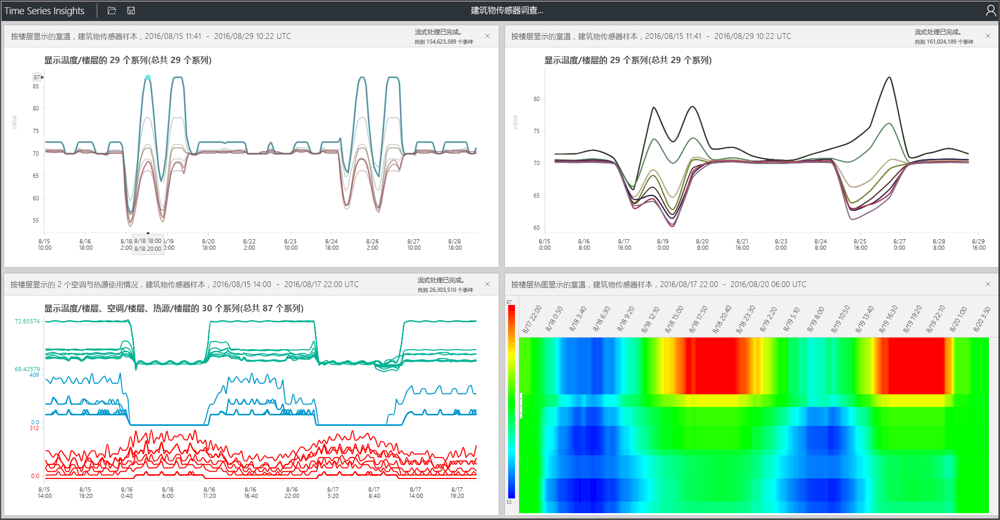

# Azure 时序见解资源管理器
本文探讨时序见解资源管理器 Web 应用中可用的各种功能和选项。 在 Web 浏览器中使用时序见解资源管理器来创建数据的可视化效果。
 
Azure 时序见解是一种完全托管的分析、存储和可视化服务，让同时探索和分析数十亿 IoT 事件变得简单轻松。 它提供数据的全局视图，从而可以快速验证 IoT 解决方案并避免任务关键型设备出现代价高昂的故障时间。 可以近乎实时地发现隐藏的趋势、找出异常以及进行根本原因分析。 时序见解资源管理器当前是公共预览版。

## 先决条件

在可以使用时序见解资源管理器之前，必须：
- 创建时序见解环境
- 提供在环境中对帐户的访问权限
- 添加事件源，以便引入数据和存储数据

## 浏览和查询数据
将事件源连接到时序见解环境的几分钟内，可以浏览和查询时序数据。

1. 首先，在 Web 浏览器中打开[时序见解资源管理器](https://insights.timeseries.azure.com/)并选择窗口左侧的环境。 有权访问的所有环境均按字母顺序列出。

2. 选择环境后，使用顶部的“开始时间”和“结束时间”配置，或者单击和拖动需要的时间范围。  单击右上角的放大镜，或者右键单击所选择的时间范围并选择“搜索”。  

3. 还可以通过选择“自动打开”按钮，每分钟自动刷新可用性。  请注意，“自动打开”按钮仅适用于可用性图表，而不适用于主要可视化效果的内容。

4. 请注意，Azure 云图标使你转到 Azure 门户中的环境。

   

5. 接下来，将看到一个图表，该图表显示的是所选时间范围内所有事件的计数。  在此有许多控件：

    “术语编辑器面板”：术语空间是查询环境的位置。  它位于屏幕左侧，启用 
      - “度量值”：此下拉框显示所有数值列（双精度）
      - “拆分方式”：此下拉框显示分类列（字符串）
      - 可以启用梯级内插、显示最小值和最大值以及调整“度量值”旁“控制面板”的 Y 轴。  此外，可以调整显示的数据是计数、平均值或数据的总和。
      - 最多可以添加五个术语，在同一个 X 轴上查看。  使用“复制” 按钮添加其他术语，或者单击“添加”按钮添加新术语。
     
        

      - “谓词”：通过谓词，可以使用下面的操作数集快速筛选事件。 如果通过选择/单击执行搜索，谓词将基于该搜索自动更新。      支持的操作数类型包括：

         |Operation  |支持的类型  |说明  |
         |---------|---------|---------|
         |<, >, <=, >=     |  双精度、DateTime、TimeSpan       |         |
         |=, !=, <>     | 字符串、布尔型、双精度型、DateTime、TimeSpan、NULL        |         |
         |IN     | 字符串、布尔型、双精度型、DateTime、TimeSpan、NULL        |  所有操作数应为同一类型或者是 NULL 常数。        |
         |HAS     | String        |  右侧只允许出现常数字符串文本。 不允许出现空字符串和 NULL。       |

      - 查询示例
      
         

6. 使用“间隔大小”滑块工具，可以在相同时间范围内放大和缩小间隔。  这能够更精确地控制在大量时间切片之间的移动，显示平滑的趋势直至小到毫秒的切片，从而允许查看数据更精细、分辨率更高的剪切片段。 滑块的默认起点设置为所选的数据的最佳视图；平衡分辨率、查询速度和粒度。

7. 使用“时间画笔”工具，可以轻松地从一个时间范围导航到另一个时间范围，并使直观的 UX 前端和中心在时间范围之间无缝移动。

8. 使用“保存”命令，可以保存当前查询并启用当前查询来与环境的其他用户共享。 使用“打开”，可以看到所有已保存的查询和有权访问的环境中的其他用户的任何共享查询。 

   

9. “透视视图”工具提供最多四个唯一查询的同步视图。 可以在图表右上角找到“透视视图”按钮。  

   

10. 使用“图表”，可以直观地浏览数据。 图标工具包括：

   - 选择/单击，可以选择特定的时间范围，或者选择一个数据系列。  
   - 在选择的时间范围内，可以放大或浏览事件。  
   - 在数据系列内，可以按另一列拆分系列、将系列作为新术语添加、只显示已选系列、排除已选系列、固定该系列或从已选系列中浏览事件。
   - 在图表左侧的筛选器区域中，可以查看显示的所有数据系列并按值或名称重新排序、查看所有数据系列或者特意固定或解锁的系列。  还可以选择一个数据系列并按另一列拆分该系列、将系列作为新术语添加、只显示已选系列、排除已选系列、固定该系列或从已选系列中浏览事件。
   - 同时查看多个术语时，可以堆叠、取消堆叠、查看有关数据系列的其他数据、通过图表右上角的按钮在所有术语中使用同一个 Y 轴。
 
    

11. “热度地图”可以用来快速发现给定查询中的唯一或异常数据系列。 仅有一个搜索术语能可视化为热度地图。    

   

12. “事件”：选择或右键单击以上内容来选择浏览事件时，事件面板是可用的。  在这里，可以看到所有原始事件并可将事件导出为 JSON 或 CSV 文件。 请注意，时序见解存储所有原始数据。

   

13. 浏览事件以公开模式和列统计信息之后，单击“统计信息”选项卡。  

   - “模式”：此功能主动显示所选数据区域中最具统计意义的模式。 这使你无需为了解最需要花费时间和精力的模式而查看数千个事件。 此外，时序见解使你能直接跳到这些具有重大统计意义的模式继续进行分析。 此功能也有助于对历史数据进行事后调查。 

   - “列统计信息”：列统计信息提供图表和表格，细分选定时间范围内所选数据系列的每列中的数据。  
 
       

现在，你已了解时序见解资源管理器 Web 应用中可用的各种功能和选项。 

## 后续步骤
> [!div class="nextstepaction"]
>[在时序见解环境中诊断并解决问题](time-series-insights-diagnose-and-solve-problems.md)
