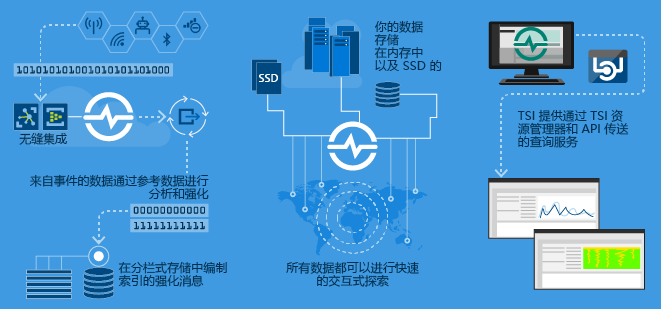
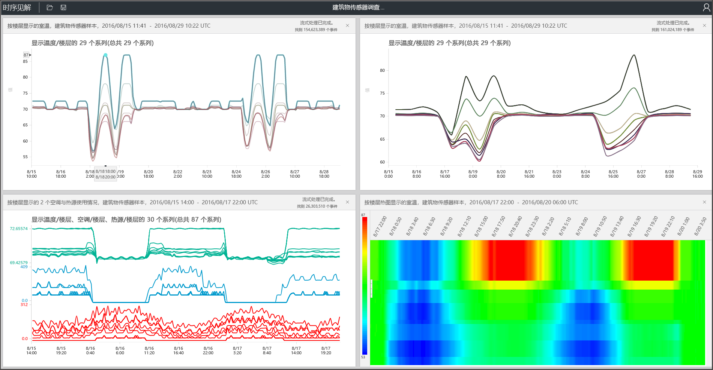

# 什么是 Azure 时序见解？

Azure 时序见解用于存储、可视化和查询大量时序数据（例如 IoT 设备所生成的数据）。 如果你想要在云中存储、管理、查询或可视化时序数据，则时序见解可能会很适合你。

时序见解包含四个关键作业：

- 它与 Azure IoT 中心和 Azure 事件中心等云网关完全集成。 它可以轻松连接到这些事件源，并根据消息和结构（在干净的行和列中包含数据）分析 JSON。 它将元数据与遥测数据联接，并在纵栏式存储中对数据编制索引。
- 时序见解管理着数据存储。 为确保始终能够轻松访问数据，它将数据存储在内存和 SSD 中长达 400 天。 可以在数秒内以交互方式按需查询数十亿的事件。
- 时序见解通过时序见解资源管理器提供现成可用的可视化效果。
- 时序见解通过两种途径提供查询服务，一种是使用时序见解资源管理器，另一种是使用可轻松集成的 API 将时序数据嵌入自定义应用程序中。

如果构建供内部使用或供外部客户使用的应用程序，则可将时序见解用作后端。 可以使用它来索引、存储和聚合时序数据。 若要在此之上构建自定义可视化效果和用户体验，请使用[客户端 SDK](https://github.com/microsoft/tsiclient/blob/master/docs/API.md)。 时序见解还配备了多个[查询 API](how-to-shape-query-json.md) 以启用这些自定义方案。

时序数据表示资产或过程是如何随时间变化的。 时序数据按时间戳进行索引，时间是用于组织此类数据的最有意义的轴。 时序数据通常按顺序到达，因此被视为插入，而不是数据库的更新。

在大型卷中存储、索引、查询、分析和可视化时序数据可能很具挑战性。
Azure 时序见解会捕获每一个新事件并将其存储为一行，所做的更改可以在一段时间内进行有效的度量。 因此，可以通过回顾过去的见解来预测未来的更改。

## 视频

### 了解有关基于云的 IoT 分析平台，即 Azure 时序见解的详细信息。 

## 主要方案

- 以可缩放的方式存储时序数据。

   在其核心，时序见解有一个数据库，是专门围绕时序数据而设计的。 因为是可缩放的和完全托管，所以时序见解负责存储和管理事件。

- 以近实时方式浏览数据。

   时序见解提供了一个资源管理器，用于可视化所有流式传输到环境中的数据。 连接到事件源后不久，便可在时序见解中查看、浏览和查询事件数据。 数据可用于验证设备是否按预期方式发出数据，并监视 IoT 资产的运行状况、生产效率和总体效率。

- 进行根本原因分析并检测异常情况

   时序见解具有模式和透视视图等工具，用于执行和保存多步骤根本原因分析。 时序见解还可与 Azure 流分析等警报服务结合使用，让你能够在时序见解资源管理器中近实时地查看警报和检测到的异常情况。

- 获取从不同位置流式传输的时序数据的全局视图，进行多资产或多站点比较。

   你可以将多个事件源连接到时序见解环境。 这样就可以近实时地查看从多个不同位置一起流式传输进来的数据。 用户可以利用这种可见性与业务领导者共享数据。 用户还可以与领域专家更好地协作，而这些专家则可以使用其专业技能帮助用户解决问题、应用最佳做法和共享知识。

- 在时序见解的基础上构建客户应用程序。

   时序见解会公开 REST 查询 API，这些 API 可以用来构建使用时序数据的应用程序。

## 功能

- **快速入门**：Azure 时序见解不需前期数据准备，因此你可以在 IoT 中心或事件中心快速连接到数百万事件。 连接以后，即可可视化传感器数据并与之交互，快速验证 IoT 解决方案。 无需编写代码即可与数据交互，也无需学习新的语言。 时序见解既为高级用户提供精细的自由文本查询图面，又提供点击浏览体验。

- **近乎实时的见解**：时序见解每天可以引入数百万个传感器事件，只有一分钟的延迟。 可以通过时序见解深入分析传感器数据。 可以通过它来发现趋势和异常情况，进行根本原因分析并避免成本高昂的停机。 在实时数据和历史数据之间进行交叉关联，帮助你发现数据中隐藏的趋势。

- **生成自定义解决方案**：将 Azure 时序见解数据嵌入现有应用程序。 也可通过时序见解 REST API 创建新的自定义解决方案。 创建个性化视图，以便通过这种共享方便他人浏览你的见解。

- **可伸缩性**：时序见解旨在支持大规模 IoT。 时序见解每天可以引入 100 万到 1 亿个事件，默认保留时间为 31 天。 可以通过近实时方式可视化和分析实时数据流以及历史数据。

## 入门

请按照以下步骤开始。

1. 在 Azure 门户中预配时序见解环境。
1. 连接到 IoT 中心或事件中心等事件源。
1. 上传参考数据。 这不是一项附加服务。
1. 使用时序见解资源管理器在几分钟内查看并显示数据。

## 资源管理器

使用 Azure 时序见解资源管理器查看、分析和发现数据趋势。

了解如何使用 [Azure 时序见解资源管理器](time-series-insights-explorer.md)获取数据趋势。

## 后续步骤

- 探索 Azure 时序见解正式发行版[免费演示环境](./time-series-quickstart.md)。

- 详细了解如何[规划时序见解](time-series-insights-environment-planning.md)环境。
