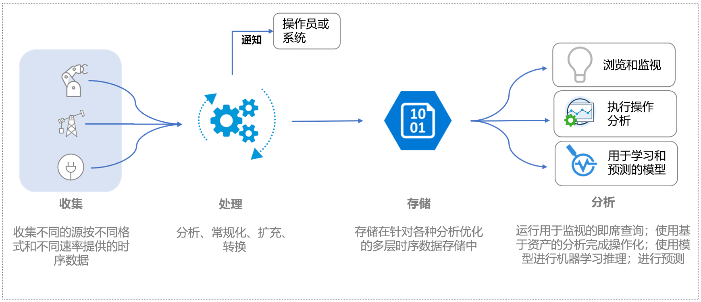
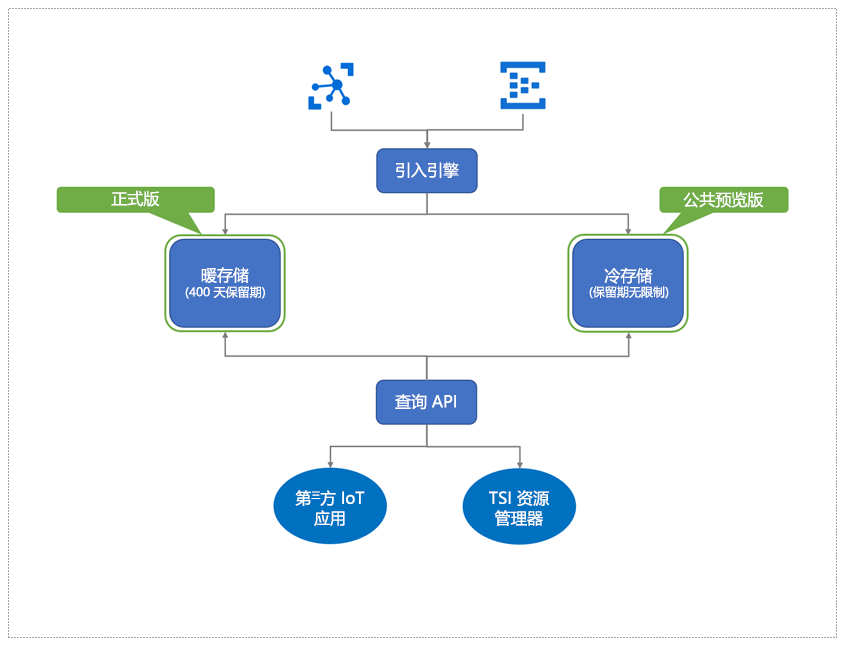

# 什么是 Azure 时序见解预览版？

Azure 时序见解预览版是一种端到端的平台即服务 (PaaS) 产品/服务。 你可以使用它来收集、处理、存储、分析和查询物联网 (IoT) 规模的数据，这类数据高度情景化并针对时序进行了优化。 

时序见解旨在用于即席数据浏览和运营分析。 它是唯一可扩展的自定义服务产品/服务，可满足行业 IoT 部署的广泛需求。

## 视频

了解 Azure 时序见解预览版的详细信息。

> [!VIDEO https://channel9.msdn.com/Shows/Internet-of-Things-Show/Azure-Time-Series-Insights-e2e-solution-for-industrial-IoT-analytics/player]

## IoT 数据的定义

由于行业设置的设备和传感器的性质不同，资产密集型组织中的行业 IoT 数据往往缺乏结构一致性。 来自这些流的数据通常带有下述特征：显著性差异、损坏的消息和错误读数。 IoT 数据通常仅在第一方或第三方源（如为端到端工作流添加上下文的 CRM 或 ERP）提供的其他数据输入的上下文中有意义。 来自第三方数据源的输入（如天气数据）有助于在给定安装中增加遥测流。 

这就意味着，只有一小部分数据用于运营和业务目的，而分析需要依据上下文进行处理。 通常对行业数据进行历史化，以便在更长的时间范围内进行深入分析，以了解和关联趋势。 将收集的 IoT 数据转换为可操作的见解需要： 

* 数据处理，用于数据的清理、筛选、内插、转换和准备操作，以便进行分析。
* 用于导航和了解数据（即规范化和情景化数据）的结构。
* 经济有效的存储，适用于长期/无限期保留已处理（或衍生）的数据和原始数据。

此类数据提供一致、广泛、最新且正确的信息，适用于业务分析和报告。

下图显示了典型的 IoT 数据流。

## 适用于行业 IoT 的 Azure 时序见解

IoT 的领域是多种多样的，客户跨越了多个行业领域，其中包括制造业、汽车、能源、公用事业、智能办公楼和咨询。 在广泛的行业 IoT 市场中，针对大型 IoT 数据提供全面分析的云原生解决方案仍在不断完善。 

Azure 时序见解通过提供统包、端到端 IoT 分析解决方案来满足这一市场需求，该方案包括用于对时序数据、基于资产的见解进行情景化的丰富的语义建模功能，并提供发现、趋势分析、异常情况检测和运营智能等一流用户体验。 

丰富的运营分析平台结合了交互式数据探索功能，你可以使用时序见解让从 IoT 资产收集的数据发挥出更大的价值。 预览版产品/服务支持： 

* 带有冷热分析支持的多层存储解决方案为客户提供了在冷热之间路由数据的选项，从而可以对热数据进行交互式分析，以及对数十年的历史数据执行运行智能。 

    *   高度交互的热分析解决方案，可对较短时间范围内的数据频繁执行大量的查询 
    *   使用基于 Azure 存储的可扩展、高性能和成本优化的时序数据湖，客户可以在数秒钟内呈现多年累积的时序数据。 

* 语义模型支持，描述与资产和设备的派生信号和原始信号关联的域和元数据。

* 灵活的分析平台可将历史时序数据存储在客户拥有的 Azure 存储帐户中，从而允许客户拥有其 IoT 数据的所有权。 数据以开放源代码 Apache Parquet 格式存储，可在各种数据方案中实现连通性和互操作性，这些方案包括预测分析、机器学习以及使用常用技术（包括 Spark、Databricks 和 Jupyter）完成的其他自定义计算。

* 具有增强的查询 API 和用户体验的丰富分析功能，结合了基于资产的数据见解和丰富的即席数据分析功能，并支持内插、标量和聚合函数、分类变量、散点图和时移时序信号，以进行深入分析。

*   企业级平台可满足企业 IoT 客户的规模、性能、安全性和可靠性需求。

* 针对端到端分析的可扩展性和集成支持。 时序见解为各种数据方案提供了可扩展的分析平台。 借助时序见解 Power BI 连接器，客户可以将其在时序见解中所做的查询直接带入 Power BI 中，以在一个单一的玻璃窗格中获得其 BI 和时序分析的统一视图。

下图显示了高级数据流。

  

Azure 时序见解为数据处理、存储（数据和元数据）以及查询提供了一种可缩放的即用即付定价模式，从而使客户能够调整其使用情况以满足其业务需求。 
 
由于引入这些重要的行业 IoT 功能，时序见解还具有以下主要优势。  

| | |
| ---| ---|
| 适用于 IoT 规模的时序数据的多层存储 | 使用用于提取数据的共享数据处理管道，可以将数据提取到热存储和冷存储中。 热存储用于进行交互式查询，而冷存储用于存储大量数据。 若要详细了解如何利用高性能的基于资产的查询，请参阅[查询](./time-series-insights-update-tsq.md)。 |
| 用于情景化原始遥测数据和派生基于资产的见解的时序模型 | 可以使用时序模型为时序数据创建实例、层次结构、类型和变量。 若要详细了解时序模型，请参阅[时序模型](./time-series-insights-update-tsm.md)。  |
| 与其他数据解决方案顺利持续集成 | 时序见解冷存储中的数据[存储](./time-series-insights-update-storage-ingress.md)在开放源代码 Apache Parquet 文件中。 这样就可以与其他数据解决方案（第一方或第三方）进行数据集成，以实现包括商业智能、高级机器学习和预测分析在内的方案。 |
| 近实时数据浏览 | [Azure 时序见解预览版资源管理器](./time-series-insights-update-explorer.md)用户体验提供的可视化功能适用于通过引入管道流式传输的所有数据。 连接事件源后，便可查看、浏览和查询事件数据。 通过这种方式，可以验证设备是否按预期方式发出数据。 此外可以监视 IoT 资产的运行状况、生产效率和整体成效。 | 
| 扩展性和集成 | 通过“导出”选项，可直接在时序浏览器用户体验中使用 Azure 时序见解 Power BI 连接器集成，从而允许客户将在用户体验中创建的时序查询直接导出到 Power BI 桌面并查看其时序图以及其他 BI 分析  。 通过从 IoT 时序等各种数据源提供进行分析的单一玻璃窗格，这为投资 Power BI 的行业 IoT 企业提供了一种新的方案。 | 
| 在时序见解平台上构建的自定义应用程序 | 时序见解支持 [JavaScript SDK](https://github.com/microsoft/tsiclient/blob/master/docs/API.md)。 SDK 提供了丰富的控件并且简化了对查询的访问。 使用 SDK 基于时序见解构建自定义 IoT 应用程序，以满足业务需求。 还可以直接使用时序见解[查询 API](./time-series-insights-update-tsq.md) 将数据推送到自定义 IoT 应用程序中。 |

## 后续步骤

开始使用 Azure 时序见解预览版：

> [!div class="nextstepaction"]
> [快速入门指南](./time-series-insights-update-quickstart.md)

了解用例：

> [!div class="nextstepaction"]
> [Azure 时序见解预览版用例](./time-series-insights-update-use-cases.md)