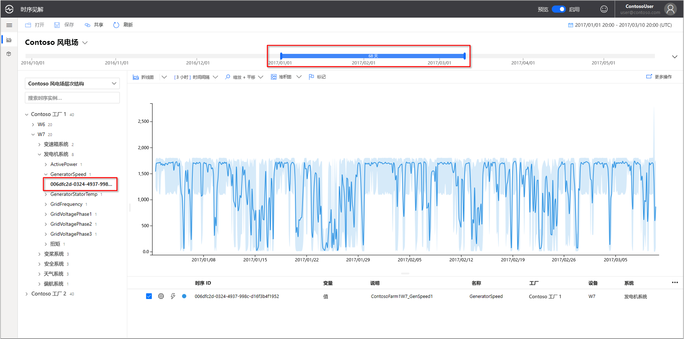
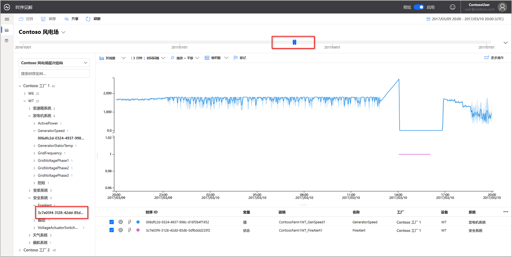
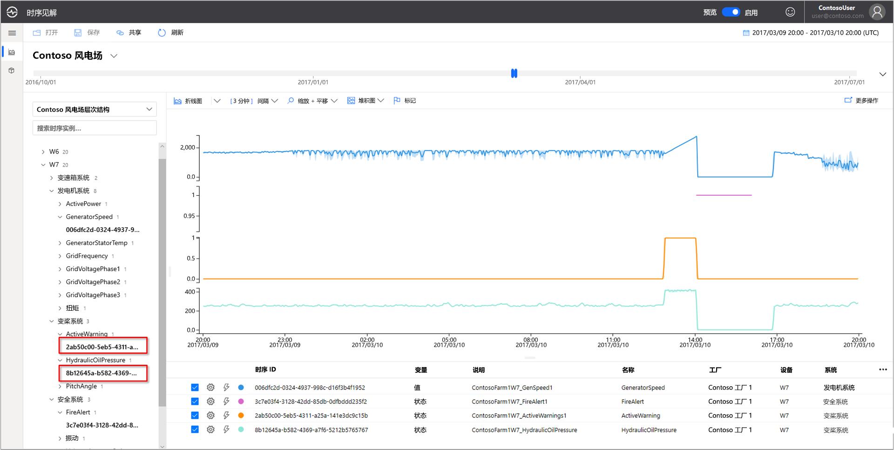
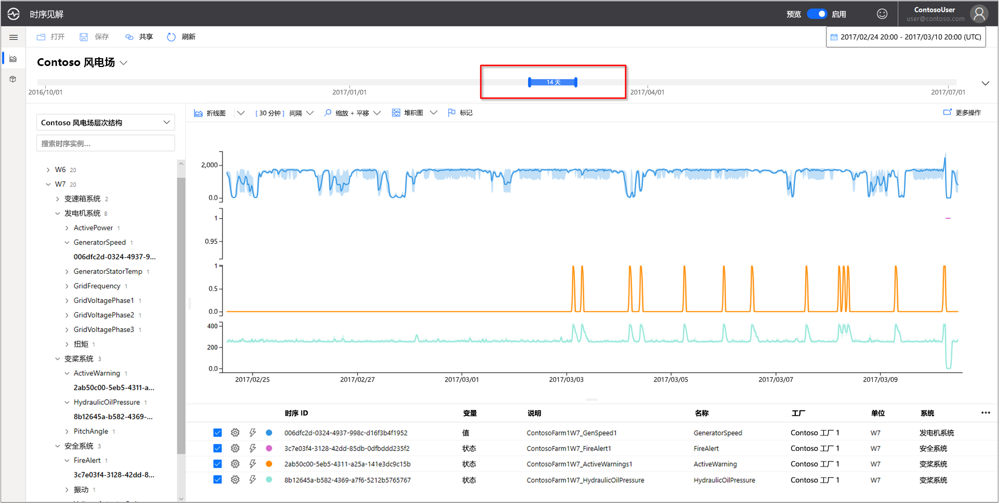
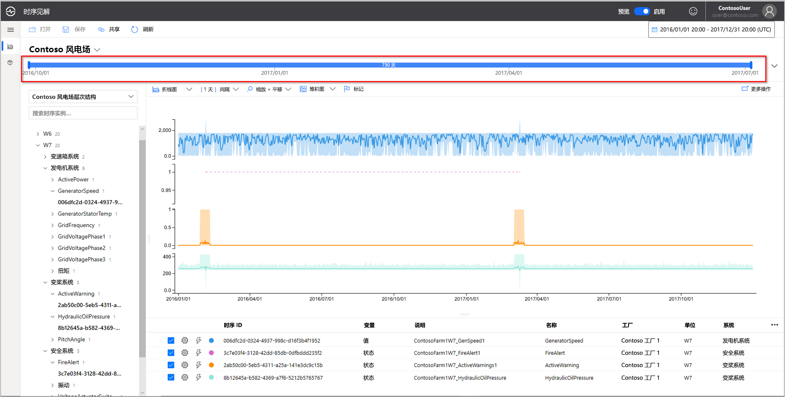
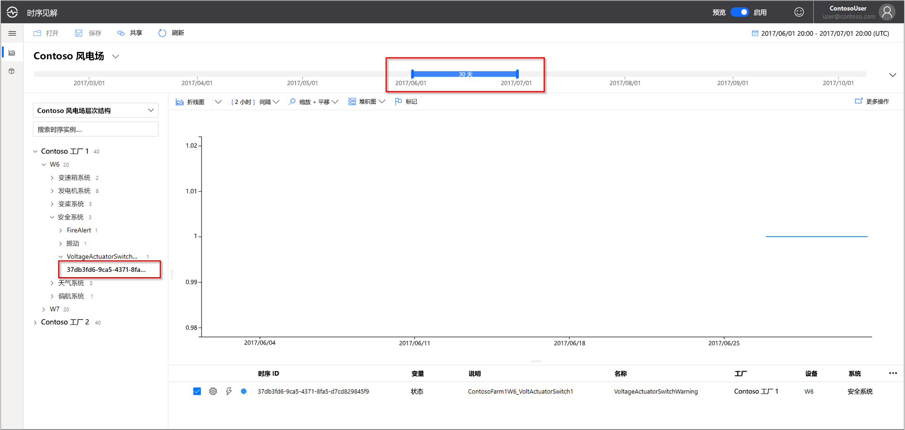
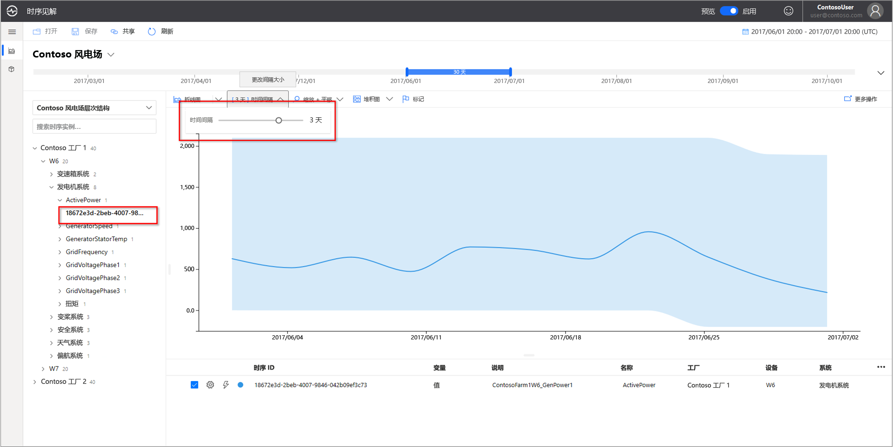
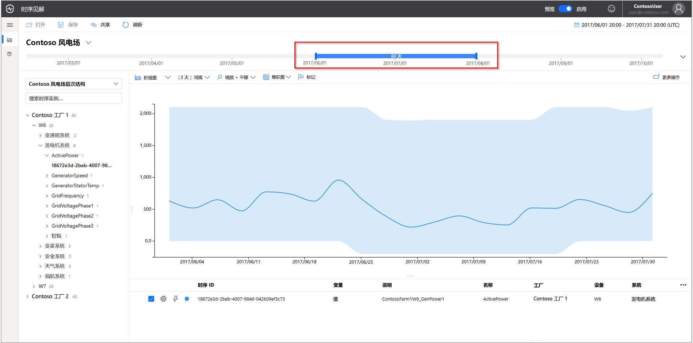
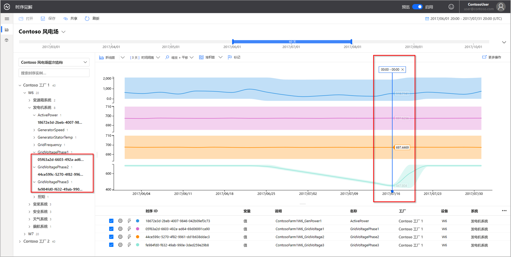
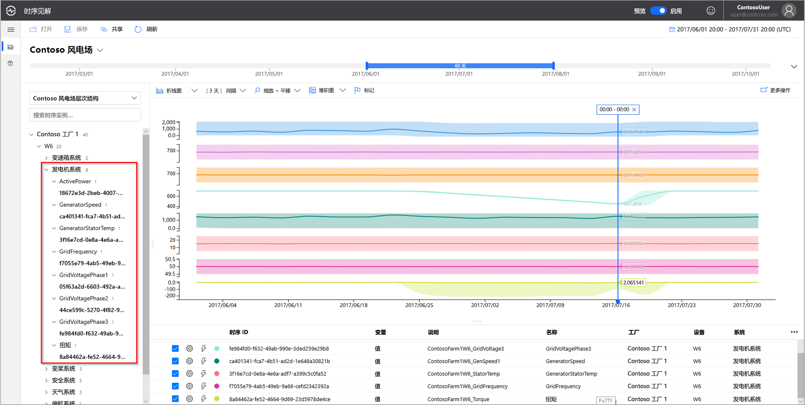

# 快速入门：浏览 Azure 时序见解预览版演示环境

本快速入门可帮助你开始使用 Azure 时序见解预览版环境。 在免费演示版中，浏览已添加到时序见解预览版中的关键功能。

时序见解预览版演示环境包含一家示例场景公司 Contoso，该公司经营两所风力发电厂。 每所工厂有 10 台涡轮机。 每台涡轮机都有 20 个传感器，这些传感器每隔一分钟向 Azure IoT 中心报告数据。 传感器收集有关天气状况、叶片螺距和偏转摆角的信息。 此外还会记录有关发电机性能、变速箱行为和安全性监视器的信息。

本快速入门介绍如何使用时序见解在 Contoso 数据中找到可行的见解。 此外，你还执行一项简单的根本原因分析，以便更好地预测严重故障和执行维护。

> [!IMPORTANT]
> 创建 [免费 Azure 帐户](https://azure.microsoft.com/free/?ref=microsoft.com&utm_source=microsoft.com&utm_medium=docs&utm_campaign=visualstudio) （如果没有该帐户）。

## 在演示环境中浏览时序见解资源管理器

时序见解预览版资源管理器演示历史数据和根本原因分析。 开始操作：

1. 转到  [Contoso 风力发电厂演示](https://insights.timeseries.azure.com/preview/samples)环境。  

1. 根据系统的提示使用 Azure 帐户凭据登录到时序见解资源管理器。

## 处理历史数据

1. 在“Contoso 发电厂 1”中查看风力涡轮机“W7”   。  

   1. 将视图范围更改为“1/1/17 20:00:00.00 to 3/10/17 20:00:00.00 (UTC)”  。
   1. 若要选择传感器，请选择“Contoso 发电厂 1” > “W7” > “发电机系统” > “GeneratorSpeed”。     然后，查看显示的值。

      

1. 最近，Contoso 公司发现风力涡轮机 W7 起火  。 起火原因的观点各不相同。 在时序见解中，将显示在火灾期间激活的火灾警报传感器。

   1. 将视图范围更改为“3/9/17 20:00:00.00 to 3/10/17 20:00:00.00 (UTC)”  。
   1. 选择“安全系统” > “FireAlert”。  

      

1. 检查在起火前后还发生了什么事件。 油压和活动警告数在起火之前的那一刻达到高峰。

   1. 添加“螺距系统” > “HydraulicOilPressure”。  
   1. 选择和“螺距系统” > “ActiveWarning”。  

      

1. 油压和活动警告传感器在起火之前的那一刻达到高峰。 展开显示的时序，以查看导致起火的其他很明显的迹象。 这两个传感器都不断地波动了一段时间， 这表示一直存在令人担忧的模式。

    * 将视图范围更改为“2/24/17 20:00:00.00 to 3/10/17 20:00:00.00 (UTC)”  。

      

1. 检查两年的历史数据后发现，出现这种传感器波动情况时也曾经发生过一次起火事件。

    * 将视图范围更改为“1/1/16 至 12/31/17”（所有数据）。 

      

使用时序见解和传感器遥测数据，我们发现历史数据中隐藏着长期的趋势。 使用这些新的见解，我们可以：

* 解释实际发生了什么问题。
* 纠正问题。
* 部署更好的警报通知系统。

## 根本原因分析

1. 某些方案需要进行复杂分析从数据中找到线索。 选择日期 **6/25** 时的风力涡轮机 **W6**。

    1. 将视图范围更改为“6/1/17 20:00:00.00 to 7/1/17 20:00:00.00 (UTC)”  。
    1. 选择“Contoso 发电厂 1” > “W6” > “安全系统” > “VoltageActuatorSwitchWarning”。    

       

1. 警告指示发电机的电压出现问题。 在当前时间间隔内，发电机的总体功率输出在正常参数范围内。 但增大间隔后，我们发现了另一种模式。 即存在明显的衰减。

    1. 删除 **VoltageActuatorSwitchWarning** 传感器。
    1. 选择“发电机系统” > “ActivePower”。  
    1. 将时间间隔更改为“3 天”。 

       

1. 扩大时间范围后，我们可以确定问题是已停止还是在持续。

    * 将时间跨度扩大为 60 天。

      

1. 可以添加其他传感器数据点来提供更好的上下文。 查看的传感器越多，对问题的认识就更全面。 让我们放置一个标记，以显示实际值。 

    1. 选择“发电机系统”，然后选择三个传感器：  **GridVoltagePhase1**、**GridVoltagePhase2** 和 **GridVoltagePhase3**。
    1. 在可见区域的最后一个数据点放一个标记。

       

    两个电压传感器的工作状态相当，且都处在正常参数范围内。 似乎 **GridVoltagePhase3** 传感器是问题所在。

1. 添加可以明确反映上下文的数据后，第 3 阶段的衰减趋势似乎更明显，这进一步确认它是问题所在。 现在我们了解了警告的原因， 可以将此问题转给维护团队去处理了。  

    * 更改显示内容，以将所有“发电机系统”传感器按同一图表比例叠加显示。 

      

## 清理资源

现在你已完成本快速入门，请清除已创建的资源：

1. 从 [Azure 门户](https://portal.azure.com)的左侧菜单中，选择“所有资源”，找到“Azure 时序见解”资源组  。
1. 通过选择“删除”  来删除整个资源组（以及其中包含的所有资源），或者单独删除每个资源。

## 后续步骤

已准备好创建自己的时序见解预览版环境。 若要开始，请执行以下操作：

> [!div class="nextstepaction"]
> [计划时序见解预览版环境](time-series-insights-update-plan.md)

了解如何使用演示及其功能：

> [!div class="nextstepaction"]
> [时序见解预览版资源管理器](time-series-insights-update-explorer.md)