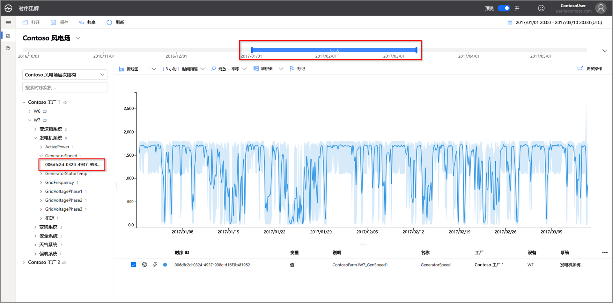
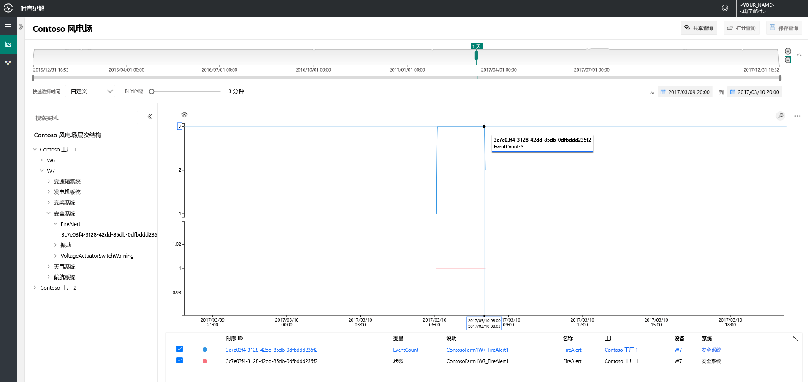
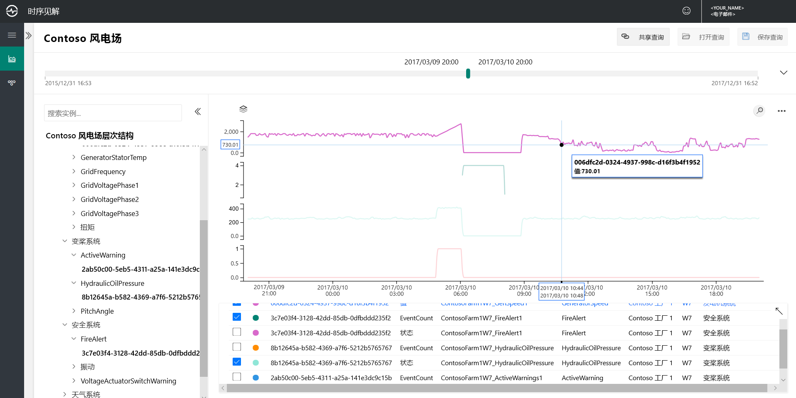
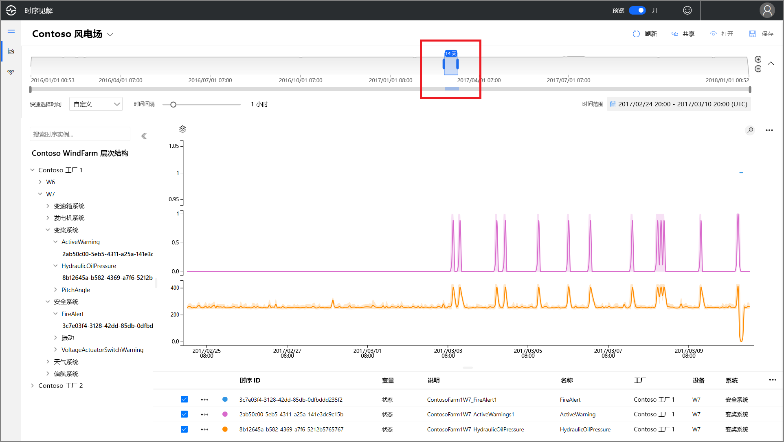
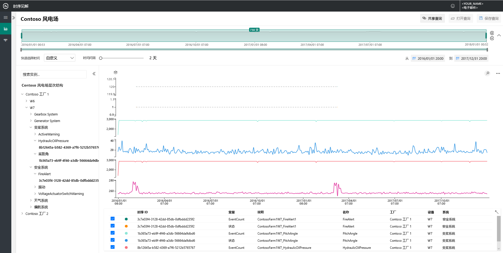
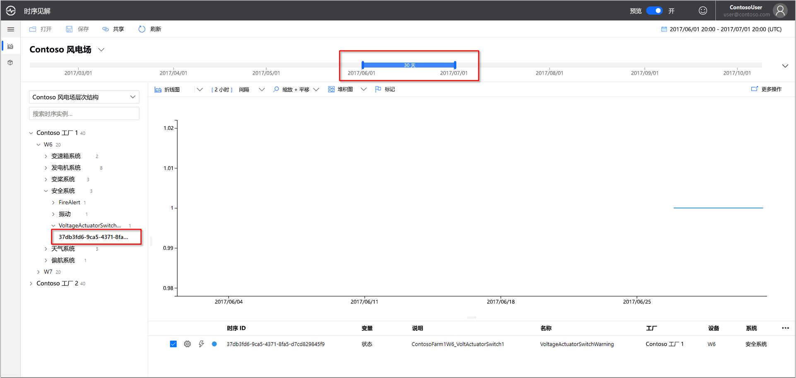
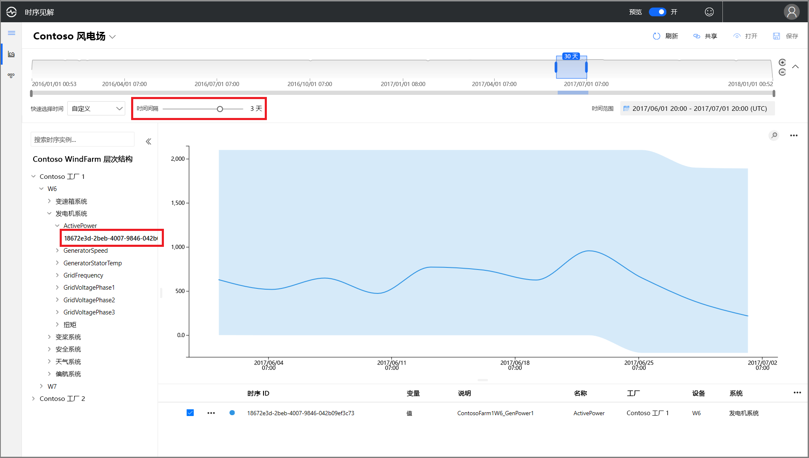
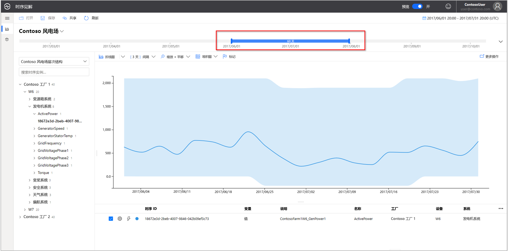
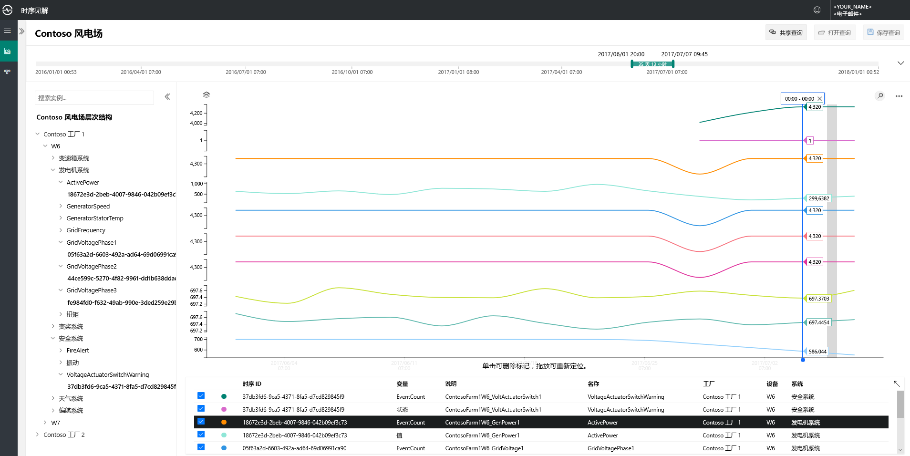
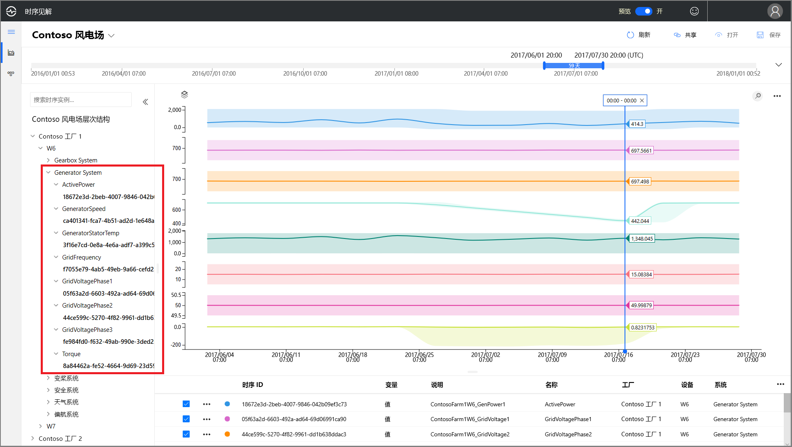

# 快速入门：浏览 Azure 时序见解预览版演示环境

本快速入门可帮助你开始使用 Azure 时序见解预览版。 可以通过免费演示浏览已添加到时序见解预览版中的关键功能。

预览版演示环境包含一家示例场景公司 Contoso，该公司经营两所风力发电厂，每所发电厂安装了 10 台涡轮机。 每台涡轮机都有 20 个传感器，这些传感器每隔一分钟向 Azure IoT 中心报告数据。 传感器收集有关天气状况、叶片螺距和偏转摆角的信息。 此外，涡轮机上还安装了发电机性能、变速箱行为和安全性监视器。

 你将在本文中了解如何使用时序见解在 Contoso 数据中找到可行的见解。 此外，你将执行一项简单的根本原因分析，以便更好地预测严重故障和执行维护。

## 在演示环境中浏览时序见解资源管理器

时序见解预览版资源管理器演示历史数据和根本原因分析。 开始操作：

1. 创建 [免费的 Azure 帐户](https://azure.microsoft.com/free/?ref=microsoft.com&utm_source=microsoft.com&utm_medium=docs&utm_campaign=visualstudio)（如果尚未创建）。 

1. 导航到  [Contoso 风力发电厂演示](https://insights.timeseries.azure.com/preview/samples)环境。  

1. 根据系统的提示使用 Azure 帐户凭据登录到时序见解资源管理器。

## 处理历史数据

1. 查看“Contoso 发电厂 1”中的风力涡轮机“W7”。  

    * 将视图范围更新为“1/1/17 20:00 至 3/10/17 20:00 (UTC)”。
    * 选择“Contoso 发电厂 1” > “W7” > “发电机系统” > “GeneratorSpeed”传感器。 然后查看生成的值。

      

1. 最近，Contoso 公司发现风力涡轮机 W7 起火。 起火大致原因的观点各不相同。 通过更认真的检查，我们发现火警传感器在起火期间激活。

    * 将视图范围更新为“3/9/17 20:00 至 3/10/17 20:00 (UTC)”。
    * 选择“安全系统” > “FireAlert”传感器。

      

1. 检查在起火前后还发生了什么事件。 油压和活动警告数在起火之前的那一刻达到高峰。

    * 添加“螺距系统” > “HydraulicOilPressure”传感器。
    * 选择和“螺距系统” > “ActiveWarning”传感器。

      

1. 油压和活动警告传感器在起火之前的那一刻达到高峰。 展开显示的时序，以查看导致起火的其他迹象。 这两个传感器都不断地波动了一段时间，这表示一直存在令人担忧的模式。

    * 将视图范围更新为“2/24/17 20:00 至 3/10/17 20:00 (UTC)”。

      

1. 检查两年的历史数据后发现，出现这种传感器波动情况时也曾经发生过一次起火事件。

    * 将视图范围更新为“1/1/16 至 12/31/17”（所有数据）。

      

使用 Azure 时序见解和传感器遥测数据，我们发现历史数据中隐藏着长期的有问题趋势。 使用这些新的见解，我们可以：

> [!div class="checklist"]
> * 解释实际发生了什么问题。
> * 纠正问题。
> * 部署高级警报通知系统。

## 根本原因分析

1. 某些方案需要使用复杂分析从数据中找到微秒的线索。 选择日期 **6/25** 时的风力涡轮机 **W6**

    * 将视图范围更新为“6/1/17 20:00 至 7/1/17 20:00 (UTC)”。
    * 然后选择“Contoso 发电厂 1” > “W6” > “安全系统” > “VoltageActuatorSwitchWarning”传感器。

      

1. 警告指示发电机输出的电压出现问题。 从当前时间间隔来看，发电机的总体功率输出在正常参数范围内。 但增大间隔后，我们发现了另一种模式：出现明显的衰减。

    * 删除 **VoltageActuatorSwitchWarning** 传感器。
    * 选择“发电机系统” > “ActivePower”传感器。
    * 将间隔更新为 **3d**。

      

1. 扩大时间范围后，我们可以确定问题是已停止还是在持续。

    * 将时间跨度扩大为 60 天。

      

1. 可以添加其他传感器数据点来提供有利的上下文。 可以查看的传感器越多，对问题的认识就更全面。 让我们放一个标记，以便查看实际值。 

    * 选择“发电机系统” > “GridVoltagePhase1”、“GridVoltagePhase2”和“GridVoltagePhase3”传感器。
    * 在可见区域的最后一个数据点放一个标记。

      

    三个电压传感器的工作状态相当，且都处在正常参数范围内。 似乎 **GridVoltagePhase3** 传感器是问题所在。

1. 添加可以明确反映上下文的数据后，第 3 阶段的衰减趋势似乎更明显，这进一步确认它是问题所在。 现在我们了解了警告的原因，可以将此问题转给维护团队去处理了。  

    * 更新显示内容，以将所有“发电机系统”传感器按同一图表比例叠加显示。

       

## 后续步骤

已准备好创建自己的时序见解预览版环境：

> [!div class="nextstepaction"]
> [计划时序见解预览版环境](time-series-insights-update-plan.md)

了解如何浏览演示及其功能：

> [!div class="nextstepaction"]
> [时序见解预览版资源管理器](time-series-insights-update-explorer.md)
