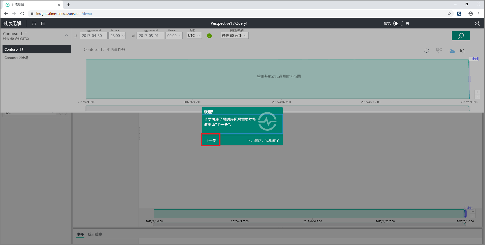
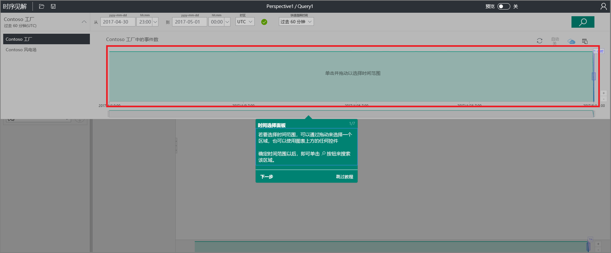
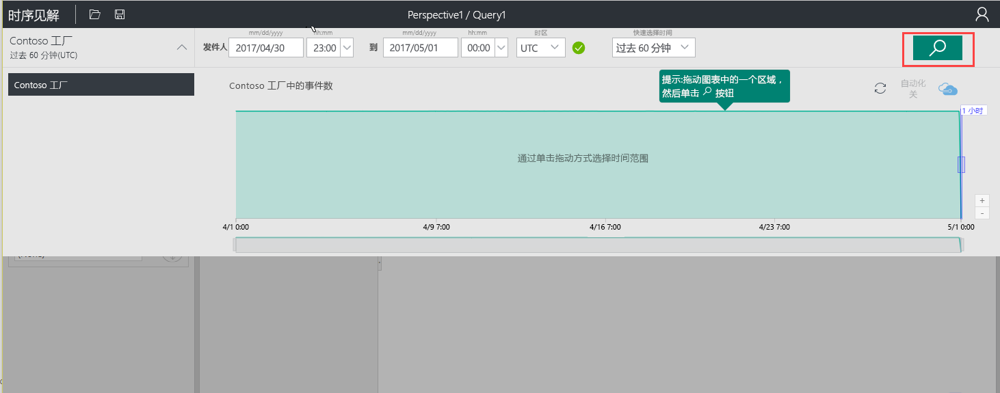
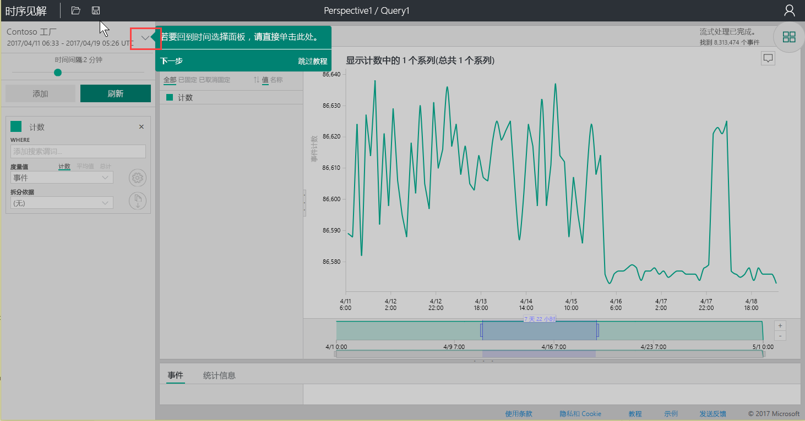
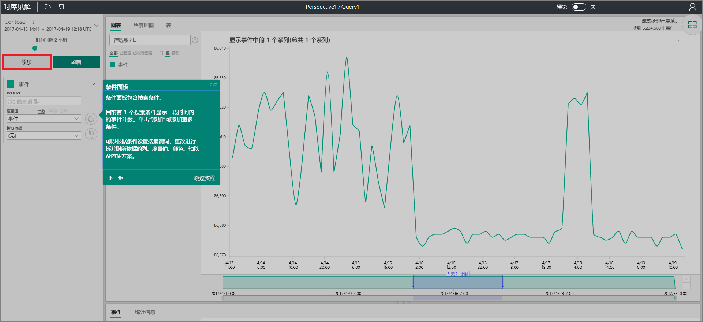
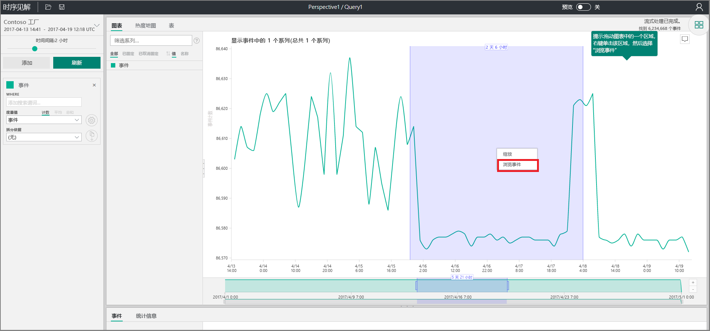
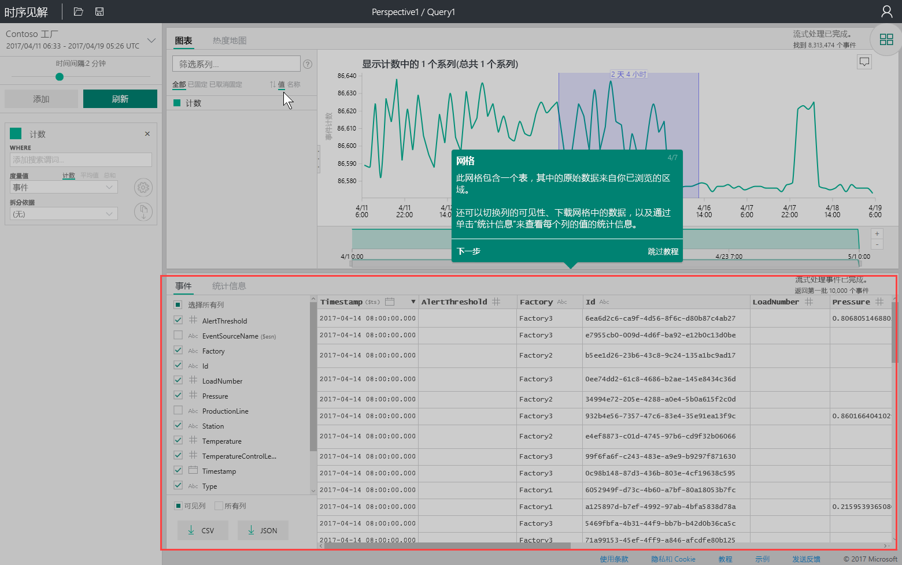
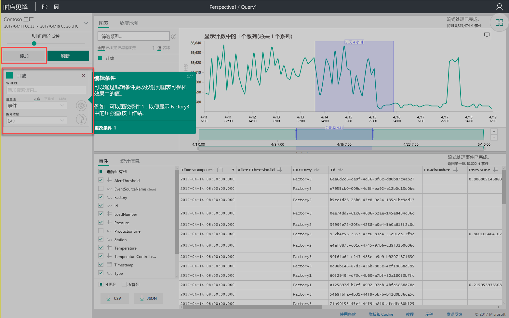
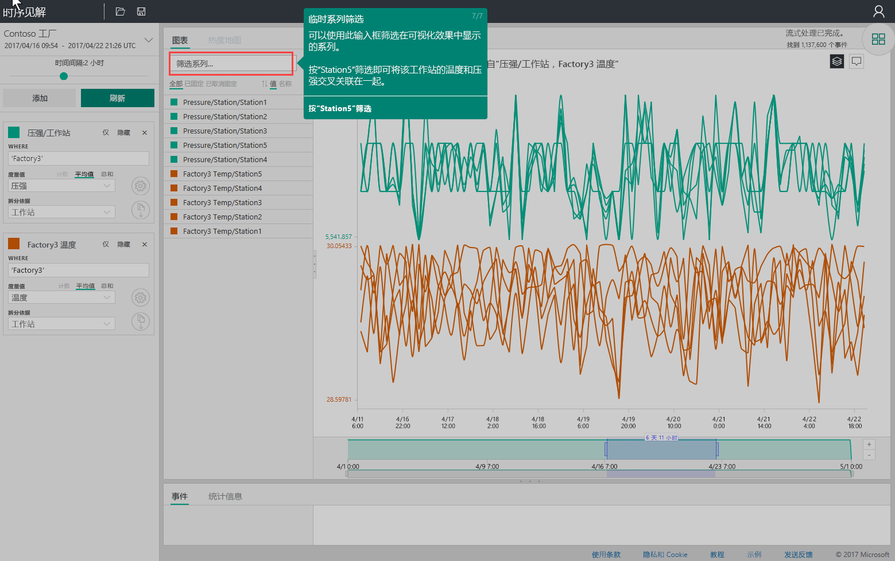

# 快速入门：浏览 Azure 时序见解
此快速入门说明如何在免费的演示环境中开始使用 Azure 时序见解资源管理器。 了解如何使用 Web 浏览器将大量 IoT 数据可视化，并浏览时序见解资源管理器的关键功能。 

Azure 时序见解是一种完全托管的分析、存储和可视化服务，让同时探索和分析数十亿 IoT 事件变得简单轻松。 它帮助发现隐藏的趋势和异常，并近实时地进行根因分析，从而提供数据的全局视图，能够快速验证 IoT 解决方案，并避免关键设备昂贵的停机时间。  如果正在生成需要存储或查询时序数据的应用程序，可以使用时序见解 REST API 进行开发。

如果还没有 Azure 订阅，可以在开始前创建一个[免费 Azure 帐户](https://azure.microsoft.com/free/?ref=microsoft.com&utm_source=microsoft.com&utm_medium=docs&utm_campaign=visualstudio)。

## 在演示环境中浏览时序见解资源管理器

1. 在浏览器中，导航到 [https://insights.timeseries.azure.com/demo](https://insights.timeseries.azure.com/demo)。 

2. 如果系统提示，请使用 Azure 帐户凭据登录到时序见解资源管理器。 
 
3. 将显示时序见解快速教程页面。 单击“下一步”开始快速教程。

   

4. 显示“时间选择面板”。 使用该面板选择期限，进行可视化。

   

5. 在此区域中单击并拖动，然后单击“搜索”按钮。
 
    

   时序见解显示指定期限的图表可视化效果。 可以在折线图中执行各种操作，例如筛选、固定、排序和堆叠。 

   要返回到“时间选择面板”，请单击如下所示的向下键：

   

6. 在“术语面板”中，单击“添加”，添加新的搜索词。

   

7. 在此图表中，可以选择一个区域，右键单击该区域，然后选择“浏览事件”。
 
   

   正在探索的区域将显示原始数据的网格：

   

8. 编辑术语以更改图表中的值，并添加另一个术语来交叉关联不同类型的值：

   

9. 在“筛选器系列...”对话框中输入筛选器术语，进行即时系列筛选。 对于本快速入门，输入“Station5”交叉关联此站的温度和压力。
 
   

完成快速入门后，可尝试用示例数据集创建不同的可视化效果。 

### 后续步骤
已准备好创建自己的时序见解环境：
> [!div class="nextstepaction"]
> [计划时序见解环境](time-series-insights-environment-planning.md)
