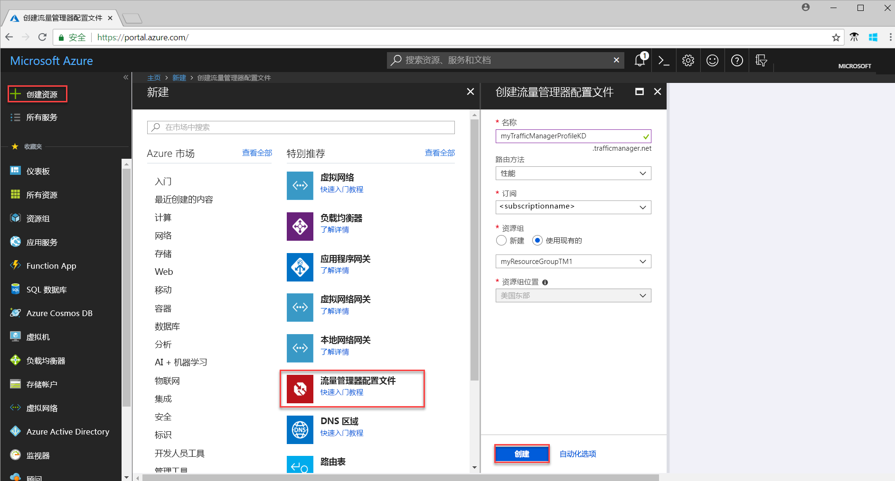
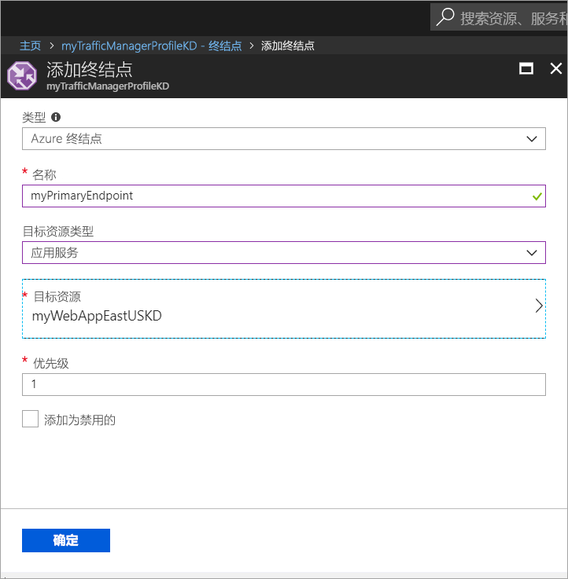

# 快速入门：为高度可用的 Web 应用程序创建流量管理器配置文件。

本快速入门介绍如何创建流量管理器配置文件，以便实现 Web 应用程序的高度可用性。 

本快速入门中介绍的方案包括两个在不同 Azure 区域中运行的 Web 应用程序实例。 将会根据[终结点优先级](traffic-manager-routing-methods.md#priority)创建流量管理器配置文件，以便将用户流量定向到运行应用程序的主站点。 流量管理器持续监视 Web 应用程序，并在主站点不可用时提供目标为备份站点的自动故障转移。

如果没有 Azure 订阅，请在开始之前创建一个[免费帐户](https://azure.microsoft.com/free/?WT.mc_id=A261C142F)。

## 登录 Azure 
通过 https://portal.azure.com 登录到 Azure 门户。

## 先决条件
本快速入门要求部署在不同 Azure 区域（美国东部和西欧）运行的两个 Web 应用程序实例。 这两个 Web 应用程序实例充当流量管理器的主终结点和备份终结点。

1. 在屏幕左上方，选择“创建资源” > “Web” > “Web 应用” > “创建”。
2. 在“Web 应用”中输入或选择以下信息，并在未指定任何设置的地方输入默认设置：

     | 设置         | 值     |
     | ---              | ---  |
     | 名称           | 输入 Web 应用的唯一名称  |
     | 资源组          | 选择“新建”，然后键入 *myResourceGroupTM1* |
     | 应用服务计划/位置         | 选择“新建”。  在应用服务计划中，输入 *myAppServicePlanEastUS*，然后选择“确定”。 
     |      位置  |   美国东部        |
    |||

3. 选择**创建**。
4. 默认网站在 Web 应用成功部署时创建。
5. 重复步骤 1-3，使用以下设置在另一 Azure 区域创建另一个网站：

     | 设置         | 值     |
     | ---              | ---  |
     | 名称           | 输入 Web 应用的唯一名称  |
     | 资源组          | 选择“新建”，然后键入 *myResourceGroupTM2* |
     | 应用服务计划/位置         | 选择“新建”。  在应用服务计划中，输入 *myAppServicePlanWestEurope*，然后选择“确定”。 
     |      位置  |   西欧      |
    |||

## 创建流量管理器配置文件
创建根据终结点优先级定向用户流量的流量管理器配置文件。

1. 在屏幕左上方，选择“创建资源” > “网络” > “流量管理器配置文件” > “创建”。
2. 在“创建流量管理器配置文件”中输入或选择以下信息，接受剩下的默认设置，然后选择“创建”：
    
    | 设置                 | 值                                              |
    | ---                     | ---                                                |
    | 名称                   | 此名称必须在 trafficmanager.net 区域中唯一，并将生成 DNS 名称 **trafficmanager.net**，该名称用于访问流量管理器配置文件。|
    | 路由方法          | 选择“优先级”路由方法。|
    | 订阅            | 选择订阅。|
    | 资源组          | 选择“现有”，然后选择“myResourceGroupTM1”。|
    |位置 |此设置指的是资源组的位置，对将全局部署的流量管理器配置文件没有影响。|
    |||
    
    
   

## 添加流量管理器终结点

将“美国东部”区域的网站添加为用于路由所有用户流量的主终结点。 将“西欧”区域的网站添加为备份终结点。 当主终结点不可用时，流量自动路由到辅助终结点。

1. 在门户的搜索栏中，搜索在前面部分创建的流量管理器配置文件名称，并在显示的结果中选择该配置文件。
2. 在“流量管理器配置文件”的“设置”部分单击“终结点”，然后单击“添加”。
3. 输入或选择以下信息，保留剩下的默认设置，然后选择“确定”：

    | 设置                 | 值                                              |
    | ---                     | ---                                                |
    | Type                    | Azure 终结点                                   |
    | 名称           | myPrimaryEndpoint                                        |
    | 目标资源类型           | 应用服务                          |
    | 目标资源          | **选择应用服务**可显示同一订阅下的 Web 应用的列表。 在“资源”中，选取要添加为第一个终结点的应用服务。 |
    | Priority               | 选择“1”。 如果此终结点处于正常状态，这会导致所有流量转到此终结点。    |
    
4. 针对下一个 Web 应用终结点重复步骤 2 和步骤 3。 确保添加该终结点时将其**优先级**值设为 **2**。
5.  添加完这两个终结点后，这两个终结点会显示在“流量管理器配置文件”中，并且其监视状态为“联机”。

    

## 测试流量管理器配置文件
在此部分，首先确定流量管理器配置文件的域名，然后看在主终结点不可用的情况下，流量管理器如何故障转移到辅助终结点。
### 确定 DNS 名称
1.  在门户的搜索栏中，搜索在前面部分中创建的**流量管理器配置文件**名称。 在显示的结果中，单击流量管理器配置文件。
2. 单击“概览”。
3. “流量管理器配置文件”会显示新建的流量管理器配置文件的 DNS 名称。
  
   

### 查看正在运行的流量管理器

1. 在 Web 浏览器中键入流量管理器配置文件的 DNS 名称，以便查看 Web 应用的默认网站。 在本快速入门方案中，所有请求都路由到其优先级已设置为“优先级 1”的主终结点。

2. 若要查看流量管理器故障转移如何进行，请禁用主站点，如下所示：
    1. 在“流量管理器配置文件”页中，选择“设置”>“终结点”>“MyPrimaryEndpoint”。
    2. 在 *MyPrimaryEndpoint* 中选择“禁用”。 
    3. 主终结点 *MyPrimaryEndpoint* 的状态现在显示为“禁用”。
3. 从上一步复制流量管理器配置文件的 DNS 名称即可在 Web 浏览器中成功查看网站。 当主终结点禁用时，用户流量会路由到辅助终结点。

## 清理资源
若不再需要资源组、Web 应用程序以及所有相关资源，请将其删除。 为此，请选择资源组（*myResourceGroupTM1* 和 *myResourceGroupTM2*），然后单击“删除”。

## 后续步骤
本快速入门介绍了如何创建流量管理器配置文件，以便将用户流量定向到高度可用的 Web 应用程序。 若要详细了解如何路由流量，请继续学习流量管理器的教程。

> [!div class="nextstepaction"]
> [流量管理器教程](traffic-manager-configure-performance-routing-method.md)

