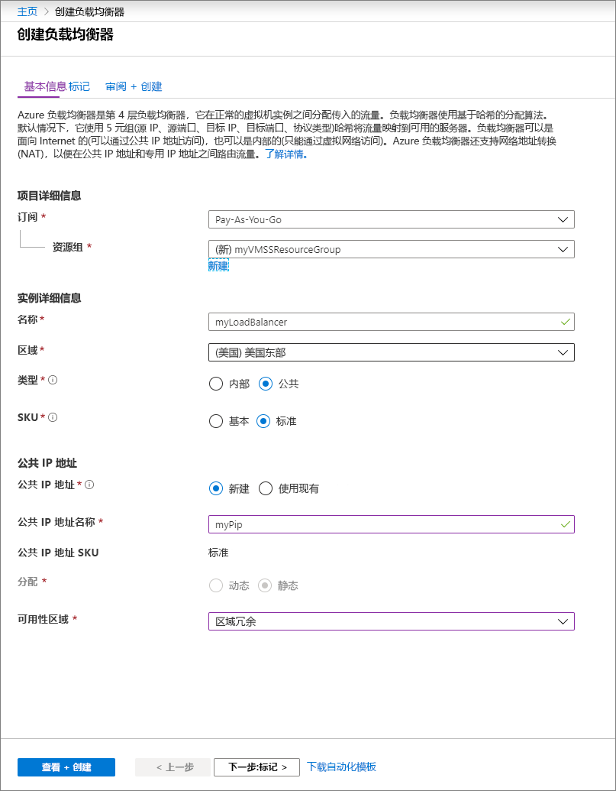
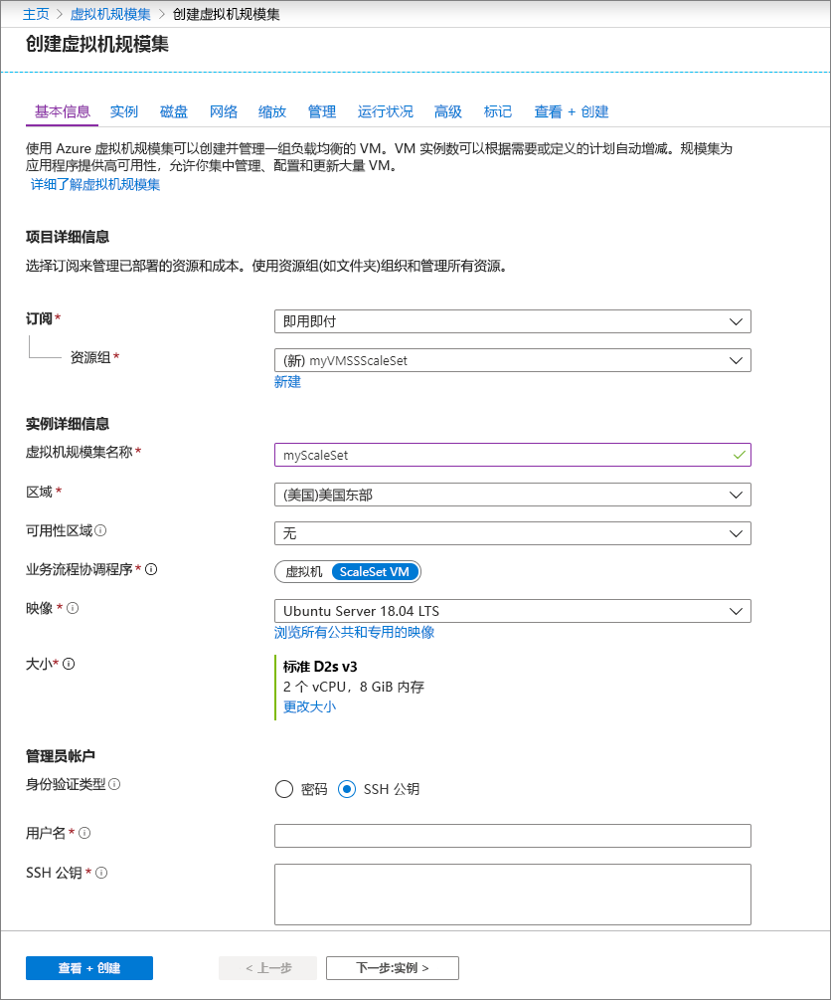

# 快速入门：在 Azure 门户中创建虚拟机规模集

利用虚拟机规模集，可以部署和管理一组相同的、自动缩放的虚拟机。 可以手动缩放规模集中的 VM 数，也可以定义规则，以便根据资源使用情况（如 CPU 使用率、内存需求或网络流量）进行自动缩放。 然后，Azure 负载均衡器会将流量分配到规模集中的 VM 实例。 本快速入门介绍如何在 Azure 门户中创建虚拟机规模集。

如果没有 Azure 订阅，请在开始之前创建一个[免费帐户](https://azure.microsoft.com/free/?WT.mc_id=A261C142F)。

## 登录 Azure
通过 https://portal.azure.com 登录到 Azure 门户。

## 创建负载均衡器

Azure [负载均衡器](../load-balancer/load-balancer-overview.md)在运行正常的虚拟机实例之间分配传入流量。 

首先，使用门户创建公共标准负载均衡器。 创建的名称和公共 IP 地址自动配置为负载均衡器的前端。

1. 在搜索框中，键入“负载均衡器”  。 在搜索结果中的“市场”下，选取“负载均衡器”   。
1. 在“创建负载均衡器”页的“基本信息”选项卡中，输入或选择以下信息   ：

    | 设置                 | 值   |
    | ---| ---|
    | 订阅  | 选择订阅。    |    
    | 资源组 | 选择“新建”并在文本框中键入 myVMSSResourceGroup   。|
    | 名称           | *myLoadBalancer*         |
    | 区域         | 选择“美国东部”  。       |
    | 类型          | 选择“公共”。        |
    | SKU           | 选择“标准”  。       |
    | 公共 IP 地址 | 选择“新建”。  |
    | 公共 IP 地址名称  | *MyPip*   |
    | 分配| 静态 |

1. 完成操作后，选择“查看 + 创建”  
1. 通过验证后，选择“创建”  。 

## 创建虚拟机规模集
可使用 Windows Server 映像或 Linux 映像（如 RHEL、CentOS、Ubuntu 或 SLES）部署规模集。

1. 在搜索框中键入“规模集”  。 在结果中的“市场”下，选择“虚拟机规模集”   。 将打开“创建虚拟机规模集”页  。 
1. 在“基本信息”  选项卡中的“项目详细信息”  下，确保选择了正确的订阅，然后选择**新建**资源组。 键入 myVMSSResourceGroup 作为名称，然后选择“确定”   。 
1. 键入 myScaleSet 作为规模集的名称  。
1. 在“区域”中，选择离你近的区域  。
1. 保留业务流程协调程序的规模集 VM 的默认值   。
1. 选择市场映像作为“映像”  。 在此示例中，我们选择了“Ubuntu 服务器 18.04 LTS”  。
1. 输入所需的用户名，并选择首选的身份验证类型。
   - 密码  长度必须至少为 12 个字符，并且必须满足以下 4 个复杂性要求的其中 3 个：1 个小写字符、1 个大写字符、1 个数字和 1 个特殊字符。 有关详细信息，请参阅[用户名和密码要求](../virtual-machines/windows/faq.md#what-are-the-username-requirements-when-creating-a-vm)。
   - 如果选择 Linux OS 磁盘映像，可选择 SSH 公钥  。 仅提供公钥，如 *~/.ssh/id_rsa.pub*。 可从门户使用 Azure Cloud Shell [创建和使用 SSH 密钥](../virtual-machines/linux/mac-create-ssh-keys.md)。
   
    

1. 选择“下一步”以移动其他页面  。 
1. 保留“实例”和“磁盘”页的默认值   。
1. 在“网络”页上的“负载平衡”下，选择“是”以将规模集实例置于负载均衡器之后    。 
1. 在“负载均衡选项”中，选择“Azure 负载均衡器”   。
1. 在“选择负载均衡器”中，选择先前创建的“myLoadBalancer”。  
1. 对于“选择后端池”，选择“新建”，然后键入“myBackendPool”，再选择“创建”     。
1. 完成操作后，选择“查看 + 创建”  。 
1. 通过验证后，选择“创建”以部署规模集  。

## 清理资源
不再需要资源组、规模集和所有相关的资源时，可将其删除。 为此，请选择规模集的资源组，然后选择“删除”。 

## 后续步骤
在本快速入门中，我们已在 Azure 门户中创建了一个基本的规模集。 若要了解详细信息，请继续学习有关如何创建和管理 Azure 虚拟机规模集的教程。

> [!div class="nextstepaction"]
> [创建和管理 Azure 虚拟机规模集](tutorial-create-and-manage-powershell.md)
