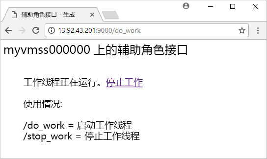

# <a name="quickstart-create-a-linux-virtual-machine-scale-set-with-an-azure-resource-manager-template"></a>快速入门：使用 Azure 资源管理器模板创建 Linux 虚拟机规模集

利用虚拟机规模集，可以部署和管理一组相同的、自动缩放的虚拟机。 可以手动缩放规模集中的 VM 数，也可以定义规则，以便根据资源使用情况（如 CPU 使用率、内存需求或网络流量）进行自动缩放。 然后，Azure 负载均衡器会将流量分配到规模集中的 VM 实例。 在本快速入门中，我们将使用 Azure 资源管理器模板创建虚拟机规模集并部署一个示例应用程序。

[!INCLUDE [About Azure Resource Manager](../../includes/resource-manager-quickstart-introduction.md)]

如果没有 Azure 订阅，请在开始之前创建一个[免费帐户](https://azure.microsoft.com/free/?WT.mc_id=A261C142F)。

## <a name="prerequisites"></a>先决条件

无。

## <a name="create-a-scale-set"></a>创建规模集

Azure 资源管理器模板允许部署成组的相关资源。 在单个模板中，可以创建虚拟机规模集、安装应用程序，以及配置自动缩放规则。 在借助变量和参数的情况下，可以重复使用此模板来更新现有的规模集，或者创建更多的规模集。 可通过 Azure 门户、Azure CLI、Azure PowerShell 或持续集成/持续交付 (CI/CD) 管道部署模板。

### <a name="review-the-template"></a>查看模板

本快速入门中使用的模板来自 [Azure 快速入门模板](https://azure.microsoft.com/resources/templates/201-vmss-bottle-autoscale/)。

:::code language="json" source="~/quickstart-templates/201-vmss-bottle-autoscale/azuredeploy.json" range="1-330" highlight="176-264":::

该模板中定义了以下资源：

- [**Microsoft.Network/virtualNetworks**](/azure/templates/microsoft.network/virtualnetworks)
- [**Microsoft.Network/publicIPAddresses**](/azure/templates/microsoft.network/publicipaddresses)
- [**Microsoft.Network/loadBalancers**](/azure/templates/microsoft.network/loadbalancers)
- [**Microsoft.Compute/virtualMachineScaleSets**](/azure/templates/microsoft.compute/virtualmachinescalesets)
- [**Microsoft.Insights/autoscaleSettings**](/azure/templates/microsoft.insights/autoscalesettings)

#### <a name="define-a-scale-set"></a>定义规模集

突出显示的部分是规模集资源定义。 若要使用模板创建规模集，请定义相应的资源。 虚拟机规模集资源类型的核心部件包括：

| properties                     | 属性说明                                  | 示例模板值                    |
|------------------------------|----------------------------------------------------------|-------------------------------------------|
| type                         | 要创建的 Azure 资源类型                            | Microsoft.Compute/virtualMachineScaleSets |
| name                         | 规模集名称                                       | myScaleSet                                |
| location                     | 要创建规模集的位置                     | 美国东部                                   |
| sku.name                     | 每个规模集实例的 VM 大小                  | Standard_A1                               |
| sku.capacity                 | 一开始需要创建的 VM 实例数           | 2                                         |
| upgradePolicy.mode           | 更改发生时的 VM 实例升级模式              | 自动                                 |
| imageReference               | 用于 VM 实例的平台或自定义映像 | Canonical Ubuntu Server 16.04-LTS         |
| osProfile.computerNamePrefix | 每个 VM 实例的名称前缀                     | myvmss                                    |
| osProfile.adminUsername      | 每个 VM 实例的用户名                        | azureuser                                 |
| osProfile.adminPassword      | 每个 VM 实例的密码                        | P@ssw0rd!                                 |

若要自定义规模集模板，可以更改 VM 大小或初始容量。 另一选项是使用其他平台或自定义映像。

#### <a name="add-a-sample-application"></a>添加示例应用程序

若要测试规模集，请安装一个基本的 Web 应用程序。 部署规模集时，可以通过 VM 扩展来完成部署后配置和自动化任务，例如安装某个应用。 可以从 Azure 存储或 GitHub 下载脚本，或者在扩展运行时将脚本提供给 Azure 门户。 若要对规模集应用某个扩展，请将 *extensionProfile* 节添加到前面的资源示例中。 扩展配置文件通常定义以下属性：

- 扩展类型
- 扩展发布者
- 扩展版本
- 配置或安装脚本的位置
- 可在 VM 实例上执行的命令

模板使用自定义脚本扩展来安装 [Bottle](https://bottlepy.org/docs/dev/)（Python Web 框架）和简单的 HTTP 服务器。

两个脚本在 **fileUris** - （*installserver.sh* 和 *workserver.py*）中定义。 从 GitHub 下载这些文件以后，*commandToExecute* 就可以运行 `bash installserver.sh` 来安装和配置应用。

### <a name="deploy-the-template"></a>部署模板

可以通过选择下面的“部署到 Azure”按钮来部署模板。  此按钮可打开 Azure 门户、加载完整的模板，以及提示输入一些参数，例如规模集名称、实例计数和管理员凭据。

[](https://portal.azure.com/#create/Microsoft.Template/uri/https%3A%2F%2Fraw.githubusercontent.com%2FAzure%2Fazure-quickstart-templates%2Fmaster%2F201-vmss-bottle-autoscale%2Fazuredeploy.json)

还可以使用 Azure CLI 部署资源管理器模板：

```azurecli-interactive
# Create a resource group
az group create --name myResourceGroup --location EastUS

# Deploy template into resource group
az group deployment create \
    --resource-group myResourceGroup \
    --template-uri https://raw.githubusercontent.com/Azure/azure-quickstart-templates/master/201-vmss-bottle-autoscale/azuredeploy.json
```

响应提示，为 VM 实例提供规模集名称、实例计数和管理员凭据。 创建规模集和支持资源需要数分钟。

## <a name="test-the-deployment"></a>测试部署

若要查看正在运行的规模集，请在 Web 浏览器中访问示例 Web 应用程序。 使用 [az network public-ip list](/cli/azure/network/public-ip) 命令获取负载均衡器的公共 IP 地址，如下所示：

```azurecli-interactive
az network public-ip list \
    --resource-group myResourceGroup \
    --query [*].ipAddress -o tsv
```

以“http:\//publicIpAddress:9000/do_work”  格式将负载均衡器的公共 IP 地址输入到 Web 浏览器中。 负载均衡器将流量分发到某个 VM 实例，如以下示例所示：



## <a name="clean-up-resources"></a>清理资源

如果不再需要资源组、规模集和所有相关的资源，可以使用 [az group delete](/cli/azure/group) 命令将其删除，如下所示。 `--no-wait` 参数会使光标返回提示符处，不会等待操作完成。 `--yes` 参数将确认是否希望删除资源，不会显示询问是否删除的额外提示。

```azurecli-interactive
az group delete --name myResourceGroup --yes --no-wait
```

## <a name="next-steps"></a>后续步骤

在本快速入门中，我们使用 Azure 模板创建了一个 Linux 规模集，并使用自定义脚本扩展在 VM 实例上安装了基本的 Python Web 服务器。 若要了解详细信息，请继续学习有关如何创建和管理 Azure 虚拟机规模集的教程。

> [!div class="nextstepaction"]
> [创建和管理 Azure 虚拟机规模集](tutorial-create-and-manage-cli.md)
