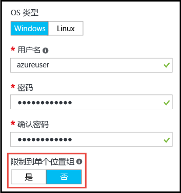

# <a name="working-with-large-virtual-machine-scale-sets"></a>使用大型虚拟机规模集
用户现在可以创建容量高达 1,000 台 VM 的 Azure [虚拟机规模集](/azure/virtual-machine-scale-sets/)。 在本文档中，_大型虚拟机规模集_定义为能够扩展到 100 台 VM 以上的规模集。 此功能通过规模集属性 (_singlePlacementGroup=False_) 设置。 

大型规模集在某些方面（例如负载均衡和容错域）的表现不同于标准规模集。 本文档介绍了大型规模集的特征，说明了在应用程序中成功使用大型规模集需要了解的事项。 

部署大型的云基础结构的常用方法是创建一组_缩放单元_，例如跨多个 VNET 和存储帐户创建多个 VM 规模集。 此方法和单个 VM 相比可以提供更简单的管理，并且多个缩放单元对于许多应用程序很有益处，尤其是那些需要其他堆叠组件（如多个虚拟网络和终结点）的应用程序。 不过，如果应用程序需要单个大型群集，则部署高达 1,000 台 VM 的单个规模集可能更直接。 示例方案包括：集中式大数据部署、需要对大型工作节点池进行简单管理的计算网格。 用户可以将大型规模集与虚拟机规模集[附加数据磁盘](virtual-machine-scale-sets-attached-disks.md)结合使用，通过单次操作部署包含数千 vCPU 和千万亿字节存储的可缩放基础结构。

## <a name="placement-groups"></a>放置组 
_大型_ 规模集之所以特别，不是因为 VM 数，而是因为其包含的_放置组_ 数。 放置组是类似于 Azure 可用性集的构造，具有自己的容错域和升级域。 默认情况下，一个规模集包含一个放置组，最大大小为 100 台 VM。 如果将名为 _singlePlacementGroup_ 的规模集属性设置为 _false_，则该规模集可以由多个放置组组成，其范围为 0-1,000 台 VM。 设置为默认值 _true_ 时，规模集由单个放置组组成，其范围为 0-100 台 VM。

## <a name="checklist-for-using-large-scale-sets"></a>使用大型规模集时的核对清单
若要确定应用程序能否有效使用大型规模集，请考虑以下要求：

- 如果计划部署大量 VM，可能需要提高计算 vCPU 配额限制。 
- 从 Azure 市场映像创建的规模集的最大规模可以是 1,000 台 VM。
- 从自定义映像（用户自己创建和上传的 VM 映射）创建的规模集目前的最大规模可以是 600 台 VM。
- 大型规模集需要 Azure 托管磁盘。 不通过托管磁盘创建的规模集需要多个存储帐户（每 20 台 VM 需要一个）。 根据设计，大型规模集专用于托管磁盘，其目的是减少存储管理开销，避免遇到存储帐户订阅限制的风险。 
- 对于由多个放置组组成的规模集，在进行第 4 层负载均衡时需要 [Azure 负载均衡器标准 SKU](../load-balancer/load-balancer-standard-overview.md)。 负载均衡器标准 SKU 还有其他优势，例如能够在多个规模集之间进行负载均衡。 标准 SKU 还要求规模集有与之关联的网络安全组，否则 NAT 池无法正常使用。 若需使用 Azure 负载均衡器基本 SKU，请确保将规模集配置为使用单个放置组，这是默认设置。
- 所有规模集均支持通过 Azure 应用程序网关进行的第 7 层负载均衡。
- 规模集按定义使用单个子网 - 请确保子网的地址空间能够容纳所需的所有 VM。 默认情况下，规模集会进行过度预配（在部署或扩展时创建额外的 VM，免费），目的是提高部署可靠性和性能。 请额外预留 20% 的地址空间（相对于计划扩展的目标 VM 数）。
- 容错域和升级域仅在放置组内保持一致性。 此体系结构不会改变规模集的总体可用性，因为 VM 在不同的物理硬件中是均衡分布的，但却意味着，如果需要保证两台 VM 位于不同的硬件中，则必须确保其位于同一放置组的不同容错域中。 请参阅此链接：[可用性选项](/azure/virtual-machines/windows/availability)。 
- 容错域和放置组 ID 显示在规模集 VM 的_实例视图_ 中。 可以在 [Azure 资源浏览器](https://resources.azure.com/)中查看规模集 VM 的实例视图。

## <a name="creating-a-large-scale-set"></a>创建大型规模集
在 Azure 门户中创建规模集时，请直接指定实例计数值（最大为 1,000）。 如果超出 100 个实例，请将“允许缩放到 100 个实例以上”设置为“是”，这样就可以缩放成多个放置组。  



可以使用 [Azure CLI](https://github.com/Azure/azure-cli) az vmss create 命令创建大型虚拟机规模集。 该命令根据 _instance-count_ 参数设置智能默认值（例如子网大小）：

```azurecli
az group create -l southcentralus -n biginfra
az vmss create -g biginfra -n bigvmss --image ubuntults --instance-count 1000
```

_vmss create_ 命令会对某些配置值进行默认设置（如果用户未指定这些值）。 若要查看可重写的选项，请尝试以下命令：

```azurecli
az vmss create --help
```

若要通过编写 Azure 资源管理器模板来创建大型规模集，请确保该模板基于 Azure 托管磁盘创建规模集。 可以在 _Microsoft.Compute/virtualMachineScaleSets_ 资源的 _properties_ 节将 _singlePlacementGroup_ 属性设置为 _false_。 以下 JSON 片段显示了规模集模板的开头，包括 1,000 VM 容量和 _"singlePlacementGroup" : false_ 设置：

```json
{
  "type": "Microsoft.Compute/virtualMachineScaleSets",
  "location": "australiaeast",
  "name": "bigvmss",
  "sku": {
    "name": "Standard_DS1_v2",
    "tier": "Standard",
    "capacity": 1000
  },
  "properties": {
    "singlePlacementGroup": false,
    "upgradePolicy": {
      "mode": "Automatic"
    }
```

有关大型规模集模板的完整示例，请参阅 [https://github.com/gbowerman/azure-myriad/blob/master/bigtest/bigbottle.json](https://github.com/gbowerman/azure-myriad/blob/master/bigtest/bigbottle.json)。

## <a name="converting-an-existing-scale-set-to-span-multiple-placement-groups"></a>将现有的规模集转换为跨多个放置组
要使现有的虚拟机规模集能够扩展到 100 个以上的 VM，需在规模集模型中将 _singlePlacementGroup_ 属性更改为 _false_。 可以使用 [Azure 资源浏览器](https://resources.azure.com/)对该属性进行测试性更改。 找到现有的规模集，选择“编辑”，并更改 _singlePlacementGroup_ 属性。 如果看不到该属性，则可能是在使用旧版 Microsoft.Compute API 查看规模集。

> [!NOTE]
> 可以将规模集从仅支持单个放置组（默认行为）更改为支持多个放置组，但不能反过来进行转换。 因此，请确保在进行转换之前了解大型规模集的属性。


