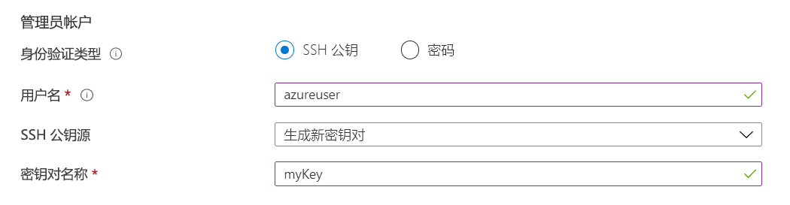

# 预览版：使用门户将 Vm 部署到专用主机

本文介绍如何创建 Azure[专用主机](dedicated-hosts.md)来托管虚拟机 (vm)。 

[!INCLUDE [virtual-machines-common-dedicated-hosts-portal](../../../includes/virtual-machines-common-dedicated-hosts-portal.md)]

## 创建 VM

1. 在 Azure 门户的左上角，选择“创建资源”。
1. 在 Azure 市场资源列表上方的搜索框中，搜索并选择 Canonical 提供的“Ubuntu Server 16.04 LTS”，然后选择“创建”。
1. 在 "**基本**信息" 选项卡中的 "**项目详细信息**" 下, 确保选择了正确的订阅, 然后选择 " *myDedicatedHostsRG* " 作为**资源组**。 
1. 在“实例详细信息”下，对于“虚拟机名称”键入 *myVM*，对于“位置”选择“美国东部”。
1. 在 "**可用性选项**" 中, 选择 "**可用性区域**", 然后从下拉范围中选择*1* 。
1. 对于 "大小", 请选择 "**更改大小**"。 在可用大小列表中, 选择 Esv3 系列中的一个, 如**标准 E2s v3**。 您可能需要清除筛选器才能查看所有可用大小。
1. 在“管理员帐户”下，选择“SSH 公钥”，键入用户名，然后将公钥粘贴到文本框中。 删除公钥中的所有前导或尾随空格。

    

1. 在 "**入站端口规则** > " "**公用入站端口**" 下, 选择 "**允许选择的端口**", 然后从下拉选项中选择**SSH (22)** 。 
1. 在页面顶部, 选择 "**高级**" 选项卡, 然后在 "**主机**" 部分中, 选择 " *myHostGroup* "**作为 "** **主机组**" 和 " *myhost 代表*"。 
    
1. 保留其余默认值，然后选择页面底部的“查看 + 创建”按钮。
1. 看到验证已通过的消息后, 选择 "**创建**"。

部署 VM 需要数分钟。

## 后续步骤

- 有关详细信息, 请参阅[专用主机](dedicated-hosts.md)概述。

- [这里](https://github.com/Azure/azure-quickstart-templates/blob/master/201-vm-dedicated-hosts/README.md)有一个示例模板, 它使用区域和容错域实现了区域中的最大复原能力。

- 你还可以使用[Azure CLI](dedicated-hosts-cli.md)部署专用主机。

