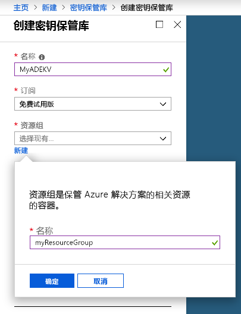
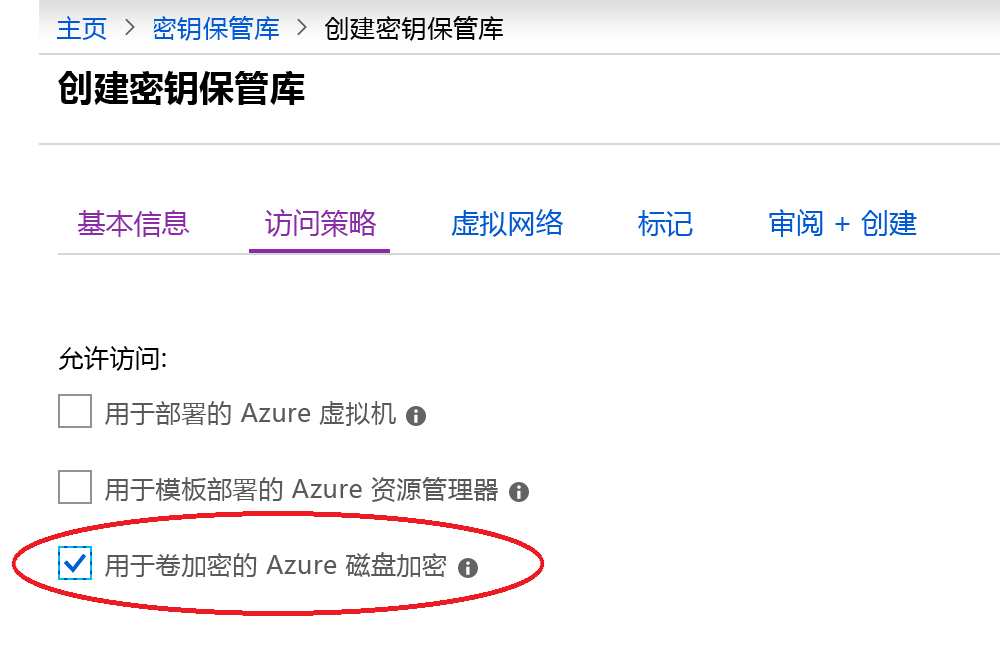
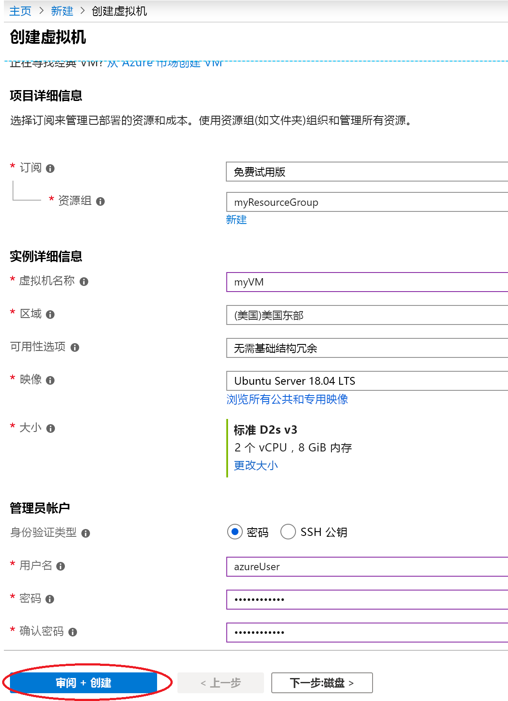
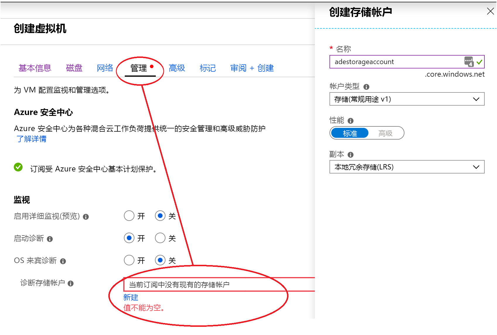
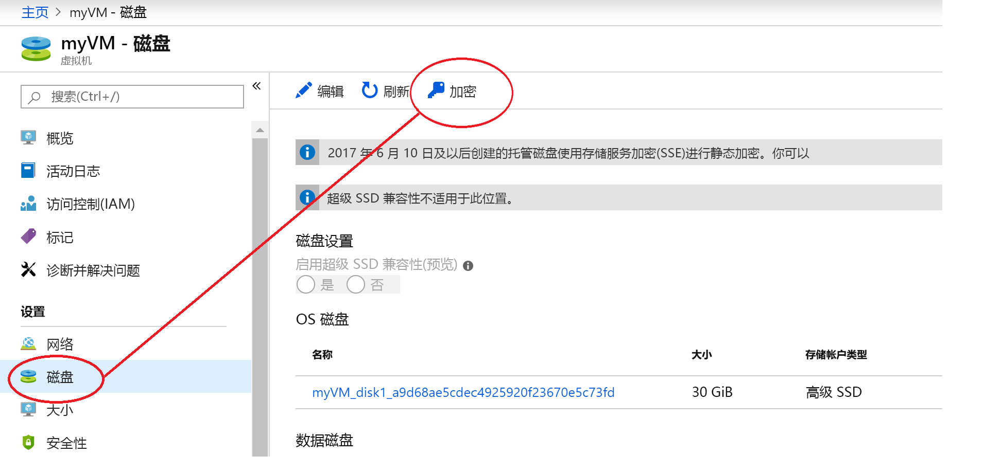
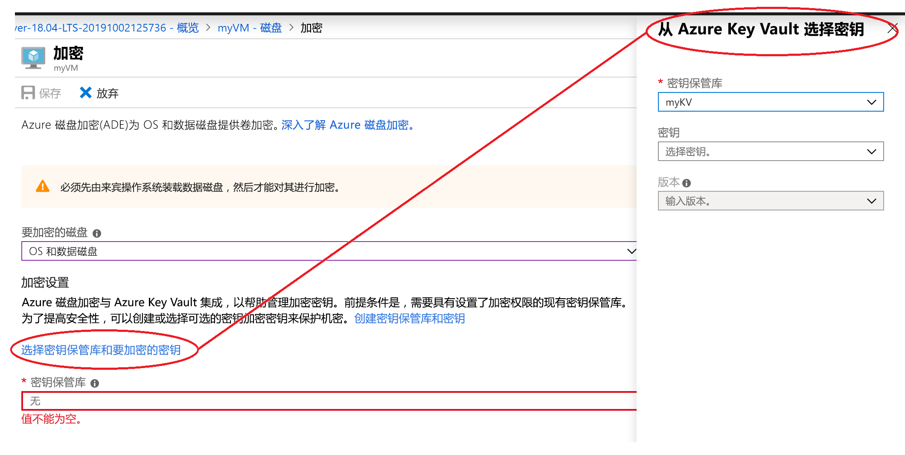

# 快速入门：使用 Azure 门户创建并加密虚拟机

可以通过 Azure 门户创建 Azure 虚拟机 (VM)。 Azure 门户是基于浏览器的用户界面，用于创建 VM 及其相关资源。 本快速入门介绍如何使用 Azure 门户来部署运行 Ubuntu 18.04 LTS 的 Linux 虚拟机 (VM)、如何创建用于存储加密密钥的密钥保管库，以及如何加密 VM。

如果没有 Azure 订阅，请在开始之前创建一个[免费帐户](https://azure.microsoft.com/free/?WT.mc_id=A261C142F)。

## 登录 Azure

登录到 [Azure 门户](https://portal.azure.com)。

## 创建 key vault

1. 选择 Azure 门户左上角的“创建资源”选项 
1. 在“搜索”框中输入“Key Vault”  。
1. 从结果列表中选择“Key Vault”  。
1. 在“Key Vault”部分，选择“创建”  。
1. 在“创建密钥保管库”屏幕上，  为新的密钥保管库选择唯一名称。

    > [!Important]
    > 每个密钥保管库必须具有唯一的名称。 以下示例创建名为“myADEKV”  的密钥保管库，但你必须将其命名为不同的名称。

1. 选择一个“订阅”。 
1.  在“资源组”下  ，选择“新建”  。 在弹出窗口中，键入 *myResourceGroup* 作为资源组的名称，然后选择“确定”  。 

    

1. 在“位置”下拉菜单中选择“美国东部”。  
1. 让其他选项保留默认值。
1. 选择“访问策略”会转到新的屏幕。
1. 选中“启用对 Azure 磁盘加密的访问以进行卷加密”旁边的复选框。

    

1. 在“访问策略”屏幕底部，单击“查看 + 创建”。
1. 查看后，单击“创建”。

## 创建虚拟机

1. 在 Azure 门户的左上角，选择“创建资源”  。

1. 在“新建”页的“常用”下，选择“Ubuntu Server 18.04 LTS”。 
1. 在“基本信息”  选项卡中的“项目详细信息”  下，确保选择了正确的订阅。
1. 对于“资源组”，请选择在前面创建密钥保管库时创建的资源组（例如“myResourceGroup”）   。
1. 对于“虚拟机名称”，请输入“MyVM”   。
1. 对于“区域”，请选择在构建密钥保管库时使用的区域（例如“美国东部”）。  
1. 确定“大小”为“标准 D2s v3”。  
1. 在“管理员帐户”下，选择“密码”。   输入用户名和密码。
    
1. 选择“管理”选项卡，验证自己是否有一个诊断存储帐户。 如果没有存储帐户，请选择“新建”，为新帐户提供一个名称，然后选择“确定”
1. 单击“查看 + 创建”。
1. 在“创建虚拟机”页上，  可以查看要创建的 VM 的详细信息。 准备好以后，选择“创建”  。

部署 VM 需要数分钟。 部署完成后，请转到下一部分。

## 加密虚拟机

1. VM 部署完成后，选择“转到资源”。 
1. 在左侧边栏上，选择“磁盘”。 
1. 在“磁盘”屏幕上，选择“加密”  。 

    

1. 在加密屏幕的“要加密的磁盘”下，选择“OS 和数据磁盘”。  
1. 在“加密设置”下，单击“选择密钥保管库和用于加密的密钥”。 
1. 在右侧边栏中，选择此前创建的密钥保管库的名称作为“密钥保管库”的值，然后单击“选择”。  

    
1. 在加密屏幕顶部，单击“保存”。 此时会出现一个弹出窗口，警告你 VM 会重启。 单击 **“是”** 。

## 清理资源

当不再需要时，可以删除资源组、虚拟机和所有相关资源。 为此，请选择虚拟机的资源组，选择“删除”，然后确认要删除的资源组的名称。

## 后续步骤

在本快速入门中，我们创建了一个启用加密密钥的密钥保管库，创建了一个虚拟机，并为虚拟机启用了加密。  

> [!div class="nextstepaction"]
> [Azure 磁盘加密概述](disk-encryption-overview.md)
