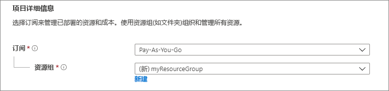
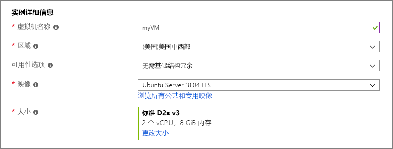
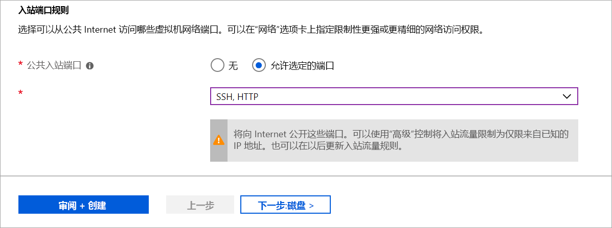

# <a name="quickstart-create-a-linux-virtual-machine-in-the-azure-portal"></a>快速入门：在 Azure 门户中创建 Linux 虚拟机

可以通过 Azure 门户创建 Azure 虚拟机 (VM)。 Azure 门户是基于浏览器的用户界面，用于创建 Azure 资源。 本快速入门介绍如何使用 Azure 门户部署运行 Ubuntu 18.04 LTS 的 Linux 虚拟机 (VM)。 若要查看运行中的 VM，也可以通过 SSH 登录到该 VM 并安装 NGINX Web 服务器。

如果没有 Azure 订阅，请在开始之前创建一个[免费帐户](https://azure.microsoft.com/free/?WT.mc_id=A261C142F)。

## <a name="create-ssh-key-pair"></a>创建 SSH 密钥对

需要一个 SSH 密钥对才能完成本快速入门。 如果已有一个 SSH 密钥对，则可以跳过此步骤。

打开 bash shell，使用 [ssh-keygen](https://www.ssh.com/ssh/keygen/) 创建一个 SSH 密钥对。 如果本地计算机上没有 bash shell，则可使用 [Azure Cloud Shell](https://shell.azure.com/bash)。


1. 登录到 [Azure 门户](https://portal.azure.com)。
1. 在页面顶部的菜单中选择 `>_` 图标以打开 Cloud Shell。
1. 请确保 CloudShell 在左上角显示 **Bash**。 如果显示“PowerShell”，请使用下拉菜单选择 **Bash**，然后选择“确认”  以更改为 Bash shell。
1. 键入 `ssh-keygen -t rsa -b 2048` 以创建 ssh 密钥。 
1. 系统将提示你输入用于保存密钥对的文件。 只需按 **Enter** 即可保存到括号中列出的默认位置。 
1. 系统会要求你输入密码。 你可以为 SSH 密钥键入密码，或按 **Enter** 继续而不键入密码。
1. `ssh-keygen` 命令会在 `~/.ssh directory` 中生成默认名称为 `id_rsa` 的公钥和私钥。 此命令返回公钥的完整路径。 通过键入 `cat ~/.ssh/id_rsa.pub` 使用公钥的此路径以 `cat` 显示其内容。
1. 复制此命令的输出，并将其保存到某个位置，以供本文后面使用。 这是你的公钥，在配置登录 VM 所需的管理员帐户时，需要用到它。

## <a name="sign-in-to-azure"></a>登录 Azure

如果尚未登录到 [Azure 门户](https://portal.azure.com)，请进行登录。

## <a name="create-virtual-machine"></a>创建虚拟机

1. 在 Azure 门户的左上角，选择“创建资源”  。

1. 在“热门”  中，选择 **Ubuntu Server 18.04 LTS**。

1. 在“基本信息”  标签页中的“项目详细信息”  下，确保选择了正确的订阅，然后在“资源组”  下选择“新建”  。 键入 *myResourceGroup* 作为资源组的名称，然后选择“确定”  。 

    

1. 在“实例详细信息”  下，对于“虚拟机名称”  键入 *myVM*，对于“区域”  选择“美国东部”  。 保留其他默认值。

    

1. 在“管理员帐户”  下，选择“SSH 公钥”  ，键入用户名，然后粘贴公钥。 删除公钥中的所有前导或尾随空格。

    

1. 在“入站端口规则”   > “公共入站端口”  下，选择“允许所选端口”  ，然后从下拉列表中选择“SSH (22)”  和“HTTP (80)”  。 

    

1. 保留其余默认值，然后选择页面底部的“查看 + 创建”  按钮。

1. 在“创建虚拟机”页上，  可以查看要创建的 VM 的详细信息。 准备好以后，选择“创建”  。

部署 VM 需要数分钟。 部署完成后，请转到下一部分。

    
## <a name="connect-to-virtual-machine"></a>连接到虚拟机

创建与 VM 的 SSH 连接。

1. 选择 VM 的概述页面上的“连接”按钮。  

    

2. 在“连接到虚拟机”页面中，请保留默认选项，以使用 IP 地址通过端口 22 进行连接。  在“使用 VM 本地帐户登录”  中，将显示一个连接命令。 选择相应的按钮来复制该命令。 下面的示例展示了 SSH 连接命令的样式：

    ```bash
    ssh azureuser@10.111.12.123
    ```

3. 使用创建 SSH 密钥对时使用过的 bash shell（可以通过再次选择 `>_` 或转到 https://shell.azure.com/bash) 重新打开 Cloud Shell），将 SSH 连接命令粘贴到 shell 中以创建 SSH 会话。

## <a name="install-web-server"></a>安装 Web 服务器

若要查看运行中的 VM，请安装 NGINX Web 服务器。 在 SSH 会话中更新包源，然后安装最新的 NGINX 包。

```bash
sudo apt-get -y update
sudo apt-get -y install nginx
```

完成后，键入 `exit` 以离开 SSH 会话。


## <a name="view-the-web-server-in-action"></a>查看运行中的 Web 服务器

使用所选的 Web 浏览器查看默认的 NGINX 欢迎页。 键入 VM 的公共 IP 地址作为 Web 地址。 可以在 VM 概览页上或此前使用过的 SSH 连接字符串中找到公共 IP 地址。


## <a name="clean-up-resources"></a>清理资源

当不再需要时，可以删除资源组、虚拟机和所有相关资源。 为此，请选择虚拟机的资源组，选择“删除”  ，然后确认要删除的资源组的名称。

## <a name="next-steps"></a>后续步骤

在本快速入门中，你部署了一台简单的虚拟机、一条网络安全组规则组和规则，并安装了一台基本 Web 服务器。 若要详细了解 Azure 虚拟机，请继续学习 Linux VM 的教程。

> [!div class="nextstepaction"]
> [Azure Linux 虚拟机教程](./tutorial-manage-vm.md)
