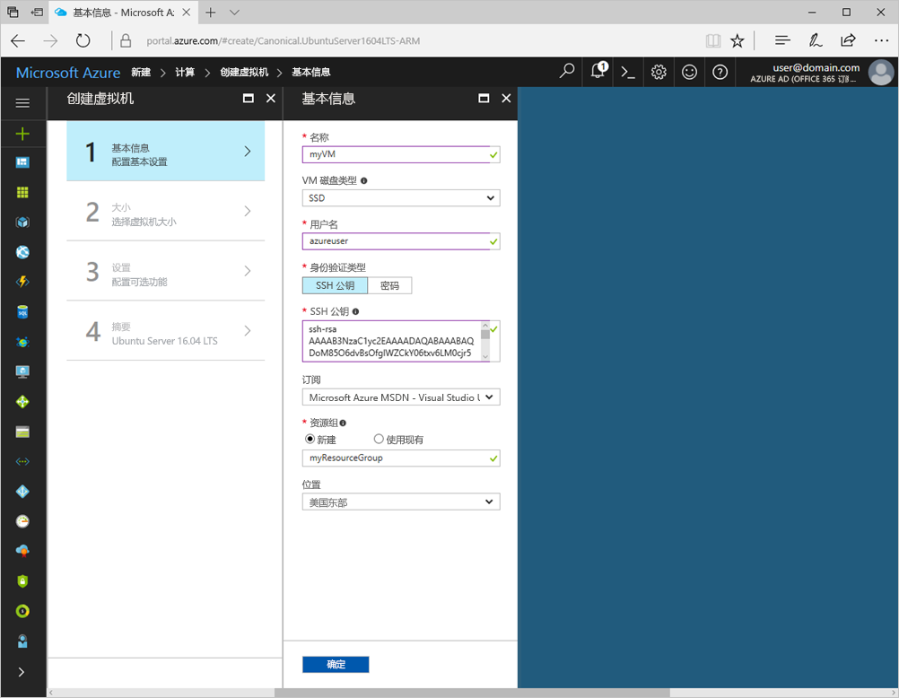
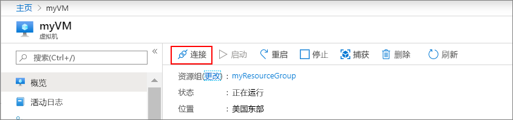

# <a name="create-a-linux-virtual-machine-with-the-azure-portal"></a>使用 Azure 门户创建 Linux 虚拟机

可以通过 Azure 门户创建 Azure 虚拟机。 此方法提供一个基于浏览器的用户界面，用于创建和配置虚拟机和所有相关的资源。 本快速入门介绍了如何创建虚拟机并在 VM 上安装 webserver。

如果你还没有 Azure 订阅，可以在开始前创建一个 [免费帐户](https://azure.microsoft.com/free/?WT.mc_id=A261C142F) 。

## <a name="create-ssh-key-pair"></a>创建 SSH 密钥对

需要一个 SSH 密钥对才能完成此快速入门。 如果有现成的 SSH 密钥对，则可跳过此步骤。

在 Bash 外壳程序中，运行以下命令并按屏幕说明操作。 命令输出包括公钥文件的文件名。 将公钥文件的内容复制到剪贴板。

```bash
ssh-keygen -t rsa -b 2048
```

## <a name="log-in-to-azure"></a>登录 Azure 

通过 http://portal.azure.com 登录到 Azure 门户。

## <a name="create-virtual-machine"></a>创建虚拟机

1. 单击 Azure 门户左上角的“新建”按钮。

2. 选择“计算”，选择 **Ubuntu Server 16.04 LTS**，确保 **Resource Manager** 是选择的部署模型。 单击“创建”  按钮。 

3. 输入虚拟机信息。 对于“身份验证类型”，请选择“SSH 公钥”。 粘贴“SSH 公钥”时，请务必删除所有前导或尾随空格。 完成后，单击“确定”。

    

4. 为 VM 选择大小。 若要查看更多的大小，请选择“全部查看”或更改“支持的磁盘类型”筛选器。 

      

5. 在“设置”边栏选项卡上，在“使用托管磁盘”下选择“是”，为其余设置保留默认值，然后单击“确定”。

6. 在摘要页上，单击“确定”以开始虚拟机部署。

7. VM 将固定到 Azure 门户仪表板。 完成部署后，VM 摘要边栏选项卡将自动打开。


## <a name="connect-to-virtual-machine"></a>连接到虚拟机

创建与虚拟机的 SSH 连接。

1. 单击虚拟机边栏选项卡上的“连接”按钮。 单击“连接”按钮后，将显示可用于连接到虚拟机的 SSH 连接字符串。

     

2. 运行以下命令创建 SSH 会话。 将连接字符串替换为从 Azure 门户复制的值。

```bash 
ssh azureuser@40.112.21.50
```

## <a name="install-nginx"></a>安装 NGINX

使用以下 bash 脚本更新包源并安装最新的 NGINX 包。 

```bash 
#!/bin/bash

# update package source
sudo apt-get -y update

# install NGINX
sudo apt-get -y install nginx
```

完成后，退出 SSH 会话，返回 Azure 门户中的 VM 属性。


## <a name="open-port-80-for-web-traffic"></a>为 Web 流量打开端口 80 

网络安全组 (NSG) 保护入站和出站流量的安全。 从 Azure 门户创建 VM 后，将会在进行 SSH 连接的端口 22 上创建入站规则。 由于此 VM 托管 webserver，需为端口 80 创建 NSG 规则。

1. 在虚拟机上，单击**资源组**的名称。
2. 选择“网络安全组”。 可以通过“类型”列来标识 NSG。 
3. 在左侧菜单的“设置”下，单击“入站安全规则”。
4. 单击“添加”。
5. 在“名称”中，键入 **http**。 请确保将“端口范围”设置为 80，将“操作”设置为“允许”。 
6. 单击 **“确定”**。


## <a name="view-the-nginx-welcome-page"></a>查看 NGINX 欢迎页

安装 NGINX 并向 VM 打开端口 80 以后，即可通过 Internet 访问 webserver。 打开 Web 浏览器，输入 VM 的公共 IP 地址。 该公共 IP 地址可以在 Azure 门户的 VM 边栏选项卡上找到。

 

## <a name="clean-up-resources"></a>清理资源

不再需要资源组、虚拟机和所有相关的资源时，可将其删除。 为此，请从虚拟机边栏选项卡中选择该资源组，然后单击“删除”。

## <a name="next-steps"></a>后续步骤

在本快速入门中，你部署了一台简单的虚拟机、一条网络安全组规则，并安装了一台 Web 服务器。 若要详细了解 Azure 虚拟机，请继续学习 Linux VM 的教程。

> [!div class="nextstepaction"]
> [Azure Linux 虚拟机教程](./tutorial-manage-vm.md)

