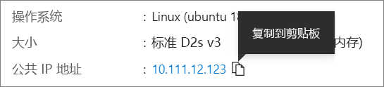

# <a name="quickstart-create-a-linux-virtual-machine-in-the-azure-portal"></a>快速入门：在 Azure 门户中创建 Linux 虚拟机

可以通过 Azure 门户创建 Azure 虚拟机 (VM)。 Azure 门户是基于浏览器的用户界面，用于创建 Azure 资源。 本快速入门介绍如何使用 Azure 门户部署运行 Ubuntu 18.04 LTS 的 Linux 虚拟机 (VM)。 若要查看运行中的 VM，也可以通过 SSH 登录到该 VM 并安装 NGINX Web 服务器。

如果没有 Azure 订阅，请在开始之前创建一个[免费帐户](https://azure.microsoft.com/free/?WT.mc_id=A261C142F)。

## <a name="sign-in-to-azure"></a>登录 Azure

如果尚未登录到 [Azure 门户](https://portal.azure.com)，请进行登录。

## <a name="create-virtual-machine"></a>创建虚拟机

1. 在搜索中键入“虚拟机”。
1. 在“服务”下，选择“虚拟机” 。
1. 在“虚拟机”页上，选择“添加” 。 此时将打开“创建虚拟机”页。
1. 在“基本信息”选项卡中的“项目详细信息”下，确保选择了正确的订阅，然后选择**新建**资源组。 对于名称.*，请键入 myResourceGroup。 

    

1. 在“实例详细信息”下，键入“myVM”作为“虚拟机名称”，选择“美国东部”作为“区域”，并选择“Ubuntu 18.04 LTS”作为“映像”。 保留其他默认值。

    

1. 在“管理员帐户”下，选择“SSH 公钥” 。

1. 在“用户名”处键入 azureuser。

1. 对于“SSH 公钥源”，请保留默认的“生成新密钥对”，然后为“密钥对名称”键入 myKey 。

    

1. 在“入站端口规则” > “公共入站端口”下，选择“允许所选端口”，然后从下拉列表中选择“SSH (22)”和“HTTP (80)”。 

    

1. 保留其余默认值，然后选择页面底部的“查看 + 创建”按钮。

1. 在“创建虚拟机”页上，可以查看要创建的 VM 的详细信息。 准备好以后，选择“创建”。

1. “生成新密钥对”窗口打开时，选择“下载私钥并创建资源” 。 下载的密钥文件将名为“myKey.pem”。 请确保知道 `.pem` 文件的下载位置，下一步将需要该文件的路径。

1. 部署完成后，选择“转到资源”。

1. 在新 VM 的页面上，选择公共 IP 地址并将其复制到剪贴板。


    

## <a name="connect-to-virtual-machine"></a>连接到虚拟机

创建与 VM 的 SSH 连接。

1. 如果使用的是 Mac 或 Linux 计算机，请打开 Bash 提示符。 如果使用的是 Windows 计算机，请打开 PowerShell 提示符。 

1. 根据提示符，打开与虚拟机的 SSH 连接。 将 IP 地址替换为 VM 中的 IP 地址，并将 `.pem` 的路径替换为密钥文件的下载路径。

```console
ssh -i .\Downloads\myKey1.pem azureuser@10.111.12.123
```

> [!TIP]
> 下次在 Azure 中创建 VM 时，可以使用此次创建的 SSH 密钥。 下次创建 VM 时，只需为“SSH 公钥源”选择“使用存储在 Azure 中的密钥” 。 你的计算机上已有私钥，因此无需下载任何内容。

## <a name="install-web-server"></a>安装 Web 服务器

若要查看运行中的 VM，请安装 NGINX Web 服务器。 在 SSH 会话中更新包源，然后安装最新的 NGINX 包。

```bash
sudo apt-get -y update
sudo apt-get -y install nginx
```

完成后，键入 `exit` 以离开 SSH 会话。


## <a name="view-the-web-server-in-action"></a>查看运行中的 Web 服务器

使用所选的 Web 浏览器查看默认的 NGINX 欢迎页。 键入 VM 的公共 IP 地址作为 Web 地址。 可以在 VM 概览页上或此前使用过的 SSH 连接字符串中找到公共 IP 地址。


## <a name="clean-up-resources"></a>清理资源

当不再需要时，可以删除资源组、虚拟机和所有相关资源。 为此，请选择虚拟机的资源组，选择“删除”，然后确认要删除的资源组的名称。

## <a name="next-steps"></a>后续步骤

在本快速入门中，你部署了一台简单的虚拟机、一条网络安全组规则组和规则，并安装了一台基本 Web 服务器。 若要详细了解 Azure 虚拟机，请继续学习 Linux VM 的教程。

> [!div class="nextstepaction"]
> [Azure Linux 虚拟机教程](./tutorial-manage-vm.md)
