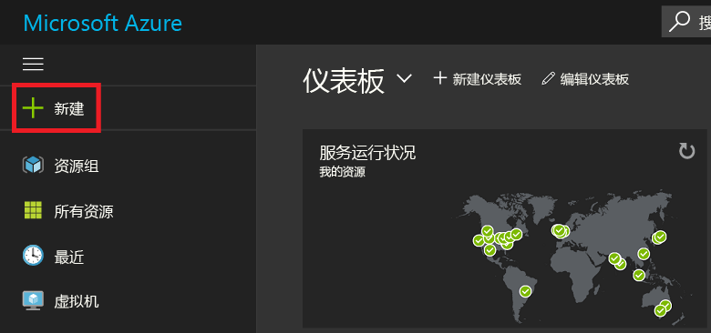
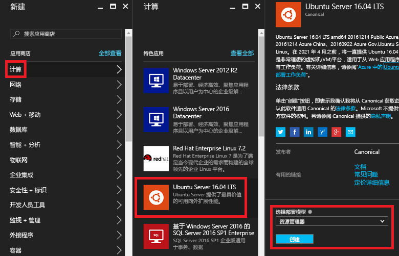
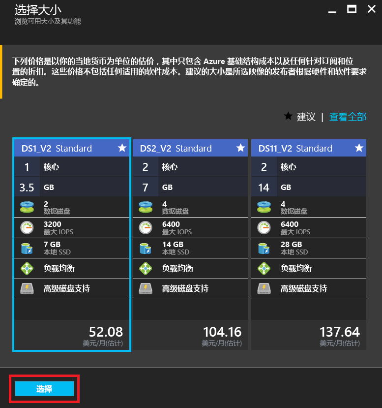
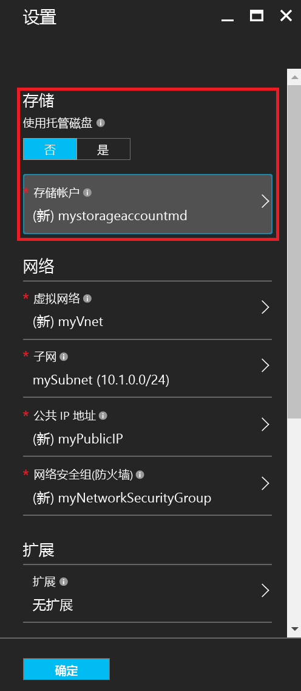
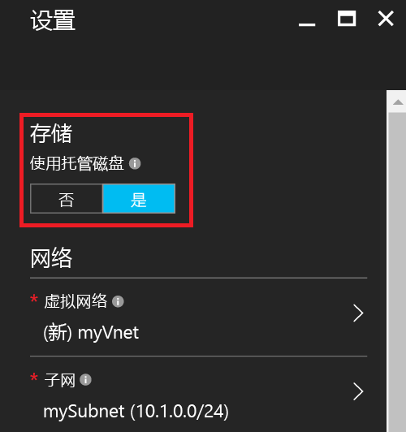
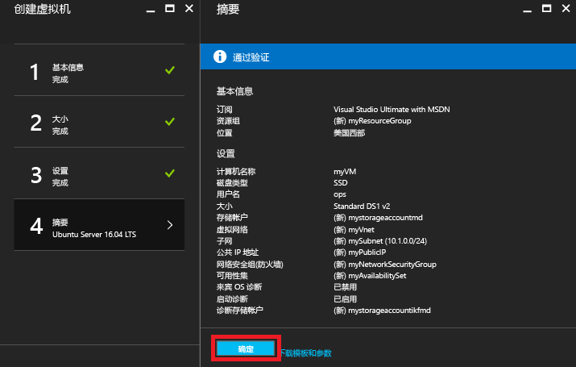
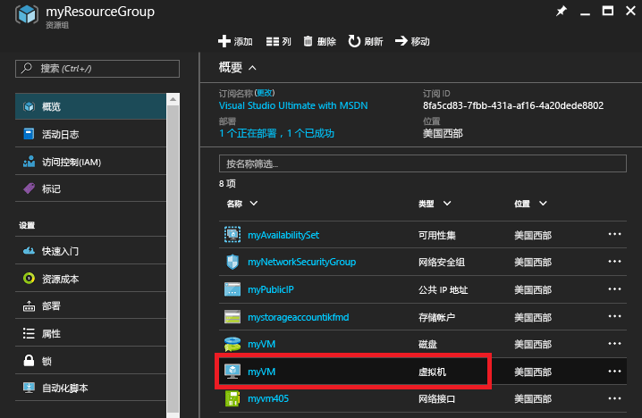
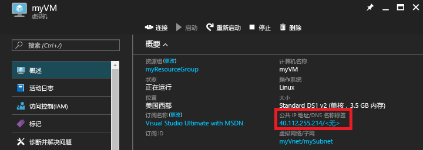

# <a name="create-a-linux-vm-on-azure-using-the-portal"></a>使用门户在 Azure 上创建 Linux VM
本文说明如何使用 [Azure 门户](https://portal.azure.com/)创建 Linux 虚拟机。

要求如下：

* [一个 Azure 帐户](https://azure.microsoft.com/pricing/free-trial/)
* [SSH 公钥和私钥文件](virtual-machines-linux-mac-create-ssh-keys.md?toc=%2fazure%2fvirtual-machines%2flinux%2ftoc.json)

## <a name="sign-in"></a>登录
使用 Azure 帐户标识登录到 Azure 门户。 单击左上角的“+ 新建”：



## <a name="choose-vm"></a>选择 VM
在“应用商店”中单击“计算”，然后从“特别推荐的应用”映像列表中选择“Ubuntu Server 16.04 LTS”。  确认底部显示的部署模型是 `Resource Manager`，然后单击“创建”。



## <a name="enter-vm-options"></a>输入 VM 选项
在“基本信息”页上输入： 

* VM 的名称
* VM 磁盘类型（SSD（默认）或 HDD）
* 管理员用户的用户名
* 将“身份验证类型”设置为“SSH 公钥”
* 字符串形式的 SSH 公钥（位于 `~/.ssh/` 目录中）
* 资源组名称，或选择现有资源组

单击“确定”继续。 边栏选项卡应如以下屏幕截图所示：


## <a name="choose-vm-size"></a>选择 VM 大小
选择 VM 大小。 以下示例选择 **DS1_V2 Standard**，在高级 SSD 上安装 Ubuntu。 VM 大小中的 **S** 表示 SSD 支持。 单击“选择”对设置进行配置。



## <a name="storage-and-network"></a>存储和网络
在“设置”边栏选项卡中，可以选择为 VM 使用 Azure 托管磁盘。 当前的默认设置是使用非托管磁盘。 Azure 托管磁盘由 Azure 平台处理，无需任何准备或位置来存储它们。 有关 Azure 托管磁盘的详细信息，请参阅 [Azure 托管磁盘概述](../storage/storage-managed-disks-overview.md)。 对于非托管磁盘，需要创建或选择虚拟硬盘的存储帐户：



如果选择使用 Azure 托管磁盘，则不需配置其他存储选项，如以下示例所示：



将网络设置的其余部分保留为默认值。

## <a name="confirm-vm-settings-and-launch"></a>确认 VM 设置并启动
确认新 Ubuntu VM 的设置，然后单击“确定”。



## <a name="select-the-vm-resource"></a>选择 VM 资源
打开门户主页，然后从左上角的菜单中选择“资源组”。 根据需要单击菜单顶部的三个条，展开列表如下：


选择资源组，然后单击新的 VM：



## <a name="find-the-public-ip"></a>查找公共 IP
查看分配给 VM 的“公共 IP 地址”：



## <a name="ssh-to-the-vm"></a>SSH 到 VM
使用 SSH 公钥通过 SSH 连接到公共 IP。  可以在 Mac 或 Linux 工作站中从终端直接进行 SSH 操作。 如果是在 Windows 工作站上操作，则需使用 PuTTY、MobaXTerm 或 Cygwin 通过 SSH 连接到 Linux。  如果还没有做好准备，可以参阅以下文档，了解如何准备 Windows 工作站，以便通过 SSH 连接到 Linux。

[如何在 Azure 上结合使用 SSH 密钥和 Windows](virtual-machines-linux-ssh-from-windows.md?toc=%2fazure%2fvirtual-machines%2flinux%2ftoc.json)

```
ssh -i ~/.ssh/azure_id_rsa ops@40.112.255.214
```

## <a name="next-steps"></a>后续步骤
现在，你已快速创建了一个用于测试或演示的 Linux VM。 若要创建针对基础结构自定义的 Linux VM，可以遵循以下任一文章操作。

* [Create a Linux VM on Azure using Templates（使用模板在 Azure 上创建 Linux VM）](virtual-machines-linux-cli-deploy-templates.md?toc=%2fazure%2fvirtual-machines%2flinux%2ftoc.json)
* [使用模板在 Azure 上创建受 SSH 保护的 Linux VM](virtual-machines-linux-create-ssh-secured-vm-from-template.md?toc=%2fazure%2fvirtual-machines%2flinux%2ftoc.json)
* [Create a Linux VM using the Azure CLI（使用 Azure CLI 创建 Linux VM）](virtual-machines-linux-create-cli-complete.md?toc=%2fazure%2fvirtual-machines%2flinux%2ftoc.json)


