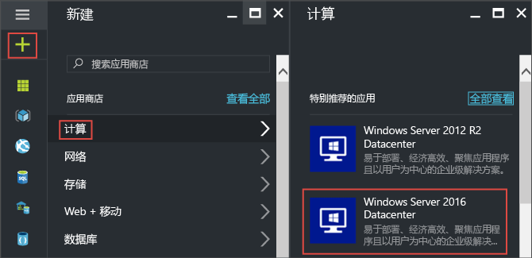
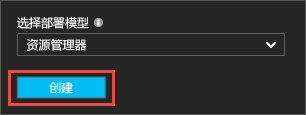
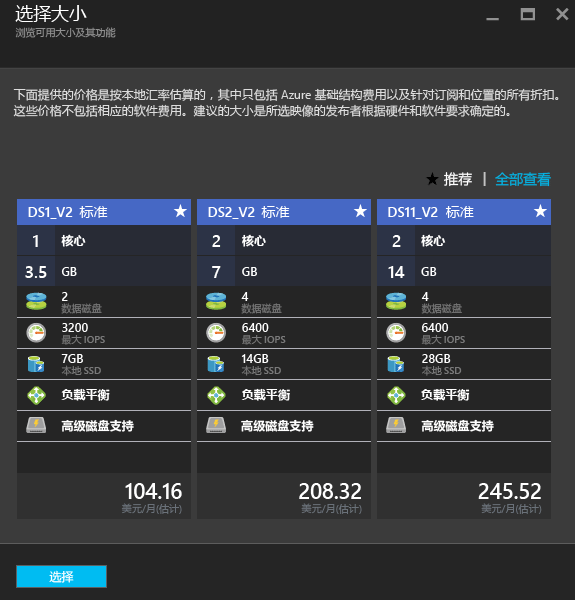
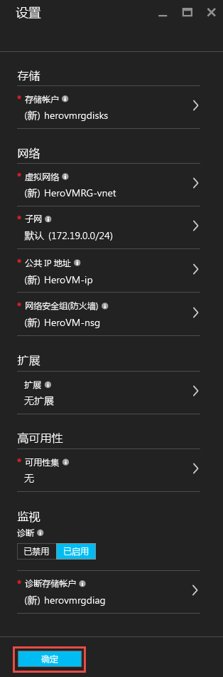
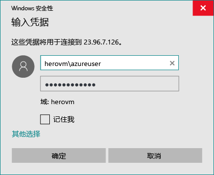
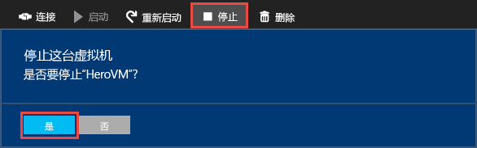

# 在 Azure 门户中创建第一个 Windows 虚拟机
本教程说明如何在片刻之间轻松通过 Azure 门户创建 Windows 虚拟机 (VM)。  

如果你还没有 Azure 订阅，可以在开始前创建一个 [免费帐户](https://azure.microsoft.com/free/) 。

## 从应用商店中选择 VM 映像
我们将使用 Windows Server 2012 R2 Datacenter 映像作为示例，但这只是 Azure 提供的众多映像的其中一个。 映像选择取决于订阅。 例如，一些桌面映像对 [MSDN 订户](https://azure.microsoft.com/pricing/member-offers/msdn-benefits-details/?WT.mc_id=A261C142F)是可用的。

1. 登录到 [Azure 门户](https://portal.azure.com)。
2. 在“中心”菜单上，单击“新建” > “虚拟机” > “Windows Server 2012 R2 Datacenter”。
   
    
3. 在“Windows Server 2012 R2 Datacenter”边栏选项卡上，确保在“选择部署模型”中选择“Resource Manager”。 单击“创建” 。
   
    

## 创建 Windows 虚拟机
选择映像后，可以使用默认设置并快速创建虚拟机。

1. 在“基本信息”边栏选项卡上，输入虚拟机的**名称**。 名称必须为 1-15 个字符，不能包含特殊字符。
2. 输入用于在 VM 上创建本地帐户的**用户名**和强**密码**。 该本地帐户用于登录和管理 VM。 
   
    密码长度必须为 8 到 123 个字符，并且必须满足以下 4 个复杂性要求的其中 3 个：1 个小写字符、1 个大写字符、1 个数字和 1 个特殊字符。 查看更多关于 [用户名和密码要求](virtual-machines-windows-faq.md#what-are-the-username-requirements-when-creating-a-vm)。
3. 选择现有的[资源组](../azure-resource-manager/resource-group-overview.md#resource-groups)，或键入新资源组的名称。 键入 Azure 数据中心的**位置**，如**美国西部**。 
4. 完成后，单击“ **确定** ”转到下一部分。 
   
    
5. 选择 VM [大小](virtual-machines-windows-sizes.md)，然后单击“ **选择** ”以继续。 
   
    
6. 在“ **设置** ”边栏选项卡上，可以更改存储和网络选项。 在本教程中接受默认设置。 如果选择了支持它的虚拟机大小，则可以通过选择“磁盘类型”中的“高级(SSD)”来试用 Azure 高级存储。 完成更改后，单击“ **确定**”。
   
    
7. 单击“摘要”查看所做的选择。 看到“验证通过”消息后，单击“确定”。
   
    
8. 当 Azure 创建虚拟机时，可以在“中心”菜单中的“ **虚拟机** ”下跟踪进度。 

## 连接到虚拟机并登录
1. 在“中心”菜单中，单击“ **虚拟机**”。
2. 从列表中选择虚拟机。
3. 在虚拟机边栏选项卡上，单击“连接”。 随后将创建并下载远程桌面协议文件（.rdp 文件），该文件类似于用于连接计算机的快捷方式。 你可以将此文件保存到桌面以便于访问。 **打开**此文件以连接到 VM。
   
    
4. 此时将出现 .rdp 来自未知发布者的警告。 这是一般警报。 在“远程桌面”窗口中，单击“连接”继续。
   
    
5. 在“Windows 安全性”窗口中，键入创建 VM 时创建的本地帐户的用户名和密码。 以 *vmname*&#92;*username* 的格式输入用户名，然后单击“确定”。
   
    
6. 此时将出现警告，指出无法验证证书。 这是一般警报。 单击“是”验证虚拟机的 ID 并完成登录。
   
   

如果在尝试连接时遇到故障，请参阅 [对基于 Windows 的 Azure 虚拟机的远程桌面连接进行故障排除](virtual-machines-windows-troubleshoot-rdp-connection.md)。

现在可以像使用任何其他服务器一样使用该虚拟机。

## 可选：停止 VM
如果你并未真正在使用 VM，最好将它停止，以免产生费用。 直接单击“停止”，然后单击“是”。

准备好再次使用 VM 时，单击“ **启动** ”按钮即可重新启动。

## 后续步骤
* 可以尝试通过 [安装 IIS](virtual-machines-windows-hero-role.md)使用新的 VM。 本教程还介绍了如何使用网络安全组 (NSG) 对传入的 Web 流量打开端口 80。 
* 也可以[使用 PowerShell 创建 Windows VM](virtual-machines-windows-ps-create.md) 或使用 Azure CLI [创建 Linux 虚拟机](virtual-machines-linux-quick-create-cli.md)。
* 如果你对自动化部署感兴趣，请参阅 [使用 Resource Manager 模板创建 Windows 虚拟机](virtual-machines-windows-ps-template.md)。

<!--HONumber=Nov16_HO2-->

