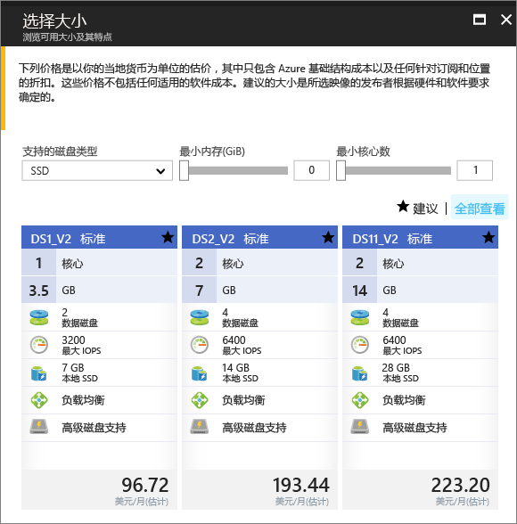

# <a name="create-a-windows-virtual-machine-in-an-availability-zone-with-the-azure-portal"></a>使用 Azure 门户在可用性区域中创建 Windows 虚拟机

本文逐步说明如何使用 Azure 门户在 Azure 可用性区域中创建虚拟机。 [可用性区域](../../availability-zones/az-overview.md)是 Azure 区域中物理上独立的区域。 使用可用性区域可以在整个数据中心发生故障或服务中断（这种情况很少见）时保护应用和数据。

[!INCLUDE [availability-zones-preview-statement.md](../../../includes/availability-zones-preview-statement.md)]


## <a name="log-in-to-azure"></a>登录 Azure 

登录 Azure 门户 ( https://portal.azure.com )。

## <a name="create-virtual-machine"></a>创建虚拟机

1. 单击 Azure 门户左上角的“新建”按钮。

2. 选择“计算”，然后选择“Windows Server 2016 Datacenter”。 

3. 输入虚拟机信息。 在此处输入的用户名和密码用于登录到虚拟机。 完成后，单击“确定”。

    

4. 为 VM 选择大小。 若要查看更多的大小，请选择“全部查看”或更改“支持的磁盘类型”筛选器。 请小心选择一个可用性区域预览版中支持的大小，如 *DS1_v2 Standard*。 

      

5. 在“设置” > “高可用性”下，从“可用性区域”下拉列表中选择一个带编号的区域，保留其余默认值，并单击“确定”。

    

6. 在摘要页上，单击“购买”以开始虚拟机部署。

7. VM 将固定到 Azure 门户仪表板。 完成部署后，会自动打开 VM 摘要。


## <a name="zone-for-ip-address-and-managed-disk"></a>IP 地址和托管磁盘的区域

当 VM 部署在可用性区域中时，IP 地址和托管磁盘资源将部署在同一可用性区域中。 可以使用 Azure PowerShell 确认区域设置。 如果需要进行安装或升级，请参阅[安装 Azure PowerShell 模块](/powershell/azure/install-azurerm-ps)。

以下示例获取名为 *myResourceGroup* 的资源组中资源的相关信息。 替换为用于创建 VM 的资源组的名称。

使用 [Get-AzureRmPublicIpAddress](/en-us/powershell/module/azurerm.network/get-azurermpublicipaddress) 查找公共 IP 地址的区域：

```powershell
Get-AzureRmPublicIpAddress -ResourceGroupName myResourceGroup
```
输出中的 `Zones` 设置显示，公共 IP 地址与 VM 位于相同的可用性区域中：

```powershell
Name                     : myVM-ip
ResourceGroupName        : myResourceGroup
Location                 : eastus2
Id                       : /subscriptions/e44f251c-c67e-4760-9ed6-bf99a306ecff/resourceGroups/danlep0911/providers/Micr
                           osoft.Network/publicIPAddresses/myVM-ip
Etag                     : W/"b67e14c0-7e8a-4d12-91c5-da2a5dfad132"
ResourceGuid             : 314bf57d-9b25-4474-9282-db3561d536aa
ProvisioningState        : Succeeded
Tags                     :
PublicIpAllocationMethod : Dynamic
IpAddress                : 13.68.16.25
PublicIpAddressVersion   : IPv4
IdleTimeoutInMinutes     : 4
IpConfiguration          : {
                             "Id": "/subscriptions/e44f251c-c67e-4760-9ed6-bf99a306ecff/resourceGroups/myResourceGroup/providers/Microsoft.Network/networkInterfaces/myVM11842/ipConfigurations/ipconfig1"
                           }
DnsSettings              : null
Zones                    : {2}
```


此外，还在相同的可用性区域中创建了 VM 的托管磁盘资源。 可以使用 [Get-AzureRmDisk](/powershell/module/azurerm.compute/get-azurermdisk) 验证此结果：

```powershell
Get-AzureRmDisk -ResourceGroupName myResourceGroup
```

输出显示，托管磁盘与 VM 位于相同的可用性区域中：

```powershell
ResourceGroupName  : myResourceGroup
AccountType        : PremiumLRS
OwnerId            : /subscriptions/d5b9d4b7-6fc1-0000-0000-000000000000/resourceGroups/myResourceGroup/providers/Microsoft.
                     Compute/virtualMachines/myVM
ManagedBy          : /subscriptions/d5b9d4b7-6fc1-0000-0000-000000000000/resourceGroups/myResourceGroup/providers/Microsoft.
                     Compute/virtualMachines/myVM
Sku                : Microsoft.Azure.Management.Compute.Models.DiskSku
Zones              : {2}
TimeCreated        : 9/7/2017 6:57:26 PM
OsType             : Windows
CreationData       : Microsoft.Azure.Management.Compute.Models.CreationData
DiskSizeGB         : 127
EncryptionSettings :
ProvisioningState  : Succeeded
Id                 : /subscriptions/d5b9d4b7-6fc1-0000-0000-000000000000/resourceGroups/myResourceGroup/providers/Microsoft.
                     Compute/disks/myVM_OsDisk_1_bd921920bb0a4650becfc2d830000000
Name               : myVM_OsDisk_1_bd921920bb0a4650becfc2d830000000
Type               : Microsoft.Compute/disks
Location           : eastus2
Tags               : {}
```

## <a name="next-steps"></a>后续步骤

本文已介绍如何在可用性区域中创建 VM。 详细了解 Azure VM 的[区域和可用性](regions-and-availability.md)。
