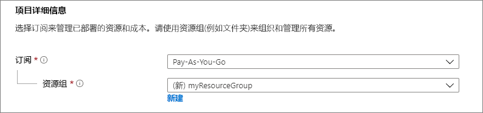
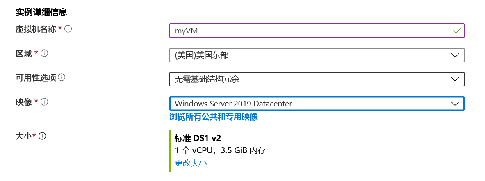
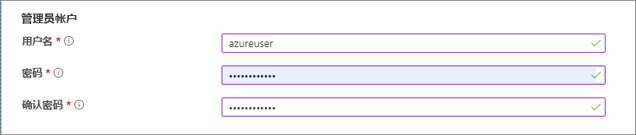
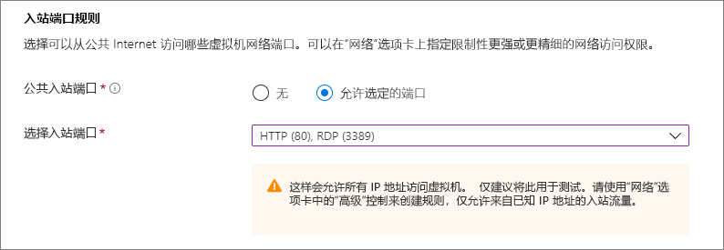
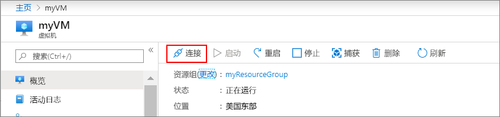

# <a name="quickstart-create-a-windows-virtual-machine-in-the-azure-portal"></a>快速入门：在 Azure 门户中创建 Windows 虚拟机

可以通过 Azure 门户创建 Azure 虚拟机 (VM)。 此方法提供基于浏览器的用户界面来创建 VM 及其相关资源。 本快速入门展示了如何使用 Azure 门户在 Azure 中部署运行 Windows Server 2019 的虚拟机 (VM)。 若要查看运行中的 VM，可以通过 RDP 登录到该 VM 并安装 IIS Web 服务器。

如果没有 Azure 订阅，请在开始之前创建一个[免费帐户](https://azure.microsoft.com/free/?WT.mc_id=A261C142F)。

## <a name="sign-in-to-azure"></a>登录 Azure

通过 https://portal.azure.com 登录到 Azure 门户。

## <a name="create-virtual-machine"></a>创建虚拟机

1. 在搜索中键入“虚拟机”。
1. 在“服务”下，选择“虚拟机”。
1. 在“虚拟机”页上，选择“添加”。 
1. 在“基本信息”选项卡中的“项目详细信息”下，确保选择了正确的订阅，然后选择**新建**资源组。 对于名称，请键入 *myResourceGroup*。 

    

1. 在“实例详细信息”下，键入“myVM ”为“虚拟机名称”，选择“美国东部”作为“区域”，选择“Windows Server 2019 数据中心”作为“映像”。 保留其他默认值。

    

1. 在“管理员帐户”下，提供用户名（例如 *azureuser*）和密码。 密码必须至少 12 个字符长，且符合[定义的复杂性要求](faq.md#what-are-the-password-requirements-when-creating-a-vm)。

    

1. 在“入站端口规则”下，选择“允许所选端口”，然后从下拉列表中选择“RDP (3389)”和“HTTP (80)”。

    

1. 保留其余默认值，然后选择页面底部的“查看 + 创建”按钮。

    


## <a name="connect-to-virtual-machine"></a>连接到虚拟机

创建到虚拟机的远程桌面连接。 这些说明指明了如何从 Windows 计算机连接到 VM。 在 Mac 上，需要一个 RDP 客户端，例如 Mac 应用商店提供的这个[远程桌面客户端](https://itunes.apple.com/us/app/microsoft-remote-desktop/id715768417?mt=12)。

1. 单击虚拟机概述页上的“连接”按钮。 

    
    
2. 在“连接到虚拟机”页面中，保留默认选项，以使用 IP 地址通过端口 3389 进行连接，然后单击“下载 RDP 文件”。

2. 打开下载的 RDP 文件，然后在出现提示时单击“连接”。 

3. 在“Windows 安全性”窗口中，依次选择“更多选择”、“使用其他帐户”。 以 **localhost**\\*username* 的形式键入用户名，输入为虚拟机创建的密码，然后单击“确定”。

4. 你可能会在登录过程中收到证书警告。 单击“是”或“继续”以创建连接。

## <a name="install-web-server"></a>安装 Web 服务器

若要查看运行中的 VM，请安装 IIS Web 服务器。 在 VM 中打开 PowerShell 提示符并运行以下命令：

```powershell
Install-WindowsFeature -name Web-Server -IncludeManagementTools
```

完成后，关闭到 VM 的 RDP 连接。


## <a name="view-the-iis-welcome-page"></a>查看 IIS 欢迎页

在门户中选择 vm，并在 VM 的 "概述" 中，使用 "**单击以**复制" IP 地址右侧的按钮将其复制并粘贴到浏览器选项卡中。此时将打开默认的 IIS "欢迎使用" 页，其外观应如下所示：


## <a name="clean-up-resources"></a>清理资源

当不再需要时，可以删除资源组、虚拟机和所有相关资源。 

选择虚拟机的资源组，然后选择“删除”。 确认资源组名称，以完成资源删除。

## <a name="next-steps"></a>后续步骤

在本快速入门中，你部署了简单的虚拟机，打开了 Web 流量的网络端口，并安装了一个基本 Web 服务器。 若要详细了解 Azure 虚拟机，请继续学习 Windows VM 的教程。

> [!div class="nextstepaction"]
> [Azure Windows 虚拟机教程](./tutorial-manage-vm.md)