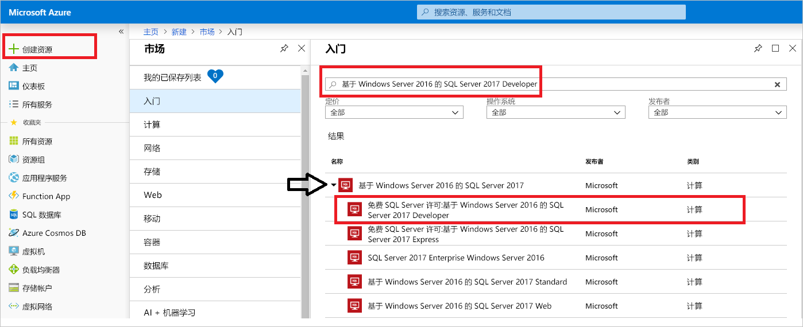
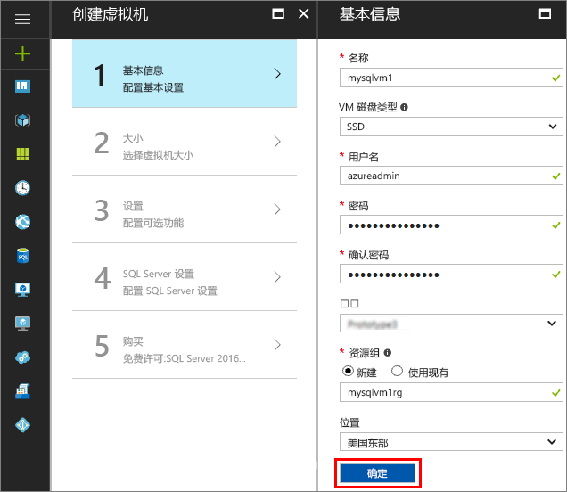
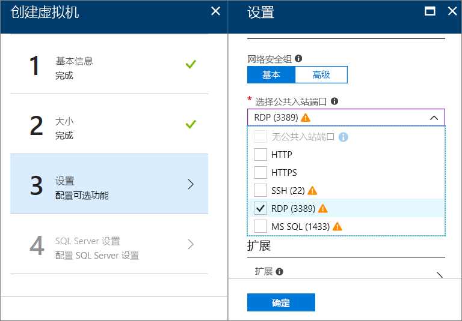
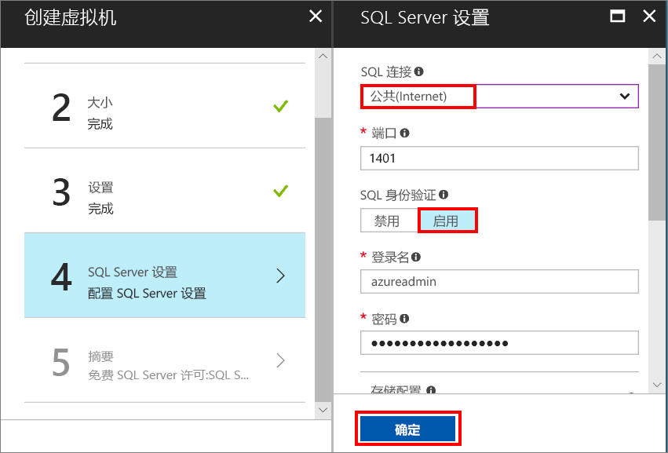
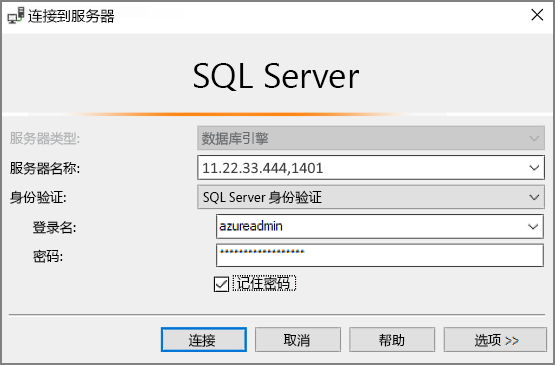

# 快速入门：在 Azure 门户中创建 SQL Server 2017 Windows 虚拟机

> [!div class="op_single_selector"]
> * [Windows](quickstart-sql-vm-create-portal.md)
> * [Linux](../../linux/sql/provision-sql-server-linux-virtual-machine.md)

本快速入门逐步讲解如何在 Azure 门户中创建 SQL Server 虚拟机。

> [!TIP]
> 本快速入门提供的路径适用于快速预配并连接到 SQL VM。 若要详细了解其他 SQL VM 预配选择，请参阅 [Azure 门户中的 Windows SQL Server VM 预配指南](virtual-machines-windows-portal-sql-server-provision.md)。

> [!TIP]
> 如果对 SQL Server 虚拟机有任何疑问，请参阅[常见问题解答](virtual-machines-windows-sql-server-iaas-faq.md)。

##  获取 Azure 订阅

如果你还没有 Azure 订阅，可以在开始前创建一个 [免费帐户](https://azure.microsoft.com/free/?WT.mc_id=A261C142F)。

## 选择 SQL Server VM 映像

1. 使用帐户登录到 [Azure 门户](https://portal.azure.com)。

1. 在 Azure 门户中，单击“创建资源”。 

1. 在搜索字段中键入“Windows Server 2016 上的 SQL Server 2017 Developer”，然后按 Enter。

1. 选择“免费 SQL Server 许可证: Windows Server 2016 上的 SQL Server 2017 Developer”映像。

   

   > [!TIP]
   > 本教程中使用 Developer 版，因为该版本是 SQL Server 的完整功能版本，并且可免费用于开发测试。 只需支付运行 VM 的成本。 有关完整的定价注意事项，请参阅 [SQL Server Azure VM 定价指南](virtual-machines-windows-sql-server-pricing-guidance.md)。

1. 单击“创建”。

##  提供基本详细信息

在“基本信息”窗口中提供以下信息：

1. 在“名称”字段中，输入唯一的虚拟机名称。 

1. 在“用户名”字段中，指定 VM 上本地管理员帐户的名称。

1. 提供一个强 **密码**。

1. 输入新的**资源组**名称。 可借助此组管理与虚拟机关联的所有资源。

1. 确认其他默认设置，然后单击“确定”继续。

   

## 选择虚拟机大小

1. 执行“大小”设置步骤时，请在“选择大小”窗口中选择虚拟机大小。

   对于本快速入门，请选择“D2S_V3”。 门户中会显示计算机的每月连续使用估算费用（不包括 SQL Server 许可费用）。 请注意，Developer Edition 不会收取额外的 SQL Server 许可费用。 有关更具体的定价信息，请参阅[定价页](https://azure.microsoft.com/pricing/details/virtual-machines/windows/)。

   > [!TIP]
   > 在测试时，**D2S_V3** 计算机大小可以节省资金。 但是，对于生产工作负荷，请参阅 [Azure 虚拟机中 SQL Server 的性能最佳做法](virtual-machines-windows-sql-performance.md)中建议的计算机大小和配置。

1. 单击“选择”继续。

## 配置可选功能

1. 如果想要通过远程桌面连接到 VM，请在“设置”窗口中，从“选择公共入站端口”列表中选择“RDP (3389)”端口。

   

   > [!NOTE]
   > 可以选择“MS SQL (1433)”端口以远程访问 SQL Server。 但是，这不必要，因为 **SQL Server 设置**步骤也提供此选项。 如果在此步骤中选择了端口 1433，则无论在 **SQL Server 设置**步骤中选择了哪一项，都会打开该端口。

1. 单击“确定”保存所做的更改并继续。

## SQL Server 设置

在“SQL Server 设置”窗口中配置以下选项。

1. 在“SQL 连接”下拉列表中，选择“公共(Internet)”。 这样，便可以通过 Internet 建立 SQL Server 连接。

1. 将“端口”更改为 **1401**，以避免在公共方案中使用已知的端口名称。

1. 在“SQL 身份验证”下面，单击“启用”。 SQL 登录名设置为针对 VM 配置的相同用户名和密码。

1. 根据需要更改其他任何设置，然后单击“确定”完成 SQL Server VM 的配置。

   

## 创建 SQL Server VM

在“摘要”窗口中查看摘要，然后单击“购买”以创建为此 VM 指定的 SQL Server、资源组和资源。

可以从 Azure 门户监视部署情况。 屏幕顶部的“ **通知** ”按钮显示部署的基本状态。

> [!TIP]
> 部署 Windows SQL Server VM 可能需要几分钟时间。

## 连接到 SQL Server

1. 在门户上虚拟机属性的“概述”部分中找到 VM 的“公共 IP 地址”。

1. 在连接到 Internet 的其他计算机上，打开 SQL Server Management Studio (SSMS)。

   > [!TIP]
   > 如果没有 SQL Server Management Studio，可以从[此处](https://docs.microsoft.com/sql/ssms/download-sql-server-management-studio-ssms)下载。

1. 在“连接到服务器”或“连接到数据库引擎”对话框中，编辑“服务器名称”值。 输入 VM 的公共 IP 地址。 添加一个逗号，然后添加配置新 VM 时指定的自定义端口 **1401**。 例如，`11.22.33.444,1401`。

1. 在“身份验证”框中，选择“SQL Server 身份验证”。

1. 在“登录”  框中，键入有效 SQL 登录的名称。

1. 在“密码”  框中，键入登录的密码。

1. 单击“连接”。

    

##  远程登录到 VM

使用以下步骤通过远程桌面连接到 SQL Server 虚拟机：

[!INCLUDE [Connect to SQL Server VM with remote desktop](../../../../includes/virtual-machines-sql-server-remote-desktop-connect.md)]

连接到 SQL Server 虚拟机以后，即可启动 SQL Server Management Studio 并使用本地管理员凭据通过 Windows 身份验证进行连接。 如果已启用 SQL Server 身份验证，也可以使用在预配期间配置的 SQL 登录名和密码来配合 SQL 身份验证进行连接。

通过访问计算机，可以根据要求直接更改计算机和 SQL Server 设置。 例如，可以配置防火墙设置或更改 SQL Server 配置设置。

## 清理资源

如果不需要让 SQL VM 持续运行，可以在不使用它时将它停止，以免产生不必要的费用。 也可以永久删除与该虚拟机关联的所有资源，在门户中删除其关联的资源组即可。 请小心使用此命令，因为它也会永久删除该虚拟机。 有关详细信息，请参阅[通过门户管理 Azure 资源](../../../azure-resource-manager/resource-group-portal.md)。

## 后续步骤

本快速入门在 Azure 门户中创建了一个 SQL Server 2017 虚拟机。 若要详细了解如何将数据迁移到新的 SQL Server，请参阅以下文章。

> [!div class="nextstepaction"]
> [将数据库迁移到 SQL VM](virtual-machines-windows-migrate-sql.md)
