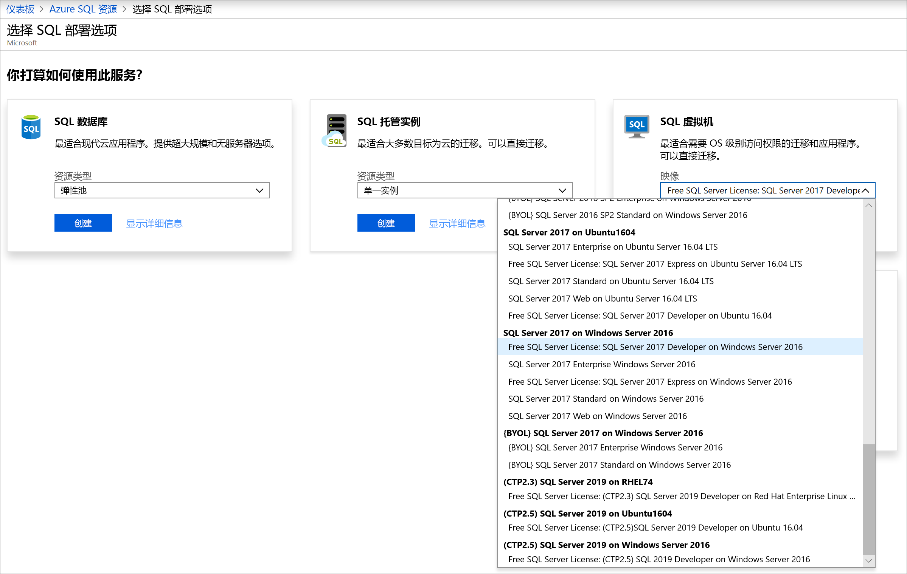
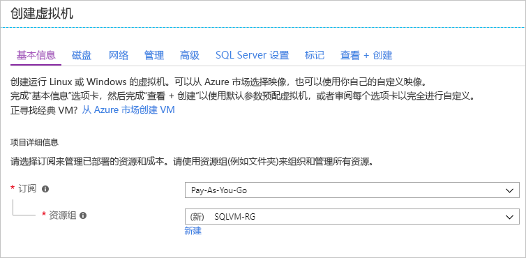
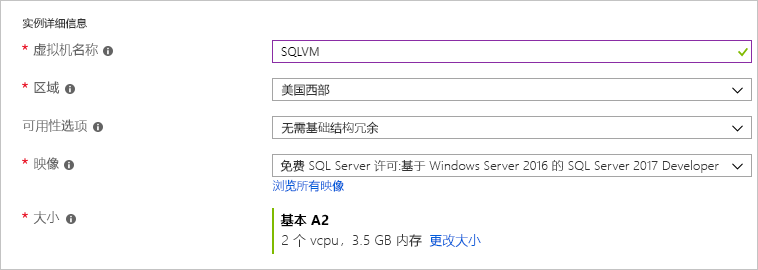
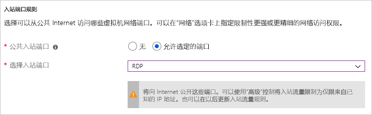
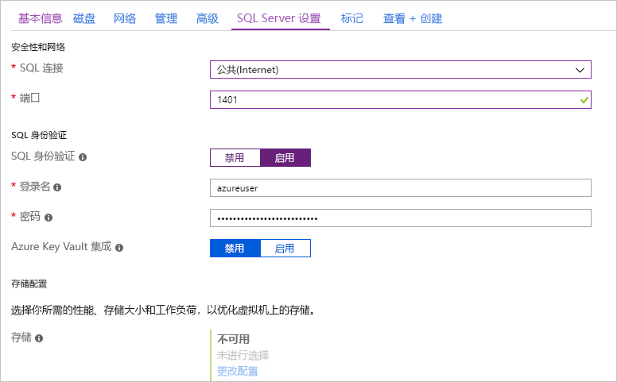
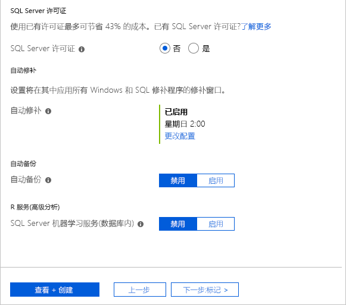

# 快速入门：在 Azure 门户中创建 SQL Server 2017 Windows 虚拟机

> [!div class="op_single_selector"]
> * [Windows](quickstart-sql-vm-create-portal.md)
> * [Linux](../../linux/sql/provision-sql-server-linux-virtual-machine.md)

本快速入门逐步讲解如何在 Azure 门户中创建 SQL Server 虚拟机。

  > [!TIP]
  > - 本快速入门提供的路径适用于快速预配并连接到 SQL VM。 若要详细了解其他 SQL VM 预配选择，请参阅 [Azure 门户中的 Windows SQL Server VM 预配指南](virtual-machines-windows-portal-sql-server-provision.md)。
  > - 如果对 SQL Server 虚拟机有任何疑问，请参阅[常见问题解答](virtual-machines-windows-sql-server-iaas-faq.md)。

##  获取 Azure 订阅

如果没有 Azure 订阅，请在开始之前创建一个[免费帐户](https://azure.microsoft.com/free/?WT.mc_id=A261C142F)。

## 选择 SQL Server VM 映像

1. 使用帐户登录到 [Azure 门户](https://portal.azure.com)。

1. 在 Azure 门户的左侧菜单中选择“Azure SQL”  。 如果 **Azure SQL** 不在列表中，请选择“所有服务”  ，然后在搜索框中键入“Azure SQL”  。
1. 选择“+添加”  以打开“选择 SQL 部署选项”  页。 可以通过在“SQL 虚拟机”  磁贴上选择“显示详细信息”  来查看其他信息。
1. 选择“免费 SQL Server 许可证：  Windows Server 2016 上的 SQL Server 2017 Developer”映像。

   

1. 选择“创建”  。

   

##  提供基本详细信息

在“基本信息”选项卡中提供以下信息： 

1. 在“项目详细信息”部分选择你的 Azure 订阅，然后选择“新建”以创建新的资源组。   键入 _SQLVM-RG_ 作为名称。

   

1. 在“实例详细信息”下： 
    1. 键入 _SQLVM_ 作为**虚拟机名称**。 
    1. 为“区域”选择一个位置。  
    1. 本快速入门将“可用性选项”保留设置为“无需基础结构冗余”。   有关可用性选项的详细信息，请参阅[可用性](../../windows/availability.md)。 
    1. 在“映像”列表中，选择“免费 SQL Server 许可证:   Windows Server 2016 上的 SQL Server 2017 Developer”的映像。 
    1. 对于虚拟机**大小**，请选择“更改大小”，然后选择“A2 基本”产品/服务。   用完资源后，请务必清理资源，以免产生任何意外的费用。 

   

1. 在“管理员帐户”下提供用户名（例如 _azureuser_）和密码。  密码必须至少 12 个字符长，且符合[定义的复杂性要求](../../windows/faq.md#what-are-the-password-requirements-when-creating-a-vm)。

   

1. 在“入站端口规则”下，选择“允许所选端口”，然后从下拉列表中选择“RDP (3389)”。    

   

## SQL Server 设置

在“SQL Server 设置”选项卡中配置以下选项： 

1. 在“安全性和网络”下，为“SQL 连接”选择“公共(Internet)”，并将端口更改为 `1401`，以避免在公共方案中使用众所周知的端口号。    
1. 在“SQL 身份验证”下，选择“启用”。   SQL 登录名设置为针对 VM 配置的相同用户名和密码。 使用 [**Azure Key Vault 集成**](virtual-machines-windows-ps-sql-keyvault.md)的默认设置。 **存储配置**不可用于基本 SQL Server VM 映像，但你可以在[存储配置](virtual-machines-windows-sql-server-storage-configuration.md#new-vms)中找到有关其他映像的可用选项的详细信息。  

   

1. 根据需要更改其他任何设置，然后选择“查看 + 创建”。  

   

## 创建 SQL Server VM

在“查看 + 创建”选项卡中查看摘要，然后选择“创建”以创建为此 VM 指定的 SQL Server、资源组和资源。  

可以从 Azure 门户监视部署情况。 屏幕顶部的“ **通知** ”按钮显示部署的基本状态。 部署可能需要几分钟的时间。 

## 连接到 SQL Server

1. 在门户上虚拟机属性的“概述”部分，找到 SQL Server VM 的“公共 IP 地址”。  

1. 在连接到 Internet 的其他计算机上，打开 [SQL Server Management Studio (SSMS)](/sql/ssms/download-sql-server-management-studio-ssms)。

1. 在“连接到服务器”或“连接到数据库引擎”对话框中，编辑“服务器名称”值    。 输入 VM 的公共 IP 地址。 添加一个逗号，然后添加配置新 VM 时指定的自定义端口 **1401**。 例如，`11.22.33.444,1401` 。

1. 在“身份验证”框中，选择“SQL Server 身份验证”   。

1. 在“登录”  框中，键入有效 SQL 登录的名称。

1. 在“密码”  框中，键入登录的密码。

1. 选择“连接”  。

    

##  远程登录到 VM

使用以下步骤通过远程桌面连接到 SQL Server 虚拟机：

[!INCLUDE [Connect to SQL Server VM with remote desktop](../../../../includes/virtual-machines-sql-server-remote-desktop-connect.md)]

连接到 SQL Server 虚拟机以后，即可启动 SQL Server Management Studio 并使用本地管理员凭据通过 Windows 身份验证进行连接。 如果已启用 SQL Server 身份验证，也可以使用在预配期间配置的 SQL 登录名和密码来配合 SQL 身份验证进行连接。

通过访问计算机，可以根据要求直接更改计算机和 SQL Server 设置。 例如，可以配置防火墙设置或更改 SQL Server 配置设置。

## 清理资源

如果不需要让 SQL VM 持续运行，可以在不使用它时将它停止，以免产生不必要的费用。 也可以永久删除与该虚拟机关联的所有资源，在门户中删除其关联的资源组即可。 请小心使用此命令，因为它也会永久删除该虚拟机。 有关详细信息，请参阅[通过门户管理 Azure 资源](../../../azure-resource-manager/management/manage-resource-groups-portal.md)。

## 后续步骤

在本快速入门中，你在 Azure 门户中创建了一个 SQL Server 2017 虚拟机。 若要详细了解如何将数据迁移到新的 SQL Server，请参阅以下文章。

> [!div class="nextstepaction"]
> [将数据库迁移到 SQL VM](virtual-machines-windows-migrate-sql.md)
