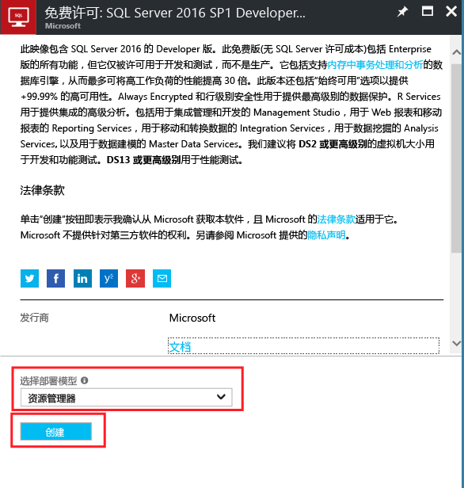
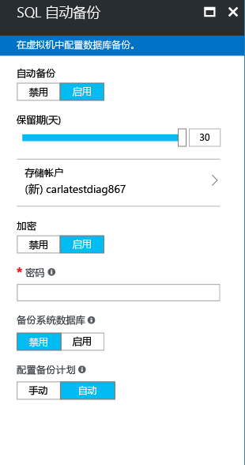

# 如何在 Azure 门户中预配 Windows SQL Server 虚拟机

本指南详细介绍在 Azure 门户中创建 Windows SQL Server 虚拟机时可用的不同选项。 本文介绍更多 [SQL Server VM 快速入门](quickstart-sql-vm-create-portal.md)中未提及的配置选项，为单个预配任务提供更丰富的选择。 

借助本指南创建你自己的 SQL Server VM。 或使用它作为参考，了解 Azure 门户中可用的选项。

> [!TIP]
> 如果对 SQL Server 虚拟机有任何疑问，请参阅[常见问题解答](virtual-machines-windows-sql-server-iaas-faq.md)。

如果你还没有 Azure 订阅，可以在开始前创建一个 [免费帐户](https://azure.microsoft.com/free/?WT.mc_id=A261C142F)。

## SQL Server 虚拟机库映像

创建 SQL Server 虚拟机时，可从虚拟机库中选择一个预配置的映像。 以下步骤演示如何选择一个 SQL Server 2017 映像。

1. 使用帐户登录到 [Azure 门户](https://portal.azure.com)。

1. 在 Azure 门户中，单击“创建资源”。 该门户将打开“新建”窗口。

1. 在“新建”窗口中，单击“计算”，然后单击“全部查看”。

   

1. 在搜索字段中，键入“SQL Server 2017”，然后按 Enter。

1. 然后单击“筛选器”图标。

1. 在“筛选器”窗口针对发布者勾选“基于 Windows”子类别和“Microsoft”。 然后单击“完成”，将结果筛选为 Microsoft 发布的 Windows SQL Server 映像。

   

1. 查看可用的 SQL Server 映像。 每个映像均可标识 SQL Server 版本和操作系统。

1. 选择名为“免费 SQL Server 许可证: 基于 Windows Server 2016 的 SQL Server 2017 Developer”的映像。

   > [!TIP]
   > 本演示使用 Developer（开发人员）版，因为该版本是 SQL Server 的完整功能版本，并且可免费用于开发测试。 只需支付运行 VM 的成本。 但是，本教程中使用的映像可随意选择。 有关可用映像的说明，请参阅 [SQL Server Microsoft 虚拟机概述](virtual-machines-windows-sql-server-iaas-overview.md#payasyougo)。

   > [!TIP]
   > SQL Server 的许可费用包含在所创建的 VM 的每秒定价中，并随版本和内核而有所不同。 但是，SQL Server 开发人员版可免费用于开发/测试（不可用于生产），而 SQL Express 可免费用于轻型工作负荷（1 GB 内存以内，10 GB 存储以内）。 还可选择自带许可 (BYOL)，只支付 VM 费用。 这些映像名称的前缀为 {BYOL}。 
   >
   > 有关这些选项的详细信息，请参阅 [SQL Server Azure VM 定价指南](virtual-machines-windows-sql-server-pricing-guidance.md)。

1. 在“选择部署模型”下面，确认已选择“Resource Manager”。 对于新虚拟机，建议使用“Resource Manager”部署模型。 

1. 单击“创建”。

    

##  配置选项
有五个用于配置 SQL Server 虚拟机的窗口。

| 步骤 | 说明 |
| --- | --- |
| **基础知识** |[配置基本设置](#1-configure-basic-settings) |
| **大小** |[选择虚拟机大小](#2-choose-virtual-machine-size) |
| **设置** |[配置可选功能](#3-configure-optional-features) |
| **SQL Server 设置** |[配置 SQL Server 设置](#4-configure-sql-server-settings) |
| **摘要** |[查看摘要](#5-review-the-summary) |

## 1.配置基本设置

在“基本信息”窗口中提供以下信息：

* 输入唯一的虚拟机 **名称**。

* 选择“SSD”作为 VM 磁盘类型可获得最佳性能。

* 指定 VM 上本地管理员帐户的 **用户名** 。 此帐户还会被添加到 SQL Server **sysadmin** 固定服务器角色。

* 提供一个强 **密码**。

* 如果有多个订阅，请验证订阅是否适合新的虚拟机。

* 在“资源组”框中，键入新资源组的名称。 此外，若要使用现有的资源组，请单击“使用现有资源组”。 资源组是 Azure（虚拟机、存储帐户、虚拟网络等）中相关资源的集合。

  > [!NOTE]
  > 如果只是测试或了解 Azure 中的 SQL Server 部署，使用新的资源组很有帮助。 测试完成后，删除资源组会自动删除 VM 和与该资源组相关联的所有资源。 有关资源组的详细信息，请参阅 [Azure 资源管理器概述](../../../azure-resource-manager/resource-group-overview.md)。

* 针对 Azure 区域选择用于托管该部署的“位置”。

* 单击“确定”保存设置。

    

## 2.选择虚拟机大小

执行“大小”设置步骤时，请在“选择大小”窗口中选择虚拟机大小。 窗口最初会根据所选映像显示建议的计算机大小。

> [!IMPORTANT]
> 在“选择大小”窗口中显示的每月估计成本不包括 SQL Server 许可成本。 此预估费用只是 VM 的成本。 对于 SQL Server 的 Express 和开发人员版本，这是估计的总成本。 对于其他版本，请参阅[“Windows 虚拟机定价”页](https://azure.microsoft.com/pricing/details/virtual-machines/windows/)并选择 SQL Server 的目标版本。 另请参阅 [SQL Server Azure VM 的定价指南](virtual-machines-windows-sql-server-pricing-guidance.md)。

对于生产工作负荷，请参阅 [Azure 虚拟机中 SQL Server 的性能最佳做法](virtual-machines-windows-sql-performance.md)中建议的计算机大小和配置。 如果所需的计算机大小未列出，请单击“全部查看”按钮。

> [!NOTE]
> 有关虚拟机大小的详细信息，请参阅[虚拟机大小](../sizes.md?toc=%2fazure%2fvirtual-machines%2fwindows%2ftoc.json)。

选择计算机大小，并单击“选择”。

## 3.配置可选功能

在“设置”窗口中，为虚拟机配置 Azure 存储、网络和监视。

* 在“存储”的“使用托管磁盘”下，选择“是”。

   > [!NOTE]
   > Microsoft 建议为 SQL Server 使用托管磁盘。 托管磁盘在后台处理存储。 此外，当使用托管磁盘的虚拟机位于同一可用性集中时，Azure 会分发存储资源以提供适当冗余。 有关详细信息，请参阅 [Azure 托管磁盘概述][../managed-disks-overview.md)。 有关可用性集中托管磁盘的具体信息，请参阅[为可用性集中的 VM 使用托管磁盘](../manage-availability.md)。

* 在“网络”下面，可以接受自动填充的值。 也可以单击每个功能来手动配置**虚拟网络**、**子网**、**公共 IP 地址**和**网络安全组**。 为实现本演示的目的，请保留默认值。

* 默认情况下，Azure 会对为 VM 指定的同一个存储帐户启用“监视”功能。 可以在此处更改这些设置。

* 对于本演示，可以在“可用性集”下保留默认设置“无”。 如果计划设置 SQL AlwaysOn 可用性组，可以对可用性进行配置，避免重新创建虚拟机。  有关详细信息，请参阅 [管理虚拟机的可用性](../manage-availability.md?toc=%2fazure%2fvirtual-machines%2fwindows%2ftoc.json)。

配置完这些设置后，请单击“确定”。

## 4.配置 SQL Server 设置
在“SQL Server 设置”窗口中，配置 SQL Server 的特定设置和优化。 可以为 SQL Server 配置的设置包括以下各项。

| 设置 |
| --- |
| [连接](#connectivity) |
| [身份验证](#authentication) |
| [存储配置](#storage-configuration) |
| [自动修补](#automated-patching) |
| [自动备份](#automated-backup) |
| [Azure 密钥保管库集成](#azure-key-vault-integration) |
| [SQL Server 机器学习服务](#sql-server-machine-learning-services) |

### 连接

在“ **SQL 连接**”下，指定要对此 VM 上的 SQL Server 实例进行的访问类型。 对于本演示，请选择“公共(Internet)”以允许从 Internet 上的计算机或服务连接到 SQL Server。 选择此选项以后，Azure 会自动将防火墙和网络安全组配置为允许在端口 1433 上通信。

> [!TIP]
> SQL Server 默认在已知端口 1433 上侦听。 为了提高安全性，请更改上一对话框中的端口，改成在非默认端口（例如 1401）上侦听。 如果更改端口，则必须在任何客户端工具（例如 SSMS）中使用该端口进行连接。

若要通过 Internet 连接到 SQL Server，还必须启用下一部分中所述的“SQL Server 身份验证”。

如果不希望启用通过 Internet 连接到数据库引擎这一功能，可选择以下选项之一：

* **本地(仅在 VM 中)** ：仅允许从 VM 内部连接到 SQL Server。
* **私有(虚拟机内)** ：允许从同一虚拟网络中的虚拟机或服务连接到 SQL Server。

一般情况下，选择方案允许的最严格连接可提高安全性。 但是，通过网络安全组规则和 SQL/Windows 身份验证的所有选项都是安全的。 可以在创建 VM 后编辑“网络安全组”。 有关详细信息，请参阅 [Azure 虚拟机中 SQL Server 的安全注意事项](virtual-machines-windows-sql-security.md)。

### 身份验证

如果需要 SQL Server 身份验证，请在“ **启用** under **启用**。

> [!NOTE]
> 如果计划通过 Internet 来访问 SQL Server（“公共”连接选项），则必须在此处启用 SQL 身份验证。 对 SQL Server 进行公共访问需要使用 SQL 身份验证。

如果启用 SQL Server 身份验证，请指定“登录名”和“密码”。 此用户名已配置为 SQL Server 身份验证登录名和 **sysadmin** 固定服务器角色的成员。 若要详细了解身份验证模式，请参阅[选择身份验证模式](https://docs.microsoft.com/sql/relational-databases/security/choose-an-authentication-mode)。

如果未启用 SQL Server 身份验证，可以在 VM 上使用本地管理员帐户连接到 SQL Server 实例。

### 存储配置

单击“ **存储配置** ”以指定存储要求。

> [!NOTE]
> 如果已手动将 VM 配置为使用标准存储，则此选项不可用。 自动存储优化只适用于高级存储。

> [!TIP]
> 每个滑块的停止数和上限取决于所选 VM 大小。 VM 较大且功能较强时，纵向扩展的余地越大。

可以将要求指定为每秒输入/输出操作数 (IOPs)、吞吐量（MB/秒）以及总存储大小。 可使用可调缩放性配置这些值。 可根据工作负荷更改这些存储设置。 门户会根据这些要求自动计算要附加和配置的磁盘数。

在“ **存储优化目标**”下，选择以下选项之一：

* **常规** ：默认设置，支持大多数工作负荷。
* **事务处理** ：针对传统数据库 OLTP 工作负荷优化存储。
* **数据仓库** ：针对分析和报告工作负荷优化存储。

### 自动修补

**自动修补** ：默认处于启用状态。 Azure 可以通过自动修补来自动修补 SQL Server 和操作系统。 指定进行维护的具体日期（星期几）、时间和时长。 Azure 会在维护时段进行修补。 维护时段计划使用 VM 的时间区域设置。 如果不希望 Azure 自动修补 SQL Server 和操作系统，请单击“ **禁用**”。  

有关详细信息，请参阅 [Azure 虚拟机中 SQL Server 的自动修补](virtual-machines-windows-sql-automated-patching.md)。

### 自动备份

在“ **自动备份**”下启用针对所有数据库的自动数据库备份。 默认情况下，自动备份处于禁用状态。

启用 SQL 自动备份以后，即可进行以下设置的配置：

* 备份保留期（天）
* 用于备份的存储帐户
* 备份的加密选项和密码
* 备份系统数据库
* 配置备份计划

若要加密备份，请单击“ **启用**”。 然后指定“密码”。 Azure 创建一个证书来加密备份，并使用指定的密码来保护该证书。

 有关详细信息，请参阅 [针对 Azure 虚拟机中 SQL Server 的自动备份](virtual-machines-windows-sql-automated-backup.md)。

### Azure 密钥保管库集成

要将安全密码存储在 Azure 中进行加密，请先单击“Azure 密钥保管库集成”，然后单击“启用”。

下表列出了配置 Azure 密钥保管库集成所需的参数。

| 参数 | 说明 | 示例 |
| --- | --- | --- |
| **密钥保管库 URL** |密钥保管库的位置。 |https://contosokeyvault.vault.azure.net/ |
| **主体名称** |Azure Active Directory 服务主体名称。 该名称也称为客户端 ID。 |fde2b411-33d5-4e11-af04eb07b669ccf2 |
| **主体密码** |Azure Active Directory 服务主体密码。 该密码也称为客户端密码。 |9VTJSQwzlFepD8XODnzy8n2V01Jd8dAjwm/azF1XDKM= |
| **凭据名称** |**凭据名称**：AKV 集成在 SQL Server 内创建一个凭据，使 VM 具有对密钥保管库的访问权限。 为此凭据选择一个名称。 |mycred1 |

有关详细信息，请参阅 [为 Azure VM 上的 SQL Server 配置 Azure 密钥保管库集成](virtual-machines-windows-ps-sql-keyvault.md)。

### SQL Server 机器学习服务

可以选择启用 [SQL Server 机器学习服务](https://msdn.microsoft.com/library/mt604845.aspx)。 使用此选项，可使用 SQL Server 2017 的高级分析功能。 在“SQL Server 设置”窗口中单击“启用”。

配置完 SQL Server 设置后，单击“ **确定**”。

## 5.查看摘要

在“摘要”窗口中查看摘要，然后单击“购买”以创建为此 VM 指定的 SQL Server、资源组和资源。

可以从 Azure 门户监视部署情况。 屏幕顶部的“ **通知** ”按钮显示部署的基本状态。

> [!NOTE]
> 为了让你了解部署时间，我已使用默认设置将一个 SQL VM 部署到美国东部区域。 此测试部署花费了约 12 分钟才完成。 但是根据你所在的区域和选择的设置，花费的部署时间会更长或更短。

##  使用远程桌面打开 VM

使用以下步骤通过远程桌面连接到 SQL Server 虚拟机：

[!INCLUDE [Connect to SQL Server VM with remote desktop](../../../../includes/virtual-machines-sql-server-remote-desktop-connect.md)]

连接到 SQL Server 虚拟机以后，即可启动 SQL Server Management Studio 并使用本地管理员凭据通过 Windows 身份验证进行连接。 如果已启用 SQL Server 身份验证，也可以使用在预配期间配置的 SQL 登录名和密码来配合 SQL 身份验证进行连接。

通过访问计算机，可以根据要求直接更改计算机和 SQL Server 设置。 例如，可以配置防火墙设置或更改 SQL Server 配置设置。

##  远程连接到 SQL Server

在本演示中，选择了虚拟机的“公共”访问权限和“SQL Server 身份验证”。 这些设置将虚拟机自动配置为允许任何客户端通过 Internet 来与 SQL Server 建立连接（假设这些客户端可提供正确的 SQL 登录名）。

> [!NOTE]
> 如果没有在预配过程中选择“公共”，则可在预配后通过门户更改 SQL 连接设置。 有关详细信息，请参阅[更改 SQL 连接设置](virtual-machines-windows-sql-connect.md#change)。

以下部分说明如何通过 Internet 连接到 SQL Server VM 实例。

[!INCLUDE [Connect to SQL Server in a VM Resource Manager](../../../../includes/virtual-machines-sql-server-connection-steps-resource-manager.md)]

## 后续步骤

有关在 Azure 中使用 SQL Server 的其他信息，请参阅 [Azure 虚拟机上的 SQL Server](virtual-machines-windows-sql-server-iaas-overview.md) 和[常见问题](virtual-machines-windows-sql-server-iaas-faq.md)。