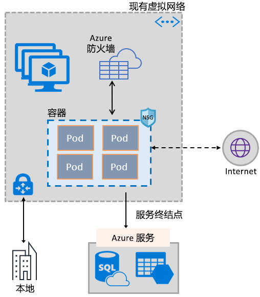
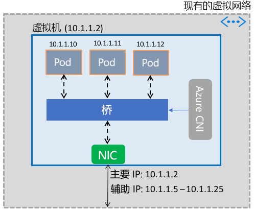

# 启用容器以使用 Azure 虚拟网络功能

利用增强虚拟机的同一软件定义网络堆栈，将一组丰富的 Azure 网络功能引入容器。 Azure 虚拟网络容器网络接口 (CNI) 插件安装在 Azure 虚拟机中。 该插件用于将虚拟网络中的 IP 地址分配到虚拟机中显示的容器，并将其附加到虚拟网络，使其直接连接到其他容器和虚拟网络资源。 该插件不依赖于覆盖网络或多个路由即可实现连接，并提供与虚拟机相同的性能。 在高级别，该插件提供以下功能：

- 虚拟网络 IP 地址分配给每个可以包含一个或多个容器的 Pod。
- 这些 Pod 可以通过 ExpressRoute 或站点到站点 VPN 连接到对等虚拟网络和本地网络。 也可从对等网络和本地网络访问这些 Pod。
- Pod 可以访问 Azure 存储和 Azure SQL 数据库等受到虚拟网络服务终结点保护的服务。
- 可以将网络安全组和路由直接应用到 Pod。
- 正如虚拟机一样，可直接将 Pod 放置在 Azure 内部或公共负载均衡器后面
- 可为 Pod 分配一个公共 IP 地址，以便通过 Internet 直接访问。 Pod 还可访问 Internet 本身。
- 可与 Kubernetes 资源（如服务、入口控制器和 Kube DNS）无缝结合使用。 通过 Azure 负载均衡器还可在外部或内部公开 Kubernetes 服务。

下图显示了该插件向 Pod 提供 Azure 虚拟网络功能的工作原理：

该插件同时支持 Linux 和 Windows 平台。

## 将 Pod 连接到虚拟网络

Pod 将显示在属于虚拟网络一部分的虚拟机中。 Pod 的 IP 地址池配置为虚拟机网络接口上的辅助地址。 Azure CNI 为 Pod 设置基本的网络连接并管理池中 IP 地址的使用率。 当 Pod 显示在虚拟机中后，Azure CNI 从池中分配可用的 IP 地址，并将 Pod 连接到虚拟机中的软件桥。 Pod 终止时，IP 地址会被添加回池。 下图显示了 Pod 连接到虚拟网络的工作原理：

## Internet 访问权限

为了使 Pod 能够访问 Internet，该插件将 iptables 规则配置为网络地址转换 (NAT)，通过 Internet 绑定 Pod 流量。 包的源 IP 地址被转换为虚拟机的网络接口上的主 IP 地址。 Windows 虚拟机自动为流往虚拟机所属子网范围之外的 IP 地址的流量进行源 NAT (SNAT)。 通常会转换流往虚拟机 IP 范围之外的 IP 地址的所有流量。

## 限制

该插件支持每台虚拟机最多 250 个 Pod，虚拟网络中最多 16,000 个 Pod。 这些限制因 [Azure Kubernetes 服务](../azure-subscription-service-limits.md?toc=%2fazure%2fvirtual-network%2ftoc.json#kubernetes-service-limits)会有所不同。

## 使用该插件

可采用以下方式来使用该插件，以提供 Pod 或 Docker 容器的基本虚拟网络连接：

- **Azure Kubernetes 服务**：该插件已集成到 Azure Kubernetes 服务 (AKS) 中，选择“高级网络”选项即可使用该插件。 使用高级网络，可在现有或新的虚拟网络中部署 Kubernetes 群集。 如需深入了解高级网络及其设置步骤，请参阅 [AKS 中的网络配置](../aks/networking-overview.md?toc=%2fazure%2fvirtual-network%2ftoc.json)。
- **ACS-Engine**：ACS-Engine 是一项工具，用于生成 Azure 资源管理器模板，以便在 Azure 中部署 Kubernetes 群集。 如需详细说明，请参阅[为 ACS-Engine Kubernetes 群集部署插件](deploy-container-networking.md#deploy-plug-in-for-acs-engine-kubernetes-cluster)。
- **在 Azure 中创建自己的 Kubernetes 群集**：该插件可用于为自行部署的 Kubernetes 群集中的 Pod 提供基本网络，无需依赖于 AKS 或 ACS-Engine 之类的工具。 在这种情况下，群集中的每个虚拟机上都已安装并启用该插件。 如需详细说明，请参阅[为自行部署的 Kubernetes 群集部署插件](deploy-container-networking.md#deploy-plug-in-for-a-kubernetes-cluster)。
- **Azure 中 Docker 容器的虚拟网络附加**：不希望创建 Kubernetes 群集，而希望创建在虚拟机中附加虚拟网络的 Docker 容器时，可使用该插件。 如需详细说明，请参阅[为容器部署插件](deploy-container-networking.md#deploy-plug-in-for-docker-containers)。

## 后续步骤

为 Kubernetes 群集或 Docker 容器[部署插件](deploy-container-networking.md)