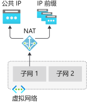
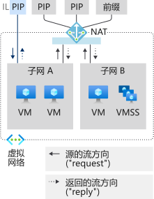
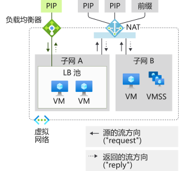
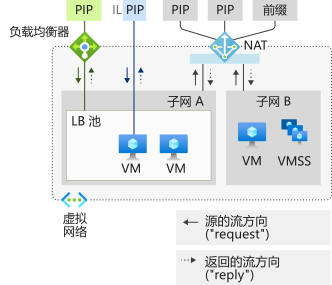
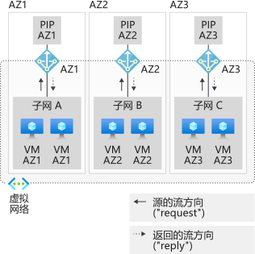
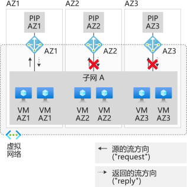
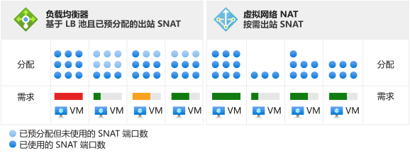
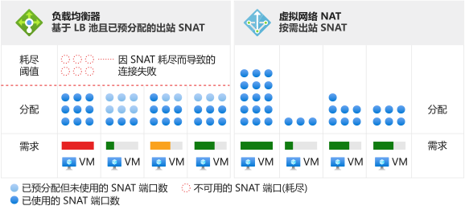

# <a name="designing-virtual-networks-with-nat-gateway-resources-public-preview"></a>使用 NAT 网关资源设计虚拟网络（公共预览版）

NAT 网关资源是[虚拟网络 NAT](nat-overview.md) 的一部分，为虚拟网络的一个或多个子网提供出站 Internet 连接。 虚拟网络的子网指明要使用的 NAT 网关。 NAT 为子网提供源网络地址转换 (SNAT)。  NAT 网关资源指定虚拟机在创建出站流时要使用的静态 IP 地址。 静态 IP 地址来自公共 IP 地址资源和/或公共 IP 前缀资源。 NAT 网关资源最多可以使用公共 IP 地址资源或公共 IP 前缀资源中的 16个静态 IP 地址。


<p align="center">
  
</p>

图：*用于出站 Internet 连接的虚拟网络 NAT*


>[!NOTE] 
>虚拟网络 NAT 暂时以公共预览版提供。 目前它只能在有限的几个[区域](nat-overview.md#region-availability)中使用。 此预览版在提供时没有附带服务级别协议，不建议用于生产工作负载。 某些功能可能不受支持或者受限。 有关详细信息，请参阅 [Microsoft Azure 预览版补充使用条款](https://azure.microsoft.comsupport/legal/preview-supplemental-terms)。

> [!IMPORTANT]
> 在订阅中启用虚拟网络 NAT [预览版](./nat-overview.md#enable-preview)后，使用 https://aka.ms/natportal 访问门户。

## <a name="how-to-deploy-nat"></a>如何部署 NAT

我们有意简化了 NAT 网关的配置和使用：  

NAT 网关资源：
- 创建区域性或局部性（区域隔离）NAT 网关资源；
- 分配 IP 地址；
- 修改空闲超时（可选）。

虚拟网络：
- 将虚拟网络子网配置为使用 NAT 网关。

不需要指定用户定义的路由。

## <a name="resource"></a>资源

从以下采用类似于模板格式的 Azure 资源管理器示例中就能看出，资源的设计非常简单。  此处显示了类似于模板的格式用于演示概念和结构。  请根据需要修改示例。  本文档并非旨在用作教程。

下图显示了不同 Azure 资源管理器资源之间的可写引用。  箭头指示引用的方向，从可写位置开始。 审阅 

<p align="center">
  
</p>

图：*虚拟网络 NAT 对象模型*

建议为大多数工作负荷使用 NAT，除非对[基于池的负载均衡器出站连接](../load-balancer/load-balancer-outbound-connections.md)有具体的依赖。  

可以从标准负载均衡器方案（包括[出站规则](../load-balancer/load-balancer-outbound-rules-overview.md)）迁移到 NAT 网关。 若要迁移，请将负载均衡器前端中的公共 IP 和公共 IP 前缀资源移到 NAT 网关。 不需要为 NAT 网关指定新的 IP 地址。 可以重复使用标准公共 IP 和前缀，只要总共不超过 16 个 IP 地址即可。 在转换期间，请规划好迁移并考虑到服务中断。  将此过程自动化可以最大程度地缩减中断时间。 首先在过渡环境中测试迁移。  在转换期间，入站来源流不受影响。

以下示例在“美国东部 2 可用性区域 1”区域创建名为 _myNATGateway_ 的 NAT 网关资源，其空闲超时为 4 分钟。   提供的出站 IP 地址为：
- 一组公共 IP 地址资源 _myIP1_ 和 _myIP2_ 
- 一组公共 IP 前缀资源 _myPrefix1_ 和 _myPrefix2_。 

所有 4 个 IP 地址资源提供的 IP 地址总数不能超过 16 个。 允许提供 1 到 16 范围内的任意数量的 IP 地址。

```json
{
"name": "myNATGateway",
   "type": "Microsoft.Network/natGateways",
   "apiVersion": "2018-11-01",
   "location": "East US 2",
   "sku": { "name": "Standard" },
   "zones": [ "1" ],
   "properties": {
      "idleTimeoutInMinutes": 4, 
      "publicIPPrefixes": [
         {
            "id": "ref to myPrefix1"
         },
         {
            "id": "ref to myPrefix2"
         }
      ],
      "publicIPAddresses": [
         {
            "id": "ref to myIP1"
         },
         {
            "id": "ref to myIP2"
         }
      ]
   }
}
```

创建 NAT 网关资源后，可以在虚拟网络的一个或多个子网上使用它。 指定哪些子网使用此 NAT 网关资源。 一个 NAT 网关不能跨多个虚拟网络。 不需要将同一个 NAT 网关分配到虚拟网络的所有子网。 可以使用不同的 NAT 网关资源配置各个子网。

不使用可用性区域的方案是区域性的（不指定局部区域）。 如果使用可用性区域，则可以指定一个局部区域，将 NAT 隔离到特定的局部区域。 不支持区域冗余。 请查看 NAT [可用性区域](#availability-zones)。


```json
{
   "name": "myVNet",
   "apiVersion": "2018-11-01",
   "type": "Microsoft.Network/virtualNetworks",
   "location": "myRegion", 
   "properties": {
      "addressSpace": {
          "addressPrefixes": [
           "192.168.0.0/16"
          ]
      },
      "subnets": [
         {
            "name": "mySubnet1",
            "properties": {
               "addressPrefix": "192.168.0.0/24",
               "natGateway": {
                  "id": "ref to myNATGateway"
               }
            }
         } 
      ]
   }
}
```
NAT 网关是使用虚拟网络中某个子网上的属性定义的。 虚拟网络 _myVNet_ 的子网 _mySubnet1_ 上的虚拟机创建的流将使用 NAT 网关。 所有出站连接将使用与 _myNatGateway_ 关联的 IP 地址作为源 IP 地址。


## <a name="design-guidance"></a>设计指南

请阅读本部分来了解有关使用 NAT 设计虚拟网络的注意事项。  

1. [成本优化](#cost-optimization)
1. [入站和出站连接的共存](#coexistence-of-inbound-and-outbound)
2. [管理基本资源](#managing-basic-resources)
3. [可用性区域](#availability-zones)

### <a name="cost-optimization"></a>成本优化

[服务终结点](virtual-network-service-endpoints-overview.md)和[专用链接](../private-link/private-link-overview.md)是在不需要 NAT 的情况下，可考虑用于优化成本的两个选项。  定向到服务终结点或专用链接的任何流量不会得到虚拟网络 NAT 的处理。  

服务终结点将 Azure 服务资源关联到虚拟网络，并控制对 Azure 服务资源的访问。 例如，在访问 Azure 存储时，可将服务终结点用于存储，以免产生 NAT 数据处理费用。 服务终结点是免费的。

专用链接将 Azure PaaS 服务（或通过专用链接托管的其他服务）作为虚拟网络中的专用终结点公开。  专用链接根据持续时间和处理的数据计费。

请评估上述一种或两种方法是否适合你的方案，并根据需要选用。

### <a name="coexistence-of-inbound-and-outbound"></a>入站和出站连接的共存

NAT 网关与以下资源兼容：

 - 标准负载均衡器
 - 标准公共 IP
 - 标准公共 IP 前缀

开发新的部署时，请从标准 SKU 着手。

<p align="center">
  
</p>

图：*用于出站 Internet 连接的虚拟网络 NAT*

可以使用从 Internet 建立入站连接功能，来扩展 NAT 网关提供的仅限 Internet 出站连接方案。 每个资源都知道流的来源方向。 在使用 NAT 网关的子网上，所有 Internet 出站连接方案都将由 NAT 网关取代。 从 Internet 建立入站连接方案由相应的资源提供。

#### <a name="nat-and-vm-with-instance-level-public-ip"></a>使用实例级公共 IP 的 NAT 和 VM

<p align="center">
  
</p>

图：*使用实例级公共 IP 的虚拟网络 NAT 和 VM*

| 方向 | 资源 |
|:---:|:---:|
| 入站 | 使用实例级公共 IP 的 VM |
| 出站 | NAT 网关 |

VM 将使用 NAT 网关建立出站连接。  来源入站连接不受影响。

#### <a name="nat-and-vm-with-public-load-balancer"></a>使用公共负载均衡器的 NAT 和 VM

<p align="center">
  
</p>

图：*使用公共负载均衡器的虚拟网络 NAT 和 VM*

| 方向 | 资源 |
|:---:|:---:|
| 入站 | 公共负载均衡器 |
| 出站 | NAT 网关 |

负载均衡规则或出站规则中的任何出站配置将由 NAT 网关取代。  来源入站连接不受影响。

#### <a name="nat-and-vm-with-instance-level-public-ip-and-public-load-balancer"></a>使用实例级公共 IP 和公共负载均衡器的 NAT 与 VM

<p align="center">
  
</p>

图：*使用实例级公共 IP 和公共负载均衡器的虚拟网络 NAT 与 VM*

| 方向 | 资源 |
|:---:|:---:|
| 入站 | 使用实例级公共 IP 和公共负载均衡器的 VM |
| 出站 | NAT 网关 |

负载均衡规则或出站规则中的任何出站配置将由 NAT 网关取代。  VM 也使用 NAT 网关建立出站连接。  来源入站连接不受影响。

### <a name="managing-basic-resources"></a>管理基本资源

标准负载均衡器、公共 IP 和公共 IP 前缀与 NAT 网关兼容。 NAT 网关在子网范围内运行。 必须在不带 NAT 网关的子网上部署这些服务的基本 SKU。 借助这种隔离，两个 SKU 变体可以在同一虚拟网络中共存。

NAT 网关优先于子网的出站方案。 无法通过适当的转换来调整基本负载均衡器或公共 IP（以及使用这些资源构建的任何托管服务）。 NAT 网关控制与子网上 Internet 流量的出站连接。 发往基本负载均衡器和公共 IP 的入站流量将不可用。 发往基本负载均衡器和/或 VM 上配置的公共 IP 的入站流量将不可用。

### <a name="availability-zones"></a>可用性区域

即使没有可用性区域，NAT 也具有复原能力，可以承受多次基础结构组件故障。 如果方案中包含可用性区域，应为特定的区域配置 NAT。  控制平面操作和数据平面受限于指定的区域。 不包含你的方案的区域发生故障预期不会影响 NAT。 由于区域隔离，来自同一区域中的虚拟机的出站流量将会失败。

<p align="center">
  
</p>

图：*使用可用性区域的虚拟网络 NAT*

区域隔离的 NAT 网关要求 IP 地址与 NAT 网关的区域相匹配。 不支持使用来自不同区域的 IP 地址的 NAT 网关资源，或没有区域的 NAT 网关资源。

虚拟网络和子网是区域性，未经过局部区域对齐。 VM 必须与 NAT 网关位于同一局部区域，才能满足出站连接的局部区域承诺。 区域隔离是通过按可用性区域创建区域“堆栈”来建立的。 跨越局部区域 NAT 网关的局部区域或者将区域 NAT 网关与局部区域 VM 配合使用时，局部区域承诺不存在。

部署要与 NAT 配合使用的虚拟机规模集时，可在 NAT 自身的子网中部署一个局部区域规模集，并将匹配的局部区域 NAT 网关附加到该子网。 如果使用跨局部区域规模集（一个规模集位于两个或更多个局部区域中），NAT 不会提供局部区域承诺。  NAT 不支持局部区域冗余。  仅支持区域隔离或局部区域隔离。

<p align="center">
  
</p>

图：*跨局部区域的虚拟网络 NAT*

zones 属性不是可变的。  使用所需的区域或局部区域首选项重新部署 NAT 网关资源。

>[!NOTE] 
>如果未指定局部区域，则 IP 地址本身不是局部区域冗余的。  如果 IP 地址不是在特定局部区域中创建的，则[标准负载均衡器的前端是局部区域冗余的](../load-balancer/load-balancer-standard-availability-zones.md#frontend)。  此规则不适用于 NAT。  仅支持区域隔离或局部区域隔离。

## <a name="source-network-address-translation"></a>源网络地址转换

源网络地址转换 (SNAT) 将流的源重写为源自不同的 IP 地址。  NAT 网关资源使用一个通常称作端口地址转换 (PAT) 的 SNAT 变体。 PAT 可重写源地址和源端口。 使用 SNAT 时，专用地址的数量与其转换的公共地址之间没有固定的关系。  

### <a name="fundamentals"></a>基本

让我们看一个示例，其中通过四个流来解释基本概念。  NAT 网关正在使用公共 IP 地址资源 65.52.0.2。

| 流向 | 源元组 | 目标元组 |
|:---:|:---:|:---:|
| 1 | 192.168.0.16:4283 | 65.52.0.1:80 |
| 2 | 192.168.0.16:4284 | 65.52.0.1:80 |
| 3 | 192.168.0.17.5768 | 65.52.0.1:80 |
| 4 | 192.168.0.16:4285 | 65.52.0.2:80 |

发生 PAT 后，这些流可能类似于：

| 流向 | 源元组 | 经过 SNAT 处理的源元组 | 目标元组 | 
|:---:|:---:|:---:|:---:|
| 1 | 192.168.0.16:4283 | 65.52.0.2:234 | 65.52.0.1:80 |
| 2 | 192.168.0.16:4284 | 65.52.0.2:235 | 65.52.0.1:80 |
| 3 | 192.168.0.17.5768 | 65.52.0.2:236 | 65.52.0.1:80 |
| 4 | 192.168.0.16:4285 | 65.52.0.2:237 | 65.52.0.2:80 |

目标将会看到，流的源为 65.52.0.2（SNAT 源元组）以及所示的分配端口。  上表中所示的 PAT 也称为端口伪装 SNAT。  多个专用源在 IP 和端口后面伪装。

请不要依赖于源端口的特定分配方式。  上面只是基本概念的演示图。

NAT 提供的 SNAT 在多个方面不同于[负载均衡器](../load-balancer/load-balancer-outbound-connections.md)。

### <a name="on-demand"></a>按需

NAT 为新的出站流量流提供按需 SNAT 端口。 配置了 NAT 的子网上的任何虚拟机将使用库存中所有可用的 SNAT 端口。 

<p align="center">
  
</p>

图：*虚拟网络 NAT 按需出站 SNAT*

虚拟机的任何 IP 配置都可以按需创建出站流。  不需要进行预先分配和按实例的规划，包括根据每个实例的最差情况进行过度预配。  

<p align="center">
  
</p>

图：*耗尽方案的差异*

释放某个 SNAT 端口后，该端口可供配置了 NAT 的子网上的任何虚拟机使用。  按需分配允许子网上的动态和分散工作负荷按需使用 SNAT 端口。  只要有可用的 SNAT 端口库存，SNAT 流就会成功。 SNAT 端口热点则可受益于较大的端口库存。 不需要 SNAT 端口的虚拟机并非不使用这些端口。

### <a name="scaling"></a>扩展

NAT 需要足够的 SNAT 端口库存才能全面实现出站连接方案。 缩放 NAT 功能主要用于管理共享的可用 SNAT 端口库存。 需有足够的库存，才能解决已附加到 NAT 网关资源的所有子网的高峰出站流。

SNAT 将多个专用地址映射到一个公共地址，并使用多个公共 IP 进行缩放。

NAT 网关资源将使用公共 IP 地址的 64,000 个端口（SNAT 端口）。  这些 SNAT 端口将成为可用的库存，用于实现专用流到公共流的映射。 添加更多公共 IP 地址可以增加可用库存 SNAT 端口。 NAT 网关资源可以扩展到 16 个 IP 地址和 100 万个 SNAT 端口。  TCP 和 UDP 是独立的 SNAT 端口库存，与此无关。

NAT 网关资源可借机重复使用源端口。 对于缩放目的，应假设每个流需要新的 SNAT 端口，并缩放出站流量的可用 IP 地址总数。

### <a name="protocols"></a>协议

NAT 网关资源与 UDP 和 TCP 流的 IP 和 IP 传输标头交互，对应用层有效负载不可知。  不支持其他 IP 协议。

### <a name="timers"></a>计时器

对于所有流，可将空闲超时从 4 分钟（默认值）调整为 120 分钟（2小时）。  此外，对于流中的流量，还可以重置空闲计时器。  TCP Keepalive 是刷新长时间空闲连接和执行终结点活动状态检测的推荐模式。  TCP Keepalive 以重复 ACK 的形式显示给终结点，其开销较低，对应用层不可见。

以下计时器用于 SNAT 端口释放：

| Timer | 值 |
|---|---|
| TCP FIN | 60 秒 |
| TCP RST | 10 秒 |
| TCP 半开 | 30 秒 |

5 秒钟后，SNAT 端口即可供同一目标 IP 地址和目标端口重复使用。

>[!NOTE] 
>这些计时器设置随时可能更改。 提供这些值是为了帮助进行故障排除，暂时请不要依赖于特定的计时器。

## <a name="limitations"></a>限制

- NAT 与标准 SKU 公共 IP、公共 IP 前缀和负载均衡器资源兼容。   基本资源（例如基本负载均衡器）以及派生自这些资源的任何产品都与 NAT 不兼容。  必须将基本资源放在未配置 NAT 的子网中。
- 支持 IPv4 地址系列。  NAT 不会与 IPv6 地址系列交互。
- 使用 NAT 发往公共终结点的出站流不遵从子网或 NIC 上的 NSG。
- 使用 NAT 时不支持 NSG 流日志记录。
- NAT 不能跨多个虚拟网络。

## <a name="preview-participation"></a>预览版参与

请按照[启用订阅的说明](nat-overview.md#public-preview-participation)操作。

## <a name="feedback"></a>反馈

我们很想知道如何能够改进该服务。 欢迎分享[有关公共预览版的反馈](https://aka.ms/natfeedback)。  同时，请在 [UserVoice for NAT](https://aka.ms/natuservoice) 上，为我们接下来要开发的功能提供建议和投票。

## <a name="next-steps"></a>后续步骤

- 详细了解[虚拟网络 NAT](nat-overview.md)。
- 有关验证 NAT 网关的教程
  * [Azure CLI](tutorial-create-validate-nat-gateway-cli.md)
  * [PowerShell](tutorial-create-validate-nat-gateway-cli.md)
  * [门户](tutorial-create-validate-nat-gateway-cli.md)
- 有关部署 NAT 网关资源的快速入门
  * [Azure CLI](./quickstart-create-nat-gateway-cli.md)
  * [PowerShell](./quickstart-create-nat-gateway-powershell.md)
  * [门户](./quickstart-create-nat-gateway-portal.md)
- 详细了解[可用性区域](../availability-zones/az-overview.md)。
- 详细了解[标准负载均衡器](../load-balancer/load-balancer-standard-overview.md)。
- 详细了解[可用性区域和标准负载均衡器](../load-balancer/load-balancer-standard-availability-zones.md)。
- 详细了解 NAT 网关资源 API
  * [REST API](https://docs.microsoft.com/rest/api/virtualnetwork/natgateways)
  * [Azure CLI](https://docs.microsoft.com/cli/azure/network/nat/gateway?view=azure-cli-latest)
  * [PowerShell](https://docs.microsoft.com/powershell/module/az.network/new-aznatgateway)。
- [在 UserVoice 中告诉我们接下来你希望开发哪些功能](https://aka/natuservoice)。
- [提供有关公共预览版的反馈](https://aka.ms/natfeedback)。
