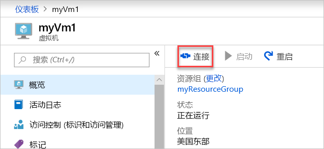

# <a name="quickstart-create-a-virtual-network-using-the-azure-portal"></a>快速入门：使用 Azure 门户创建虚拟网络

虚拟网络能让 Azure 资源（例如虚拟机 (VM)）彼此之间私下通信以及与 Internet 进行通信。 本快速入门介绍如何创建虚拟网络。 创建虚拟网络后，将两个 VM 部署到该虚拟网络中。 然后从 Internet 连接到其中一个 VM，并在两个 VM 之间进行私下通信。

如果你还没有 Azure 订阅，可以在开始前创建一个 [免费帐户](https://azure.microsoft.com/free/?WT.mc_id=A261C142F)。

## <a name="log-in-to-azure"></a>登录 Azure 

通过 https://portal.azure.com 登录到 Azure 门户。

## <a name="create-a-virtual-network"></a>创建虚拟网络

1. 选择 Azure 门户左上角的“+ 创建资源”。
2. 选择“网络”，然后选择“虚拟网络”。
3. 输入或选择以下信息，接受剩下的默认设置，然后选择“创建”：

    |设置|值|
    |---|---|
    |名称|myVirtualNetwork|
    |订阅| 选择订阅。|
    |资源组| 选择“新建”，并输入 myResourceGroup|
    |Location| 选择“美国东部”。|

    

## <a name="create-virtual-machines"></a>创建虚拟机

在虚拟网络中创建两个 VM：

### <a name="create-the-first-vm"></a>创建第一个 VM

1. 选择 Azure 门户左上角的“+ 创建资源”。
2. 选择“计算”，然后选择“Windows Server 2016 Datacenter”。
3. 输入或选择以下信息，保留剩下的默认设置，然后选择“确定”：

    |设置|值|
    |---|---|
    |名称|myVM1|
    |用户名| 输入所选用户名。|
    |密码| 输入所选密码。 密码必须至少 12 个字符长，且符合[定义的复杂性要求](../virtual-machines/windows/faq.md?toc=%2fazure%2fvirtual-network%2ftoc.json#what-are-the-password-requirements-when-creating-a-vm)。|
    |订阅| 选择订阅。|
    |资源组| 选择“使用现有资源组”，再选择“myResourceGroup”。|
    |Location| 选择“美国东部”|

    

4. 选择 VM 的大小，然后选择“选择”。
5. 在“设置”下，保留所有默认值，然后选择“确定”。

    

6. 在“摘要”中的“创建”下，选择“创建”以启动 VM 部署。 部署 VM 需要几分钟时间。 

### <a name="create-the-second-vm"></a>创建第二个 VM

再次完成步骤 1-6，但在步骤 3 中，将 VM 命名为“myVm2”。

## <a name="connect-to-a-vm-from-the-internet"></a>从 Internet 连接到 VM

1. 创建 *myVm1* 后，连接到它。 在 Azure 门户的顶部，输入“myVm1”。 当“myVm1”出现在搜索结果中时，请选择它。 选择“连接”按钮。

    

2. 选择“连接”按钮后将创建一个远程桌面协议 (.rdp) 文件，该文件会被下载到你的计算机。  
3. 打开下载的 rdp 文件。 出现提示时，选择“连接”。 输入在创建 VM 时指定的用户名和密码。 可能需要选择“更多选择”，然后选择“使用其他帐户”，以指定在创建 VM 时输入的凭据。 
4. 选择“确定”。
5. 你可能会在登录过程中收到证书警告。 如果收到警告，请选择“是”或“继续”以继续连接。

## <a name="communicate-between-vms"></a>VM 之间进行通信

1. 从 PowerShell 中输入 `ping myvm2`。 Ping 会失败，因为 ping 使用 Internet 控制消息协议 (ICMP)，而默认情况下不允许 ICMP 通过 Windows 防火墙。
2. 若要在稍后的步骤中允许 *myVm2* ping 通 *myVm1*，请从 PowerShell 输入以下命令，以允许 ICMP 入站流量通过 Windows 防火墙：

    ```powershell
    New-NetFirewallRule –DisplayName “Allow ICMPv4-In” –Protocol ICMPv4
    ```

3. 关闭与 *myVm1* 的远程桌面连接。 

4. 再次完成[从 Internet 连接到 VM](#connect-to-a-vm-from-the-internet) 中的步骤，但这次连接到 *myVm2*。 从命令提示符输入 `ping myvm1`。

    将从 *myVm1* 收到答复，因为在上一步中已经允许 ICMP 通过 *myVm1* VM 上的 Windows 防火墙。

5. 关闭与 *myVm2* 的远程桌面连接。

## <a name="clean-up-resources"></a>清理资源

不再需要资源组时，可将资源组及其包含的所有资源一并删除：

1. 在门户顶部的“搜索”框中输入“myResourceGroup”。 当在搜索结果中看到“myResourceGroup”时，将其选中。
2. 选择“删除资源组”。
3. 对于“键入资源组名称:”，输入“myResourceGroup”，然后选择“删除”。

## <a name="next-steps"></a>后续步骤

在本快速入门中，你创建了默认的虚拟网络和两个 VM。 你从 Internet 连接到了其中一个 VM，然后该 VM 与另一个 VM 进行了私下通信。 若要了解有关虚拟网络设置的详细信息，请参阅[管理虚拟网络](manage-virtual-network.md)。

默认情况下，Azure 允许虚拟机之间进行不受限制的私下通信，但仅允许从 Internet 到 Windows VM 的入站远程桌面连接。 若要了解如何允许或限制进出 VM 的不同类型的网络通信，请转到[筛选网络流量](tutorial-filter-network-traffic.md)教程。