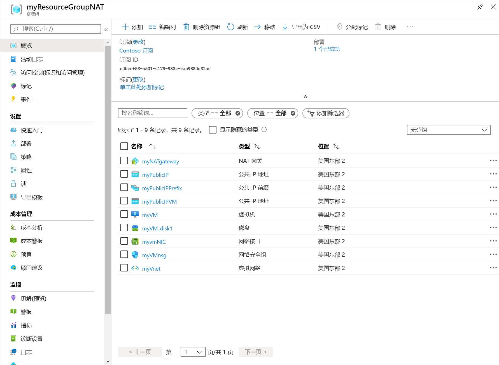

# <a name="quickstart-create-a-nat-gateway---resource-manager-template"></a>快速入门：创建 NAT 网关 - 资源管理器模板

通过 Azure 资源管理器模板完成虚拟网络 NAT 入门。  此模板部署虚拟网络、NAT 网关和 Ubuntu 虚拟机。 Ubuntu 虚拟机部署到与 NAT 网关关联的子网。

>[!NOTE] 
>Azure 虚拟网络 NAT 目前以公共预览版提供，仅在有限的几个[区域](https://azure.microsoft.com/global-infrastructure/regions/)中可用。 此预览版在提供时没有附带服务级别协议，不建议用于生产工作负载。 某些功能可能不受支持或者受限。 有关详细信息，请参阅 [Microsoft Azure 预览版补充使用条款](https://azure.microsoft.com/support/legal/preview-supplemental-terms)。

[!INCLUDE [About Azure Resource Manager](../../includes/resource-manager-quickstart-introduction.md)]

如果没有 Azure 订阅，请在开始之前创建一个[免费帐户](https://azure.microsoft.com/free/?WT.mc_id=A261C142F)。

## <a name="create-a-nat-gateway-and-supporting-resources"></a>创建 NAT 网关和支持资源

此模板配置为创建 

* 虚拟网络 
* NAT 网关资源
* Ubuntu 虚拟机

Ubuntu VM 部署到与 NAT 网关资源关联的子网。

### <a name="review-the-template"></a>查看模板

本快速入门中使用的模板来自 [Azure 快速入门模板](https://raw.githubusercontent.com/Azure/azure-quickstart-templates/master/101-nat-gateway-1-vm/azuredeploy.json)

:::code language="json" source="~/quickstart-templates/101-nat-gateway-1-vm/azuredeploy.json" range="1-335" highlight="256-282":::

该模板中定义了九个 Azure 资源：

**Microsoft.Network**

* **[Microsoft.Network/natGateways](https://docs.microsoft.com/azure/templates/microsoft.network/natgateways)** ：创建 NAT 网关资源。

* **[Microsoft.Network/networkSecurityGroups](https://docs.microsoft.com/azure/templates/microsoft.network/networksecuritygroups)** ：创建网络安全组。

    * **[Microsoft.Network/networkSecurityGroups/securityRules](https://docs.microsoft.com/azure/templates/microsoft.network/networksecuritygroups/securityrules)** ：创建安全规则。

* **[Microsoft.Network/publicIPAddresses](https://docs.microsoft.com/azure/templates/microsoft.network/publicipaddresses)** ：创建公共 IP 地址。

* **[Microsoft.Network/publicIPPrefixes](https://docs.microsoft.com/azure/templates/microsoft.network/publicipprefixes)** ：创建公共 IP 前缀。

* **[Microsoft.Network/virtualNetworks](https://docs.microsoft.com/azure/templates/microsoft.network/virtualnetworks)** ：创建虚拟网络。

    * **[Microsoft.Network/virtualNetworks/subnets](https://docs.microsoft.com/azure/templates/microsoft.network/virtualnetworks/subnets)** ：创建虚拟网络子网。

* **[Microsoft.Network/networkinterfaces](https://docs.microsoft.com/azure/templates/microsoft.network/networkinterfaces)** ：创建网络接口。

**Microsoft.Compute**

* **[Microsoft.Compute/virtualMachines](https://docs.microsoft.com/azure/templates/Microsoft.Compute/virtualMachines)** ：创建虚拟机。

### <a name="deploy-the-template"></a>部署模板

**Azure CLI**

```azurecli-interactive
read -p "Enter the location (i.e. westcentralus): " location
resourceGroupName="myResourceGroupNAT"
templateUri="https://raw.githubusercontent.com/Azure/azure-quickstart-templates/master/101-nat-gateway-1-vm/azuredeploy.json" 

az group create \
--name $resourceGroupName \
--location $location

az group deployment create \
--resource-group $resourceGroupName \
--template-uri  $templateUri
```

**Azure PowerShell**

```azurepowershell-interactive
$location = Read-Host -Prompt "Enter the location (i.e. westcentralus)"
$templateUri = "https://raw.githubusercontent.com/Azure/azure-quickstart-templates/master/101-nat-gateway-1-vm/azuredeploy.json"

$resourceGroupName = "myResourceGroupNAT"

New-AzResourceGroup -Name $resourceGroupName -Location $location
New-AzResourceGroupDeployment -ResourceGroupName $resourceGroupName -TemplateUri $templateUri
```

**Azure 门户**

[](https://portal.azure.com/#create/Microsoft.Template/uri/https%3A%2F%2Fraw.githubusercontent.com%2FAzure%2Fazure-quickstart-templates%2Fmaster%2F101-nat-gateway-1-vm%2Fazuredeploy.json)

## <a name="review-deployed-resources"></a>查看已部署的资源

1. 登录 [Azure 门户](https://portal.azure.com)。

2. 从左侧窗格中选择“资源组”  。

3. 选择你在上一部分中创建的资源组。 默认资源组名称是 **myResourceGroupNAT**

4. 验证是否在资源组中创建了以下资源：

    

## <a name="clean-up-resources"></a>清理资源

**Azure CLI**

如果不再需要上述资源组及其包含的所有资源，可以使用 [az group delete](/cli/azure/group#az-group-delete) 命令将其删除。

```azurecli-interactive 
  az group delete \
    --name myResourceGroupNAT
```

**Azure PowerShell**

如果不再需要上述资源组及其包含的所有资源，可以使用 [Remove-AzResourceGroup](https://docs.microsoft.com/powershell/module/az.resources/remove-azresourcegroup?view=latest) 命令将其删除。

```azurepowershell-interactive 
Remove-AzResourceGroup -Name myResourceGroupNAT
```

**Azure 门户**

如果不再需要上述资源组、NAT 网关和所有相关资源，请将其删除。 选择包含 NAT 网关的资源组 **myResourceGroupNAT**，然后选择“删除”。 

## <a name="next-steps"></a>后续步骤

在本快速入门中，我们创建了：

* NAT 网关资源
* 虚拟网络
* Ubuntu 虚拟机

虚拟机部署到与 NAT 网关关联的虚拟网络子网。 

若要详细了解虚拟网络 NAT 和 Azure 资源管理器，请继续阅读以下文章。

* 阅读[虚拟网络 NAT 概述](nat-overview.md)
* 了解 [NAT 网关资源](nat-gateway-resource.md)
* 了解有关 [Azure 资源管理器](../azure-resource-manager/management/overview.md)的详细信息
