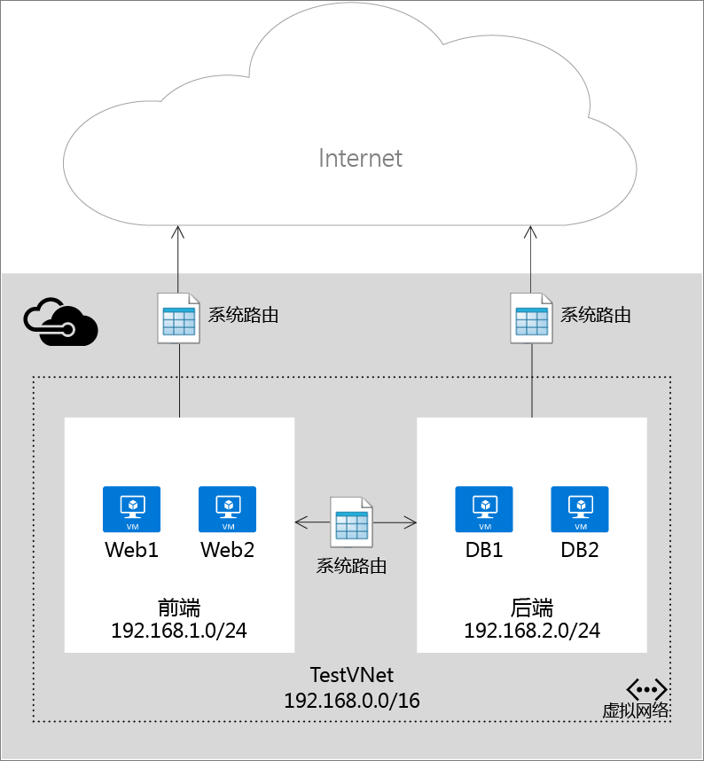
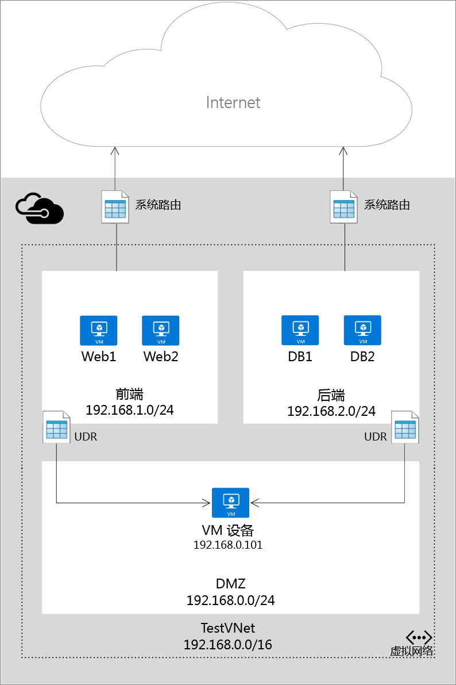

# 用户定义的路由和 IP 转发

当将虚拟机 (Vm) 添加到 Azure 中的虚拟网络 (VNet) 中时，你会注意到，Vm 能够相互通信通过网络自动。 你不需要指定网关，即使这些 Vm 位于不同子网。 同样适用于从 Vm 到公共 Internet，通信并且甚至到本地网络时从 Azure 到自己的数据中心的混合连接不存在。

此流是通信的可能的因为 Azure 使用一系列系统路由来定义 IP 流量的流动方式。 系统路由来控制在以下情况中的通信流：

* 从在同一子网内。
* 从到另一个 VNet 中的子网。
* 从 Vm 到 Internet。
* 从通过 VPN 网关的另一个 VNet 到 VNet。
* 从通过 VNet 对等互连 （服务链接） 的另一个 VNet 到 VNet。
* 从 VNet 到本地网络通过 VPN 网关。

下图显示使用 VNet、 两个子网和数个 Vm，以及允许 IP 通信流动的系统路由简单安装。

尽管使用系统路由促进自动为你的部署的流量，有一些情况下想要控制通过虚拟设备路由数据包。 你可以创建用户定义的路由来指定方便数据包流向特定的子网并转到你的虚拟设备，并启用作为虚拟设备运行的 vm 的 IP 转发的下一个跃点。

下图显示了一种用户定义的路由和 IP 转发，以强制数据包发送到一个子网从另一个第三个子网上转通过虚拟设备。

> [!IMPORTANT]
> 用户定义的路由将应用到子网中任何资源 （例如附加到 Vm 的网络接口） 从离开子网的流量。 无法创建路由，以便指定如何流量进入子网从 Internet 中，例如。 你会将通信转发到该设备不能在同一子网流量的来源位置。 始终创建单独的子网用于你的设备。 
> 
> 

## 路由资源
基于物理网络上的每个节点上定义的路由表的 TCP/IP 网络路由数据包。 路由表是用于决定在何处转发数据包基于目标 IP 地址的各个路由的集合。 路由由以下内容组成：

| 属性 | 描述 | 约束 | 注意事项 |
| --- | --- | --- | --- |
| 地址前缀 |目标向其路由应用 CIDR，例如 10.1.0.0/16。 |必须有效的 CIDR 范围表示公共 Internet、 Azure 虚拟网络或在本地数据中心上的地址。 |请确保**地址前缀**不包含的地址**下一跃点地址**，否则你数据包将输入从源转到下一个跃点而无需到达目标的循环中。 |
| 下一跃点类型 |数据包应发送到的 Azure 跃点类型。 |必须是以下值之一：   **虚拟网络**。 表示本地虚拟网络。 例如，如果在相同虚拟网络中有两个子网、 10.1.0.0/16 和 10.2.0.0/16，路由表中每个子网的路由将具有的下一个跃点值*虚拟网络*。   **虚拟网络网关**。 表示 Azure S2S VPN 网关。   **Internet**。 表示通过 Azure 基础结构提供的默认 Internet 网关。   **虚拟设备**。 表示虚拟设备添加到 Azure 虚拟网络。   **无**。 表示黑洞。 转发至黑洞的数据包将不会在所有转发。 |请考虑使用**虚拟设备**若要将流量定向到 VM 或 Azure 负载平衡器的内部 IP 地址。  此类允许的 IP 地址，如下所述的规范。 请考虑使用**无**要停止从流向指定的目标的数据包类型。 |
| 下一个跃点地址 |下一个跃点地址包含应将数据包转发到的 IP 地址。 下一跃点值只允许在下一个跃点类型所在的路由*虚拟设备*。 |必须是用户定义的路由应用，而无需通过虚拟网络中可访问的 IP 地址**虚拟网络网关**。 IP 地址必须是应用其中，在同一虚拟网络上或 peered 虚拟网络上。 |如果 IP 地址代表虚拟机，请确保启用[IP 转发](#IP-forwarding)Azure vm 中。 如果 IP 地址代表 Azure 负载平衡器的内部 IP 地址，请确保你有匹配的负载平衡规则的每个端口你想要进行负载平衡。|

在 Azure PowerShell 中某些"NextHopType"值具有不同的名称：

* 虚拟网络是 VnetLocal
* 虚拟网络网关是 VirtualNetworkGateway
* 虚拟设备是 VirtualAppliance
* Internet 是 Internet
* 无为 None

### 系统路由
创建的虚拟网络中每个子网都会自动与其中包含以下系统路由规则的路由表关联：

* **本地 Vnet 规则**： 此规则将自动创建的虚拟网络中每个子网。 它指定在 VNet 中 Vm 之间存在直接链接并且没有任何中间的下一个跃点。
* **本地规则**： 此规则适用于要发送到本地地址范围的所有流量，并使用 VPN 网关作为下一跃点目标。
* **Internet 规则**： 此规则句柄的所有流量要发送到公共 Internet (地址前缀 0.0.0.0/0)，并使用基础结构 internet 网关作为下一个跃点的所有流量发送到 Internet。

### 用户定义的路由
对于大多数环境将仅需要已由 Azure 定义的系统路由。 但是，你可能需要创建路由表并在特定情况下，添加一个或多个路由，例如：

* 强制隧道方式连接到你的本地网络通过 Internet。
* 使用 Azure 环境中的虚拟设备。

在上面的方案中，你将需要创建路由表并向其中添加用户定义的路由。 你可以有多个路由表，并可与一个或多个子网相关联的相同的路由表。 并且每个子网只能与一个路由表相关联。 所有 Vm 和云服务在子网使用路由表都关联到该子网。

路由表关联到子网之前，子网依赖于系统路由。 建立关联以后，路由可基于在最长前缀匹配 (LPM) 在用户定义的路由和系统路由之间。 如果有多个路由的 LPM 匹配情况相同路由被选择基于其源按以下顺序：

1. 用户定义的路由
2. BGP 路由 （当使用 ExpressRoute 时）
3. 系统路由

若要了解如何创建用户定义路由，请参阅[如何创建路由和在 Azure 中启用 IP 转发](virtual-network-create-udr-arm-template.md)。

> [!IMPORTANT]
> 用户定义路由仅适用于 Azure Vm 和云服务。 例如，如果你想要添加防火墙虚拟设备的本地网络与 Azure 之间，你将必须创建 Azure 路由表，转到虚拟设备的本地地址空间的全部流量都转发的用户定义路由。 你还可以向 GatewaySubnet 以将所有流量从本地到 Azure 通过虚拟设备添加用户定义路由 (UDR)。 这是最近添加。
> 
> 

### BGP 路由
如果你有你的本地网络与 Azure 之间存在 ExpressRoute 连接，可以通过 BGP 将路由从你的本地网络传播到 Azure。 这些 BGP 路由的使用方式与系统路由和每个 Azure 子网中的用户定义路由相同。 有关详细信息请参阅[ExpressRoute 简介](../expressroute/expressroute-introduction.md)。

> [!IMPORTANT]
> 你可以配置 Azure 环境以使用强制隧道通过你的本地网络通过创建使用 VPN 网关作为下一个跃点的子网 0.0.0.0/0 一个用户定义的路由。 但是，这仅适用如果正在使用 VPN 网关，不 ExpressRoute。 对于 ExpressRoute，强制隧道是通过 BGP 配置的。
> 
> 

## IP 转发
与如下所述，一个主要原因创建用户定义的路由是将流量转发到虚拟设备。 虚拟设备是没有什么比的 VM 上运行的应用程序用于处理以某种方式，如防火墙或 NAT 设备的网络流量。

此虚拟设备 VM 必须能够接收不发送给自身的传入流量。 若要允许 VM 接收发送到其他目标的流量，你必须启用 IP 转发 vm。 这是 Azure 设置，不是在来宾操作系统中的设置。

## 后续步骤
* 了解如何[在资源管理器部署模型中创建路由](virtual-network-create-udr-arm-template.md)并将其关联到子网。 
* 了解如何[在经典部署模型中创建路由](virtual-network-create-udr-classic-ps.md)并将其关联到子网。

