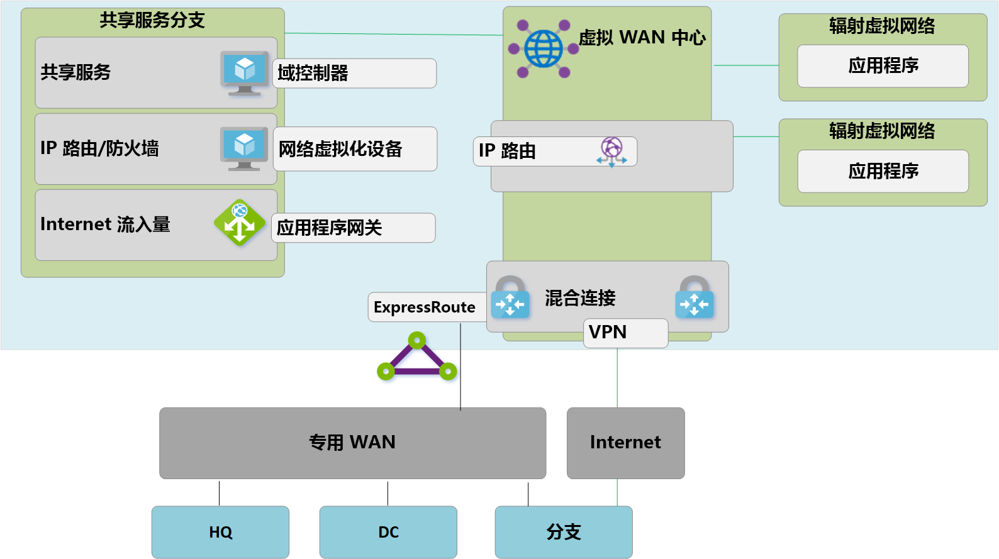
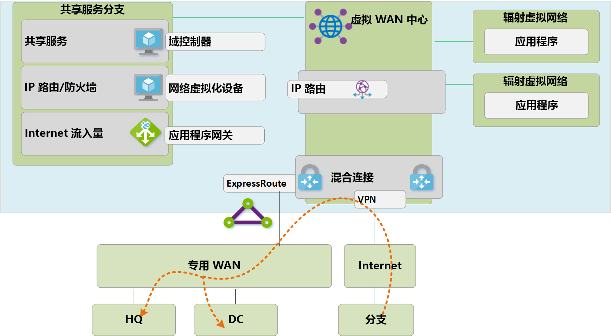
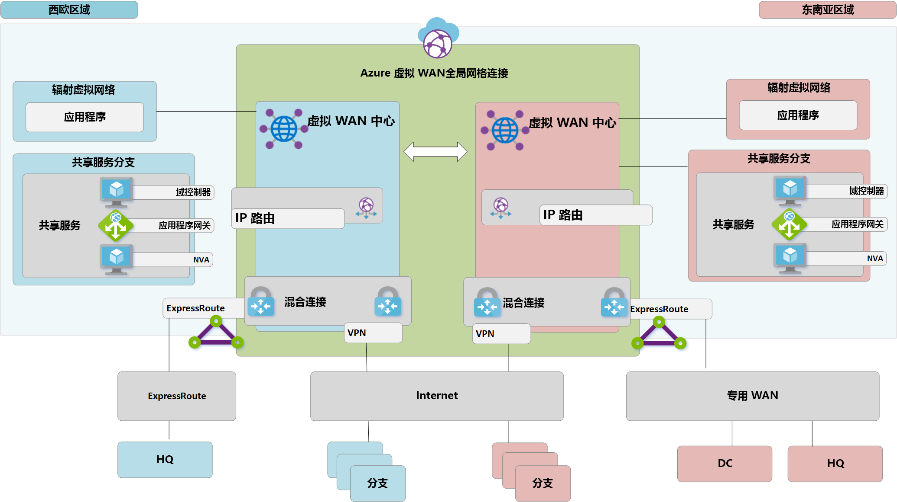
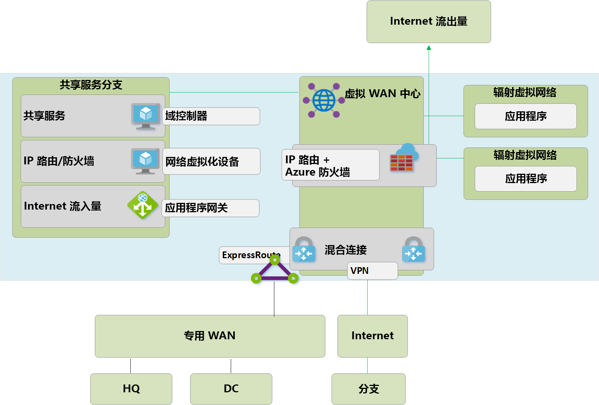

# 迁移到 Azure 虚拟 WAN
Azure 虚拟 WAN 使公司能够简化其全球连接并从大规模的 Microsoft 全球网络中获益。 本白皮书面向相关公司（这些公司希望从现有的客户托管中心辐射型拓扑迁移到利用 Microsoft 托管虚拟 WAN 中心的设计）提供了技术细节。

[全球传输网络体系结构和虚拟 WAN](virtual-wan-global-transit-network-architecture.md) 一文重点介绍了 Azure 虚拟 WAN 为采用云中心新式企业级全球网络的企业所带来的好处。

**图 1：Azure 虚拟 WAN**

数千客户已采用 Azure 虚拟数据中心 (VDC) 中心辐射连接模型，以利用 Azure 网络的默认传递路由行为来构建简单且可缩放的云网络。 Azure 虚拟 WAN 基于这些概念，并引入了新功能，新功能不仅允许本地位置和 Azure 之间的全球连接拓扑，还允许客户利用大规模的 Microsoft 网络来扩展其现有的全球网络。

本文介绍如何将现有的混合环境迁移到虚拟 WAN。

## 场景

Contoso 是一家全球金融组织，在欧洲和亚洲均设有办事处。 他们计划将其现有的应用程序从本地域控制器迁移到 Azure，并基于 VDC 体系结构建立了基础设计，其中包括用于混合连接的区域客户托管中心虚拟网络。 在迁移到基于云的技术的过程中，网络团队的任务是确保针对不断发展的业务优化其连接。

图 2 显示现有全球网络的高级视图，其中包括与多个 Azure 区域的连接。

**图 2：Contoso 现有网络拓扑**

从现有网络拓扑中可了解以下几点：
 
- 多个区域使用中心辐射模型。 利用 ExpressRoute 高级线路回连公共专用 WAN。
- 其中一些站点还将 VPN 隧道与 Azure 直接连接，以访问 Microsoft 云中托管的应用程序。

## 要求
网络团队的任务是提供一个全球网络模型，该模型可以支持 Contoso 向云的迁移，且必须在成本、规模和性能方面进行优化。 总而言之，需要满足以下要求：
- 为总部 (HQ) 和分支机构提供云托管应用程序的优化路径。 
- 消除 VPN 终端对现有本地域控制器 (DC) 的依赖，同时保留以下连接路径：
    - **分支 -> VNet**：连接 VPN 的办事处必须能够访问本地 Azure 区域中迁移到云的应用程序。
    - **分支 -> 中心 -> 中心 -> VNet**：连接 VPN 的办事处必须能够访问远程 Azure 区域中迁移到云的应用程序。 
    - **分支 -> 分支**：连接区域 VPN 的办事处必须能够相互通信，且能够与连接 ExpressRoute 的 HQ/DC 站点通信。 
    - **分支 -> 中心 -> 中心 -> 分支**：连接全球分布 VPN 的办事处必须能够相互通信，且能够与任何连接 ExpressRoute 的 HQ/DC 站点通信。
    - **分支 -> Internet**：连接的站点必须能够与 Internet 通信，且必须筛选和记录此流量。
    - **VNet -> VNet**：同一区域中的辐射虚拟网络必须能够相互通信。
    - **VNet -> 中心 -> 中心 -> VNet**：不同区域中的辐射虚拟网络必须能够相互通信。
- 使 Contoso 漫游用户（笔记本电脑和手机）无需连接公司网络即可访问公司资源。

## Azure 虚拟 WAN 体系结构

图 3 显示更新后的目标拓扑的高级视图，该拓扑使用 Azure 虚拟 WAN 来满足上一节中所述的要求。

**图 3：Azure 虚拟 WAN 体系结构**

综上所述： 
- 欧洲 HQ 仍连接 ExpressRoute，而欧洲本地 DC 已完全迁移到 Azure，现已停用。
- 亚洲 DC 和 HQ 仍连接专用 WAN。 Azure 虚拟 WAN 现用于扩展本地运营商网络并提供全球连接 
- 西欧和东南亚 Azure 区域均部署了 Azure 虚拟 WAN 中心，以便为连接 ExpressRoute 和 VPN 的设备提供连接中心。 
- 中心还使用全球网格网络的 OpenVPN 连接，提供了面向多种客户端类型漫游用户的 VPN，不仅允许访问迁移到 Azure 的应用程序，还允许访问未迁移的任何本地资源。 
- Azure 虚拟 WAN 提供的虚拟网络中的资源的 Internet 连接。 Azure 虚拟 WAN 提供的远程站点的 Internet 连接。 通过合作伙伴集成支持的本地 Internet 中断，用于优化对 Office 365 等 SaaS 服务的访问。

## 迁移到 Azure 虚拟 WAN

本节介绍迁移到 Azure 虚拟 WAN 的各个步骤。
 
### VDC 中心辐射型单区域

下图显示 Azure 虚拟 WAN 推出之前 Contoso 的单区域拓扑。

 **图 4：VDC 中心辐射型单区域 - 步骤 1**

与虚拟数据中心 (VDC) 方法相同，客户托管的中心虚拟网络包含几个功能块：
- 共享服务（多个辐射网络所需的任何常见功能），Contoso 使用的示例是基础结构即服务 (IaaS) 虚拟机上的 IaaS Windows 服务器域控制器。
- IP/路由防火墙服务由第三方网络虚拟设备提供，可实现辐射网络到辐射网络的第 3 层 IP 路由。 
- Internet 入口/出口服务，其中包括用于入站 HTTPS 请求的 Azure 应用程序网关，以及在虚拟机上运行且用于已筛选的 Internet 资源出站访问的第三方代理服务。
- ExpressRoute 和 VPN 虚拟网络网关，用于连接到本地网络。

### 部署虚拟 WAN 中心

第一步是在每个区域部署虚拟 WAN 中心。 按以下文章所述，使用 VPN 网关和 ExpressRoute 网关部署虚拟 WAN 中心： 
- [教程：使用 Azure 虚拟 WAN 创建站点到站点连接](virtual-wan-site-to-site-portal.md)
- [教程：使用 Azure 虚拟 WAN 创建 ExpressRoute 关联](virtual-wan-expressroute-portal.md) 

> [!NOTE]
> 要启用本文所述的某些流量路径，Azure 虚拟 WAN 必须使用标准 SKU。

**图 5：从 VDC 中心辐射型拓扑迁移到虚拟 WAN - 步骤 2**

### 将远程站点（ExpressRoute 和 VPN）连接到虚拟 WAN

现在，将虚拟 WAN 中心连接到公司 ExpressRoute 线路，并通过 Internet 在任何远程分支上设置站点到站点 VPN。

> [!NOTE]
> ExpressRoute 线路必须升级为高级 SKU 类型，以便连接到虚拟 WAN 中心。

**图 6：从 VDC 中心辐射型拓扑迁移到虚拟 WAN - 步骤 3**

此时，本地网络设备将开始接收路由，这些路由表明分配给虚拟 WAN 托管中心 VNet 的 IP 地址空间。 在此阶段，连接 VPN 的远程分支将在辐射虚拟网络中显示两条指向任何现有应用程序的路径。 这些设备应配置为继续使用指向 VDC 中心的隧道，以确保转换阶段的对称路由。

### 通过虚拟 WAN 测试混合连接

利用托管的虚拟 WAN 中心进行生产连接之前，建议测试辐射虚拟网络和虚拟 WAN VNet 连接。 继续执行后续步骤之前，通过 ExpressRoute 和站点到站点 VPN 验证此测试环境的连接是否正常工作。

**图 7：从 VDC 中心辐射型拓扑迁移到虚拟 WAN - 步骤 4**

### 将连接转换到虚拟 WAN 中心

**图 8：从 VDC 中心辐射型拓扑迁移到虚拟 WAN - 步骤 5**

**a**. 删除辐射虚拟网络到旧 VDC 中心的现有对等连接。 步骤 a-c 完成之前，无法访问辐射虚拟网络中的应用程序。

**b**. 通过 VNet 连接将辐射虚拟网络连接到虚拟 WAN 中心。

**c**. 删除之前在辐射虚拟网络中使用的用于辐射网络到辐射网络通信的任何用户定义路由 (UDR)。 虚拟 WAN 中心内提供的动态路由现已启用此路径。

**d**. VDC 中心内的现有 ExpressRoute 和 VPN 网关现已停用，以便执行步骤 5。

**e**. 通过新的 VNet 连接将旧 VDC 中心（中心虚拟网络）连接到虚拟 WAN 中心。

### 旧中心成为共享服务辐射网络

现已重新设计了 Azure 网络，使虚拟 WAN 中心成为了新拓扑的中心点。

**图片 9：从 VDC 中心辐射型拓扑迁移到虚拟 WAN - 步骤 6**

由于虚拟 WAN 中心是托管实体，且不允许部署虚拟机之类的自定义资源，因此共享服务功能块现以辐射虚拟网络形式存在，该网络通过 Azure 应用程序网关或网络虚拟设备托管 Internet 入口等功能。 现在，共享服务环境与后端虚拟机之间的流量在虚拟 WAN 托管的中心内传输。

### 优化本地连接以充分利用虚拟 WAN

在此阶段，Contoso 基本已将业务应用程序迁移到 Microsoft 云，仅少量旧版应用程序保留在本地 DC。

**图 10：从 VDC 中心辐射型拓扑迁移到虚拟 WAN - 步骤 7**

 为利用 Azure 虚拟 WAN 的全部功能，Contoso 决定停用其旧的本地 VPN 连接。 继续访问 HQ 或 DC 网络的任何分支都能够使用 Azure 虚拟 WAN 的内置传输路由在 Microsoft 全球网络中传输。 对于希望利用 Microsoft 主干网来补全其现有专用 WAN 的客户，ExpressRoute Global Reach 是替代选项。

## 最终状态体系结构和流量路径

**图 11：双区域虚拟 WAN**

本节通过介绍一些示例流量来概述此拓扑如何满足初始要求。

### 路径 1

路径 1 描述了从亚洲 S2S VPN 分支到东南亚区域 Azure VNet 的流量流。

流量按如下方式路由：
- 亚洲分支通过启用了可复原 S2S BGP 的隧道连接到东南亚虚拟 WAN 中心。
- 亚洲虚拟 WAN 中心将流量本地路由到连接的 VNet。

### 路径 2
路径 2 描述了从连接 ExpressRoute 的欧洲 HQ 到东南亚区域 Azure VNet 的流量流。

流量按如下方式路由：
- 欧洲 HQ 通过标准 ExpressRoute 线路连接到西欧虚拟 WAN 中心。
- 虚拟 WAN 中心到中心全球连接确保流量能够无缝传输到远程区域中连接的 VNet。

### 路径 3
路径 3 描述了从连接到专用 WAN 的亚洲本地 DC 到连接欧洲 S2S 的分支的流量流。

流量按如下方式路由：
- 亚洲 DC 连接到本地专用 WAN 运营商。
- 专用 WAN 中的 ExpressRoute 线路本地终端连接到东南亚虚拟 WAN 中心。
- 虚拟 WAN 中心到中心全球连接确保连接到欧洲远程中心的流量分支能够无缝传输。

### 路径 4
路径 4 描述了从东南亚区域 Azure VNet 到西欧区域 Azure VNet 的流量流。

流量按如下方式路由：
- 虚拟 WAN 中心到中心全球连接确保无需进一步的用户配置即可本地传输所有连接的 Azure VNet。

### 路径 5
路径 5 描述了从漫游 VPN (P2S) 用户到西欧区域 Azure VNet 的流量流。

流量按如下方式路由：
- 笔记本电脑和手机用户利用 OpenVPN 客户端实现与西欧 P2S VPN 网关的透明连接。
- 西欧虚拟 WAN 中心将流量本地路由到连接的 VNet。

## 通过 Azure 防火墙的安全和策略控制

Contoso 现已按照本文档前面部分讨论的要求验证了所有分支与 VNet 之间的连接。 为满足对安全控制和网络隔离的要求，他们需要继续通过中心网络来分离和记录流量，而之前此功能是由 NVA 执行的。 Contoso 还希望停用其现有代理服务，并使用本机 Azure 服务进行出站 Internet 筛选。 

**图 12：虚拟 WAN（安全虚拟中心）中的 Azure 防火墙**

将 Azure 防火墙引入虚拟 WAN 中心以启用统一的策略控制点需要执行以下高级步骤。 [此处](https://go.microsoft.com/fwlink/?linkid=2107683)详细说明了此过程以及安全虚拟中心的概念。
- 创建 Azure 防火墙策略。
- 将防火墙策略链接到 Azure 虚拟 WAN 中心。
上述步骤允许现有的虚拟 WAN 中心充当安全虚拟中心，并部署所需的 Azure 防火墙资源。

> [!NOTE]
> 如果 Azure 防火墙部署在标准虚拟 WAN 中心（SKU：标准）：仅对源自连接到部署有 Azure FW 的特定中心（安全中心）的 VNet 和分支的流量执行 V2V、B2V、V2I 和 B2I FW 策略。 即使远程分支和 VNet 通过虚拟 WAN 中心到中心链接进行互连，也不会对源自附加到同一虚拟 WAN 中其他虚拟 WAN 中心的远程 VNet 和分支的流量进行“防火墙处理”。 Azure 虚拟 WAN 和防火墙管理器未来将支持跨中心防火墙处理。

以下路径描述了通过利用 Azure 安全虚拟中心启用的连接路径。

### 路径 6
路径 6 描述了同一区域内 VNet 到 VNet 安全传输的流量流。

流量按如下方式路由：
- 连接到同一安全虚拟中心的虚拟网络现通过 Azure 防火墙路由流量。
- Azure 防火墙可将策略应用这些流量流。

### 路径 7
路径 7 描述了 VNet 到 Internet 或第三方安全服务的流量流。

流量按如下方式路由：
- 连接到安全虚拟中心的虚拟网络使用安全中心作为 Internet 访问的中心点，可以将流量发送到 Internet 上的公共目标位置。
- 可以使用 Azure 防火墙 FQDN 规则本地筛选此流量，也可以将其发送到第三方安全服务进行检查。

### 路径 8
路径 8 描述了分支到 Internet 或第三方安全服务的流量流。

流量按如下方式路由：
- 连接到安全虚拟中心的分支使用安全中心作为 Internet 访问的中心点，可以将流量发送到 Internet 上的公共目标位置。
- 可以使用 Azure 防火墙 FQDN 规则本地筛选此流量，也可以将其发送到第三方安全服务进行检查。

 

## 后续步骤
详细了解 [Azure 虚拟 WAN](virtual-wan-about.md)
