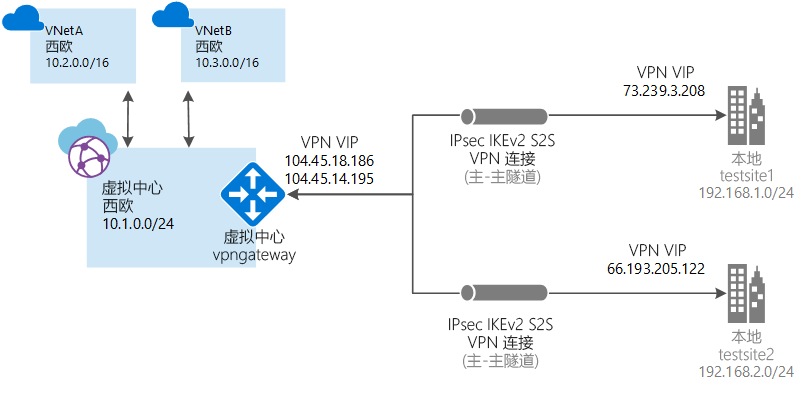

# 什么是 Azure 虚拟 WAN？ （预览版）

Azure Virtual WAN 是一种网络服务，它通过 Azure 提供经优化、自动的分支到分支连接。 使用虚拟 WAN 可以连接分支设备，并将其配置为与 Azure 通信。 可以手动完成此操作，也可以通过虚拟 WAN 合作伙伴使用首选的提供商设备完成此操作。 使用首选的提供商设备可以降低操作难度、简化连接和进行配置管理。 Azure WAN 的内置仪表板提供即时故障排除见解，可帮助你节省时间，以及方便查看大规模的站点到站点连接。

> [!IMPORTANT]
> Azure 虚拟 WAN 目前以托管的公共预览版提供。 若要使用虚拟 WAN，必须[在预览版中注册](#enroll)。
>
> 此公共预览版在提供时没有附带服务级别协议，不应该用于生产工作负荷。 某些功能可能不受支持或受到约束，或者不一定在所有 Azure 位置都可用。 有关详细信息，请参阅 [Microsoft Azure 预览版补充使用条款](https://azure.microsoft.com/support/legal/preview-supplemental-terms/)。

本文提供 Azure 和非 Azure 工作负荷网络连接的快速视图。 虚拟 WAN 提供以下优势：

* **中心辐射型的集成式连接解决方案：** 在本地站点与各种源（包括虚拟 WAN 合作伙伴解决方案）中的 Azure 中心之间自动建立站点到站点配置和连接。
* **自动化的分支设置和配置：** 将虚拟网络和工作负荷无缝连接到 Azure 中心。
* **直观的故障排除：** 可以查看 Azure 中的端到端流，并使用此信息来执行所需的操作。

## 与虚拟 WAN 合作伙伴合作

1. 分支设备 (VPN/SDWAN) 控制器经过身份验证后，使用 Azure 服务主体将站点导向型信息导出到 Azure。
2. 分支设备 (VPN/SDWAN) 控制器获取 Azure 连接配置并更新本地设备。 这样可以自动完成配置下载，以及本地 VPN 设备的编辑和更新。
3. 设备获得正确的 Azure 配置后，将与 Azure WAN 建立站点到站点连接（两个活动隧道）。 Azure 要求分支 (VPN/SDWAN) 控制器支持 IKEv2。 BGP 是可选的。

## 虚拟 WAN 资源

若要配置端到端虚拟 WAN，请创建以下资源：

* **virtualWAN：** virtualWAN 资源表示 Azure 网络的一个虚拟叠加层，是多个资源的集合。 它包含要部署到虚拟 WAN 中的所有虚拟中心的链接。 虚拟 WAN 资源相互隔离，不能包含公用中心。 跨虚拟 WAN 的虚拟中心不会相互通信。

* **站点：** 称作 vpnsite 的站点资源表示本地 VPN 设备及其设置。 可以通过与虚拟 WAN 合作伙伴合作，使用一个内置的解决方案自动将此信息导出到 Azure。

* **中心：** 虚拟中心是 Microsoft 托管的虚拟网络。 中心包含不同的服务终结点，可从本地网络 (vpnsite) 建立连接。 中心是区域中网络的核心。 每个 Azure 区域只能有一个中心。 使用 Azure 门户创建中心时，会自动创建虚拟中心 VNet 和虚拟中心 vpngateway。

  中心网关与用于 ExpressRoute 和 VPN 网关的虚拟网络网关不同。 例如，使用虚拟 WAN 时，不要直接从本地站点来与 VNet 建立站点到站点连接， 而应该与中心建立站点到站点连接。 流量始终通过中心网关。 这意味着，VNet 不需要自身的虚拟网络网关。 虚拟 WAN 可让 VNet 通过虚拟中心和虚拟中心网关轻松利用缩放功能。 

* **中心虚拟网络连接：** 中心虚拟网络连接资源用于将中心无缝连接到虚拟网络。 目前，只能连接到同一中心区域内的虚拟网络。

##在预览版中注册

在配置虚拟 WAN 之前，必须先在预览版中注册订阅。 否则无法在门户中使用虚拟 WAN。 若要注册，请向 <azurevirtualwan@microsoft.com> 发送一封包含订阅 ID 的电子邮件。 注册订阅后，你会收到电子邮件。

## 常见问题解答

[!INCLUDE [Virtual WAN FAQ](../../includes/virtual-wan-faq-include.md)]

## 预览版反馈

如能提供反馈，我们将不胜感激。 请向 <azurevirtualwan@microsoft.com> 发送电子邮件以报告问题，或提供有关虚拟 WAN 的反馈（正面或负面）。 请在主题行中添加你的公司名称（用“[ ]”括起来）。 若要报告问题，还请添加订阅 ID。

## 后续步骤

若要使用虚拟 WAN 创建站点到站点连接，可以咨询[虚拟 WAN 合作伙伴](https://aka.ms/virtualwan)，或手动创建连接。 若要手动创建连接，请参阅[使用虚拟 WAN 创建站点到站点连接](virtual-wan-site-to-site-portal.md)。