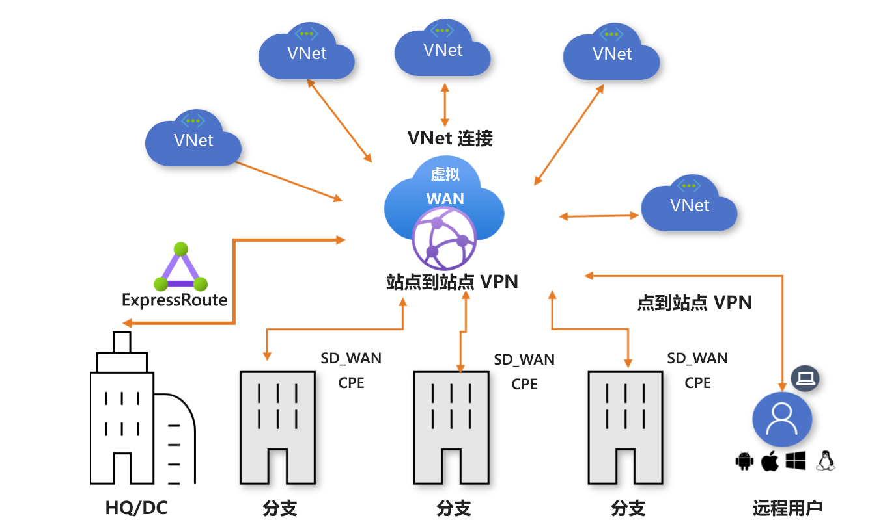

# 关于 Azure 虚拟 WAN

Azure 虚拟 WAN 是一个网络服务，其中整合了多种网络、安全和路由功能，提供单一操作界面。 这些功能包括分支连接（通过 SD-WAN 或 VPN CPE 等虚拟 WAN 合作伙伴设备的连接自动化）、站点到站点 VPN 连接、远程用户 VPN（点到站点）连接、专用 (ExpressRoute) 连接、云内部连接（虚拟网络的可中转连接）、VPN ExpressRoute 互连、路由、Azure 防火墙、专用连接加密。 无需所有这些用例即可开始使用虚拟 WAN。 可从一个用例开始，并随着情况变化对网络进行调整。

虚拟 WAN 体系结构是一种内置了规模和性能的中心辐射型体系结构，适用于分支（VPN/SD-WAN 设备）、用户（Azure VPN/OpenVPN/IKEv2 客户端）、ExpressRoute 线路和虚拟网络。 它支持[全球传输网络体系结构](virtual-wan-global-transit-network-architecture.md)，其中的云托管网络“中心”支持可能分布在不同“辐射”类型上的终结点之间的传输连接。

Azure 区域充当可供连接的中心。 所有中心均在标准虚拟 WAN 中以完整网格的形式进行连接，使得用户能够轻松地使用 Microsoft 主干进行任意分支到任意分支的连接。 对于包含 SD-WAN/VPN 设备的辐射连接，用户可以在 Azure 虚拟 WAN 中手动设置该连接，或者使用虚拟 WAN CPE (SD-WAN/VPN) 合作伙伴解决方案来设置与 Azure 的连接。 我们提供了一个列表，其中的合作伙伴支持使用 Azure 虚拟 WAN 实现连接自动化（能够将设备信息导出到 Azure、下载 Azure 配置和建立连接）。 有关详细信息，请参阅[虚拟 WAN 合作伙伴和位置](virtual-wan-locations-partners.md)一文。

本文提供 Azure 虚拟 WAN 中网络连接的快速视图。 虚拟 WAN 提供以下优势：

* 中心和辐射中的集成式连接解决方案：在本地站点与 Azure 中心之间自动建立站点到站点配置和连接。
* 自动化的辐射设置和配置：将虚拟网络和工作负载无缝连接到 Azure 中心。
* 直观的疑难解答：可以查看 Azure 中的端到端流，并使用此信息来执行所需的操作。

## 基本和标准虚拟 WAN

虚拟 WAN 分为两种类型：“基本”和“标准”。 下表显示了每种类型的可用配置。

[!INCLUDE [Basic and Standard SKUs](../../includes/virtual-wan-standard-basic-include.md)]

有关升级虚拟 WAN 的步骤，请参阅[从基本虚拟 WAN 升级到标准虚拟 WAN](upgrade-virtual-wan.md)。

## 体系结构

有关虚拟 WAN 体系结构以及如何迁移到虚拟 WAN 的信息，请参阅以下文章：

* [虚拟 WAN 体系结构](migrate-from-hub-spoke-topology.md)
* [全局传输网络体系结构](virtual-wan-global-transit-network-architecture.md)

## 虚拟 WAN 资源

若要配置端到端虚拟 WAN，请创建以下资源：

* virtualWAN：virtualWAN 资源表示 Azure 网络的虚拟覆盖，并且是多个资源的集合。 它包含要部署到虚拟 WAN 中的所有虚拟中心的链接。 虚拟 WAN 资源相互隔离，不能包含公用中心。 跨虚拟 WAN 的虚拟中心不会相互通信。

* 中心：虚拟中心是 Microsoft 托管的虚拟网络。 中心包含用于建立连接的不同服务终结点。 从本地网络 (vpnsite)，你可以连接到虚拟中心内的 VPN 网关，将 ExpressRoute 线路连接到虚拟中心，甚至可以将移动用户连接到虚拟中心中的点到站点网关。 中心是区域中网络的核心。 每个 Azure 区域只能有一个中心。

  中心网关与用于 ExpressRoute 和 VPN 网关的虚拟网络网关不同。 例如，使用虚拟 WAN 时，不要直接从本地站点创建与 VNet 的站点到站点连接。 而应与中心建立站点到站点连接。 流量始终通过中心网关。 这意味着，VNet 不需要自身的虚拟网络网关。 虚拟 WAN 可让 VNet 通过虚拟中心和虚拟中心网关轻松利用缩放功能。

* 中心虚拟网络连接：中心虚拟网络连接资源用于将中心无缝连接到虚拟网络。

* 中心到中心连接：中心都在虚拟 WAN 中彼此连接。 这意味着连接到本地中心的分支、用户或 VNet 可以使用连接中心的完整网格体系结构与另一个分支或 VNet 通信。 还可以使用中心到中心连接框架连接通过虚拟中心传输的中心内的 VNet，以及跨中心的 VNet。

* 中心路由表：可以创建一个虚拟中心路由，并将该路由应用于虚拟中心路由表。 可以将多个路由应用于虚拟中心路由表。

其他虚拟 WAN 资源

* 站点：此资源仅用于站点到站点连接。 站点资源为 vpnsite。 它表示本地 VPN 设备及其设置。 可以通过与虚拟 WAN 合作伙伴合作，使用一个内置的解决方案自动将此信息导出到 Azure。

## 连接类型

虚拟 WAN 允许以下类型的连接：站点到站点 VPN、用户 VPN（点到站点）和 ExpressRoute。

### 站点到站点 VPN 连接

通过站点到站点 IPsec/IKE (IKEv2) 连接可以连接到 Azure 中的资源。 有关详细信息，请参阅[使用虚拟 WAN 创建站点到站点连接](virtual-wan-site-to-site-portal.md)。 

此类型的连接需要 VPN 设备或虚拟 WAN 合作伙伴设备。 虚拟 WAN 合作伙伴提供自动进行连接的功能：将设备信息导出到 Azure 中，下载 Azure 配置，然后建立与 Azure 虚拟 WAN 中心的连接。 有关可用的合作伙伴和位置的列表，请参阅[虚拟 WAN 合作伙伴和位置](virtual-wan-locations-partners.md)一文。 如果 VPN/SD-WAN 设备提供程序未在提到的链接中列出，则可以仅使用分步说明[使用虚拟 WAN 创建站点到站点连接](virtual-wan-site-to-site-portal.md)来设置连接。

### 用户 VPN（点到站点）连接

通过 IPsec/IKE (IKEv2) 或 OpenVPN 连接可以连接到 Azure 中的资源。 此类连接要求在客户端计算机上配置一个 VPN 客户端。 有关详细信息，请参阅[创建点到站点连接](virtual-wan-point-to-site-portal.md)。

### ExpressRoute 连接
ExpressRoute 允许通过专用连接将本地网络连接到 Azure。 要创建连接，请参阅[使用虚拟 WAN 创建 ExpressRoute 连接](virtual-wan-expressroute-portal.md)。

### 中心到 VNet 连接

可以将 Azure 虚拟网络连接到虚拟中心。 有关详细信息，请参阅[将 VNet 连接到中心](virtual-wan-site-to-site-portal.md#vnet)。

### 传输连接

#### VNet 之间的传输连接

虚拟 WAN 允许 VNet 之间的传输连接。 VNet 通过虚拟网络连接连接到虚拟中心。 由于每个虚拟中心中都有路由器，因此启用了标准虚拟 WAN 中的 VNet 之间的传输连接。 首次创建虚拟中心时，将实例化此路由器。

路由器可以有四种路由状态：“已预配”、“正在预配”、“失败”或“无”。 在 Azure 门户中，通过导航到“虚拟中心”页面可以找到“路由状态”。

* “无”状态表示虚拟中心未预配路由器。 如果虚拟 WAN 为“基本”类型，或者虚拟中心是在提供服务之前部署的，则可能会出现此状态。
* “失败”状态表示在实例化过程中失败。 若要实例化或重置路由器，可以通过导航到 Azure 门户中的虚拟中心“概述”页面，找到“重置路由器”选项。

每个虚拟中心路由器支持的聚合吞吐量上限为 50 Gbps。 虚拟网络连接之间的连接假设虚拟 WAN 中的所有 VNet 共有 2000 VM 工作负载。

#### VPN 和 ExpressRoute 之间的传输连接

虚拟 WAN 允许 VNet 和 ExpressRoute 之间的传输连接。 这意味着 VPN 连接的站点或远程用户可以与 ExpressRoute 连接的站点进行通信。 此外，还存在一个隐式假设，即已启用“分支到分支标记”。 在 Azure 门户中的“Azure 虚拟 WAN”设置中可找到此标记。 所有路由管理功能均由虚拟中心路由器提供，该路由器还启用了虚拟网络之间的传输连接。

### 自定义路由

虚拟 WAN 提供了高级路由增强功能。 能够设置自定义路由表，通过路由关联和传播优化虚拟网络路由，使用标签对路由表进行逻辑分组以及简化众多网络虚拟设备或共享服务路由方案。

### 全局 VNet 对等互连

全局 VNet 对等互连提供了一种机制，用于连接不同区域中的两个 VNet。 在虚拟 WAN 中，虚拟网络连接将 VNet 连接到虚拟中心。 用户无需显式设置全局 VNet 对等互连。 连接到虚拟中心的 VNet 位于同一区域，因此会产生 VNet 对等互连费用。 连接到不同区域中的虚拟中心的 VNet 会产生全局 VNet 对等互连费用。

### ExpressRoute 流量加密

Azure 虚拟 WAN 提供了加密 ExpressRoute 流量的功能。 此方法通过 ExpressRoute 在本地网络和 Azure 虚拟网络之间提供加密的传输，而无需通过公共 Internet 或使用公共 IP 地址。 有关详细信息，请参阅[虚拟 WAN 的基于 ExpressRoute 的 IPsec](vpn-over-expressroute.md)。

## 位置

有关位置信息，请参阅[虚拟 WAN 合作伙伴和位置](virtual-wan-locations-partners.md)一文。

## 基本和标准虚拟 WAN 中的路由表

路由表现在具有关联和传播功能。 预先存在的路由表是不具有这些功能的路由表。 如果中心路由中具有预先存在的路由，并希望使用新功能，请考虑以下事项：

* **在虚拟中心中具有预先存在的路由的标准虚拟 WAN 客户**：若要使用新的路由表功能，请等一下，这些功能在 Azure 中推出要到 8 月第 3 周才能完成。 如果你在 Azure 门户中的中心的“路由”部分具有预先存在的路由，则需要首先删除它们，再尝试在 Azure 门户中的中心的“路由表”部分创建新的路由表。

* **在虚拟中心中具有预先存在的路由的基本虚拟 WAN 客户**：若要使用新的路由表功能，请等一下，这些功能在 Azure 中推出要到 8 月第 3 周才能完成。 如果你在 Azure 门户中的中心的“路由”部分具有预先存在的路由，则需要首先删除它们，再将虚拟 WAN 从基本版升级到标准版。 请参阅[将虚拟 WAN 从基本版升级到标准版](upgrade-virtual-wan.md)。

## 常见问题解答

[!INCLUDE [Virtual WAN FAQ](../../includes/virtual-wan-faq-include.md)]

## 后续步骤

[使用虚拟 WAN 创建站点到站点连接](virtual-wan-site-to-site-portal.md)
