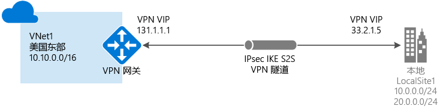
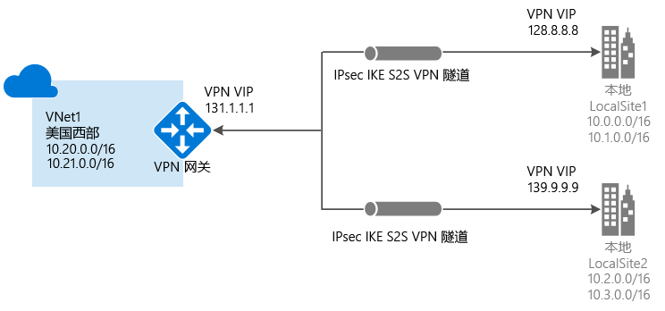
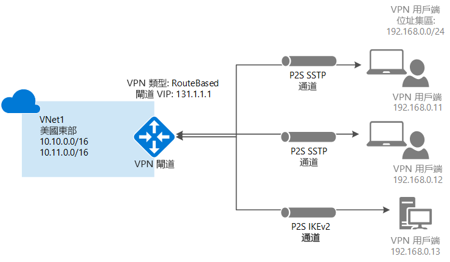
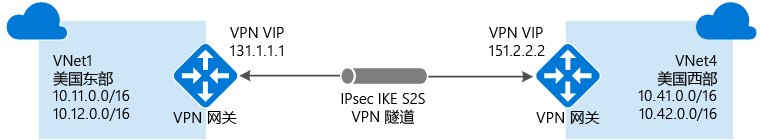
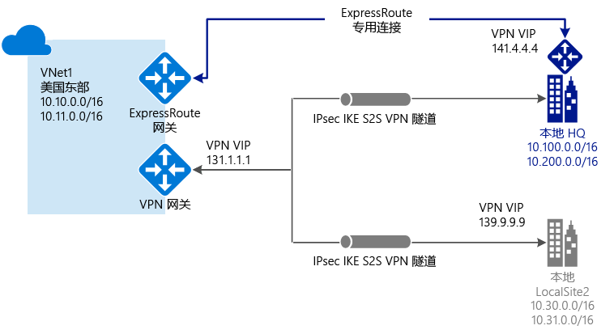

# 什么是 VPN 网关？

VPN 网关是特定类型的虚拟网关，用于跨公共 Internet 在 Azure 虚拟网络和本地位置之间发送加密的流量。 也可使用 VPN 网关在基于 Microsoft 网络的 Azure 虚拟网络之间发送加密流量。 每个虚拟网络只能有一个 VPN 网关。 但是，可以创建连接到相同 VPN 网关的多个连接。 与同一个 VPN 网关建立多个连接时，所有 VPN 隧道共享可用的网关带宽。

## 什么是虚拟网关？

虚拟网络网关由两个或多个 VM 组成，这些 VM 部署到所创建的名为“网关子网”的特定子网  。 虚拟网络网关 VM 包含路由表，并运行特定的网关服务。 这些 VM 是在创建虚拟网络网关时创建的。 不能直接配置属于虚拟网络网关的 VM。

为虚拟网络网关配置的一项设置是网关类型。 网关类型指定如何使用虚拟网络网关以及网关所采取的操作。 网关类型“vpn”指定创建的虚拟网关类型为“VPN 网关”，而非 ExpressRoute 网关。 一个虚拟网络可以有两个虚拟网络网关：一个 VPN 网关和一个 ExpressRoute 网关，与[共存](#coexisting)连接配置的情况相同。 有关详细信息，请参阅[网关类型](vpn-gateway-about-vpn-gateway-settings.md#gwtype)。

VPN 网关可以部署在 Azure 可用性区域中。 这样可以提高虚拟网络网关的复原性、可伸缩性和可用性。 如果在 Azure 可用性区域中部署网关，可以在地理位置和逻辑上将区域内的网关分隔开来，同时还能保护本地网络与 Azure 的连接免受区域级故障的影响。 请参阅[关于 Azure 可用性区域中的区域冗余虚拟网络网关](about-zone-redundant-vnet-gateways.md)

创建虚拟网关可能需要多达 45 分钟才能完成。 创建虚拟网关时，会将网关 VM 部署到网关子网，并使用指定的设置进行配置。 在创建 VPN 网关以后，即在一个 VPN 网关和另一个 VPN 网关之间（VNet 到 VNet）创建 IPsec/IKE VPN 隧道连接，或者在 VPN 网关和本地 VPN 设备（站点到站点）之间创建跨界 IPsec/IKE VPN 隧道连接。 也可创建点到站点 VPN 连接（基于 OpenVPN、IKEv2 或 SSTP 的 VPN），以便从远程位置（例如从会议室或家）连接到虚拟网络。

## 配置 VPN 网关

VPN 网关连接依赖于使用特定设置配置的多个资源。 大多数资源可以单独配置，虽然某些资源必须按特定顺序配置。

### 设置

为每个资源选择的设置对于成功创建连接至关重要。 有关 VPN 网关的各个资源和设置的信息，请参阅 [关于 VPN 网关设置](vpn-gateway-about-vpn-gateway-settings.md)。 本文包含的信息有助于了解网关类型、网关 SKU、VPN 类型、连接类型、网关子网、本地网关，以及可能需要考虑的其他各项资源设置。

### 部署工具

开始时可以使用一个配置工具（如 Azure 门户）创建和配置资源。 可在以后切换到另一个工具（如 PowerShell）来配置其他资源或修改现有资源（如果适用）。 目前，无法在 Azure 门户中配置每个资源和资源设置。 每个连接拓扑的文章中的说明指定了何时需要特定配置工具。 

### 部署模型

目前有两种适用于 Azure 的部署模型。 配置 VPN 网关时，采取的步骤取决于用于创建虚拟网络的部署模型。 例如，如果使用经典部署模型创建的 VNet，则使用经典部署模型的指导原则和说明来创建及配置 VPN 网关设置。 有关部署模型的详细信息，请参阅 [了解 Resource Manager 和经典部署模型](../azure-resource-manager/management/deployment-models.md)。

### 规划表

下表可帮助选择最适合解决方案的连接选项。

[!INCLUDE [cross-premises](../../includes/vpn-gateway-cross-premises-include.md)]

## 网关 SKU

创建虚拟网络网关时，需指定要使用的网关 SKU。 请根据工作负荷、吞吐量、功能和 SLA 的类型，选择满足需求的 SKU。

* 有关网关 SKU 的详细信息（包括支持的功能、生产和开发测试以及配置步骤），请参阅 [VPN 网关设置 - 网关 SKU](vpn-gateway-about-vpn-gateway-settings.md#gwsku) 一文。
* 有关旧版 SKU 的信息，请参阅[使用旧版 SKU](vpn-gateway-about-skus-legacy.md)。

### 按隧道、连接和吞吐量列出的网关 SKU

[!INCLUDE [Aggregated throughput by SKU](../../includes/vpn-gateway-table-gwtype-aggtput-include.md)]

## 连接拓扑示意图

必须知道，VPN 网关连接可以使用不同的配置。 必须确定哪种配置最适合自己的需要。 在下面的部分中，可以查看有关以下 VPN 网关连接的信息和拓扑示意图：以下部分包含一些表格，其中列出了：

* 可用的部署模型
* 可用的配置工具
* 直接转到某篇文章的链接（如果适用）

使用示意图和说明来帮助选择符合要求的连接拓扑。 示意图显示了主要的基准拓扑，但可以使用示意图作为准则生成更复杂的配置。

## 站点到站点和多站点（IPsec/IKE VPN 隧道）

### 站点到站点

站点到站点 (S2S) VPN 网关连接是通过 IPsec/IKE（IKEv1 或 IKEv2）VPN 隧道建立的连接。 S2S 连接可以用于跨界和混合配置。 S2S 连接要求位于本地的 VPN 设备分配有一个公共 IP 地址。 若要了解如何选择 VPN 设备，请参阅 [VPN 网关常见问题解答 - VPN 设备](vpn-gateway-vpn-faq.md#s2s)。

### 多站点

这种类型的连接是站点到站点连接的另一种形式。 可从虚拟网络网关创建多个 VPN 连接（通常是连接到多个本地站点）。 使用多个连接时，必须使用 RouteBased VPN 类型（使用经典 VNet 时称为动态网关）。 由于每个虚拟网络只能有一个 VPN 网关，因此通过网关的所有连接都共享可用带宽。 此类连接通常称为“多站点”连接。

### 适用于站点到站点和多站点的部署模型和方法

[!INCLUDE [site-to-site and multi-site table](../../includes/vpn-gateway-table-site-to-site-include.md)]

## 点到站点 VPN

点到站点 (P2S) VPN 网关连接用于创建从单个客户端计算机到虚拟网络的安全连接。 可通过从客户端计算机启动连接来建立 P2S 连接。 对于要从远程位置（例如从家里或会议室）连接到 Azure VNet 的远程工作者，此解决方案很有用。 如果只有一些客户端需要连接到 VNet，则还可以使用 P2S VPN 这一解决方案来代替 S2S VPN。

与 S2S 连接不同，P2S 连接不需本地面向公众的 IP 地址或 VPN 设备。 可以通过同一 VPN 网关将 P2S 连接与 S2S 连接结合使用，前提是这两种连接的所有配置要求都兼容。 有关点到站点连接的详细信息，请参阅[关于点到站点 VPN](point-to-site-about.md)。

### 适用于 P2S 的部署模型和方法

[!INCLUDE [vpn-gateway-table-site-to-site](../../includes/vpn-gateway-table-point-to-site-include.md)]

## VNet 到 VNet 连接（IPsec/IKE VPN 隧道）

将一个虚拟网络连接到另一个虚拟网络（VNet 到 VNet）类似于将 VNet 连接到本地站点位置。 这两种连接类型都使用 VPN 网关来提供使用 IPsec/IKE 的安全隧道。 甚至可以将 VNet 到 VNet 通信与多站点连接配置组合使用。 这样，便可以建立将跨界连接与虚拟网络间连接相结合的网络拓扑。

连接的 VNet 可以：

* 在相同或不同区域中
* 在相同或不同订阅中 
* 在相同或不同部署模型中

### 部署模型之间的连接

Azure 当前有两种部署模型：经典模型和 Resource Manager 模型。 如果 Azure 已经使用了一段时间，则 Azure VM 和实例角色可能是在经典 VNet 上运行。 而较新的 VM 和角色实例可能是在 Resource Manager 中创建的 VNet 上运行。 可以在 VNet 之间创建连接，以允许一个 VNet 中的资源直接与另一个 VNet 中的资源进行通信。

### VNet 对等互连

可能能够使用 VNet 对等互连来创建连接，前提是虚拟网络符合特定要求。 VNet 对等互连不使用虚拟网络网关。 有关详细信息，请参阅 [VNet 对等互连](../virtual-network/virtual-network-peering-overview.md)。

### 适用于 VNet 到 VNet 的部署模型和方法

[!INCLUDE [vpn-gateway-table-vnet-to-vnet](../../includes/vpn-gateway-table-vnet-to-vnet-include.md)]

## ExpressRoute（专用连接）

使用 ExpressRoute 可通过连接服务提供商所提供的专用连接，将本地网络扩展到 Microsoft 云。 使用 ExpressRoute 可与 Microsoft Azure、Office 365 和 CRM Online 等 Microsoft 云服务建立连接。 可以从任意位置之间的 (IP VPN) 网络、点到点以太网或在共置设施上通过连接服务提供商的虚拟交叉连接来建立这种连接。

ExpressRoute 连接不通过公共 Internet 。 与通过 Internet 的典型连接相比，ExpressRoute 连接提供更高的可靠性、更快的速度、更低的延迟和更高的安全性。

ExpressRoute 连接使用虚拟网关作为其所需配置的一部分。 在 ExpressRoute 连接中，虚拟网络网关配置了网关类型“ExpressRoute”，而不是“Vpn”。 虽然经 ExpressRoute 线路传送的流量默认不加密，但可以创建一项解决方案，通过 ExpressRoute 线路来发送加密的流量。 有关 ExpressRoute 的详细信息，请参阅 [ExpressRoute 技术概述](../expressroute/expressroute-introduction.md)。

## 站点到站点和 ExpressRoute 共存连接

ExpressRoute 是从 WAN （不通过公共 Internet）到 Microsoft 服务（包括 Azure）的直接专用连接。 站点到站点 VPN 流量以加密方式通过公共 Internet 传输。 能够为同一个虚拟网络配置站点到站点 VPN 和 ExpressRoute 连接有诸多优点。

可以将站点到站点 VPN 配置为 ExpressRoute 的安全故障转移路径，或者使用站点到站点 VPN 连接到不属于网络但却已通过 ExpressRoute 进行连接的站点。 请注意，此配置要求对同一虚拟网络使用两个虚拟网络网关，一个网关使用网关类型“Vpn”，另一个网关使用网关类型“ExpressRoute”。

### 适用于 S2S 和 ExpressRoute 的部署模型和方法共存

[!INCLUDE [vpn-gateway-table-coexist](../../includes/vpn-gateway-table-coexist-include.md)]

## 定价

[!INCLUDE [vpn-gateway-about-pricing-include](../../includes/vpn-gateway-about-pricing-include.md)]

有关用于 VPN 网关的网关 SKU 的详细信息，请参阅[网关 SKU](vpn-gateway-about-vpn-gateway-settings.md#gwsku)。

## 常见问题解答

有关 VPN 网关的常见问题，请参阅 [VPN 网关常见问题](vpn-gateway-vpn-faq.md)。

## 后续步骤

- 有关更多信息，请查看 [VPN 网关常见问题](vpn-gateway-vpn-faq.md)。
- 查看[订阅和服务限制](../azure-resource-manager/management/azure-subscription-service-limits.md#networking-limits)。
- 了解 Azure 的一些其他关键[网络功能](../networking/networking-overview.md)。
