# <a name="configure-a-point-to-site-connection-by-using-certificate-authentication-classic"></a>使用证书身份验证（经典）配置点到站点连接

[!INCLUDE [deployment models](../../includes/vpn-gateway-classic-deployment-model-include.md)]

本文介绍如何创建具有点到站点连接的 VNet。 使用 Azure 门户创建具有经典部署模型的 Vnet。 此配置使用证书（不管是自签名的还是 CA 颁发的）来验证正在进行连接的客户端。 还可以使用以下文章中描述的选项，通过不同的部署工具或模型创建此配置：

> [!div class="op_single_selector"]
> * [Azure 门户](vpn-gateway-howto-point-to-site-resource-manager-portal.md)
> * [PowerShell](vpn-gateway-howto-point-to-site-rm-ps.md)
> * [Azure 门户（经典）](vpn-gateway-howto-point-to-site-classic-azure-portal.md)
>

使用点到站点链接 (P2S) VPN 网关创建从单个客户端计算机到虚拟网络的安全连接。 要从远程位置连接到 VNet，可使用点到站点 VPN 连接。 如果只有一些客户端需要连接到 VNet，则可使用 P2S VPN 这种解决方案来代替站点到站点 VPN。 可通过从客户端计算机启动连接来建立 P2S VPN 连接。

> [!IMPORTANT]
> 经典部署模型仅支持 Windows VPN 客户端，并使用安全套接字隧道协议 (SSTP)，一种基于 SSL 的 VPN 协议。 为了支持非 Windows VPN 客户端，必须使用资源管理器部署模型创建 VNet。 除了 SSTP，资源管理器部署模型还支持 IKEv2 VPN。 有关详细信息，请参阅[关于 P2S 连接](point-to-site-about.md)。
>
>

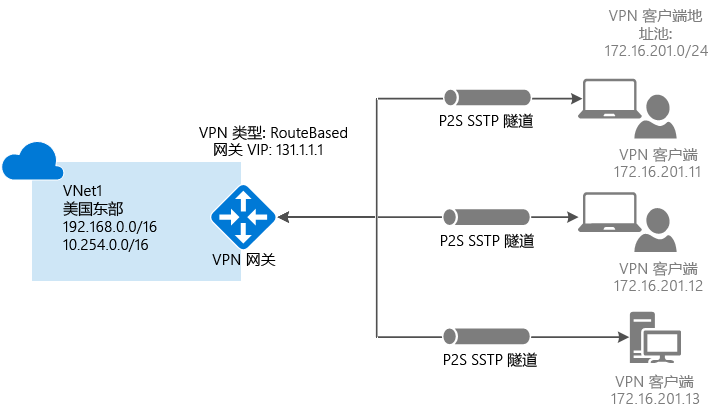

## <a name="prerequisites"></a>必备组件

点到站点证书身份验证连接需要以下先决条件：

* 动态 VPN 网关。
* 适用于根证书的公钥（.cer 文件），已上传到 Azure。 此公钥被视为可信证书，用于身份验证。
* 从根证书生成的客户端证书，安装在每个要连接的客户端计算机上。 此证书用于客户端身份验证。
* 必须生成 VPN 客户端配置包，并将其安装在每个进行连接的客户端计算机上。 客户端配置包配置本机 VPN 客户端，该客户端已经位于操作系统中，且具有连接到 VNet 所需的信息。

点到站点连接不需要 VPN 设备或面向公众的本地 IP 地址。 VPN 连接基于 SSTP（安全套接字隧道协议）创建。 在服务器端，我们支持 SSTP 1.0、1.1 和 1.2 版。 客户端决定要使用的版本。 对于 Windows 8.1 及更高版本，SSTP 默认使用 1.2。 

有关点到站点连接的详细信息，请参阅[点到站点常见问题解答](#point-to-site-faq)。

### <a name="example-settings"></a>示例设置

使用以下值创建测试环境，或参考这些值以更好地理解本文中的示例：

- **创建虚拟网络（经典）设置**
   - **Name**: Enter *VNet1*.
   - **Address space**: Enter *192.168.0.0/16*. 对于此示例，我们只使用一个地址空间。 可以在 VNet 中使用多个地址空间，如图所示。
   - **Subnet name**: Enter *FrontEnd*.
   - **Subnet address range**: Enter *192.168.1.0/24*.
   - **Subscription**: Select a subscription from the list of available subscriptions.
   - **Resource group**: Enter *TestRG*. 如果资源组不存在，选择“新建”。
   - **Location**: Select **East US** from the list.

  - **VPN 连接设置**
    - **Connection type**: Select **Point-to-site**.
    - **Client Address Space**: Enter *172.16.201.0/24*. 使用此点到站点连接连接到 VNet 的 VPN 客户端接收来自指定池的 IP 地址。

- **网关配置子网设置**
   - **Name**: Autofilled with *GatewaySubnet*.
   - **Address range**: Enter *192.168.200.0/24*. 

- **网关配置设置**：
   - **Size**: Select the gateway SKU that you want to use.
   - **Routing Type**: Select **Dynamic**.

## <a name="create-a-virtual-network-and-a-vpn-gateway"></a>创建虚拟网络和 VPN 网关

开始之前，请确保拥有 Azure 订阅。 如果还没有 Azure 订阅，可以激活 [MSDN 订户权益](https://azure.microsoft.com/pricing/member-offers/msdn-benefits-details)或注册获取[免费帐户](https://azure.microsoft.com/pricing/free-trial)。

### <a name="part-1-create-a-virtual-network"></a>第 1 部分：创建虚拟网络

如果还没有虚拟网络 (VNet)，请创建一个。 这些屏幕截图仅供参考。 请务必替换成自己的值。 若要使用 Azure 门户创建 VNet，请执行以下步骤：

1. On the [Azure portal](https://portal.azure.com) menu or from the **Home** page, select **Create a resource**. 此时会打开一个“新建”页面。

2. 在“搜索市场”字段中，输入“虚拟网络”，然后从返回的列表中选择“虚拟网络”。 此时会打开“虚拟网络”页。

3. 从“选择部署模型”列表，选择“经典”，然后选择“创建”。 此时会打开“创建虚拟网络”页。

4. 在“创建虚拟网络”页上，配置 VNet 设置。 在此页上，添加第一个地址空间和单个子网地址范围。 完成创建 VNet 之后，可以返回并添加其他子网和地址空间。

   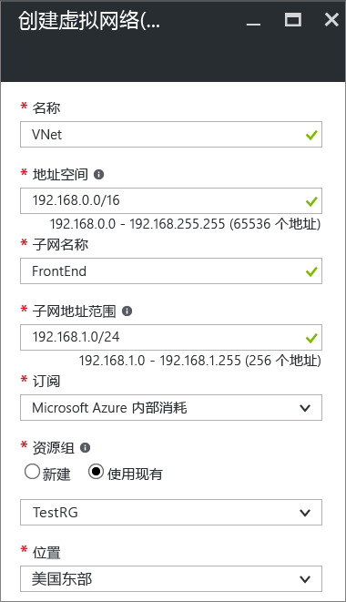

5. 从下拉列表中选择要使用的“订阅”。

6. 选择现有“资源组”。 或者，通过选择“新建”并输入名称，创建新的资源组。 如果要创建新资源组，请根据计划的配置值来命名资源组。 有关资源组的详细信息，请参阅 [Azure 资源管理器概述](../azure-resource-manager/resource-group-overview.md#resource-groups)。

7. 为 VNet 选择“位置”。 此设置确定部署到此 VNet 的资源的地理位置。

8. 选择“创建”来创建该 VNet。 从“通知”页，将看到“正在部署”消息。

8. 创建虚拟网络后，“通知”页上的该消息更改为“部署成功”。 如果希望能够在仪表板上轻松查找 VNet，请选择“固定到仪表板”。 

10. 添加 DNS 服务器（可选）。 创建虚拟网络后，可以添加 DNS 服务器的 IP 地址进行名称解析。 指定的 DNS 服务器 IP 地址应该是可以解析 VNet 中资源名称的 DNS 服务器的地址。

    要添加 DNS 服务器，请从 VNet 页选择“DNS 服务器”。 然后，输入要用的 DNS 服务器的 IP 地址并选择“保存”。

### <a name="part-2-create-a-gateway-subnet-and-a-dynamic-routing-gateway"></a>Part 2: Create a gateway subnet and a dynamic routing gateway

本步骤创建网关子网和动态路由网关。 在经典部署模型的 Azure 门户中，通过相同的配置页创建网关子网和网关。 网关子网仅用于网关服务。 切勿将任何资源（例如 VM 或任何其他服务）直接部署到网关子网。

1. In the Azure portal, go to the virtual network for which you want to create a gateway.

2. 在虚拟网络页上，选择“概览”，在“VPN 连接”部分，选择“网关”。

   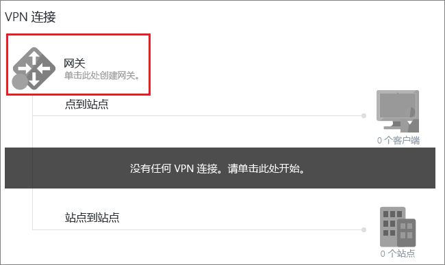
3. 在“新建 VPN 连接”页中，选择“点到站点”。

   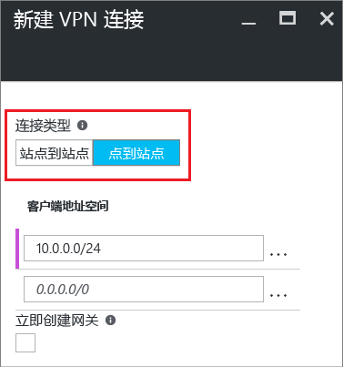
4. 对于“客户端地址空间”，添加 IP 地址范围，VPN 客户端连接时接收此范围中的 IP 地址。 使用专用 IP 地址范围时，该范围不得与要通过其进行连接的本地位置重叠，也不得与连接到其中的 VNet 重叠。 可以用要使用的专用 IP 地址范围覆盖自动填充的范围。 本示例演示自动填充的范围。 

   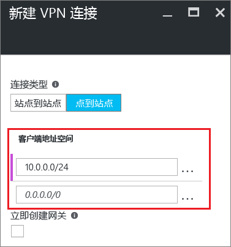
5. 选择“立即创建网关”，然后选择“可选网关配置”打开“网关配置”页。

   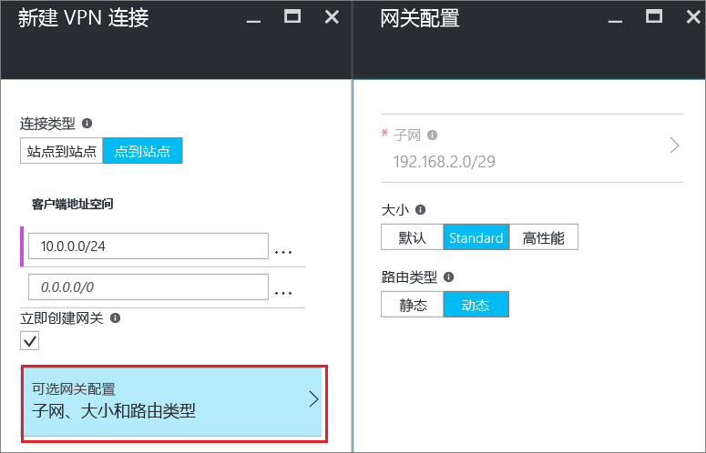

6. 从“网关配置”页，选择“子网”，添加网关子网。 可以创建最小可为 /29 的网关子网。 但建议至少选择 /28 或 /27，创建包含更多地址的更大子网。 这样便可以留出足够多的地址，满足将来可能需要使用的其他配置。 使用网关子网时，避免将网络安全组 (NSG) 与网关子网关联。 将网络安全组与此子网关联可能会导致 VPN 网关不再按预期方式工作。 选择“确定”以保存此设置。

   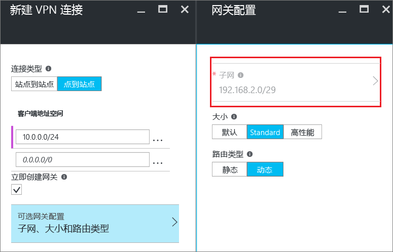
7. 选择网关“大小”。 大小为虚拟网关的网关 SKU。 在 Azure 门户中，默认 SKU 为“默认”。 有关网关 SKU 的详细信息，请参阅[关于 VPN 网关设置](vpn-gateway-about-vpn-gateway-settings.md#gwsku)。

   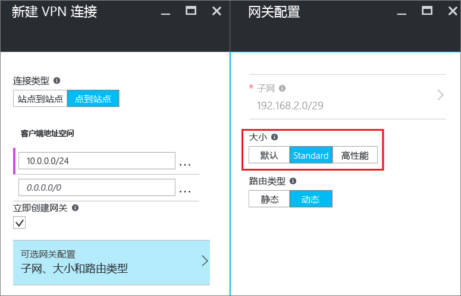
8. 选择网关的“路由类型”。 P2S 配置需要“动态”路由类型。 在此页中完成配置后，请选择“确定”。

   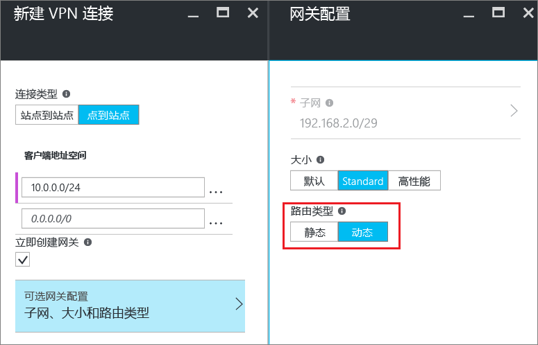

9. 在“新建 VPN 连接”页中，选择该页底部的“确定”开始创建虚拟网关。 VPN 网关可能需要长达 45 分钟的时间才能完成，具体取决于所选网关 SKU。
 
## <a name="generatecerts"></a>创建证书

Azure 使用证书对点到站点 VPN 的 VPN 客户端进行身份验证。 请将根证书的公钥信息上传到 Azure， 然后即可将该公钥视为“可信”公钥。 必须根据可信根证书生成客户端证书，并将其安装在每个客户端计算机的 Certificates-Current User\Personal\Certificates 证书存储中。 客户端连接到 VNet 时，使用证书进行身份验证。 

如果使用自签名证书，这些证书必须使用特定的参数创建。 可以按照 [PowerShell 和 Windows 10](vpn-gateway-certificates-point-to-site.md) 或 [MakeCert](vpn-gateway-certificates-point-to-site-makecert.md) 的说明，创建自签名证书。 在使用自签名根证书以及从自签名根证书生成客户端证书时，必须按这些说明中的步骤操作，这一点很重要。 否则，创建的证书将与 P2S 连接不兼容，你将收到“连接错误”。

### <a name="acquire-the-public-key-cer-for-the-root-certificate"></a>获取根证书的公钥 (.cer)

[!INCLUDE [vpn-gateway-basic-vnet-rm-portal](../../includes/vpn-gateway-p2s-rootcert-include.md)]

### <a name="generate-a-client-certificate"></a>生成客户端证书

[!INCLUDE [vpn-gateway-basic-vnet-rm-portal](../../includes/vpn-gateway-p2s-clientcert-include.md)]

## <a name="upload-the-root-certificate-cer-file"></a>上传根证书 .cer 文件

创建网关之后，将可信根证书的 .cer 文件（包含公钥信息）上传到 Azure 服务器。 请勿上传根证书私钥。 上传证书后，Azure 使用该证书对已安装客户端证书（根据可信根证书生成）的客户端进行身份验证。 之后可根据需要上传更多可信根证书文件（最多 20 个）。  

1. 在 VNet 页的“VPN 连接”部分，选择客户端图形，打开“点到站点 VPN 连接”页。

   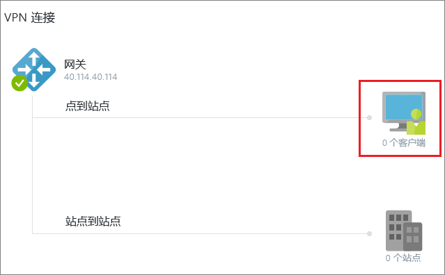

2. 在“点到站点 VPN 连接”页中，选择“管理证书”，打开“证书”页。

   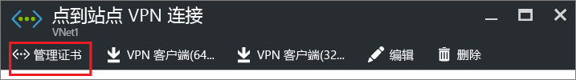

1. 在“证书”页中，选择“上传”，打开“上传证书”页。

    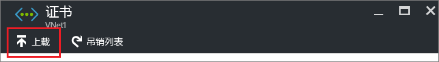

4. 选择文件夹图形浏览 .cer 文件。 选择该文件，然后选择“确定”。 上传的证书显示在“证书”页。

   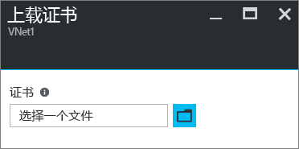


## <a name="configure-the-client"></a>配置客户端

要通过点到站点 VPN 连接到 VNet，每个客户端都必须安装一个用于配置本机 Windows VPN 客户端的包。 配置包使用连接到虚拟网络所需的设置配置本机 Windows VPN 客户端。

只要版本与客户端的体系结构匹配，就可以在每台客户端计算机上使用相同的 VPN 客户端配置包。 有关支持的客户端操作系统的列表，请参阅[点到站点连接常见问题解答](#point-to-site-faq)。

### <a name="generate-and-install-a-vpn-client-configuration-package"></a>生成和安装 VPN 客户端配置包

1. 在 Azure 门户中，在 VNet“概览”页的“VPN 连接”中，选择客户端图形，打开“点到站点 VPN 连接”页。

2. 从“点到站点 VPN 连接”页，选择在其中进行安装的客户端操作系统所对应的下载包：

   * 对于 64 位客户端，请选择“VPN 客户端（64 位）”。
   * 对于 32 位客户端，请选择“VPN 客户端（32 位）”。

   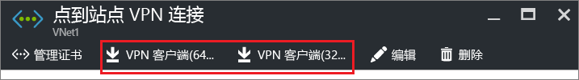

3. 生成包后，下载该包并将其安装在客户端计算机上。 如果看到弹出 SmartScreen，选择“详细信息”，然后选择“仍要运行”。 也可将要安装的包保存在其他客户端计算机上。

### <a name="install-a-client-certificate"></a>安装客户端证书

要从另一台客户端计算机（而不是用于生成客户端证书的计算机）创建 P2S 连接，请安装客户端证书。 安装客户端证书时，需要使用导出客户端证书时创建的密码。 通常，只需双击证书即可安装。 有关详细信息，请参阅[安装已导出的客户端证书](vpn-gateway-certificates-point-to-site.md#install)。


## <a name="connect-to-your-vnet"></a>连接到 VNet

>[!NOTE]
>在要从其进行连接的客户端计算机上，你必须拥有管理员权限。
>
>

1. To connect to your VNet, on the client computer, go to **VPN connections** in the Azure portal and locate the VPN connection that you created. 该 VPN 连接名称与虚拟网络的名称相同。 选择“连接”。 如果显示关于证书的弹出消息，请选择“继续”以使用提升的权限。

2. 在“连接”状态页上，选择“连接”以启动连接。 如果看到“选择证书”屏幕，请验证显示的客户端证书是否正确。 如果错误，请从下拉列表中选择正确的证书，然后选择“确定”。

3. 如果连接成功，将看到“已连接”通知。


### <a name="troubleshooting-p2s-connections"></a>排查 P2S 连接问题

[!INCLUDE [verify-client-certificates](../../includes/vpn-gateway-certificates-verify-client-cert-include.md)]

## <a name="verify-the-vpn-connection"></a>验证 VPN 连接

1. 验证 VPN 连接是否激活。 在客户端计算机上打开提升的命令提示符，并运行 ipconfig/all。
2. 查看结果。 请注意，收到的 IP 地址是点到站点连接地址范围中的一个地址，该范围是你在创建 VNet 时指定的。 结果应类似于以下示例：

   ```
    PPP adapter VNet1:
        Connection-specific DNS Suffix .:
        Description.....................: VNet1
        Physical Address................:
        DHCP Enabled....................: No
        Autoconfiguration Enabled.......: Yes
        IPv4 Address....................: 192.168.130.2(Preferred)
        Subnet Mask.....................: 255.255.255.255
        Default Gateway.................:
        NetBIOS over Tcpip..............: Enabled
   ```

## <a name="connect-to-a-virtual-machine"></a>连接到虚拟机

[!INCLUDE [Connect to a VM](../../includes/vpn-gateway-connect-vm-p2s-classic-include.md)]

## <a name="add-or-remove-trusted-root-certificates"></a>添加或删除可信根证书

可以在 Azure 中添加和删除受信任的根证书。 删除根证书时，具有从该根生成的证书的客户端不能再进行身份验证和连接。 为了让这些客户端再次进行身份验证并连接，必须安装新的客户端证书，该证书由 Azure 信任的根证书生成。

### <a name="to-add-a-trusted-root-certificate"></a>添加受信任的根证书

最多可以将 20 个受信任的根证书 .cer 文件添加到 Azure。 有关说明，请参阅“上传根证书 .cer 文件”。

### <a name="to-remove-a-trusted-root-certificate"></a>删除受信任的根证书

1. 在 VNet 页的“VPN 连接”部分，选择客户端图形，打开“点到站点 VPN 连接”页。

   

2. 在“点到站点 VPN 连接”页中，选择“管理证书”，打开“证书”页。

   

3. 在“证书”页中，选择要删除的证书旁边的省略号，然后选择“删除”。

   

## <a name="revoke-a-client-certificate"></a>吊销客户端证书

如有必要，可以吊销客户端证书。 证书吊销列表用于选择性地拒绝基于单个客户端证书的点到站点连接。 此方法不同于删除可信根证书。 如果从 Azure 中删除受信任的根证书 .cer，它会吊销由吊销的根证书生成/签名的所有客户端证书的访问权限。 如果吊销客户端证书而非根证书，则可继续使用从根证书生成的其他证书，以便进行点到站点连接所需的身份验证。

常见的做法是使用根证书管理团队或组织级别的访问权限，并使用吊销的客户端证书针对单个用户进行精细的访问控制。

### <a name="to-revoke-a-client-certificate"></a>吊销客户端证书

可以通过将指纹添加到吊销列表来吊销客户端证书。

1. 检索客户端证书指纹。 有关详细信息，请参阅[如何：检索证书的指纹](https://msdn.microsoft.com/library/ms734695.aspx)。
2. 将信息复制到文本编辑器，删除其中的空格，使之成为连续的字符串。
3. Go to the classic virtual network. 选择“点到站点 VPN 连接”，然后选择“管理证书”，打开“证书”页。
4. 选择“吊销列表”，打开“吊销列表”页。 
5. 选择“添加证书”，打开“将证书添加到吊销列表”页。
6. 在“指纹”页中，将证书指纹以连续文本行的形式进行粘贴，不留空格。 选择“确定”完成操作。

更新完成后，不再可以使用证书来连接。 客户端在尝试使用此证书进行连接时，会收到一条消息，指出证书不再有效。

## <a name="point-to-site-faq"></a>点到站点常见问题解答

[!INCLUDE [Point-to-Site FAQ](../../includes/vpn-gateway-faq-point-to-site-classic-include.md)]

## <a name="next-steps"></a>后续步骤

- 连接完成后，即可将虚拟机添加到虚拟网络。 有关详细信息，请参阅[虚拟机](https://docs.microsoft.com/azure/)。 

- 要详细了解网络和 Linux 虚拟机，请参阅 [Azure 和 Linux VM 网络概述](../virtual-machines/linux/network-overview.md)。

- 有关 P2S 故障排除信息，请参阅[排查 Azure 点到站点连接问题](vpn-gateway-troubleshoot-vpn-point-to-site-connection-problems.md)。
