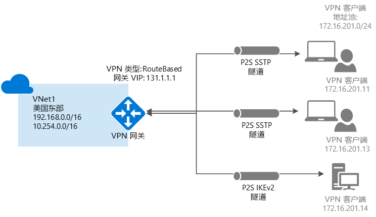
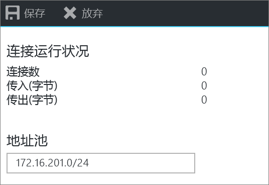
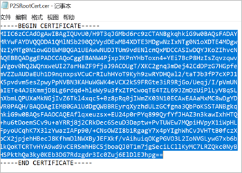
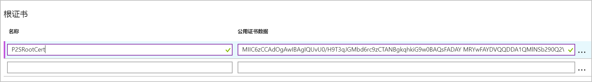
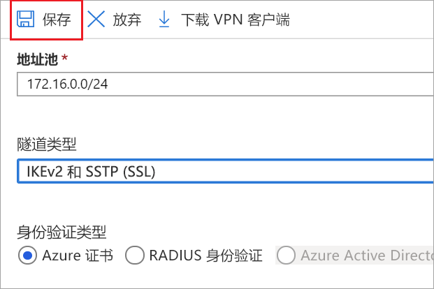
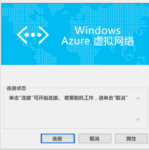

# <a name="configure-a-point-to-site-connection-to-a-vnet-using-native-azure-certificate-authentication-azure-portal"></a>使用本机 Azure 证书身份验证配置与 VNet 的点到站点连接：Azure 门户

本文介绍如何将运行 Windows 或 Mac OS X 的单个客户端安全地连接到 Azure VNet。 若要从远程位置连接到 VNet，例如从家里或会议室进行远程通信，则可使用点到站点 VPN。 如果只有一些客户端需要连接到 VNet，也可使用 P2S VPN 来代替站点到站点 VPN。 点到站点连接不需要 VPN 设备或面向公众的 IP 地址。 P2S 基于 SSTP（安全套接字隧道协议）或 IKEv2 创建 VPN 连接。 有关点到站点 VPN 的详细信息，请参阅[关于点到站点 VPN](point-to-site-about.md)。




## <a name="architecture"></a>体系结构

点到站点本机 Azure 证书身份验证连接使用可在此练习中配置的以下项目：

* RouteBased VPN 网关。
* 适用于根证书的公钥（.cer 文件），已上传到 Azure。 上传证书以后，该证书将被视为受信任的证书，用于身份验证。
* 从根证书生成的客户端证书。 安装在要连接到 VNet 的每个客户端计算机上的客户端证书。 此证书用于客户端身份验证。
* VPN 客户端配置。 VPN 客户端配置文件包含客户端连接到 VNet 时所需的信息。 这些文件对操作系统自带的现有 VPN 客户端进行配置。 必须使用配置文件中的设置对进行连接的每个客户端进行配置。

#### <a name="example"></a>示例值

可使用以下值创建测试环境，或参考这些值以更好地理解本文中的示例：

* VNet 名称：VNet1
* 地址空间：192.168.0.0/16<br>对于此示例，我们只使用一个地址空间。 VNet 可以有多个地址空间。
* 子网名称：FrontEnd
* 子网地址范围：192.168.1.0/24
* **订阅：** 如果有多个订阅，请验证是否正在使用正确的订阅。
* 资源组：TestRG
* **位置：**美国东部
* GatewaySubnet：192.168.200.0/24<br>
* DNS 服务器：（可选）要用于名称解析的 DNS 服务器的 IP 地址。
* 虚拟网关名称：VNet1GW
* 网关类型：VPN
* VPN 类型：基于路由
* 公共 IP 地址名称：VNet1GWpip
* 连接类型：点到站点
* 客户端地址池：172.16.201.0/24<br>使用此点到站点连接连接到 VNet 的 VPN 客户端接收来自客户端地址池的 IP 地址。

## <a name="createvnet"></a>1.创建虚拟网络

开始之前，请确保拥有 Azure 订阅。 如果还没有 Azure 订阅，可以激活 [MSDN 订户权益](https://azure.microsoft.com/pricing/member-offers/msdn-benefits-details)或注册获取[免费帐户](https://azure.microsoft.com/pricing/free-trial)。
[!INCLUDE [Basic Point-to-Site VNet](../../includes/vpn-gateway-basic-p2s-vnet-rm-portal-include.md)]

## <a name="gatewaysubnet"></a>2.添加网关子网

将虚拟网络连接到网关之前，必须先创建要连接的虚拟网络的网关子网。 网关服务使用网关子网中指定的 IP 地址。 在可能的情况下，建议使用 /28 或 /27 的 CIDR 块创建网关子网，以便提供足够的 IP 地址，满足将来的其他配置要求。

[!INCLUDE [vpn-gateway-add-gwsubnet-rm-portal](../../includes/vpn-gateway-add-gwsubnet-p2s-rm-portal-include.md)]

## <a name="dns"></a>3.指定 DNS 服务器（可选）

创建虚拟网络后，可以添加 DNS 服务器的 IP 地址来处理名称解析。 DNS 服务器对于此配置是可选的，但在需要名称解析的情况下是必需的。 指定一个值不会创建新的 DNS 服务器。 指定的 DNS 服务器 IP 地址应该是可以解析所连接的资源名称的 DNS 服务器。 对于此示例，我们使用了专用 IP 地址，但这可能不是你 DNS 服务器的 IP 地址。 请务必使用自己的值。 你指定的值将由部署到 VNet 的资源使用，而不是由 P2S 连接或 VPN 客户端使用。

[!INCLUDE [vpn-gateway-add-dns-rm-portal](../../includes/vpn-gateway-add-dns-rm-portal-include.md)]

## <a name="creategw"></a>4.创建虚拟网络网关

[!INCLUDE [create-gateway](../../includes/vpn-gateway-add-gw-p2s-rm-portal-include.md)]

## <a name="generatecert"></a>5.生成证书

Azure 使用证书对通过点到站点 VPN 连接连接到 VNet 的客户端进行身份验证。 获得根证书后，即可将公钥信息[上传](#uploadfile)到 Azure。 然后，Azure 就会将该根证书视为通过 P2S 连接到虚拟网络时需要使用的“受信任的”证书。 也可从受信任的根证书生成客户端证书，然后将其安装在每个客户端计算机上。 当客户端发起与 VNet 的连接时，需使用客户端证书对客户端进行身份验证。 

### <a name="getcer"></a>1.获取根证书的 .cer 文件

[!INCLUDE [root-certificate](../../includes/vpn-gateway-p2s-rootcert-include.md)]

### <a name="generateclientcert"></a>2.生成客户端证书

[!INCLUDE [generate-client-cert](../../includes/vpn-gateway-p2s-clientcert-include.md)]

## <a name="addresspool"></a>6.添加客户端地址池

客户端地址池是指定的专用 IP 地址的范围。 通过点到站点 VPN 进行连接的客户端动态接收此范围内的 IP 地址。 使用专用 IP 地址范围时，该范围不得与要通过其进行连接的本地位置重叠，也不得与要连接到其中的 VNet 重叠。

1. 创建虚拟网关后，请导航到虚拟网关页的“设置”部分。 在“设置”部分单击“点到站点配置”。

   
2. 单击“立即配置”，打开配置页。

  
3. 在“点到站点”配置页的“地址池”框中，添加要使用的专用 IP 地址范围。 VPN 客户端动态接收指定范围内的 IP 地址。 单击“保存”验证和保存设置。

  

## <a name="tunneltype"></a>7.配置隧道类型

可以选择隧道类型。 两个隧道选项是 SSTP 和 IKEv2。 Android 和 Linux 上的 strongSwan 客户端以及 iOS 和 OSX 上的本机 IKEv2 VPN 客户端仅会使用 IKEv2 隧道进行连接。 Windows 客户端会首先尝试 IKEv2，如果不能连接，则会回退到 SSTP。 可以选择启用其中之一或启用两者。 选择解决方案需要的复选框。


## <a name="authenticationtype"></a>8.配置身份验证类型

选择“Azure 证书”。

  

## <a name="uploadfile"></a>9.上传根证书的公共证书数据

可以上传更多受信任的根证书（最多 20 个）。 上传公共证书数据后，Azure 即可使用该数据对已安装客户端证书（根据受信任的根证书生成）的客户端进行身份验证。 将根证书的公钥信息上传到 Azure。

1. 证书在“点到站点配置”页的“根证书”部分添加。
2. 请确保已导出了格式为 Base-64 编码的 X.509 (.cer) 文件的根证书。 需要以这种格式导出证书，以便使用文本编辑器打开该证书。
3. 使用记事本之类的文本编辑器打开该证书。 复制证书数据时，请确保将文本复制为一个无回车符或换行符的连续行。 可能需要在文本编辑器中将视图修改为“显示符号/显示所有字符”以查看回车符和换行符。 仅将以下部分复制为一个连续行：

  
4. 将证书数据粘贴到“公共证书数据”字段中。 “命名”该证书，并单击“保存”。 最多可以添加 20 个受信任的根证书。

  
5. 单击页面顶部的“保存”来保存所有配置设置。

  

## <a name="installclientcert"></a>10.安装已导出的客户端证书

如果想要从另一台客户端计算机（而不是用于生成客户端证书的计算机）创建 P2S 连接，需要安装客户端证书。 安装客户端证书时，需要使用导出客户端证书时创建的密码。

确保已将客户端证书与整个证书链（默认）一起作为 .pfx 导出。 否则，根证书信息就不会出现在客户端计算机上，客户端将无法进行正常的身份验证。

有关安装步骤，请参阅[安装客户端证书](point-to-site-how-to-vpn-client-install-azure-cert.md)。

## <a name="clientconfig"></a>11.生成和安装 VPN 客户端配置包

VPN 客户端配置文件包含的设置用来对设备进行配置以通过 P2S 连接来连接到 VNet。 有关生成和安装 VPN 客户端配置文件的说明，请参阅[为本机 Azure 证书身份验证 P2S 配置创建和安装 VPN 客户端配置文件](point-to-site-vpn-client-configuration-azure-cert.md)。

## <a name="connect"></a>12.连接到 Azure

### <a name="to-connect-from-a-windows-vpn-client"></a>从 Windows VPN 客户端进行连接

>[!NOTE]
>在要从其进行连接的 Windows 客户端计算机上，你必须拥有管理员权限。
>
>

1. 若要连接到 VNet，请在客户端计算机上导航到 VPN 连接，找到创建的 VPN 连接。 其名称与虚拟网络的名称相同。 单击“连接”。 可能会出现与使用证书相关的弹出消息。 单击“继续”使用提升的权限。

2. 在“连接”状态页上，单击“连接”以启动连接。 如果看到“选择证书”屏幕，请确保所显示的客户端证书是要用来连接的证书。 如果不是，请使用下拉箭头选择正确的证书，并单击“确定”。

  
3. 连接已建立。

  

#### <a name="troubleshoot-windows-p2s-connections"></a>对 Windows P2S 连接进行故障排除

[!INCLUDE [verifies client certificates](../../includes/vpn-gateway-certificates-verify-client-cert-include.md)]

### <a name="to-connect-from-a-mac-vpn-client"></a>从 Mac VPN 客户端进行连接

在“网络”对话框中，找到要使用的客户端配置文件，在 [VpnSettings.xml](point-to-site-vpn-client-configuration-azure-cert.md#installmac) 中指定设置，然后单击“连接”。

  

## <a name="verify"></a>验证连接

这些说明适用于 Windows 客户端。

1. 要验证 VPN 连接是否处于活动状态，请打开提升的命令提示符，然后运行 *ipconfig/all*。
2. 查看结果。 请注意，收到的 IP 地址是在配置中指定的点到站点 VPN 客户端地址池中的地址之一。 结果与以下示例类似：

  ```
  PPP adapter VNet1:
      Connection-specific DNS Suffix .:
      Description.....................: VNet1
      Physical Address................:
      DHCP Enabled....................: No
      Autoconfiguration Enabled.......: Yes
      IPv4 Address....................: 172.16.201.3(Preferred)
      Subnet Mask.....................: 255.255.255.255
      Default Gateway.................:
      NetBIOS over Tcpip..............: Enabled
  ```

## <a name="connectVM"></a>连接到虚拟机

这些说明适用于 Windows 客户端。

[!INCLUDE [Connect to a VM](../../includes/vpn-gateway-connect-vm-p2s-include.md)]

## <a name="add"></a>添加或删除受信任的根证书

可以在 Azure 中添加和删除受信任的根证书。 删除根证书时，如果客户端的证书是从该根生成的，则客户端不能进行身份验证，因此无法进行连接。 如果希望客户端进行身份验证和连接，则需安装新客户端证书，该证书是从委托（上传）给 Azure 的根证书生成的。

### <a name="to-add-a-trusted-root-certificate"></a>添加受信任的根证书

最多可以将 20 个受信任的根证书 .cer 文件添加到 Azure。 有关说明，请参阅本文的[上载受信任的根证书](#uploadfile)部分。

### <a name="to-remove-a-trusted-root-certificate"></a>删除受信任的根证书

1. 若要删除受信任的根证书，请导航到虚拟网关的“点到站点配置”页。
2. 在页面的“根证书”部分，找到要删除的证书。
3. 单击证书旁的省略号，并单击“删除”。

## <a name="revokeclient"></a>吊销客户端证书

可以吊销客户端证书。 证书吊销列表用于选择性地拒绝基于单个客户端证书的点到站点连接。 这不同于删除受信任的根证书。 如果从 Azure 中删除受信任的根证书 .cer，它会吊销由吊销的根证书生成/签名的所有客户端证书的访问权限。 如果吊销客户端证书而非根证书，则可继续使用从根证书生成的其他证书进行身份验证。

常见的做法是使用根证书管理团队或组织级别的访问权限，并使用吊销的客户端证书针对单个用户进行精细的访问控制。

### <a name="revoke-a-client-certificate"></a>吊销客户端证书

可以通过将指纹添加到吊销列表来吊销客户端证书。

1. 检索客户端证书指纹。 有关详细信息，请参阅[如何检索证书的指纹](https://msdn.microsoft.com/library/ms734695.aspx)。
2. 将信息复制到一个文本编辑器，删除所有空格，使之成为一个连续的字符串。
3. 导航到虚拟网关的“点到站点配置”页。 此页面正是用来[上传受信任的根证书](#uploadfile)的页面。
4. 在“吊销的证书”部分，输入证书的友好名称（不必是证书 CN）。
5. 将指纹字符串复制并粘贴到“指纹”字段。
6. 指纹将进行验证，并会自动添加到吊销列表。 屏幕上会显示一条消息，指出列表正在进行更新。 
7. 更新完成后，不再可以使用证书来连接。 客户端在尝试使用此证书进行连接时，会收到一条消息，指出证书不再有效。

## <a name="faq"></a>点到站点常见问题解答

[!INCLUDE [Point-to-Site FAQ](../../includes/vpn-gateway-faq-p2s-azurecert-include.md)]

## <a name="next-steps"></a>后续步骤
连接完成后，即可将虚拟机添加到虚拟网络。 有关详细信息，请参阅[虚拟机](https://docs.microsoft.com/azure/#pivot=services&panel=Compute)。 若要详细了解网络和虚拟机，请参阅 [Azure 和 Linux VM 网络概述](../virtual-machines/linux/azure-vm-network-overview.md)。

有关 P2S 故障排除信息，请参阅[排查 Azure 点到站点连接问题](vpn-gateway-troubleshoot-vpn-point-to-site-connection-problems.md)。
