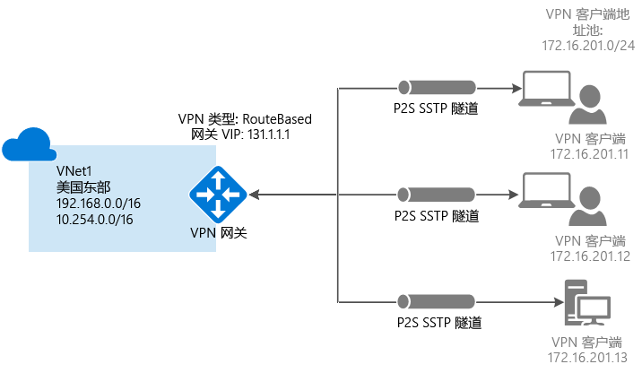
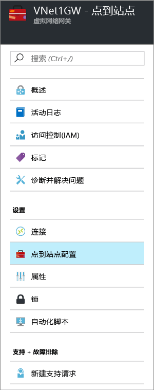
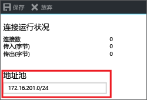

# <a name="configure-a-point-to-site-connection-to-a-vnet-using-certificate-authentication-azure-portal"></a>使用证书身份验证配置与 VNet 的点到站点连接：Azure 门户

本文介绍如何在 Resource Manager 部署模型中使用 Azure 门户通过点到站点连接来创建 VNet。 此配置使用证书来验证正在进行连接的客户端。 也可使用不同的部署工具或部署模型来创建此配置，方法是从以下列表中选择另一选项：

> [!div class="op_single_selector"]
> * [Azure 门户](vpn-gateway-howto-point-to-site-resource-manager-portal.md)
> * [PowerShell](vpn-gateway-howto-point-to-site-rm-ps.md)
> * [Azure 门户（经典）](vpn-gateway-howto-point-to-site-classic-azure-portal.md)
>
>

通过点到站点 (P2S) 配置，可以使单台客户端计算机与虚拟网络建立安全的连接。 如果要从远程位置（例如，从家里或会议室）连接到 VNet，或者只有少数几台客户端计算机需要连接到虚拟网络，点到站点连接将非常有用。 P2S VPN 连接通过本机 Windows VPN 客户端从客户端计算机启动。 连接客户端使用证书进行身份验证。 



点到站点证书身份验证连接需要以下项：

* RouteBased VPN 网关。
* 适用于根证书的公钥（.cer 文件），已上传到 Azure。 此证书被视为可信证书，用于身份验证。
* 从根证书生成的客户端证书，安装在每个要连接的客户端计算机上。 此证书用于客户端身份验证。
* 必须生成 VPN 客户端配置包，并将其安装在每个进行连接的客户端计算机上。 客户端配置包配置本机 VPN 客户端，该客户端已经位于操作系统中，具有连接到 VNet 所需的信息。

点到站点连接不需要 VPN 设备或面向公众的本地 IP 地址。 VPN 连接基于 SSTP（安全套接字隧道协议）创建。 在服务器端，我们支持 SSTP 1.0、1.1 和 1.2 版。 客户端决定要使用的版本。 对于 Windows 8.1 及更高版本，SSTP 默认使用 1.2。 

有关点到站点连接的详细信息，请参阅本文末尾的[点到站点常见问题解答](#faq)。

### <a name="example"></a>示例值

可使用以下值创建测试环境，或参考这些值以更好地理解本文中的示例：

* **名称：VNet1**
* **地址空间：192.168.0.0/16**<br>对于此示例，我们只使用一个地址空间。 VNet 可以有多个地址空间。
* **子网名称：FrontEnd**
* **子网地址范围：192.168.1.0/24**
* **订阅：** 如果有多个订阅，请验证是否正在使用正确的订阅。
* **资源组：TestRG**
* **位置：美国东部**
* **GatewaySubnet：192.168.200.0/24**
* **虚拟网络网关名称：VNet1GW**
* **网关类型：VPN**
* **VPN 类型：基于路由**
* **公共 IP 地址：VNet1GWpip**
* **连接类型：点到站点**
* **客户端地址池：172.16.201.0/24**<br>使用此点到站点连接连接到 VNet 的 VPN 客户端接收来自客户端地址池的 IP 地址。

## <a name="createvnet"></a>1 - 创建虚拟网络

开始之前，请确保拥有 Azure 订阅。 如果你还没有 Azure 订阅，可以激活 [MSDN 订户权益](https://azure.microsoft.com/pricing/member-offers/msdn-benefits-details)或注册获取[免费帐户](https://azure.microsoft.com/pricing/free-trial)。 如果正在练习创建此配置，可以参考[示例值](#example)。

[!INCLUDE [vpn-gateway-basic-vnet-rm-portal](../../includes/vpn-gateway-basic-vnet-rm-portal-include.md)]

## <a name="address"></a>2 - 指定地址空间和子网

可以将其他地址空间和子网添加到已创建的 VNet。

[!INCLUDE [vpn-gateway-additional-address-space](../../includes/vpn-gateway-additional-address-space-include.md)]

## <a name="gatewaysubnet"></a>3 - 添加网关子网

将虚拟网络连接到网关之前，必须先创建要连接的虚拟网络的网关子网。 网关服务使用网关子网中指定的 IP 地址。 在可能的情况下，建议使用 /28 或 /27 的 CIDR 块创建网关子网，以便提供足够的 IP 地址，满足将来的其他配置要求。

本部分中的屏幕截图是一个引用示例。 请确保使用与配置所需值对应的 GatewaySubnet 地址范围。

### <a name="to-create-a-gateway-subnet"></a>创建网关子网

[!INCLUDE [vpn-gateway-add-gwsubnet-rm-portal](../../includes/vpn-gateway-add-gwsubnet-rm-portal-include.md)]

## <a name="dns"></a>4 - 指定 DNS 服务器（可选）

创建虚拟网络后，可以添加 DNS 服务器的 IP 地址来处理名称解析。 指定的 DNS 服务器应该是可以解析所连接的资源名称的 DNS 服务器。 在随后的步骤中生成的 VPN 客户端配置包将包含在本设置中指定的 DNS 服务器的 IP 地址。 如果需要在将来更新 DNS 服务器的列表，则可根据新列表生成并安装新的 VPN 客户端配置包。

[!INCLUDE [vpn-gateway-add-dns-rm-portal](../../includes/vpn-gateway-add-dns-rm-portal-include.md)]

## <a name="creategw"></a>5 - 创建虚拟网关

点到站点连接需要以下设置：

* 网关类型：VPN
* VPN 类型：基于路由

### <a name="to-create-a-virtual-network-gateway"></a>创建虚拟网络网关

[!INCLUDE [create a vnet gateway](../../includes/vpn-gateway-add-gw-rm-portal-include.md)]

## <a name="generatecert"></a>6 - 生成证书

Azure 使用证书对点到站点 VPN 的 VPN 客户端进行身份验证。 请将根证书的公钥信息上传到 Azure， 然后即可将该公钥视为“可信”公钥。 必须根据可信根证书生成客户端证书，并将其安装在每个客户端计算机的 Certificates-Current User/个人证书存储中。 当客户端启动到 VNet 的连接时，使用证书进行身份验证。 

如果使用自签名证书，这些证书必须使用特定的参数创建。 可以按照 [PowerShell 和 Windows 10](vpn-gateway-certificates-point-to-site.md) 或 [MakeCert](vpn-gateway-certificates-point-to-site-makecert.md) 的说明，创建自签名证书。 在使用自签名根证书以及从自签名根证书生成客户端证书时，必须按这些说明中的步骤操作，这一点很重要。 否则，创建的证书将不兼容 P2S 连接，你会收到连接错误。

### <a name="getcer"></a>步骤 1 - 获取根证书的 .cer 文件

[!INCLUDE [get the root certificate](../../includes/vpn-gateway-p2s-rootcert-include.md)]

### <a name="generateclientcert"></a>步骤 2 - 生成客户端证书

[!INCLUDE [generates client certificate](../../includes/vpn-gateway-p2s-clientcert-include.md)]

## <a name="addresspool"></a>7 - 添加客户端地址池

客户端地址池是指定的专用 IP 地址的范围。 通过 P2S 连接的客户端接收来自此范围的 IP 地址。 使用专用 IP 地址范围时，该范围不得与要通过其进行连接的本地位置重叠，也不得与要连接到其中的 VNet 重叠。

1. 一旦创建虚拟网络网关后，请导航到“虚拟网络网关”边栏选项卡的“设置”部分。 在“设置”部分中，单击“点到站点配置”可打开“配置”边栏选项卡。

  
2. 可以删除自动填充的范围，并添加要使用的专用 IP 地址范围。 单击“保存”验证和保存设置。

  

## <a name="uploadfile"></a>8 - 上传根证书 .cer 文件

创建网关后，即可为委托给 Azure 的根证书上传 .cer 文件（其中包含公钥信息）。 上传 .cer 文件后，Azure 可以使用该文件对已安装客户端证书（根据可信根证书生成）的客户端进行身份验证。 可在以后根据需要上传更多的可信根证书文件（最多 20 个）。 

1. 证书已添加到“根证书”部分中的“点到站点配置”边栏选项卡上。  
2. 请确保已导出了格式为 Base-64 编码的 X.509 (.cer) 文件的根证书。 需要以这种格式导出证书，以便使用文本编辑器打开该证书。
3. 使用记事本之类的文本编辑器打开该证书。 复制证书数据时，请确保将文本复制为一个无回车符或换行符的连续行。 可能需要在文本编辑器中将视图修改为“显示符号/显示所有字符”以查看回车符和换行符。 仅将以下部分复制为一个连续行：

  
4. 将证书数据粘贴到“公共证书数据”字段中。 “命名”该证书，并单击“保存”。 最多可以添加 20 个受信任的根证书。

  

## <a name="clientconfig"></a>9 - 安装 VPN 客户端配置包

若要通过点到站点 VPN 连接到 VNet，每个客户端都必须安装一个用于配置本机 Windows VPN 客户端的包。 配置包为本机 Windows VPN 客户端配置连接到虚拟网络所需的设置，在为 VNet 指定 DNS 服务器的情况下，它包含 DNS 服务器 IP 地址，客户端将使用该地址进行名称解析。 如果在以后更改指定的 DNS 服务器，则在生成客户端配置包以后，请确保生成新的客户端配置包，以便将其安装在客户端计算机上。

只要版本与客户端的体系结构匹配，就可以在每台客户端计算机上使用相同的 VPN 客户端配置包。 有关支持的客户端操作系统列表，请参阅本文末尾的[点到站点连接常见问题解答](#faq)。

### <a name="step-1---download-the-client-configuration-package"></a>步骤 1 - 下载客户端配置包

1. 在“点到站点配置”边栏选项卡上，单击“下载 VPN 客户端”可打开“下载 VPN 客户端”边栏选项卡。 生成包需要一到两分钟。

  
2. 为客户端选择正确的包，并单击“下载”。 保存配置包文件。 将 VPN 客户端配置包安装在每台连接到虚拟网络的客户端计算机上。

  

### <a name="step-2---install-the-client-configuration-package"></a>步骤 2 - 安装客户端配置包

1. 将配置文件通过本地方式复制到要连接到虚拟网络的计算机上。 
2. 双击 .exe 文件，在客户端计算机上安装包。 配置包是你创建的，因此未签名，并可能会显示警告。 如果显示 Windows SmartScreen 弹出窗口，请单击“更多信息”（左侧），并单击“仍要运行”以安装该包。
3. 将该包安装在客户端计算机上。 如果显示 Windows SmartScreen 弹出窗口，请单击“更多信息”（左侧），并单击“仍要运行”以安装该包。
4. 在客户端计算机上，导航到“网络设置”，并单击“VPN”。 VPN 连接显示所连接到的虚拟网络的名称。

## <a name="installclientcert"></a>10 - 安装客户端证书

如果想要从另一台客户端计算机（而不是用于生成客户端证书的计算机）创建 P2S 连接，需要安装客户端证书。 安装客户端证书时，需要使用导出客户端证书时创建的密码。 通常只需双击证书即可安装。 有关详细信息，请参阅[安装已导出的客户端证书](vpn-gateway-certificates-point-to-site.md#install)。

## <a name="connect"></a>11 - 连接到 Azure

1. 要连接到 VNet，请在客户端计算机上，导航到 VPN 连接，找到创建的 VPN 连接。 其名称与虚拟网络的名称相同。 单击“连接”。 可能会出现与使用证书相关的弹出消息。 单击“继续”使用提升的权限。

2. 在“连接”状态页上，单击“连接”以启动连接。 如果看到“选择证书”屏幕，请确保所显示的客户端证书是要用来连接的证书。 如果不是，请使用下拉箭头选择正确的证书，并单击“确定”。

  
3. 连接已建立。

  

[!INCLUDE [verifies client certificates](../../includes/vpn-gateway-certificates-verify-client-cert-include.md)]

## <a name="verify"></a>12 - 验证连接

1. 要验证 VPN 连接是否处于活动状态，请打开提升的命令提示符，然后运行 *ipconfig/all*。
2. 查看结果。 请注意，收到的 IP 地址是在配置中指定的点到站点 VPN 客户端地址池中的地址之一。 结果与以下示例类似：

  ```
  PPP adapter VNet1:
      Connection-specific DNS Suffix .:
      Description.....................: VNet1
      Physical Address................:
      DHCP Enabled....................: No
      Autoconfiguration Enabled.......: Yes
      IPv4 Address....................: 172.16.201.3(Preferred)
      Subnet Mask.....................: 255.255.255.255
      Default Gateway.................:
      NetBIOS over Tcpip..............: Enabled
  ```

## <a name="connectVM"></a>连接到虚拟机

[!INCLUDE [Connect to a VM](../../includes/vpn-gateway-connect-vm-p2s-include.md)]

## <a name="add"></a>添加或删除受信任的根证书

可以在 Azure 中添加和删除受信任的根证书。 删除根证书时，如果客户端的证书是从该根生成的，则客户端不能进行身份验证，因此无法进行连接。 如果希望客户端进行身份验证和连接，则需安装新客户端证书，该证书是从委托（上传）给 Azure 的根证书生成的。

### <a name="to-add-a-trusted-root-certificate"></a>添加受信任的根证书

最多可以将 20 个受信任的根证书 .cer 文件添加到 Azure。 有关说明，请参阅本文的[上载受信任的根证书](#uploadfile)部分。

### <a name="to-remove-a-trusted-root-certificate"></a>删除受信任的根证书

1. 若要删除受信任的根证书，请导航到虚拟网关的“点到站点配置”边栏选项卡。
2. 在边栏选项卡的“根证书”部分，找到要删除的证书。
3. 单击证书旁的省略号，并单击“删除”。

## <a name="revokeclient"></a>吊销客户端证书

可以吊销客户端证书。 证书吊销列表即可选择性地拒绝基于单个客户端证书的点到站点连接。 这不同于删除受信任的根证书。 如果从 Azure 中删除受信任的根证书 .cer，它会吊销由吊销的根证书生成/签名的所有客户端证书的访问权限。 如果吊销客户端证书而非根证书，则可继续使用从根证书生成的其他证书进行身份验证。

常见的做法是使用根证书管理团队或组织级别的访问权限，并使用吊销的客户端证书针对单个用户进行精细的访问控制。

### <a name="to-revoke-a-client-certificate"></a>吊销客户端证书

可以通过将指纹添加到吊销列表来吊销客户端证书。

1. 检索客户端证书指纹。 有关详细信息，请参阅[如何检索证书的指纹](https://msdn.microsoft.com/library/ms734695.aspx)。
2. 将信息复制到一个文本编辑器，删除所有空格，使之成为一个连续的字符串。
3. 导航到虚拟网关的“点到站点配置”边栏选项卡。 此边栏选项卡正是你用来[上传受信任的根证书](#uploadfile)的边栏选项卡。
4. 在“吊销的证书”部分，输入证书的友好名称（不必是证书 CN）。
5. 将指纹字符串复制并粘贴到“指纹”字段。
6. 指纹将进行验证，并会自动添加到吊销列表。 屏幕上会显示一条消息，指出列表正在进行更新。 
7. 更新完成后，不再可以使用证书来连接。 客户端在尝试使用此证书进行连接时，会收到一条消息，指出证书不再有效。

## <a name="faq"></a>点到站点常见问题解答

[!INCLUDE [Point-to-Site FAQ](../../includes/vpn-gateway-point-to-site-faq-include.md)]

## <a name="next-steps"></a>后续步骤
连接完成后，即可将虚拟机添加到虚拟网络。 有关详细信息，请参阅[虚拟机](https://docs.microsoft.com/azure/#pivot=services&panel=Compute)。 若要详细了解网络和虚拟机，请参阅 [Azure 和 Linux VM 网络概述](../virtual-machines/linux/azure-vm-network-overview.md)。
