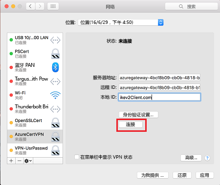

# <a name="configure-a-point-to-site-connection-to-a-vnet-using-native-azure-certificate-authentication-powershell"></a>使用本机 Azure 证书身份验证配置与 VNet 的点到站点连接：PowerShell

本文介绍如何在 Resource Manager 部署模型中使用 PowerShell 通过点到站点连接来创建 VNet。 此配置使用证书进行身份验证。 在此配置中，由 Azure VPN 网关而非 RADIUS 服务器执行证书验证。 也可使用不同的部署工具或部署模型来创建此配置，方法是从以下列表中选择另一选项：

> [!div class="op_single_selector"]
> * [Azure portal](vpn-gateway-howto-point-to-site-resource-manager-portal.md)
> * [PowerShell](vpn-gateway-howto-point-to-site-rm-ps.md)
> * [Azure 门户（经典）](vpn-gateway-howto-point-to-site-classic-azure-portal.md)
>
>

点到站点 (P2S) VPN 网关用于创建从单个客户端计算机到虚拟网络的安全连接。 若要从远程位置连接到 VNet，例如从家里或会议室进行远程通信，则可使用点到站点 VPN。 如果只有一些客户端需要连接到 VNet，则可使用 P2S VPN 这种解决方案来代替站点到站点 VPN。 P2S VPN 连接是从 Windows 和 Mac 设备启动的。 

连接方客户端可以使用以下身份验证方法：

* RADIUS 服务器
* VPN 网关本机 Azure 证书身份验证

本文可用来帮助使用本机 Azure 证书身份验证配置采用身份验证的 P2S 配置。 如果希望使用 RADIUS 对进行连接的用户进行身份验证，请参阅[使用 RADIUS 身份验证的 P2S](point-to-site-how-to-radius-ps.md)。


点到站点连接不需要 VPN 设备或面向公众的 IP 地址。 P2S 基于 SSTP（安全套接字隧道协议）或 IKEv2 创建 VPN 连接。

* SSTP 是基于 SSL 的 VPN 隧道，仅在 Windows 客户端平台上受支持。 它可以穿透防火墙，这使得它成为一个可用来从任何位置连接到 Azure 的理想选项。 服务器端支持 SSTP 1.0、1.1 和 1.2 版。 客户端决定要使用的版本。 对于 Windows 8.1 及更高版本，SSTP 默认使用 1.2。

* IKEv2 VPN，这是一种基于标准的 IPsec VPN 解决方案。 IKEv2 VPN 可用于从 Mac 设备进行连接（OSX 10.11 和更高版本）。

点到站点本机 Azure 证书身份验证连接需要以下项：

* RouteBased VPN 网关。
* 适用于根证书的公钥（.cer 文件），已上传到 Azure。 上传证书以后，该证书将被视为受信任的证书，用于身份验证。
* 从根证书生成的客户端证书，安装在每个要连接到 VNet 的客户端计算机上。 此证书用于客户端身份验证。
* VPN 客户端配置。 VPN 客户端配置文件包含客户端连接到 VNet 时所需的信息。 这些文件对操作系统自带的现有 VPN 客户端进行配置。 必须使用配置文件中的设置对进行连接的每个客户端进行配置。

有关点到站点连接的详细信息，请参阅[关于点到站点连接](point-to-site-about.md)。

## <a name="before-you-begin"></a>开始之前

* 确保拥有 Azure 订阅。 如果还没有 Azure 订阅，可以激活 [MSDN 订户权益](https://azure.microsoft.com/pricing/member-offers/msdn-benefits-details)或注册获取[免费帐户](https://azure.microsoft.com/pricing/free-trial)。
* 安装最新版本的资源管理器 PowerShell cmdlet。 有关安装 PowerShell cmdlet 的详细信息，请参阅[如何安装和配置 Azure PowerShell](/powershell/azure/overview)。

### <a name="example"></a>示例值

可使用示例值创建测试环境，或参考这些值以更好地理解本文中的示例。 变量在本文的第 [1](#declare) 部分设置。 可以将这些步骤用作演练并使用这些值而不更改它们，也可以更改这些值以反映自己的环境。

* **名称：VNet1**
* **地址空间：192.168.0.0/16** 和 **10.254.0.0/16**<br>本示例使用了多个地址空间，说明此配置可与多个地址空间一起使用。 但是，对于此配置，多个地址空间并不必要。
* **子网名称：FrontEnd**
  * **子网地址范围：192.168.1.0/24**
* **子网名称：BackEnd**
  * **子网地址范围：10.254.1.0/24**
* **子网名称：GatewaySubnet**<br>要使 VPN 网关正常工作，必须使用子网名称 GatewaySubnet。
  * **GatewaySubnet 地址范围：192.168.200.0/24** 
* **VPN 客户端地址池：172.16.201.0/24**<br>使用此点到站点连接连接到 VNet 的 VPN 客户端接收来自 VPN 客户端地址池的 IP 地址。
* **订阅：** 如果有多个订阅，请验证是否正在使用正确的订阅。
* **资源组：TestRG**
* **位置：美国东部**
* **DNS 服务器**：要用于名称解析的 DNS 服务器的 IP 地址。 （可选）
* **GW 名称：Vnet1GW**
* **公共 IP 名称：VNet1GWPIP**
* **VpnType：RouteBased** 

## <a name="declare"></a>1.登录并设置变量

在本部分中，将登录并声明用于此配置的值。 声明的值会在示例脚本中使用。 更改这些值以反映自己的环境。 也可以使用声明的值完成这些步骤作为练习。

1. 使用提升的权限打开 PowerShell 控制台，并登录到 Azure 帐户。 该 cmdlet 会提示提供登录凭据。 登录后它会下载帐户设置，以便这些信息可供 Azure PowerShell 使用。

  ```powershell
  Login-AzureRmAccount
  ```
2. 获取 Azure 订阅的列表。

  ```powershell
  Get-AzureRmSubscription
  ```
3. 指定要使用的订阅。

  ```powershell
  Select-AzureRmSubscription -SubscriptionName "Name of subscription"
  ```
4. 声明要使用的值。 使用以下示例，在必要时会值替换为自己的值。

  ```powershell
  $VNetName  = "VNet1"
  $FESubName = "FrontEnd"
  $BESubName = "Backend"
  $GWSubName = "GatewaySubnet"
  $VNetPrefix1 = "192.168.0.0/16"
  $VNetPrefix2 = "10.254.0.0/16"
  $FESubPrefix = "192.168.1.0/24"
  $BESubPrefix = "10.254.1.0/24"
  $GWSubPrefix = "192.168.200.0/26"
  $VPNClientAddressPool = "172.16.201.0/24"
  $RG = "TestRG"
  $Location = "East US"
  $GWName = "VNet1GW"
  $GWIPName = "VNet1GWPIP"
  $GWIPconfName = "gwipconf"
  ```

## <a name="ConfigureVNet"></a>2.配置 VNet

1. 创建资源组。

  ```powershell
  New-AzureRmResourceGroup -Name $RG -Location $Location
  ```
2. 为虚拟网络创建子网配置，并将其命名为 FrontEnd、BackEnd 和 GatewaySubnet。 这些前缀必须是已声明的 VNet 地址空间的一部分。

  ```powershell
  $fesub = New-AzureRmVirtualNetworkSubnetConfig -Name $FESubName -AddressPrefix $FESubPrefix
  $besub = New-AzureRmVirtualNetworkSubnetConfig -Name $BESubName -AddressPrefix $BESubPrefix
  $gwsub = New-AzureRmVirtualNetworkSubnetConfig -Name $GWSubName -AddressPrefix $GWSubPrefix
  ```
3. 创建虚拟网络。

  在本示例中，-DnsServer 服务器参数是可选的。 指定一个值不会创建新的 DNS 服务器。 指定的 DNS 服务器 IP 地址应该是可以解析从 VNet 所连接到的资源名称的 DNS 服务器。 此示例使用了专用 IP 地址，但这可能不是你 DNS 服务器的 IP 地址。 请务必使用自己的值。 你指定的值将由部署到 VNet 的资源使用，而不是由 P2S 连接或 VPN 客户端使用。

  ```powershell
  New-AzureRmVirtualNetwork -Name $VNetName -ResourceGroupName $RG -Location $Location -AddressPrefix $VNetPrefix1,$VNetPrefix2 -Subnet $fesub, $besub, $gwsub -DnsServer 10.2.1.3
  ```
4. 指定所创建的虚拟网络的变量。

  ```powershell
  $vnet = Get-AzureRmVirtualNetwork -Name $VNetName -ResourceGroupName $RG
  $subnet = Get-AzureRmVirtualNetworkSubnetConfig -Name "GatewaySubnet" -VirtualNetwork $vnet
  ```
5. VPN 网关必须具有公共 IP 地址。 请先请求 IP 地址资源，然后在创建虚拟网关时参阅该资源。 创建 VPN 网关时，IP 地址是动态分配给资源的。 VPN 网关当前仅支持动态公共 IP 地址分配。 不能请求静态公共 IP 地址分配。 但这并不意味着 IP 地址在分配到 VPN 网关后会更改。 公共 IP 地址只在删除或重新创建网关时更改。 该地址不会因为 VPN 网关大小调整、重置或其他内部维护/升级而更改。

  请求动态分配的公共 IP 地址。

  ```powershell
  $pip = New-AzureRmPublicIpAddress -Name $GWIPName -ResourceGroupName $RG -Location $Location -AllocationMethod Dynamic
  $ipconf = New-AzureRmVirtualNetworkGatewayIpConfig -Name $GWIPconfName -Subnet $subnet -PublicIpAddress $pip
  ```

## <a name="creategateway"></a>3.创建 VPN 网关

为 VNet 配置和创建虚拟网络网关。

* -GatewayType 必须是 **Vpn**，-VpnType 必须是 **RouteBased**。
* -VpnClientProtocol 用来指定要启用的隧道的类型。 两个隧道选项是 **SSTP** 和 **IKEv2**。 可以选择启用其中之一或启用两者。 如果要启用两者，请同时指定两个名称，以逗号分隔。 Android 和 Linux 上的 Strongswan 客户端以及 iOS 和 OSX 上的本机 IKEv2 VPN 客户端仅会使用 IKEv2 隧道进行连接。 Windows 客户端会首先尝试 IKEv2，如果不能连接，则会回退到 SSTP。
* VPN 网关可能需要长达 45 分钟的时间才能完成，具体取决于所选[网关 SKU](vpn-gateway-about-vpn-gateway-settings.md)。 本示例使用 IKEv2。

```powershell
New-AzureRmVirtualNetworkGateway -Name $GWName -ResourceGroupName $RG `
-Location $Location -IpConfigurations $ipconf -GatewayType Vpn `
-VpnType RouteBased -EnableBgp $false -GatewaySku VpnGw1 -VpnClientProtocol "IKEv2"
```

## <a name="addresspool"></a>4.添加 VPN 客户端地址池

创建完 VPN 网关后即可添加 VPN 客户端地址池。 VPN 客户端地址池是 VPN 客户端在连接时要从中接收 IP 地址的范围。 使用专用 IP 地址范围时，该范围不得与要通过其进行连接的本地位置重叠，也不得与要连接到其中的 VNet 重叠。 在此示例中，VPN 客户端地址池在步骤 1 声明为[变量](#declare)。

```powershell
$Gateway = Get-AzureRmVirtualNetworkGateway -ResourceGroupName $RG -Name $GWName
Set-AzureRmVirtualNetworkGateway -VirtualNetworkGateway $Gateway -VpnClientAddressPool $VPNClientAddressPool
```

## <a name="Certificates"></a>5.生成证书

Azure 使用证书对点到站点 VPN 的 VPN 客户端进行身份验证。 请将根证书的公钥信息上传到 Azure， 然后即可将该公钥视为“可信”公钥。 必须根据可信根证书生成客户端证书，并将其安装在每个客户端计算机的 Certificates-Current User/个人证书存储中。 当客户端启动到 VNet 的连接时，使用证书进行身份验证。 

如果使用自签名证书，这些证书必须使用特定的参数创建。 可以按照 [PowerShell 和 Windows 10](vpn-gateway-certificates-point-to-site.md) 或 [MakeCert](vpn-gateway-certificates-point-to-site-makecert.md)（如果没有 Windows 10）的说明，创建自签名证书。 生成自签名根证书和客户端证书时，必须按说明中的步骤操作，这一点很重要。 否则，生成的证书将不兼容 P2S 连接，并且会出现连接错误。

### <a name="cer"></a>1.获取根证书的 .cer 文件

[!INCLUDE [vpn-gateway-basic-vnet-rm-portal](../../includes/vpn-gateway-p2s-rootcert-include.md)]


### <a name="generate"></a>2.生成客户端证书

[!INCLUDE [vpn-gateway-basic-vnet-rm-portal](../../includes/vpn-gateway-p2s-clientcert-include.md)]

## <a name="upload"></a>6.上传根证书的公钥信息

验证 VPN 网关是否已创建完毕。 创建完以后，即可为委托给 Azure 的根证书上传 .cer 文件（其中包含公钥信息）。 上传 .cer 文件后，Azure 可以使用该文件对已安装客户端证书（根据可信根证书生成）的客户端进行身份验证。 可在以后根据需要上传更多的可信根证书文件（最多 20 个）。

1. 为证书名称声明变量，将值替换为自己的值。

  ```powershell
  $P2SRootCertName = "P2SRootCert.cer"
  ```
2. 将文件路径替换为自己的路径，然后运行 cmdlet。

  ```powershell
  $filePathForCert = "C:\cert\P2SRootCert.cer"
  $cert = new-object System.Security.Cryptography.X509Certificates.X509Certificate2($filePathForCert)
  $CertBase64 = [system.convert]::ToBase64String($cert.RawData)
  $p2srootcert = New-AzureRmVpnClientRootCertificate -Name $P2SRootCertName -PublicCertData $CertBase64
  ```
3. 将公钥信息上传到 Azure。 上传证书信息以后，Azure 就会将该证书视为受信任的根证书。

  ```powershell
  Add-AzureRmVpnClientRootCertificate -VpnClientRootCertificateName $P2SRootCertName -VirtualNetworkGatewayname "VNet1GW" -ResourceGroupName "TestRG" -PublicCertData $CertBase64
  ```

## <a name="clientcertificate"></a>7.安装已导出的客户端证书

如果想要从另一台客户端计算机（而不是用于生成客户端证书的计算机）创建 P2S 连接，需要安装客户端证书。 安装客户端证书时，需要使用导出客户端证书时创建的密码。

确保已将客户端证书与整个证书链（默认）一起作为 .pfx 导出。 否则，根证书信息就不会出现在客户端计算机上，客户端将无法进行正常的身份验证。 

有关安装步骤，请参阅[安装客户端证书](point-to-site-how-to-vpn-client-install-azure-cert.md)。

## <a name="clientconfig"></a>8.配置本机 VPN 客户端

VPN 客户端配置文件包含的设置用来对设备进行配置以通过 P2S 连接来连接到 VNet。 有关生成和安装 VPN 客户端配置文件的说明，请参阅[为本机 Azure 证书身份验证 P2S 配置创建和安装 VPN 客户端配置文件](point-to-site-vpn-client-configuration-azure-cert.md)。

## <a name="connect"></a>9.连接到 Azure

### <a name="to-connect-from-a-windows-vpn-client"></a>从 Windows VPN 客户端进行连接

1. 若要连接到 VNet，请在客户端计算机上导航到 VPN 连接，找到创建的 VPN 连接。 其名称与虚拟网络的名称相同。 单击“连接”。 可能会出现与使用证书相关的弹出消息。 单击“继续”使用提升的权限。 
2. 在“连接”状态页上，单击“连接”以启动连接。 如果看到“选择证书”屏幕，请确保所显示的客户端证书是要用来连接的证书。 如果不是，请使用下拉箭头选择正确的证书，并单击“确定”。

  
3. 连接已建立。

  

#### <a name="troubleshooting-windows-client-p2s-connections"></a>对 Windows 客户端 P2S 连接进行故障排除

[!INCLUDE [client certificates](../../includes/vpn-gateway-certificates-verify-client-cert-include.md)]

### <a name="to-connect-from-a-mac-vpn-client"></a>从 Mac VPN 客户端进行连接

从“网络”对话框中，找到要使用的客户端配置文件，然后单击“连接”。

  

## <a name="verify"></a>验证连接

这些说明适用于 Windows 客户端。

1. 要验证 VPN 连接是否处于活动状态，请打开提升的命令提示符，然后运行 *ipconfig/all*。
2. 查看结果。 请注意，收到的 IP 地址是在配置中指定的点到站点 VPN 客户端地址池中的地址之一。 结果与以下示例类似：

  ```
  PPP adapter VNet1:
      Connection-specific DNS Suffix .:
      Description.....................: VNet1
      Physical Address................:
      DHCP Enabled....................: No
      Autoconfiguration Enabled.......: Yes
      IPv4 Address....................: 172.16.201.3(Preferred)
      Subnet Mask.....................: 255.255.255.255
      Default Gateway.................:
      NetBIOS over Tcpip..............: Enabled
  ```

## <a name="connectVM"></a>连接到虚拟机

这些说明适用于 Windows 客户端。

[!INCLUDE [Connect to a VM](../../includes/vpn-gateway-connect-vm-p2s-include.md)]

## <a name="addremovecert"></a>添加或删除根证书

可以在 Azure 中添加和删除受信任的根证书。 删除根证书时，如果客户端的证书是从该根证书生成的，则客户端不能进行身份验证，因此无法进行连接。 如果希望客户端进行身份验证和连接，则需安装新客户端证书，该证书是从委托（上传）给 Azure 的根证书生成的。

### <a name="addtrustedroot"></a>添加受信任的根证书

最多可以将 20 个根证书 .cer 文件添加到 Azure。 以下步骤用于添加根证书：

#### <a name="certmethod1"></a>方法 1

这是上传根证书的最有效方法。

1. 准备要上传的 .cer 文件：

  ```powershell
  $filePathForCert = "C:\cert\P2SRootCert3.cer"
  $cert = new-object System.Security.Cryptography.X509Certificates.X509Certificate2($filePathForCert)
  $CertBase64_3 = [system.convert]::ToBase64String($cert.RawData)
  $p2srootcert = New-AzureRmVpnClientRootCertificate -Name $P2SRootCertName -PublicCertData $CertBase64_3
  ```
2. 上传该文件。 一次只能上传一个文件。

  ```powershell
  Add-AzureRmVpnClientRootCertificate -VpnClientRootCertificateName $P2SRootCertName -VirtualNetworkGatewayname "VNet1GW" -ResourceGroupName "TestRG" -PublicCertData $CertBase64_3
  ```

3. 若要验证是否已上传证书文件，请执行以下操作：

  ```powershell
  Get-AzureRmVpnClientRootCertificate -ResourceGroupName "TestRG" `
  -VirtualNetworkGatewayName "VNet1GW"
  ```

#### <a name="certmethod2"></a>方法 2

此方法的步骤多于方法 1，但结果相同。 包括此方法是考虑到你可能需要查看证书数据。

1. 创建并准备要添加到 Azure 的新根证书。 将公钥导出为 Base-64 编码 X.509 (.CER) 文件并使用文本编辑器打开它。 复制值，如以下示例所示：

  

  > [!NOTE]
  > 复制证书数据时，请确保将文本复制为一个无回车符或换行符的连续行。 可能需要在文本编辑器中将视图修改为“显示符号/显示所有字符”以查看回车符和换行符。
  >
  >

2. 将证书名称和密钥信息指定为变量。 将该信息替换为自己的信息，如以下示例所示：

  ```powershell
  $P2SRootCertName2 = "ARMP2SRootCert2.cer"
  $MyP2SCertPubKeyBase64_2 = "MIIC/zCCAeugAwIBAgIQKazxzFjMkp9JRiX+tkTfSzAJBgUrDgMCHQUAMBgxFjAUBgNVBAMTDU15UDJTUm9vdENlcnQwHhcNMTUxMjE5MDI1MTIxWhcNMzkxMjMxMjM1OTU5WjAYMRYwFAYDVQQDEw1NeVAyU1Jvb3RDZXJ0MIIBIjANBgkqhkiG9w0BAQEFAAOCAQ8AMIIBCgKCAQEAyjIXoWy8xE/GF1OSIvUaA0bxBjZ1PJfcXkMWsHPzvhWc2esOKrVQtgFgDz4ggAnOUFEkFaszjiHdnXv3mjzE2SpmAVIZPf2/yPWqkoHwkmrp6BpOvNVOpKxaGPOuK8+dql1xcL0eCkt69g4lxy0FGRFkBcSIgVTViS9wjuuS7LPo5+OXgyFkAY3pSDiMzQCkRGNFgw5WGMHRDAiruDQF1ciLNojAQCsDdLnI3pDYsvRW73HZEhmOqRRnJQe6VekvBYKLvnKaxUTKhFIYwuymHBB96nMFdRUKCZIiWRIy8Hc8+sQEsAML2EItAjQv4+fqgYiFdSWqnQCPf/7IZbotgQIDAQABo00wSzBJBgNVHQEEQjBAgBAkuVrWvFsCJAdK5pb/eoCNoRowGDEWMBQGA1UEAxMNTXlQMlNSb290Q2VydIIQKazxzFjMkp9JRiX+tkTfSzAJBgUrDgMCHQUAA4IBAQA223veAZEIar9N12ubNH2+HwZASNzDVNqspkPKD97TXfKHlPlIcS43TaYkTz38eVrwI6E0yDk4jAuPaKnPuPYFRj9w540SvY6PdOUwDoEqpIcAVp+b4VYwxPL6oyEQ8wnOYuoAK1hhh20lCbo8h9mMy9ofU+RP6HJ7lTqupLfXdID/XevI8tW6Dm+C/wCeV3EmIlO9KUoblD/e24zlo3YzOtbyXwTIh34T0fO/zQvUuBqZMcIPfM1cDvqcqiEFLWvWKoAnxbzckye2uk1gHO52d8AVL3mGiX8wBJkjc/pMdxrEvvCzJkltBmqxTM6XjDJALuVh16qFlqgTWCIcb7ju"
  ```
3. 添加新的根证书。 一次只能添加一个证书。

  ```powershell
  Add-AzureRmVpnClientRootCertificate -VpnClientRootCertificateName $P2SRootCertName2 -VirtualNetworkGatewayname "VNet1GW" -ResourceGroupName "TestRG" -PublicCertData $MyP2SCertPubKeyBase64_2
  ```
4. 可以使用以下示例来验证是否已正确添加新证书。

  ```powershell
  Get-AzureRmVpnClientRootCertificate -ResourceGroupName "TestRG" `
  -VirtualNetworkGatewayName "VNet1GW"
  ```

### <a name="removerootcert"></a>删除根证书

1. 声明变量。

  ```powershell
  $GWName = "Name_of_virtual_network_gateway"
  $RG = "Name_of_resource_group"
  $P2SRootCertName2 = "ARMP2SRootCert2.cer"
  $MyP2SCertPubKeyBase64_2 = "MIIC/zCCAeugAwIBAgIQKazxzFjMkp9JRiX+tkTfSzAJBgUrDgMCHQUAMBgxFjAUBgNVBAMTDU15UDJTUm9vdENlcnQwHhcNMTUxMjE5MDI1MTIxWhcNMzkxMjMxMjM1OTU5WjAYMRYwFAYDVQQDEw1NeVAyU1Jvb3RDZXJ0MIIBIjANBgkqhkiG9w0BAQEFAAOCAQ8AMIIBCgKCAQEAyjIXoWy8xE/GF1OSIvUaA0bxBjZ1PJfcXkMWsHPzvhWc2esOKrVQtgFgDz4ggAnOUFEkFaszjiHdnXv3mjzE2SpmAVIZPf2/yPWqkoHwkmrp6BpOvNVOpKxaGPOuK8+dql1xcL0eCkt69g4lxy0FGRFkBcSIgVTViS9wjuuS7LPo5+OXgyFkAY3pSDiMzQCkRGNFgw5WGMHRDAiruDQF1ciLNojAQCsDdLnI3pDYsvRW73HZEhmOqRRnJQe6VekvBYKLvnKaxUTKhFIYwuymHBB96nMFdRUKCZIiWRIy8Hc8+sQEsAML2EItAjQv4+fqgYiFdSWqnQCPf/7IZbotgQIDAQABo00wSzBJBgNVHQEEQjBAgBAkuVrWvFsCJAdK5pb/eoCNoRowGDEWMBQGA1UEAxMNTXlQMlNSb290Q2VydIIQKazxzFjMkp9JRiX+tkTfSzAJBgUrDgMCHQUAA4IBAQA223veAZEIar9N12ubNH2+HwZASNzDVNqspkPKD97TXfKHlPlIcS43TaYkTz38eVrwI6E0yDk4jAuPaKnPuPYFRj9w540SvY6PdOUwDoEqpIcAVp+b4VYwxPL6oyEQ8wnOYuoAK1hhh20lCbo8h9mMy9ofU+RP6HJ7lTqupLfXdID/XevI8tW6Dm+C/wCeV3EmIlO9KUoblD/e24zlo3YzOtbyXwTIh34T0fO/zQvUuBqZMcIPfM1cDvqcqiEFLWvWKoAnxbzckye2uk1gHO52d8AVL3mGiX8wBJkjc/pMdxrEvvCzJkltBmqxTM6XjDJALuVh16qFlqgTWCIcb7ju"
  ```
2. 删除证书。

  ```powershell
  Remove-AzureRmVpnClientRootCertificate -VpnClientRootCertificateName $P2SRootCertName2 -VirtualNetworkGatewayName $GWName -ResourceGroupName $RG -PublicCertData $MyP2SCertPubKeyBase64_2
  ```
3. 使用以下示例来验证是否已成功删除证书。

  ```powershell
  Get-AzureRmVpnClientRootCertificate -ResourceGroupName "TestRG" `
  -VirtualNetworkGatewayName "VNet1GW"
  ```

## <a name="revoke"></a>吊销客户端证书

可以吊销客户端证书。 证书吊销列表用于选择性地拒绝基于单个客户端证书的点到站点连接。 这不同于删除受信任的根证书。 如果从 Azure 中删除受信任的根证书 .cer，它会吊销由吊销的根证书生成/签名的所有客户端证书的访问权限。 如果吊销客户端证书而非根证书，则可继续使用从根证书生成的其他证书进行身份验证。

常见的做法是使用根证书管理团队或组织级别的访问权限，并使用吊销的客户端证书针对单个用户进行精细的访问控制。

### <a name="revokeclientcert"></a>吊销客户端证书

1. 检索客户端证书指纹。 有关详细信息，请参阅[如何检索证书的指纹](https://msdn.microsoft.com/library/ms734695.aspx)。
2. 将信息复制到一个文本编辑器，删除所有空格，使之成为一个连续的字符串。 该字符串在下一步声明为变量。
3. 声明变量。 确保声明在前面的步骤中检索的指纹。

  ```powershell
  $RevokedClientCert1 = "NameofCertificate"
  $RevokedThumbprint1 = "‎51ab1edd8da4cfed77e20061c5eb6d2ef2f778c7"
  $GWName = "Name_of_virtual_network_gateway"
  $RG = "Name_of_resource_group"
  ```
4. 将指纹添加到已吊销证书的列表。 添加指纹后，会显示“成功”。

  ```powershell
  Add-AzureRmVpnClientRevokedCertificate -VpnClientRevokedCertificateName $RevokedClientCert1 `
  -VirtualNetworkGatewayName $GWName -ResourceGroupName $RG `
  -Thumbprint $RevokedThumbprint1
  ```
5. 确认指纹已添加到证书吊销列表。

  ```powershell
  Get-AzureRmVpnClientRevokedCertificate -VirtualNetworkGatewayName $GWName -ResourceGroupName $RG
  ```
6. 添加指纹后，不再可以使用证书来连接。 客户端在尝试使用此证书进行连接时，会收到一条消息，指出证书不再有效。

### <a name="reinstateclientcert"></a>恢复客户端证书

可以通过从吊销的客户端证书列表中删除指纹来恢复客户端证书。

1. 声明变量。 确保为需要恢复的证书声明正确的指纹。

  ```powershell
  $RevokedClientCert1 = "NameofCertificate"
  $RevokedThumbprint1 = "‎51ab1edd8da4cfed77e20061c5eb6d2ef2f778c7"
  $GWName = "Name_of_virtual_network_gateway"
  $RG = "Name_of_resource_group"
  ```
2. 从证书吊销列表中删除证书指纹。

  ```powershell
  Remove-AzureRmVpnClientRevokedCertificate -VpnClientRevokedCertificateName $RevokedClientCert1 `
  -VirtualNetworkGatewayName $GWName -ResourceGroupName $RG -Thumbprint $RevokedThumbprint1
  ```
3. 检查指纹是否已从吊销列表中删除。

  ```powershell
  Get-AzureRmVpnClientRevokedCertificate -VirtualNetworkGatewayName $GWName -ResourceGroupName $RG
  ```

## <a name="faq"></a>点到站点常见问题解答

[!INCLUDE [Point-to-Site FAQ](../../includes/vpn-gateway-faq-p2s-azurecert-include.md)]

## <a name="next-steps"></a>后续步骤
连接完成后，即可将虚拟机添加到虚拟网络。 有关详细信息，请参阅[虚拟机](https://docs.microsoft.com/azure/#pivot=services&panel=Compute)。 若要详细了解网络和虚拟机，请参阅 [Azure 和 Linux VM 网络概述](../virtual-machines/linux/azure-vm-network-overview.md)。
