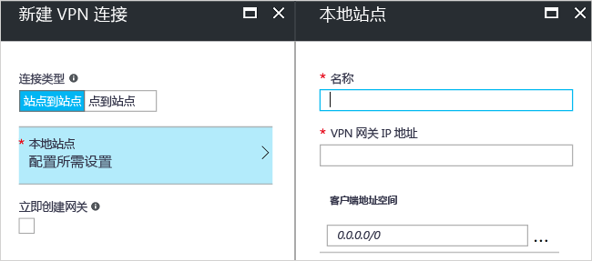

# <a name="create-a-site-to-site-connection-using-the-azure-portal-classic"></a>使用 Azure 门户创建站点到站点连接（经典）

[!INCLUDE [deployment models](../../includes/vpn-gateway-classic-deployment-model-include.md)]

本文介绍如何使用 Azure 门户创建站点到站点 VPN 网关连接，以便从本地网络连接到 VNet。 本文中的步骤适用于经典部署模型。 也可使用不同的部署工具或部署模型来创建此配置，方法是从以下列表中选择另一选项：

> [!div class="op_single_selector"]
> * [Azure portal](vpn-gateway-howto-site-to-site-resource-manager-portal.md)
> * [PowerShell](vpn-gateway-create-site-to-site-rm-powershell.md)
> * [CLI](vpn-gateway-howto-site-to-site-resource-manager-cli.md)
> * [Azure 门户（经典）](vpn-gateway-howto-site-to-site-classic-portal.md)
> 
>

使用站点到站点 VPN 网关连接，通过 IPsec/IKE（IKEv1 或 IKEv2）VPN 隧道将本地网络连接到 Azure 虚拟网络。 此类型的连接要求位于本地的 VPN 设备分配有一个面向外部的公共 IP 地址。 有关 VPN 网关的详细信息，请参阅[关于 VPN 网关](vpn-gateway-about-vpngateways.md)。


## <a name="before-you-begin"></a>开始之前

在开始配置之前，请验证是否符合以下条件：

* 确认是否需要使用经典部署模型。 如果想要使用 Resource Manager 部署模型，请参阅[创建站点到站点连接 (Resource Manager)](vpn-gateway-howto-site-to-site-resource-manager-portal.md)。 我们建议在可能的情况下使用 Resource Manager 部署模型。
* 确保有一台兼容的 VPN 设备，并且可对其进行配置。 有关兼容的 VPN 设备和设备配置的详细信息，请参阅[关于 VPN 设备](vpn-gateway-about-vpn-devices.md)。
* 确认 VPN 设备有一个面向外部的公共 IPv4 地址。 此 IP 地址不得位于 NAT 之后。
* 如果不熟悉本地网络配置中的 IP 地址范围，则需咨询能够提供此类详细信息的人员。 创建此配置时，必须指定 IP 地址范围前缀，Azure 会将该前缀路由到本地位置。 本地网络的任何子网都不得与要连接到的虚拟网络子网重叠。
* 目前需要使用 PowerShell 来指定共享密钥和创建 VPN 网关连接。 安装最新版本的 Azure 服务管理 (SM) PowerShell cmdlet。 有关详细信息，请参阅[如何安装和配置 Azure PowerShell](/powershell/azure/overview)。 使用 PowerShell 进行此配置时，请确保以管理员身份运行。 

### <a name="values"></a>此练习的示例配置值

本文中的示例使用以下值。 可使用这些值创建测试环境，或参考这些值以更好地理解本文中的示例。

* **VNet 名称：** TestVNet1
* **地址空间：** 
  * 10.11.0.0/16
  * 10.12.0.0/16（可选，适用于本练习）
* **子网：**
  * FrontEnd：10.11.0.0/24
  * BackEnd：10.12.0.0/24（可选，适用于本练习）
* **GatewaySubnet：** 10.11.255.0/27
* **资源组：** TestRG1
* **位置：** 美国东部
* DNS 服务器：10.11.0.3（可选，适用于本练习）
* **本地站点名称：** Site2
* 客户端地址空间：位于本地站点的地址空间。

## <a name="CreatVNet"></a>1.创建虚拟网络

创建适用于 S2S 连接的虚拟网络时，需确保指定的地址空间与适用于本地站点（需要连接到这些站点）的任何客户端地址空间不重叠。 如果有重叠子网，连接将无法正常工作。

* 如果已有一个 VNet，请验证这些设置是否与 VPN 网关设计兼容。 请特别注意任何可能与其他网络重叠的子网。 

* 如果还没有虚拟网络，请创建。 这些屏幕截图仅供参考。 请务必替换成自己的值。

### <a name="to-create-a-virtual-network"></a>创建虚拟网络

1. 从浏览器导航到 [Azure 门户](http://portal.azure.com)，并在必要时用 Azure 帐户登录。
2. 单击“+”。 在“搜索应用商店”字段中，键入“虚拟网络”。 从返回的列表中找到“虚拟网络”，单击打开“虚拟网络”页。

  
3. 从靠近“虚拟网络”页底部的“选择部署模型”下拉列表中，选择“经典”，然后单击“创建”。

  
4. 在“创建虚拟网络(经典)”页上，配置 VNet 设置。 在此页上，添加第一个地址空间和单个子网地址范围。 完成创建 VNet 之后，可以返回并添加其他子网和地址空间。

  
5. 验证“订阅”  是否正确。 可以使用下拉列表更改订阅。
6. 单击“资源组”，然后选择现有资源组，或通过键入名称创建新资源组。 有关资源组的详细信息，请访问 [Azure 资源管理器概述](../azure-resource-manager/resource-group-overview.md#resource-groups)。
7. 接下来，选择 VNet 的“位置”  设置。 该位置确定要部署到此 VNet 的资源所在的位置。
8. 如果希望能够在仪表板上轻松查找 VNet，请选择“固定到仪表板”。 单击“创建”以创建 VNet。

  
9. 单击“创建”后，仪表板上会出现一个磁贴，反映 VNet 的进度。 创建 VNet 时，该磁贴会更改。

  

## <a name="additionaladdress"></a>2.添加其他地址空间

创建虚拟网络后，即可添加其他地址空间。 进行 S2S 配置时，不需添加额外的地址空间，但如果需要多个地址空间，请执行以下步骤：

1. 在门户中找到虚拟网络。
2. 在虚拟网络页的“设置”部分，单击“地址空间”。
3. 在“地址空间”页上单击“+添加”，并输入其他地址空间。

## <a name="dns"></a>3.指定 DNS 服务器

在 S2S 配置过程中不需进行 DNS 设置，但如果需要名称解析，则 DNS 是必需的。 指定一个值不会创建新的 DNS 服务器。 指定的 DNS 服务器 IP 地址应该是可以解析所连接的资源名称的 DNS 服务器。 对于示例设置，我们使用了专用 IP 地址。 我们使用的 IP 地址可能不是你 DNS 服务器的 IP 地址。 请务必使用自己的值。

创建虚拟网络后，可以添加 DNS 服务器的 IP 地址来处理名称解析。 打开虚拟网络的设置，单击 DNS 服务器，并添加要用于名称解析的 DNS 服务器的 IP 地址。

1. 在门户中找到虚拟网络。
2. 在虚拟网络页的“设置”部分，单击“DNS 服务器”。
3. 添加 DNS 服务器。
4. 若要保存设置，请单击页面顶部的“保存”。

## <a name="localsite"></a>4.配置本地站点

本地站点通常指本地位置。 它包含 VPN 设备的 IP 地址和地址范围，需要创建到该设备的连接，并且需要通过 VPN 网关将地址范围路由到该设备。

1. 在门户中，导航到要为其创建网关的虚拟网络。
2. 在虚拟网络页的“概览”页的“VPN 连接”部分，单击“网关”打开“新建 VPN 连接”页。

  
3. 在“新建 VPN 连接”页上，选择“站点到站点”。
4. 单击“本地站点 - 配置所需的设置”打开“本地站点”页。 配置设置，并单击“确定”保存设置。
  - **名称：** 创建本地站点的名称，方便进行标识。
  - **VPN 网关 IP 地址：** 这是本地网络的 VPN 设备的公共 IP 地址。 VPN 设备需要 IPv4 公共 IP 地址。 为要连接到的 VPN 设备指定一个有效的公共 IP 地址。 它不能位于 NAT 后面，并且必须可让 Azure 访问。 如果不知道 VPN 设备的 IP 地址，则始终可以先添加一个占位符值（只要其格式是有效的公共 IP 地址），等到以后再更改。
  - **客户端地址空间:** 列出一个 IP 地址范围，需通过该网关将此范围路由到本地网络。 可以添加多个地址空间范围。 请确保在此处指定的范围与虚拟网络连接到的其他网络的范围不重叠，也与虚拟网络本身的地址范围不重叠。

  

## <a name="gatewaysubnet"></a>5.配置网关子网

必须为 VPN 网关创建一个网关子网。 网关子网包含 VPN 网关服务使用的 IP 地址。

1. 在“新建 VPN 连接”页上，选中“立即创建网关”复选框。 此时会显示“可选网关配置”页。 如果不选中该复选框，则看不到配置网关子网的页面。

  
2. 若要打开“网关配置”页，请单击“可选网关配置 - 子网、大小和路由类型”。
3. 在“网关配置”页上，单击“子网 - 配置所需的设置”打开“添加子网”页。

  
4. 在“添加子网”页上，添加网关子网。 指定的网关子网的大小取决于要创建的 VPN 网关配置。 尽管网关子网最小可以创建为 /29，但建议使用 /27 或 /28。 这样可以创建较大的子网，包含的地址更多。 使用更大的网关子网可以有足够的 IP 地址来应对未来可能会有的配置。

  

## <a name="sku"></a>6.指定 SKU 和 VPN 类型

1. 选择网关“大小”。 这是用于创建虚拟网关的网关 SKU。 在门户中，“默认 SKU”为“基本”。 经典 VPN 使用老版（旧版）网关 SKU。 有关旧版网关 SKU 的详细信息，请参阅[使用虚拟网关 SKU（老版 SKU）](vpn-gateway-about-skus-legacy.md)。

  
2. 选择网关的“路由类型”。 这也称为 VPN 类型。 选择正确的网关类型很重要，因为无法将网关从一个类型转换为另一个类型。 VPN 设备必须兼容所选路由类型。 有关 VPN 类型的详细信息，请参阅[关于 VPN 网关设置](vpn-gateway-about-vpn-gateway-settings.md#vpntype)。 可能会有文章引用“RouteBased”和“PolicyBased”VPN 类型。 “动态”对应于“RouteBased”，“静态”对应于“PolicyBased”。
3. 单击“确定”保存设置。
4. 在“新建 VPN 连接”页中，单击底部的“确定”开始创建虚拟网关。 创建虚拟网关可能需要长达 45 分钟的时间，具体取决于所选 SKU。

## <a name="vpndevice"></a>7.配置 VPN 设备

通过站点到站点连接连接到本地网络需要 VPN 设备。 在此步骤中，请配置 VPN 设备。 配置 VPN 设备时，需要以下项：

- 共享密钥。 此共享密钥就是在创建站点到站点 VPN 连接时指定的共享密钥。 在示例中，我们使用基本的共享密钥。 建议生成更复杂的可用密钥。
- 虚拟网络网关的“公共 IP 地址”。 可以通过 Azure 门户、PowerShell 或 CLI 查看公共 IP 地址。

[!INCLUDE [vpn-gateway-configure-vpn-device-rm](../../includes/vpn-gateway-configure-vpn-device-rm-include.md)]

## <a name="CreateConnection"></a>8.创建连接
此步骤设置共享密钥并创建连接。 设置的密钥必须是在 VPN 设备配置中使用过的同一密钥。

> [!NOTE]
> 此步骤目前在 Azure 门户中不可用。 必须使用服务管理 (SM) 版本的 Azure PowerShell cmdlet。
>

### <a name="step-1-connect-to-your-azure-account"></a>步骤 1. 连接到 Azure 帐户

1. 使用提升的权限打开 PowerShell 控制台，并连接到帐户。 使用下面的示例来帮助连接：

  ```powershell
  Add-AzureAccount
  ```
2. 检查该帐户的订阅。

  ```powershell
  Get-AzureSubscription
  ```
3. 如果有多个订阅，请选择要使用的订阅。

  ```powershell
  Select-AzureSubscription -SubscriptionId "Replace_with_your_subscription_ID"
  ```

### <a name="step-2-set-the-shared-key-and-create-the-connection"></a>步骤 2. 设置共享密钥并创建连接

使用 PowerShell 和经典部署模型时，有时门户中资源的名称不是在使用 PowerShell 时 Azure 中本应显示的名称。 可通过以下步骤导出网络配置文件，获取这些名称的确切值。

1. 在计算机上创建一个目录，然后将网络配置文件导出到该目录。 在此示例中，网络配置文件导出到 C:\AzureNet。

  ```powershell
  Get-AzureVNetConfig -ExportToFile C:\AzureNet\NetworkConfig.xml
  ```
2. 使用 XML 编辑器打开网络配置文件，检查值中是否包含“LocalNetworkSite name”和“VirtualNetworkSite name”。 根据所需值修改此示例。 指定包含空格的名称时，请使用单引号将值引起来。

3. 设置共享密钥并创建连接。 “-SharedKey”是你生成并指定的值。 在示例中，我们使用的是“abc123”，但可以生成并且应该使用更复杂的。 重要的是，此处指定的值必须与配置 VPN 设备时指定的值相同。

  ```powershell
  Set-AzureVNetGatewayKey -VNetName 'Group TestRG1 TestVNet1' `
  -LocalNetworkSiteName 'D1BFC9CB_Site2' -SharedKey abc123
  ```
创建连接后，结果为“状态: 成功”。

## <a name="verify"></a>9.验证连接

[!INCLUDE [vpn-gateway-verify-connection-azureportal-classic](../../includes/vpn-gateway-verify-connection-azureportal-classic-include.md)]

如果无法进行连接，请参阅左窗格目录的“故障排除”部分。

## <a name="reset"></a>如何重置 VPN 网关

如果丢失一个或多个站点到站点隧道上的跨界 VPN 连接，重置 VPN 网关可有效解决该情况。 在此情况下，本地 VPN 设备都在正常工作，但却无法与 Azure VPN 网关建立 IPsec 隧道。 有关步骤，请参阅[重置 VPN 网关](vpn-gateway-resetgw-classic.md)。

## <a name="changesku"></a>如何更改网关 SKU

有关更改网关 SKU 的步骤，请参阅[重设网关 SKU 大小](vpn-gateway-about-SKUS-legacy.md)。

## <a name="next-steps"></a>后续步骤

* 连接完成后，即可将虚拟机添加到虚拟网络。 有关详细信息，请参阅[虚拟机](https://docs.microsoft.com/azure/#pivot=services&panel=Compute)。
* 有关强制隧道的信息，请参阅[关于强制隧道](vpn-gateway-about-forced-tunneling.md)。