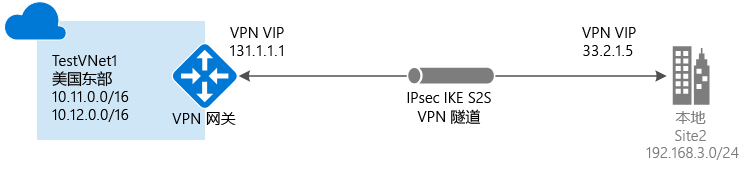

# 在 Azure 门户中创建站点到站点连接

本文介绍如何使用 Azure 门户创建站点到站点 VPN 网关连接，以便从本地网络连接到 VNet。 本文中的步骤适用于 Resource Manager 部署模型。 也可使用不同的部署工具或部署模型来创建此配置，方法是从以下列表中选择另一选项：

> [!div class="op_single_selector"]
> * [Azure 门户](vpn-gateway-howto-site-to-site-resource-manager-portal.md)
> * [PowerShell](vpn-gateway-create-site-to-site-rm-powershell.md)
> * [CLI](vpn-gateway-howto-site-to-site-resource-manager-cli.md)
> * [Azure 门户（经典）](vpn-gateway-howto-site-to-site-classic-portal.md)
> 
>

使用站点到站点 VPN 网关连接，通过 IPsec/IKE（IKEv1 或 IKEv2）VPN 隧道将本地网络连接到 Azure 虚拟网络。 此类型的连接要求位于本地的 VPN 设备分配有一个面向外部的公共 IP 地址。 有关 VPN 网关的详细信息，请参阅[关于 VPN 网关](vpn-gateway-about-vpngateways.md)。

## 开始之前

在开始配置之前，请验证你是否符合以下条件：

* 确保有一台兼容的 VPN 设备，并且可对其进行配置。 有关兼容的 VPN 设备和设备配置的详细信息，请参阅[关于 VPN 设备](vpn-gateway-about-vpn-devices.md)。
* 确认 VPN 设备有一个面向外部的公共 IPv4 地址。 此 IP 地址不得位于 NAT 之后。
* 如果不熟悉本地网络配置中的 IP 地址范围，则需咨询能够提供此类详细信息的人员。 创建此配置时，必须指定 IP 地址范围前缀，Azure 会将该前缀路由到本地位置。 本地网络的任何子网都不得与要连接到的虚拟网络子网重叠。 

### 示例值

本文中的示例使用以下值。 可使用这些值创建测试环境，或参考这些值以更好地理解本文中的示例。 有关通用 VPN 网关设置的详细信息，请参阅[关于 VPN 网关设置](vpn-gateway-about-vpn-gateway-settings.md)。

* **VNet 名称：**TestVNet1
* **地址空间：**10.11.0.0/16 和 10.12.0.0/16（对于本练习可选）
* **订阅：**要使用的订阅
* **资源组：**TestRG1
* **位置：**美国东部
* **子网：**FrontEnd：10.11.0.0/24，BackEnd：10.12.0.0/24（对于本练习可选）
* **网关子网名称：**GatewaySubnet（会在门户中自动填充）
* **网关子网地址范围：**10.11.255.0/27
* DNS 服务器：可选。 DNS 服务器的 IP 地址。
* **虚拟网关名称：**VNet1GW
* **公共 IP：**VNet1GWIP
* **VPN 类型：**基于路由
* **连接类型：**站点到站点 (IPsec)
* **网关类型：**VPN
* **局域网网关名称：**Site2
* **连接名称：**VNet1toSite2
* **共享密钥：**在此示例中，我们将使用 abc123。 但是，你可以使用与 VPN 硬件兼容的任何密钥。 重要的是连接两端的值要匹配。

## 1.创建虚拟网络

[!INCLUDE [vpn-gateway-basic-vnet-rm-portal](../../includes/vpn-gateway-basic-vnet-s2s-rm-portal-include.md)]

## 2.指定 DNS 服务器

创建站点到站点连接不需要 DNS。 但是，如果希望对部署到虚拟网络的资源进行名称解析，则应指定 DNS 服务器。 可以通过此设置指定 DNS 服务器，以便将其用于此虚拟网络的名称解析。 此设置不创建 DNS 服务器。 有关名称解析的详细信息，请参阅 [VM 和角色实例的名称解析](../virtual-network/virtual-networks-name-resolution-for-vms-and-role-instances.md)。

[!INCLUDE [vpn-gateway-add-dns-rm-portal](../../includes/vpn-gateway-add-dns-rm-portal-include.md)]

## 3.创建网关子网

[!INCLUDE [vpn-gateway-aboutgwsubnet](../../includes/vpn-gateway-about-gwsubnet-include.md)]

[!INCLUDE [vpn-gateway-add-gwsubnet-rm-portal](../../includes/vpn-gateway-add-gwsubnet-s2s-rm-portal-include.md)]

## 4.创建 VPN 网关

[!INCLUDE [vpn-gateway-add-gw-s2s-rm-portal](../../includes/vpn-gateway-add-gw-s2s-rm-portal-include.md)]

## 5.创建本地网关

本地网络网关通常是指本地位置。 可以为站点提供一个名称供 Azure 引用，并指定本地 VPN 设备的 IP 地址，以便创建一个连接来连接到该设备。 此外还可指定 IP 地址前缀，以便通过 VPN 网关将其路由到 VPN 设备。 指定的地址前缀是位于本地网络的前缀。 如果之后本地网络发生了更改，或需要更改 VPN 设备的公共 IP 地址，可轻松更新这些值。

[!INCLUDE [Add local network gateway](../../includes/vpn-gateway-add-lng-s2s-rm-portal-include.md)]

## 6.配置 VPN 设备

通过站点到站点连接连接到本地网络需要 VPN 设备。 在此步骤中，请配置 VPN 设备。 配置 VPN 设备时，需要以下项：

- 共享密钥。 此共享密钥就是在创建站点到站点 VPN 连接时指定的共享密钥。 在示例中，我们使用基本的共享密钥。 建议生成更复杂的可用密钥。
- 虚拟网关的“公共 IP 地址”。 可以通过 Azure 门户、PowerShell 或 CLI 查看公共 IP 地址。 要使用 Azure 门户查找 VPN 网关的公共 IP 地址，请导航到“虚拟网关”，并单击网关的名称。

[!INCLUDE [Configure a VPN device](../../includes/vpn-gateway-configure-vpn-device-rm-include.md)]

## 7.创建 VPN 连接

在虚拟网关和本地 VPN 设备之间创建站点到站点 VPN 连接。

[!INCLUDE [Add connections](../../includes/vpn-gateway-add-site-to-site-connection-s2s-rm-portal-include.md)]

## 8.验证 VPN 连接

[!INCLUDE [Verify - Azure portal](../../includes/vpn-gateway-verify-connection-portal-rm-include.md)]

## 连接到虚拟机

[!INCLUDE [Connect to a VM](../../includes/vpn-gateway-connect-vm-s2s-include.md)]

## 如何重置 VPN 网关

如果丢失一个或多个站点到站点隧道上的跨界 VPN 连接，重置 VPN 网关可有效解决该情况。 在此情况下，本地 VPN 设备都在正常工作，但却无法与 Azure VPN 网关建立 IPsec 隧道。 有关步骤，请参阅[重置 VPN 网关](vpn-gateway-resetgw-classic.md)。

## 如何更改网关 SKU（重设网关大小）

有关更改网关 SKU 的步骤，请参阅[网关 SKU](vpn-gateway-about-vpn-gateway-settings.md#gwsku)。

## 如何将其他连接添加到 VPN 网关

可以添加其他连接，前提是连接之间不存在地址空间重叠。

1. 若要添加其他连接，请导航到 VPN 网关，然后单击“连接”打开“连接”页。
2. 单击“+添加”添加连接。 调整连接类型以反映“VNet 到 VNet”（如果连接到另一个 VNet 网关）或“站点到站点”。
3. 如果要使用“站点到站点”连接进行连接，并且尚未为要连接到的站点创建本地网络网关，则可以创建一个新的本地网络网关。
4. 指定要使用的共享密钥，然后单击“确定”以创建连接。

## 后续步骤

* 有关 BGP 的信息，请参阅 [BGP 概述](vpn-gateway-bgp-overview.md)和[如何配置 BGP](vpn-gateway-bgp-resource-manager-ps.md)。
* 有关强制隧道的信息，请参阅[关于强制隧道](vpn-gateway-forced-tunneling-rm.md)。
* 有关高可用性主动-主动连接的信息，请参阅[高可用性跨界连接与 VNet 到 VNet 连接](vpn-gateway-highlyavailable.md)。
* 有关如何限制发往虚拟网络中资源的网络流量的信息，请参阅[网络安全](../virtual-network/security-overview.md)。
* 有关 Azure 如何在 Azure 资源、本地资源和 Internet 资源之间路由流量的信息，请参阅[虚拟网络流量路由](../virtual-network/virtual-networks-udr-overview.md)。
* 有关使用 Azure 资源管理器模板创建站点到站点 VPN 连接的信息，请参阅[创建站点到站点 VPN 连接](https://azure.microsoft.com/resources/templates/101-site-to-site-vpn-create/)。
* 有关使用 Azure 资源管理器模板创建 Vnet 到 Vnet VPN 连接的信息，请参阅[部署 HBase 异地复制](https://azure.microsoft.com/resources/templates/101-hdinsight-hbase-replication-geo/)。
