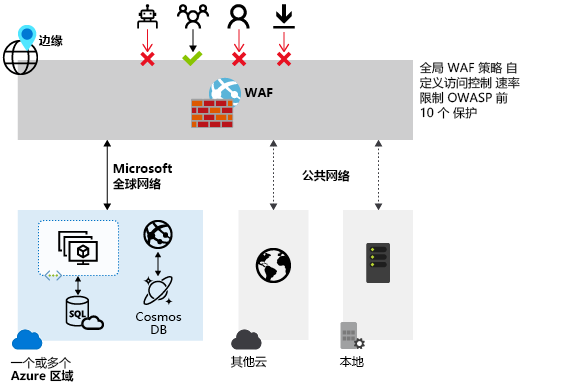
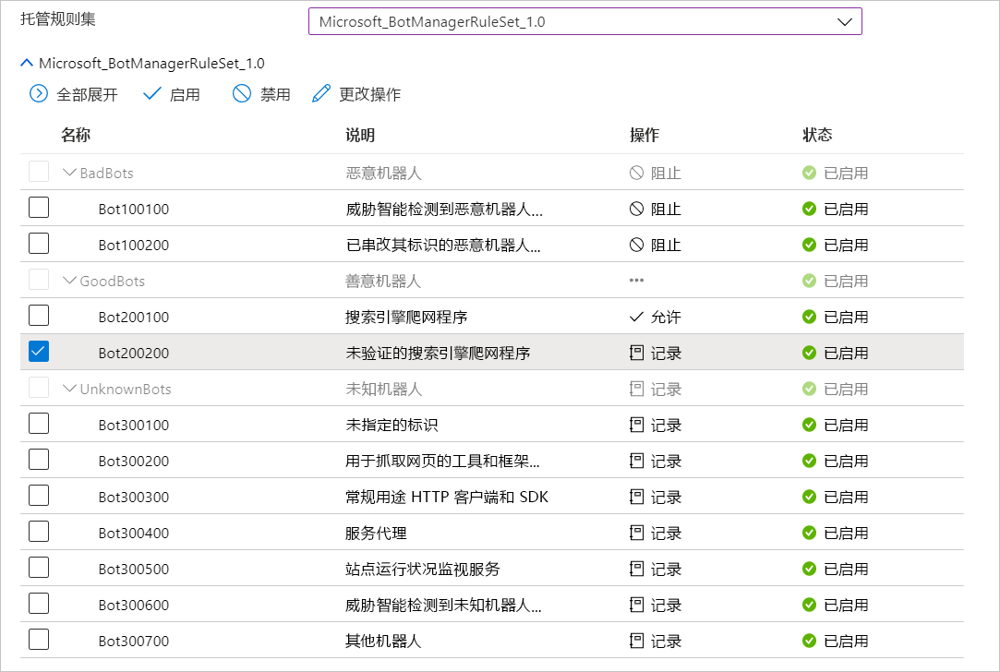

# Azure Front Door 上的 Azure Web 应用程序防火墙

Azure Front Door 上的 Azure Web 应用程序防火墙 (WAF) 为 Web 应用程序提供集中保护。 WAF 可以防范 Web 服务遭到常见的恶意利用和出现漏洞。 它使服务对用户高度可用，并帮助满足合规性要求。

Front Door 上的 WAF 是一个全球性的集中式解决方案。 它部署在全球各地的 Azure 网络边缘位置。 启用了 WAF 的 Web 应用程序会检查 Front Door 在网络边缘传送的每个传入请求。 

在恶意攻击进入虚拟网络之前，WAF 会阻止这些攻击靠近攻击源。 你可以获得大规模的全局保护，且不会降低性能。 WAF 策略可轻松链接到订阅中的任何 Front Door 配置文件。 在几分钟内就能部署新的规则，因此可以快速响应不断变化的威胁模式。

## WAF 策略和规则

可以配置一个 WAF 策略，然后将该策略与一个或多个 Front Door 前端关联，以提供保护。 WAF 策略包含两种类型的安全规则：

- 客户创作的自定义规则。

- 托管规则集，即由 Azure 托管的预配置规则设置的集合。

如果两者均存在，则先处理自定义规则，然后处理托管规则集中的规则。 规则由匹配条件、优先级和操作组成。 支持的操作类型包括：允许、阻止、记录和重定向。 可以组合托管规则和自定义规则以创建满足特定应用程序保护要求的完全自定义策略。

策略中的规则按优先顺序进行处理。 “优先级”是唯一的整数，定义规则的处理顺序。 整数值越小表示优先级越高，这些规则的评估顺序先于整数值较大的规则。 匹配规则后，规则中定义的相应操作将应用于请求。 处理此类匹配后，不再进一步处理优先级较低的规则。

Front Door 交付的 Web 应用程序一次只能与一个 WAF 策略关联。 但可以使用 Front Door 配置，且无需将其与任何 WAF 策略关联。 如果 WAF 策略存在，它将复制到所有边缘位置，以确保全球的安全策略保持一致。

## WAF 模式

WAF 策略可配置为在以下两种模式下运行：

- **检测模式：** 在检测模式下运行时，WAF 除进行监视并将请求及其匹配的 WAF 规则记录到 WAF 日志中以外，不会执行任何其他操作。 可为 Front Door 启用日志诊断。 如果使用门户，请转到“诊断”部分。 

- **阻止模式：** 在阻止模式下，如果请求与规则匹配，WAF 将执行指定的操作。 如果找到匹配项，则不会评估优先级更低的规则。 任何匹配的请求也会记录在 WAF 日志中。

## WAF 操作

如果请求匹配规则的条件，WAF 客户可以选择运行其中某个操作：

- **允许：** 请求通过 WAF 传递并转发到后端。 没有其他优先级较低的规则可以阻止此请求。
- **阻止：** 请求受阻，WAF 将响应发送到客户端，且不会将请求转发到后端。
- **记录：** 请求记录在 WAF 日志中，且 WAF 继续评估优先级较低的规则。
- **重定向：** WAF 将请求重定向到指定的 URI。 指定的 URI 是策略级别设置。 配置后，与“重定向”操作匹配的所有请求都将发送到该 URI  。

## WAF 规则

WAF 策略可以由安全规则（由客户创作的自定义规则）和托管规则集（由 Azure 托管的预配置规则集）这两种类型组成。

### 自定义创作规则

可按如下方式配置自定义规则 WAF：

- **IP 允许列表和阻止列表：** 可以基于客户端 IP 地址列表或 IP 地址范围来控制对 Web 应用程序的访问。 支持 IPv4 和 IPv6 地址类型。 可将此列表配置为阻止或允许源 IP 与列表中的 IP 匹配的请求。

- **基于地理位置的访问控制：** 可以基于与客户端 IP 地址相关联的国家/地区代码来控制对 Web 应用程序的访问。

- **基于 HTTP 参数的访问控制：** 可使规则基于 HTTP/HTTPS 请求参数中的字符串匹配项。  例如，查询字符串、POST 参数、请求 URI、请求标头和请求正文。

- **基于请求方法的访问控制：** 使规则基于请求的 HTTP 请求方法。 例如 GET、PUT 或 HEAD。

- **大小约束：** 可使规则基于请求的特定部分（例如查询字符串、URI 或请求正文）的长度。

- **速率限制规则：** 速率控制规则用于限制任何客户端 IP 发出的异常高的流量。 对于客户端 IP 在一分钟内允许的 Web 请求数，可以配置一个阈值。 此规则与基于 IP 列表的允许/阻止自定义规则不同，后者允许或阻止客户端 IP 的所有请求。 速率限制可以与其他匹配条件（例如用于粒度速率控制的 HTTP(S) 参数匹配）结合使用。

### Azure 托管的规则集

Azure 托管的规则集可轻松针对一组常见的安全威胁来部署保护。 由于此类规则集由 Azure 托管，因此这些规则会根据需要进行更新以预防新的攻击签名。 Azure 托管的默认规则集包含针对以下威胁类别的规则：

- 跨站点脚本
- Java 攻击
- 本地文件包含
- PHP 注入攻击
- 远程命令执行
- 远程文件包含
- 会话固定
- SQL 注入保护
- 协议攻击者

将新的攻击签名添加到规则集时，默认规则集的版本号将递增。
默认规则集在 WAF 策略的检测模式下默认启用。 可以禁用或启用默认规则集内的各个规则以满足应用程序要求。 还可以根据规则设置特定操作（允许/阻止/重定向/记录）。

有时你可能需要忽略 WAF 评估中的某些请求属性。 一个常见的例子是用于身份验证的 Active Directory 插入令牌。 可以为托管规则、规则组或整个规则集配置排除列表。  

默认操作为“阻止”。 此外，如果想要绕过默认规则集中的任何预配置规则，可以在同一 WAF 策略中配置自定义规则。

在评估默认规则集中的规则之前，自定义规则始终适用。 如果请求与某个自定义规则相匹配，将应用相应的规则操作。 请求将被阻止，或通过后端传递。 不会处理任何其他自定义规则或默认规则集中的规则。 还可以从 WAF 策略中删除默认规则集。

### 机器人防护规则集（预览版）

可以启用托管机器人防护规则集，以便针对来自已知机器人类别的请求执行自定义操作。 

支持三种机器人类别：“不良”、“良好”和“未知”。 机器人签名由 WAF 平台管理和动态更新。

不良的机器人包括来自恶意 IP 地址的机器人，以及伪造了其身份的机器人。 恶意 IP 地址源自于 Microsoft 威胁情报源，每小时更新一次。 [Intelligent Security Graph](https://www.microsoft.com/security/operations/intelligence) 为 Microsoft 威胁智能助力，它已得到 Azure 安全中心等多项服务的运用。

善意机器人包括经过验证的搜索引擎。 “未知”类别包括将自身标识为机器人的其他机器人组。 例如市场分析器、源提取器和数据收集代理。 

未知的机器人是通过已发布的用户代理分类的，未经过附加的验证。 可为不同类型的机器人设置自定义的阻止、允许、记录或重定向操作。

> [!IMPORTANT]
> 机器人防护规则集当前为公共预览版，并提供预览版服务级别协议。 某些功能可能不受支持或者受限。  有关详细信息，请参阅 [Microsoft Azure 预览版补充使用条款](https://azure.microsoft.com/support/legal/preview-supplemental-terms/)。

如果启用了机器人防护，则与机器人规则匹配的传入请求将记录在 FrontdoorWebApplicationFirewallLog 日志中。 可从存储帐户、事件中心或日志分析访问 WAF 日志。

## 配置

可以使用 Azure 门户、REST API、Azure 资源管理器模板和 Azure PowerShell 来配置和部署所有 WAF 规则类型。

## 监视

在 Front Door 监视 WAF 与 Azure Monitor 集成，以便跟踪警报并轻松监视流量趋势。

## 后续步骤

- 了解 [Azure 应用程序网关上的 Web 应用程序防火墙](../ag/ag-overview.md)