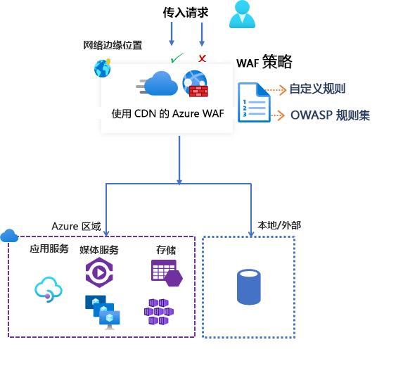

# Azure 内容分发网络上的 Azure Web 应用程序防火墙

Microsoft 推出的 Azure 内容分发网络 (CDN) 上的 Azure Web 应用程序防火墙 (WAF) 为 Web 内容提供集中保护。 WAF 可以防范 Web 服务遭到常见的恶意利用和出现漏洞。 它使服务对用户高度可用，并帮助满足合规性要求。

> [!IMPORTANT]
> Microsoft 推出的 Azure CDN 上的 WAF 目前以公共预览版提供，并附带预览版服务级别协议。 某些功能可能不受支持或者受限。  有关详细信息，请参阅 [Microsoft Azure 预览版补充使用条款](https://azure.microsoft.com/support/legal/preview-supplemental-terms/)。

Azure CDN 上的 WAF 是全球性的集中式解决方案。 它部署在全球各地的 Azure 网络边缘位置。 在恶意攻击进入你的来源地之前，WAF 会阻止它们靠近攻击源。 你可以获得大规模的全局保护，且不会降低性能。 

WAF 策略可轻松链接到订阅中的任何 CDN 终结点。 在几分钟内就能部署新的规则，因此可以快速响应不断变化的威胁模式。

## WAF 策略和规则

可以配置一个 WAF 策略，然后将该策略与一个或多个 CDN 终结点相关联，以提供保护。 WAF 策略包含两种类型的安全规则：

- 可创建的自定义规则。

- 托管规则集，即由 Azure 托管的预配置规则集合。

如果两者均存在，则先处理自定义规则，然后处理托管规则集中的规则。 规则由匹配条件、优先级和操作组成。 支持的操作类型包括：“允许”、“阻止”、“记录”和“重定向”。 可以组合托管规则和自定义规则以创建满足特定应用程序保护要求的完全自定义策略。

策略中的规则按优先顺序进行处理。 “优先级”是一个唯一数字，定义规则的处理顺序。 数字越小表示优先级越高，这些规则的评估顺序先于值较大的规则。 匹配规则后，规则中定义的相应操作将应用于请求。 处理此类匹配后，不再进一步处理优先级较低的规则。

Azure CDN 上托管的 Web 应用程序一次只能与一个 WAF 策略相关联。 但可以使用不与任何 WAF 策略相关联的 CDN 终结点。 如果 WAF 策略存在，它将复制到所有边缘位置，以确保全球的安全策略保持一致。

## WAF 模式

WAF 策略可配置为在以下两种模式下运行：

- *检测模式*：在检测模式下运行时，WAF 除进行监视并将请求及其匹配的 WAF 规则记录到 WAF 日志中以外，不会执行任何其他操作。 可为 CDN 启用日志诊断。 如果使用门户，请转到“诊断”部分。

- *阻止模式*：在阻止模式下，如果请求与规则匹配，WAF 将执行指定的操作。 如果找到匹配项，则不会评估优先级更低的规则。 任何匹配的请求也会记录在 WAF 日志中。

## WAF 操作

当请求满足规则条件时，可选择以下操作之一：

- *允许*：请求将通过 WAF 传递并转发到后端。 没有其他优先级较低的规则可以阻止此请求。
- *阻止*：请求受阻，WAF 将响应发送到客户端，且不会将请求转发到后端。
- *Log*：请求将记录在 WAF 日志中，且 WAF 继续评估优先级较低的规则。
- *重定向*：WAF 将请求重定向到指定的 URI。 指定的 URI 是策略级别设置。 配置后，与“重定向”操作匹配的所有请求将发送到该 URI。

## WAF 规则

WAF 策略可以包含两种类型的安全规则：

- *自定义规则*：你自己创建的规则 
- *托管规则集*：Azure 托管的预配置规则集

### 自定义规则

自定义规则可以包含匹配规则和速率控制规则。

可配置以下自定义匹配规则：

- *IP 允许列表和阻止列表*：可以基于客户端 IP 地址列表或 IP 地址范围来控制对 Web 应用程序的访问。 支持 IPv4 和 IPv6 地址类型。 可将此列表配置为阻止或允许源 IP 与列表中的 IP 匹配的请求。

- *基于地理位置的访问控制*：可以基于与客户端 IP 地址相关联的国家/地区代码来控制对 Web 应用程序的访问。

- *基于 HTTP 参数的访问控制*：可使规则基于 HTTP/HTTPS 请求参数中的字符串匹配项。  例如，查询字符串、POST 参数、请求 URI、请求标头和请求正文。

- *基于请求方法的访问控制*：将规则基于请求的 HTTP 请求方法。 例如 GET、PUT 或 HEAD。

- *大小约束*：可使规则基于请求的特定部分（例如查询字符串、URI 或请求正文）的长度。

速率控制规则限制来自任何客户端 IP 地址的异常高流量。

- *速率限制规则*：可以针对一分钟持续时间内允许来自客户端 IP 地址的 Web 请求数配置一个阈值。 此规则与基于 IP 列表的允许/阻止自定义规则不同，后者允许或阻止来自客户端 IP 地址的所有请求。 速率限制可以与其他匹配条件（例如用于粒度速率控制的 HTTP(S) 参数匹配）结合使用。

### Azure 托管的规则集

Azure 托管的规则集可轻松针对一组常见的安全威胁来部署保护。 由于这些规则集由 Azure 托管，因此这些规则会根据需要进行更新以防范新的攻击签名。 Azure 托管的默认规则集包含针对以下威胁类别的规则：

- 跨站点脚本
- Java 攻击
- 本地文件包含
- PHP 注入攻击
- 远程命令执行
- 远程文件包含
- 会话固定
- SQL 注入保护
- 协议攻击者

将新的攻击签名添加到规则集时，默认规则集的版本号将递增。
默认规则集在 WAF 策略的“检测”模式下默认启用。 可以禁用或启用默认规则集内的各个规则以满足应用程序要求。 还可以根据规则设置特定操作（允许/阻止/重定向/记录）。 托管默认规则集的默认操作是“阻止”。

在评估默认规则集中的规则之前，自定义规则始终适用。 如果请求与某个自定义规则相匹配，将应用相应的规则操作。 请求将被阻止，或通过后端传递。 不会处理任何其他自定义规则或默认规则集中的规则。 还可以从 WAF 策略中删除默认规则集。

## 配置

可以使用 Azure 门户、REST API、Azure 资源管理器模板和 Azure PowerShell 来配置和部署所有 WAF 规则类型。

## 监视

CDN 中 WAF 的监视功能与 Azure Monitor 相集成，可以跟踪警报并轻松监视流量趋势。

## 后续步骤

- [教程：使用 Azure 门户创建 Azure CDN 的 WAF 策略](waf-cdn-create-portal.md)
