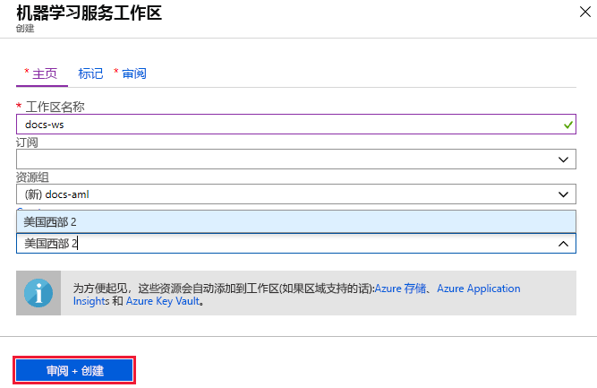
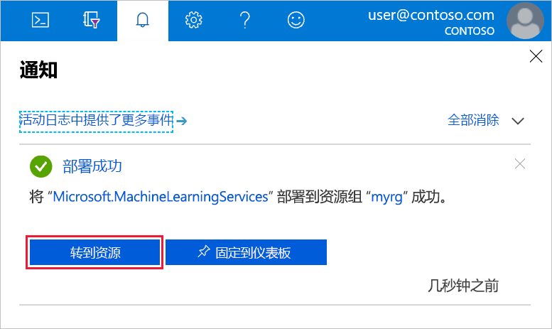

1. 使用将所使用的 Azure 订阅的凭据登录到 [Azure 门户](https://portal.azure.com/)。 

1. 在 Azure 门户的左上角，选择“创建资源”  。

1. 使用搜索栏查找“机器学习服务工作区”  。

1. 选择“机器学习服务工作区”  。

1. 在“ML 服务工作区”窗格中，选择“创建”以开始   。

1. 通过提供工作区名称、订阅、资源组和位置来配置新工作区。

    

   字段|说明 
   ---|---
   工作区名称 |输入用于标识工作区的唯一名称。 本示例使用 docs-ws  。 名称在整个资源组中必须唯一。 使用易于记忆且区别于其他人所创建工作区的名称。  
   Subscription |选择要使用的 Azure 订阅。
   Resource group | 使用订阅中的现有资源组，或者输入一个名称以创建新的资源组。 资源组保存 Azure 解决方案的相关资源。 本示例使用 docs-aml  。 
   位置 | 选择离你的用户和数据资源最近的位置来创建工作区。

1. 完成工作区配置后，选择“创建”  。 

   创建工作区可能需要一些时间。

   完成创建后，会显示部署成功消息。 通知部分也会出现该消息。 若要查看新工作区，请选择“转到资源”  。

   

1. 如果将要使用门户中的无代码选项（如可视界面或自动 ML 试验），则现已完成。 如果将要创建 [Notebook VM](../articles/machine-learning/service/tutorial-1st-experiment-sdk-setup.md#azure)，则也已完成。 

1. 如果计划使用引用此工作区的本地环境中的代码，请  从工作区的“概述”  部分中选择“下载 config.json”。  

   
   
   使用 Python 脚本或 Jupyter Notebook 将此文件放入到目录结构中。 它可以位于同一目录（名为 *.azureml* 的子目录）中，也可以位于父目录中。 创建 Notebook VM 时，此文件会添加到 VM 上的正确目录中。

    

