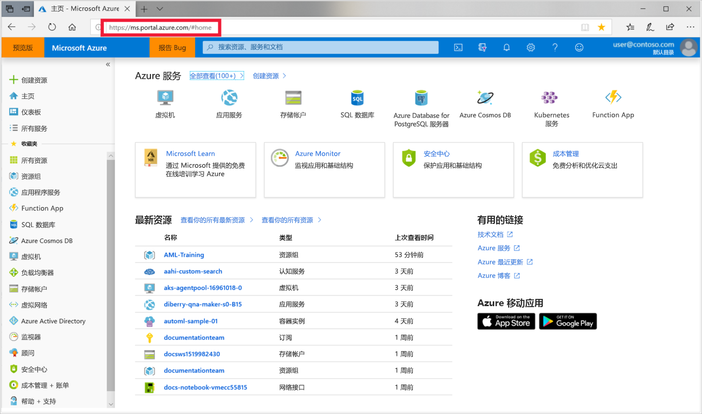
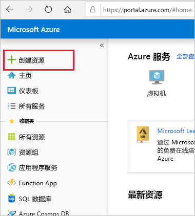

1. 使用将所使用的 Azure 订阅的凭据登录到 [Azure 门户](https://portal.azure.com/)。 

   

1. 在门户左上角选择“创建资源”  。

   

1. 在搜索栏中输入“机器学习”  。 选择搜索结果“机器学习服务工作区”  。

   

1. 在“ML 服务工作区”窗格中，选择“创建”以开始   。

    

1. 在“机器学习服务工作区”窗格中，配置工作区  。

   字段|说明
   ---|---
   工作区名称 |输入用于标识工作区的唯一名称。 本示例使用 docs-ws  。 名称在整个资源组中必须唯一。 使用易于记忆且区别于其他人所创建工作区的名称。  
   订阅 |选择要使用的 Azure 订阅。
   资源组 | 使用订阅中的现有资源组，或者输入一个名称，创建新的资源组。 资源组保存 Azure 解决方案的相关资源。 本示例使用 docs-aml  。 
   位置 | 选择最靠近用户和数据资源的位置。 这是用于创建工作区的位置。

1. 若要开始创建过程，请选择“查看 + 创建”  。

    

1. 查看工作区配置。 如果配置正确，请选择“创建”  。 创建工作区可能需要一些时间。

1. 若要检查部署状态，请选择工具栏上的“通知”图标（铃铛）  。

1. 完成创建后，会显示部署成功消息。 通知部分也会出现该消息。 若要查看新工作区，请选择“转到资源”  。

   
